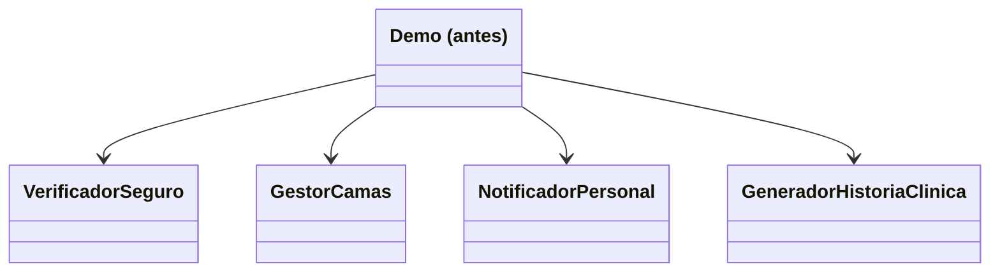
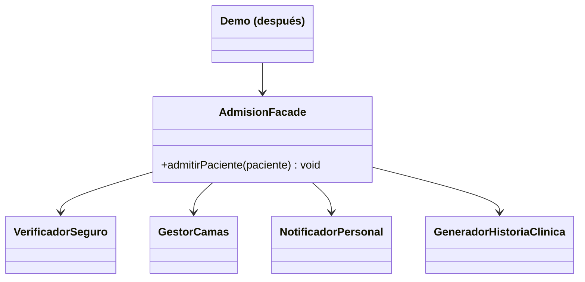

# 💡 Ejemplo 06 — Facade

## 🌍 Contexto

Admitir un paciente en MediSalud requiere coordinar cuatro subsistemas: verificar el seguro, reservar
una cama, notificar al personal y generar la historia clínica, en ese orden. El código cliente que
admite pacientes conoce y llama directamente a los cuatro.

**Qué busca demostrar este ejemplo**: cuántos subsistemas conoce el cliente, comparado entre orquestarlos
directamente y ocultarlos detrás de una única operación.

## 🏥 Caso de estudio

MediSalud admite pacientes coordinando verificación de seguro, reserva de cama, notificación al
personal y generación de historia clínica.

## 🗺️ Diagrama





*Arriba, la versión "antes" (el cliente conoce los cuatro subsistemas). Abajo, la versión "después" (el
cliente solo conoce la fachada).*

## 🌳 Árbol de archivos — antes

```text
facade-antes/
└── com/medisalud/
    ├── VerificadorSeguro.java
    ├── GestorCamas.java
    ├── NotificadorPersonal.java
    ├── GeneradorHistoriaClinica.java
    └── Demo.java
```

## 💻 Archivo: VerificadorSeguro.java

```java
package com.medisalud;

public class VerificadorSeguro {
    public String verificar(String paciente) {
        return "Seguro de " + paciente + " verificado";
    }
}
```

## 💻 Archivo: GestorCamas.java

```java
package com.medisalud;

public class GestorCamas {
    public String reservar(String paciente) {
        return "Cama reservada para " + paciente;
    }
}
```

## 💻 Archivo: NotificadorPersonal.java

```java
package com.medisalud;

public class NotificadorPersonal {
    public String avisar(String paciente) {
        return "Personal avisado de la admision de " + paciente;
    }
}
```

## 💻 Archivo: GeneradorHistoriaClinica.java

```java
package com.medisalud;

public class GeneradorHistoriaClinica {
    public String generar(String paciente) {
        return "Historia clinica generada para " + paciente;
    }
}
```

## 💻 Archivo: Demo.java

```java
package com.medisalud;

public class Demo {
    public static void main(String[] args) {
        // Datos de entrada
        String paciente = "Marta Diaz";

        // El cliente conoce y orquesta los cuatro subsistemas, en el orden correcto
        VerificadorSeguro verificador = new VerificadorSeguro();
        GestorCamas gestorCamas = new GestorCamas();
        NotificadorPersonal notificador = new NotificadorPersonal();
        GeneradorHistoriaClinica generador = new GeneradorHistoriaClinica();

        System.out.println(verificador.verificar(paciente));
        System.out.println(gestorCamas.reservar(paciente));
        System.out.println(notificador.avisar(paciente));
        System.out.println(generador.generar(paciente));
    }
}
```

## ✅ Resultado esperado — antes

```text
Seguro de Marta Diaz verificado
Cama reservada para Marta Diaz
Personal avisado de la admision de Marta Diaz
Historia clinica generada para Marta Diaz
```

## 🌳 Árbol de archivos — después

```text
facade-despues/
└── com/medisalud/
    ├── VerificadorSeguro.java         (sin cambios)
    ├── GestorCamas.java               (sin cambios)
    ├── NotificadorPersonal.java       (sin cambios)
    ├── GeneradorHistoriaClinica.java  (sin cambios)
    ├── AdmisionFacade.java            (nuevo)
    └── Demo.java                      (cambió)
```

Sin cambios respecto de "antes": `VerificadorSeguro.java`, `GestorCamas.java`,
`NotificadorPersonal.java` y `GeneradorHistoriaClinica.java` — su código ya se mostró arriba y es
exactamente el mismo, byte a byte.

<details>
<summary>💻 Ver de nuevo el código sin cambios (VerificadorSeguro, GestorCamas, NotificadorPersonal,
GeneradorHistoriaClinica)</summary>

## 💻 Archivo: VerificadorSeguro.java

```java
package com.medisalud;

public class VerificadorSeguro {
    public String verificar(String paciente) {
        return "Seguro de " + paciente + " verificado";
    }
}
```

## 💻 Archivo: GestorCamas.java

```java
package com.medisalud;

public class GestorCamas {
    public String reservar(String paciente) {
        return "Cama reservada para " + paciente;
    }
}
```

## 💻 Archivo: NotificadorPersonal.java

```java
package com.medisalud;

public class NotificadorPersonal {
    public String avisar(String paciente) {
        return "Personal avisado de la admision de " + paciente;
    }
}
```

## 💻 Archivo: GeneradorHistoriaClinica.java

```java
package com.medisalud;

public class GeneradorHistoriaClinica {
    public String generar(String paciente) {
        return "Historia clinica generada para " + paciente;
    }
}
```

</details>

## 💻 Archivo: AdmisionFacade.java — nuevo

```java
package com.medisalud;

public class AdmisionFacade {
    private VerificadorSeguro verificador = new VerificadorSeguro();
    private GestorCamas gestorCamas = new GestorCamas();
    private NotificadorPersonal notificador = new NotificadorPersonal();
    private GeneradorHistoriaClinica generador = new GeneradorHistoriaClinica();

    public void admitirPaciente(String paciente) {
        System.out.println(verificador.verificar(paciente));
        System.out.println(gestorCamas.reservar(paciente));
        System.out.println(notificador.avisar(paciente));
        System.out.println(generador.generar(paciente));
    }
}
```

## 💻 Archivo: Demo.java — cambió

```java
package com.medisalud;

public class Demo {
    public static void main(String[] args) {
        // Datos de entrada
        AdmisionFacade admision = new AdmisionFacade();
        admision.admitirPaciente("Marta Diaz");
    }
}
```

## ✅ Resultado esperado — después

```text
Seguro de Marta Diaz verificado
Cama reservada para Marta Diaz
Personal avisado de la admision de Marta Diaz
Historia clinica generada para Marta Diaz
```

## 🔍 Comparación: la prueba concreta

Ambas versiones producen la misma salida de cuatro líneas. En la versión "antes", `Demo` crea y llama
directamente a `VerificadorSeguro`, `GestorCamas`, `NotificadorPersonal` y `GeneradorHistoriaClinica`: el
cliente conoce cuatro clases. En la versión "después", `Demo` solo crea y llama a `AdmisionFacade`: el
cliente conoce una sola clase, que internamente orquesta a las mismas cuatro (sin ningún cambio en
ellas) en el mismo orden.

## 🔍 Análisis: errores frecuentes

El error más frecuente al aplicar Facade es confundirlo con Adapter (ambos "envuelven" algo): Adapter
cambia una interfaz existente por otra que el cliente ya espera, casi siempre envolviendo una sola
clase; Facade simplifica el acceso a varias interfaces de un subsistema completo, envolviendo y
orquestando varias clases para exponer una única operación de negocio.

## ❓ Preguntas de repaso

**1. [Selección]** En la versión "antes", ¿cuántas clases de subsistema conoce `Demo` directamente?

- A. Ninguna.
- B. Una.
- C. Cuatro.
- D. Depende de cuántos pacientes se admitan.

<details>
<summary>🔑 Ver respuesta</summary>

**Respuesta correcta: C.** `Demo` crea y llama directamente a `VerificadorSeguro`, `GestorCamas`,
`NotificadorPersonal` y `GeneradorHistoriaClinica`.

</details>

**2. [Selección múltiple]** Sobre la versión "después", ¿cuáles afirmaciones son verdaderas?

- A. `AdmisionFacade` crea internamente instancias de los cuatro subsistemas.
- B. `Demo` ya no conoce ninguno de los cuatro subsistemas por separado.
- C. Los cuatro subsistemas dejaron de existir.
- D. El orden en que se llama a los cuatro subsistemas es el mismo que en la versión "antes".

<details>
<summary>🔑 Ver respuesta</summary>

**Respuestas correctas: A, B y D.** C es falsa: los cuatro subsistemas siguen existiendo exactamente
igual — Facade solo oculta su orquestación detrás de una interfaz simple, no los elimina.

</details>

**3. [Abierta]** Un compañero dice: "Adapter y Facade son el mismo patrón con otro nombre, porque los
dos envuelven código existente". ¿Estás de acuerdo? Justifica tu respuesta.

<details>
<summary>🔑 Ver respuesta</summary>

No. Adapter resuelve un problema de **incompatibilidad de interfaz**: una sola clase existente tiene una
interfaz distinta a la que el cliente espera, y el adaptador la traduce. Facade resuelve un problema de
**complejidad de orquestación**: varias clases de un subsistema deben coordinarse en un orden específico,
y la fachada expone una única operación que lo hace por dentro. Adapter normalmente envuelve una clase;
Facade normalmente orquesta varias.

</details>
