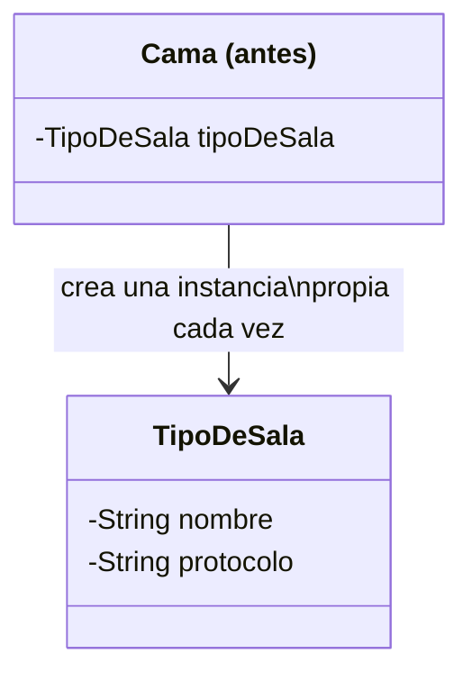
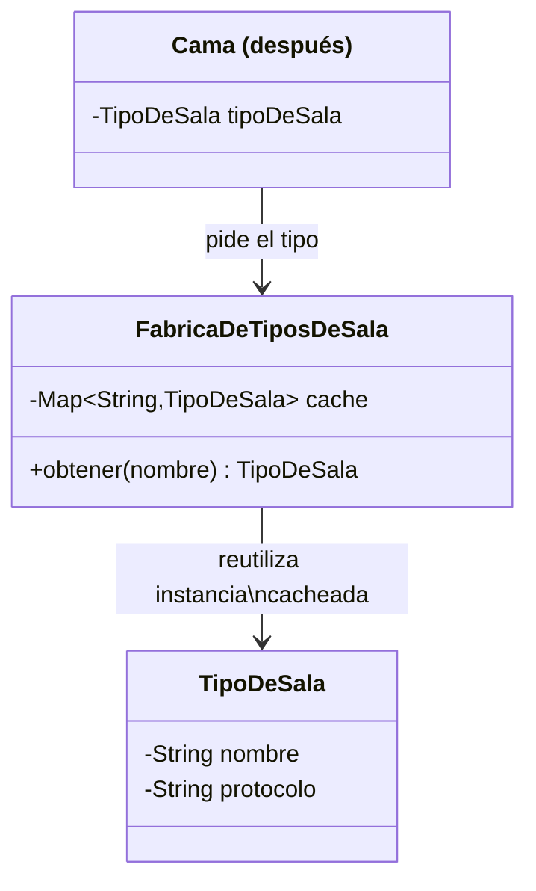

# 💡 Ejemplo 07 — Flyweight

## 🌍 Contexto

MediSalud modela cada cama del hospital con su tipo de sala asociado (general, terapia intensiva,
aislamiento). Cada `Cama` crea su propio objeto `TipoDeSala`, aunque el hospital solo tiene un puñado de
tipos distintos — con miles de camas, eso significa miles de objetos `TipoDeSala` repetidos con los
mismos datos.

**Qué busca demostrar este ejemplo**: si dos camas del mismo tipo comparten la misma instancia de
`TipoDeSala` en memoria, comparado entre crear una instancia por cama y compartir instancias mediante una
fábrica con caché.

## 🏥 Caso de estudio

MediSalud asigna un tipo de sala a cada cama del hospital.

## 🗺️ Diagrama





*Arriba, la versión "antes" (cada cama crea su propio `TipoDeSala`). Abajo, la versión "después" (una
fábrica cachea y reutiliza instancias).*

## 🌳 Árbol de archivos — antes

```text
flyweight-antes/
└── com/medisalud/
    ├── TipoDeSala.java
    ├── Cama.java
    └── Demo.java
```

## 💻 Archivo: TipoDeSala.java

```java
package com.medisalud;

public class TipoDeSala {
    private String nombre;
    private String icono;

    public TipoDeSala(String nombre, String icono) {
        this.nombre = nombre;
        this.icono = icono;
    }

    public String describir() {
        return nombre + " (" + icono + ")";
    }
}
```

## 💻 Archivo: Cama.java

```java
package com.medisalud;

public class Cama {
    private int posicion;
    private TipoDeSala tipoDeSala;

    public Cama(int posicion, String nombreSala, String icono) {
        this.posicion = posicion;
        // Cada cama crea su propia copia del tipo de sala, aunque el nombre y el icono se repitan
        this.tipoDeSala = new TipoDeSala(nombreSala, icono);
    }

    public TipoDeSala getTipoDeSala() {
        return tipoDeSala;
    }

    public String describir() {
        return "Cama " + posicion + ": " + tipoDeSala.describir();
    }
}
```

## 💻 Archivo: Demo.java

```java
package com.medisalud;

public class Demo {
    public static void main(String[] args) {
        // Datos de entrada
        Cama cama1 = new Cama(1, "Terapia Intensiva", "UCI");
        Cama cama2 = new Cama(2, "Terapia Intensiva", "UCI");
        Cama cama3 = new Cama(3, "Terapia Intensiva", "UCI");

        System.out.println(cama1.describir());
        System.out.println(cama2.describir());
        System.out.println(cama3.describir());

        boolean mismaInstancia = cama1.getTipoDeSala() == cama2.getTipoDeSala();
        System.out.println("mismaInstancia=" + mismaInstancia);
    }
}
```

## ✅ Resultado esperado — antes

```text
Cama 1: Terapia Intensiva (UCI)
Cama 2: Terapia Intensiva (UCI)
Cama 3: Terapia Intensiva (UCI)
mismaInstancia=false
```

## 🌳 Árbol de archivos — después

```text
flyweight-despues/
└── com/medisalud/
    ├── TipoDeSala.java             (sin cambios)
    ├── FabricaDeTiposDeSala.java   (nuevo)
    ├── Cama.java                   (cambió)
    └── Demo.java                   (cambió)
```

Sin cambios respecto de "antes": `TipoDeSala.java` — su código ya se mostró arriba y es exactamente el
mismo, byte a byte.

<details>
<summary>💻 Ver de nuevo el código sin cambios (TipoDeSala.java)</summary>

## 💻 Archivo: TipoDeSala.java

```java
package com.medisalud;

public class TipoDeSala {
    private String nombre;
    private String icono;

    public TipoDeSala(String nombre, String icono) {
        this.nombre = nombre;
        this.icono = icono;
    }

    public String describir() {
        return nombre + " (" + icono + ")";
    }
}
```

</details>

## 💻 Archivo: FabricaDeTiposDeSala.java — nuevo

```java
package com.medisalud;

import java.util.HashMap;
import java.util.Map;

public class FabricaDeTiposDeSala {
    private static Map<String, TipoDeSala> tiposCreados = new HashMap<>();

    public static TipoDeSala obtener(String nombreSala, String icono) {
        TipoDeSala existente = tiposCreados.get(nombreSala);
        if (existente != null) {
            return existente;
        }
        TipoDeSala nuevo = new TipoDeSala(nombreSala, icono);
        tiposCreados.put(nombreSala, nuevo);
        return nuevo;
    }
}
```

## 💻 Archivo: Cama.java — cambió

```java
package com.medisalud;

public class Cama {
    private int posicion;
    private TipoDeSala tipoDeSala;

    public Cama(int posicion, String nombreSala, String icono) {
        this.posicion = posicion;
        this.tipoDeSala = FabricaDeTiposDeSala.obtener(nombreSala, icono);
    }

    public TipoDeSala getTipoDeSala() {
        return tipoDeSala;
    }

    public String describir() {
        return "Cama " + posicion + ": " + tipoDeSala.describir();
    }
}
```

## 💻 Archivo: Demo.java — cambió

```java
package com.medisalud;

public class Demo {
    public static void main(String[] args) {
        // Datos de entrada
        Cama cama1 = new Cama(1, "Terapia Intensiva", "UCI");
        Cama cama2 = new Cama(2, "Terapia Intensiva", "UCI");
        Cama cama3 = new Cama(3, "Terapia Intensiva", "UCI");

        System.out.println(cama1.describir());
        System.out.println(cama2.describir());
        System.out.println(cama3.describir());

        boolean mismaInstancia = cama1.getTipoDeSala() == cama2.getTipoDeSala();
        System.out.println("mismaInstancia=" + mismaInstancia);
    }
}
```

## ✅ Resultado esperado — después

```text
Cama 1: Terapia Intensiva (UCI)
Cama 2: Terapia Intensiva (UCI)
Cama 3: Terapia Intensiva (UCI)
mismaInstancia=true
```

## 🔍 Comparación: la prueba concreta

`Demo` crea dos camas del mismo tipo ("General") y compara sus objetos `TipoDeSala` con `==` (igualdad de
referencia, no de contenido). En la versión "antes", `mismaInstancia=false`: cada `Cama` construyó su
propio `TipoDeSala("General", ...)`, así que son dos objetos distintos aunque tengan los mismos datos. En
la versión "después", `mismaInstancia=true`: ambas camas piden su tipo a
`FabricaDeTiposDeSala.obtener("General")`, que devuelve la misma instancia cacheada la segunda vez — dos
camas del mismo tipo comparten un único objeto `TipoDeSala` en memoria.

## 🔍 Análisis: errores frecuentes

El error más frecuente al aplicar Flyweight es cachear el objeto compartido (el estado intrínseco, como
`nombre` y `protocolo` de `TipoDeSala`) junto con datos que sí varían por cama (el estado extrínseco, como
el número de cama o el paciente asignado). Si `TipoDeSala` almacenara el número de cama, cada cama
necesitaría su propia instancia y el caché dejaría de tener sentido — Flyweight solo funciona cuando el
objeto compartido no contiene ningún dato que distinga a un usuario individual del objeto de otro.

## ❓ Preguntas de repaso

**1. [Selección]** En la versión "antes", si dos camas tienen el mismo tipo de sala ("General"), ¿qué
devuelve comparar sus objetos `TipoDeSala` con `==`?

- A. `true`, porque tienen los mismos datos.
- B. `false`, porque cada cama creó su propia instancia.
- C. Un error de compilación.
- D. Depende del orden en que se crearon las camas.

<details>
<summary>🔑 Ver respuesta</summary>

**Respuesta correcta: B.** `==` compara igualdad de referencia, no de contenido — cada `Cama` construyó
su propio objeto `TipoDeSala`, así que son dos instancias distintas aunque los datos sean iguales.

</details>

**2. [Selección múltiple]** Sobre la versión "después", ¿cuáles afirmaciones son verdaderas?

- A. `FabricaDeTiposDeSala` guarda las instancias creadas en un `Map`, indexado por nombre de tipo.
- B. Dos camas del mismo tipo comparten la misma instancia de `TipoDeSala`.
- C. `TipoDeSala.java` se modificó para agregar el número de cama.
- D. La primera vez que se pide un tipo, la fábrica lo crea; las siguientes veces, lo reutiliza.

<details>
<summary>🔑 Ver respuesta</summary>

**Respuestas correctas: A, B y D.** C es falsa: `TipoDeSala.java` no cambia — solo contiene datos
compartidos entre camas del mismo tipo (estado intrínseco), nunca datos propios de una cama en particular.

</details>

**3. [Abierta]** Un compañero propone agregar el número de cama como atributo de `TipoDeSala`, para
"tener todo junto en un solo objeto". ¿Qué problema tendría esa idea con Flyweight? Justifica tu
respuesta.

<details>
<summary>🔑 Ver respuesta</summary>

Rompería el patrón. El número de cama es estado extrínseco: varía en cada cama individual, así que no
puede vivir dentro del objeto compartido. Si `TipoDeSala` almacenara el número de cama, cada cama
necesitaría su propia instancia (porque cada una tiene un número distinto), y `FabricaDeTiposDeSala` ya
no podría reutilizar una misma instancia entre dos camas — el caché dejaría de ahorrar memoria, que es la
razón de ser de Flyweight.

</details>
