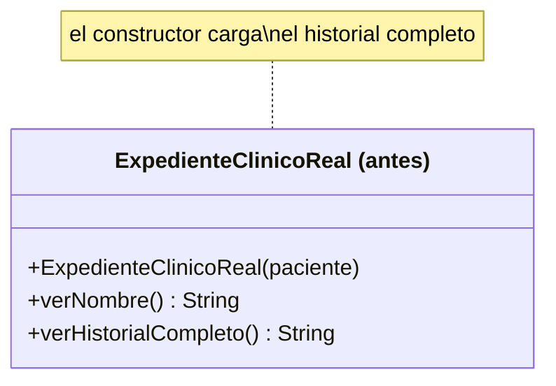
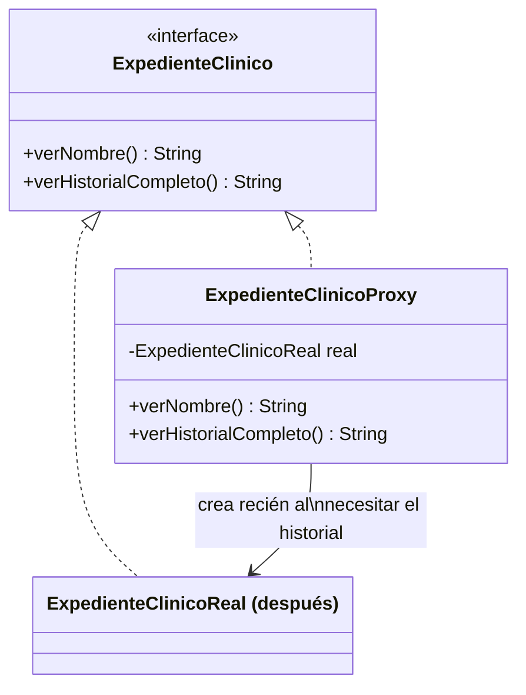

# 💡 Ejemplo 08 — Proxy

## 🌍 Contexto

Cargar la historia clínica completa de un paciente (`ExpedienteClinicoReal`) es una operación costosa: lee
años de estudios, análisis e internaciones. El código actual la carga apenas se crea el objeto, aunque
muchas veces solo se necesita consultar el nombre del paciente sin ver el historial completo.

**Qué busca demostrar este ejemplo**: en qué momento se carga el historial completo, comparado entre
cargarlo siempre al crear el objeto y postergar la carga hasta que realmente se lo necesita.

## 🏥 Caso de estudio

MediSalud consulta historias clínicas de pacientes, algunas veces solo para ver el nombre, otras veces
para ver el historial completo.

## 🗺️ Diagrama





*Arriba, la versión "antes" (carga siempre en el constructor). Abajo, la versión "después" (el proxy
posterga la carga).*

## 🌳 Árbol de archivos — antes

```text
proxy-antes/
└── com/medisalud/
    ├── ExpedienteClinicoReal.java
    └── Demo.java
```

## 💻 Archivo: ExpedienteClinicoReal.java

```java
package com.medisalud;

public class ExpedienteClinicoReal {
    private String paciente;

    public ExpedienteClinicoReal(String paciente) {
        this.paciente = paciente;
        // Simula una carga costosa desde un sistema externo
        System.out.println("Cargando historia clinica de " + paciente + " desde el sistema externo...");
    }

    public String consultar() {
        return "Historia clinica de " + paciente + ": sin antecedentes relevantes";
    }
}
```

## 💻 Archivo: Demo.java

```java
package com.medisalud;

public class Demo {
    public static void main(String[] args) {
        // Datos de entrada
        System.out.println("Abriendo la ficha de Marta Diaz...");
        new ExpedienteClinicoReal("Marta Diaz");
        System.out.println("Ficha abierta, sin consultar la historia todavia.");
    }
}
```

## ✅ Resultado esperado — antes

```text
Abriendo la ficha de Marta Diaz...
Cargando historia clinica de Marta Diaz desde el sistema externo...
Ficha abierta, sin consultar la historia todavia.
```

## 🌳 Árbol de archivos — después

```text
proxy-despues/
└── com/medisalud/
    ├── ExpedienteClinico.java        (nuevo)
    ├── ExpedienteClinicoReal.java    (cambió: implementa la interfaz)
    ├── ExpedienteClinicoProxy.java   (nuevo)
    └── Demo.java                   (cambió)
```

## 💻 Archivo: ExpedienteClinico.java — nuevo

```java
package com.medisalud;

public interface ExpedienteClinico {
    String consultar();
}
```

## 💻 Archivo: ExpedienteClinicoReal.java — cambió

```java
package com.medisalud;

public class ExpedienteClinicoReal implements ExpedienteClinico {
    private String paciente;

    public ExpedienteClinicoReal(String paciente) {
        this.paciente = paciente;
        // Simula una carga costosa desde un sistema externo
        System.out.println("Cargando historia clinica de " + paciente + " desde el sistema externo...");
    }

    public String consultar() {
        return "Historia clinica de " + paciente + ": sin antecedentes relevantes";
    }
}
```

## 💻 Archivo: ExpedienteClinicoProxy.java — nuevo

```java
package com.medisalud;

public class ExpedienteClinicoProxy implements ExpedienteClinico {
    private String paciente;
    private ExpedienteClinicoReal historiaReal;

    public ExpedienteClinicoProxy(String paciente) {
        this.paciente = paciente;
    }

    public String consultar() {
        if (historiaReal == null) {
            historiaReal = new ExpedienteClinicoReal(paciente);
        }
        return historiaReal.consultar();
    }
}
```

## 💻 Archivo: Demo.java — cambió

```java
package com.medisalud;

public class Demo {
    public static void main(String[] args) {
        // Datos de entrada
        System.out.println("Abriendo la ficha de Marta Diaz...");
        ExpedienteClinico historia = new ExpedienteClinicoProxy("Marta Diaz");
        System.out.println("Ficha abierta, sin consultar la historia todavia.");

        System.out.println("Consultando la historia...");
        System.out.println(historia.consultar());
    }
}
```

## ✅ Resultado esperado — después

```text
Abriendo la ficha de Marta Diaz...
Ficha abierta, sin consultar la historia todavia.
Consultando la historia...
Cargando historia clinica de Marta Diaz desde el sistema externo...
Historia clinica de Marta Diaz: sin antecedentes relevantes
```

## 🔍 Comparación: la prueba concreta

`Demo` crea el objeto, llama a `verNombre()`, y recién después llama a `verHistorialCompleto()`,
imprimiendo un mensaje antes de cada llamada. El orden de los mensajes revela la diferencia real: en la
versión "antes", el mensaje `"Cargando historial completo..."` aparece **antes** que
`"Consultando nombre..."`, porque el constructor de `ExpedienteClinicoReal` carga el historial de
inmediato, sin importar si se lo va a pedir o no. En la versión "después", ese mismo mensaje aparece
**después** de `"Consultando nombre..."` — recién cuando `Demo` llama a `verHistorialCompleto()`, el
proxy crea por primera vez la `ExpedienteClinicoReal` (y ahí, recién ahí, se carga el historial); si
`Demo` nunca hubiera llamado a `verHistorialCompleto()`, la carga costosa nunca habría ocurrido.

## 🔍 Análisis: errores frecuentes

El error más frecuente al aplicar Proxy es que el proxy cree la instancia real en su propio constructor
(en vez de crearla recién dentro del método que la necesita), lo que elimina por completo el beneficio de
la carga diferida — el proxy terminaría cargando el historial completo en el mismo momento que la versión
"antes", solo que a través de una clase intermedia.

## ❓ Preguntas de repaso

**1. [Selección]** En la versión "antes", ¿en qué momento se carga el historial completo del paciente?

- A. Recién cuando se llama a `verHistorialCompleto()`.
- B. En el constructor de `ExpedienteClinicoReal`, sin importar si se lo va a pedir.
- C. Nunca se carga automáticamente.
- D. Solo si se llama a `verNombre()` primero.

<details>
<summary>🔑 Ver respuesta</summary>

**Respuesta correcta: B.** El constructor de `ExpedienteClinicoReal` carga el historial completo de
inmediato, independientemente de si el código luego lo consulta o no.

</details>

**2. [Selección múltiple]** Sobre la versión "después", ¿cuáles afirmaciones son verdaderas?

- A. `ExpedienteClinicoProxy` implementa la misma interfaz `ExpedienteClinico` que `ExpedienteClinicoReal`.
- B. El historial completo se carga recién cuando se llama a `verHistorialCompleto()` por primera vez.
- C. `Demo` necesita saber si está usando el proxy o la clase real, porque los métodos son distintos.
- D. Si nunca se llama a `verHistorialCompleto()`, la carga costosa nunca ocurre.

<details>
<summary>🔑 Ver respuesta</summary>

**Respuestas correctas: A, B y D.** C es falsa: `Demo` llama a los mismos métodos de la interfaz
`ExpedienteClinico` sin importar si el objeto detrás es el proxy o la clase real — esa es la razón por la
que el proxy puede sustituir a la clase real de forma transparente.

</details>

**3. [Abierta]** Un compañero dice: "el proxy y la clase real hacen lo mismo, solo que el proxy tiene un
nombre distinto". ¿Estás de acuerdo? Justifica tu respuesta con el orden de mensajes observado en este
ejemplo.

<details>
<summary>🔑 Ver respuesta</summary>

No. Ambos implementan la misma interfaz y exponen los mismos métodos, pero el proxy agrega un
comportamiento que la clase real no tiene: postergar la creación de la clase real hasta que su
funcionalidad completa es realmente necesaria. La prueba concreta es el orden de los mensajes: con la
clase real, `"Cargando historial completo..."` aparece antes que `"Consultando nombre..."`; con el proxy,
aparece después — y solo si `verHistorialCompleto()` llegó a llamarse. Si el proxy solo delegara sin
agregar esa lógica, no habría ninguna diferencia observable entre usar uno u otro.

</details>
