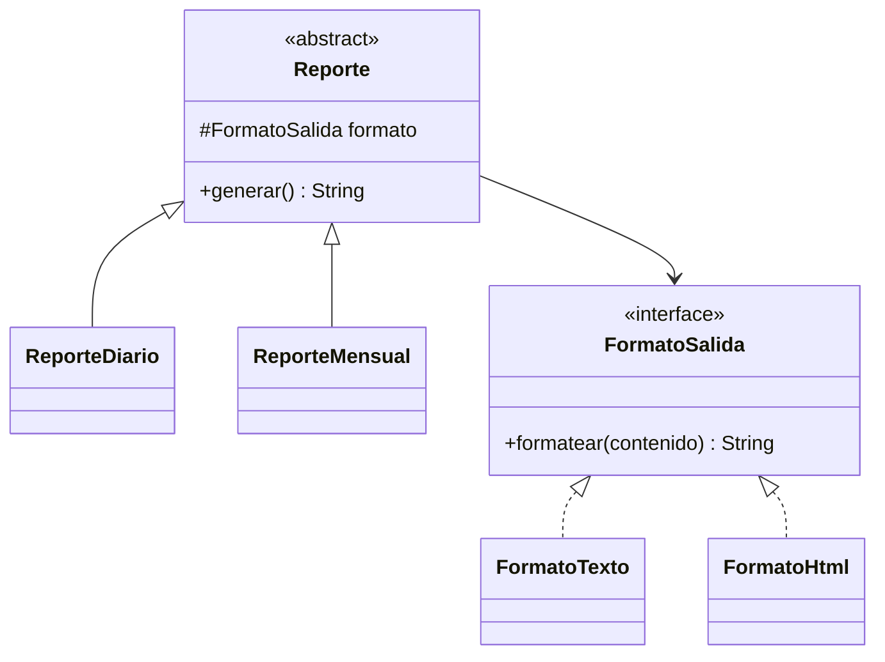

# 🟡 Intermedio 02 — Aplicar Bridge

## 🧩 Problema

Tienes las mismas cuatro clases de la Biblioteca Universitaria del ejercicio Básico 02:

## 💻 Código o contexto de partida

```java
package com.biblioteca;

public class ReporteDiarioTexto {
    public String generar() {
        return "REPORTE (texto): 12 prestamos hoy";
    }
}
```

```java
package com.biblioteca;

public class ReporteDiarioHtml {
    public String generar() {
        return "<html><body>12 prestamos hoy</body></html>";
    }
}
```

```java
package com.biblioteca;

public class ReporteMensualTexto {
    public String generar() {
        return "REPORTE (texto): 340 prestamos este mes";
    }
}
```

```java
package com.biblioteca;

public class ReporteMensualHtml {
    public String generar() {
        return "<html><body>340 prestamos este mes</body></html>";
    }
}
```

```java
package com.biblioteca;

public class Demo {
    public static void main(String[] args) {
        System.out.println(new ReporteDiarioTexto().generar());
        System.out.println(new ReporteDiarioHtml().generar());
        System.out.println(new ReporteMensualTexto().generar());
        System.out.println(new ReporteMensualHtml().generar());
    }
}
```

Rediséñalo para que respete Bridge: separa el período de reporte y el formato de salida en dos jerarquías
independientes, combinadas por composición.

## 🗺️ Diagrama



## 🧪 Casos de prueba

| Entrada | Verificación | Resultado esperado |
|---|---|---|
| Las cuatro combinaciones de período y formato de la versión original | Salida completa del programa antes y después de refactorizar | Idéntica, carácter por carácter |
| Se agrega un formato nuevo (`FormatoPdf`) como una clase que implementa `FormatoSalida` | Clases `ReporteDiario.java` y `ReporteMensual.java` | Sin ninguna modificación |

## 📏 Criterios de evaluación de la solución

- Declara una interfaz `FormatoSalida` con un método `formatear(String contenido)`, implementada por
  `FormatoTexto` y `FormatoHtml`.
- Declara una clase abstracta `Reporte` que recibe un `FormatoSalida` por composición, con subclases
  `ReporteDiario` y `ReporteMensual`.
- La salida por consola no cambia respecto de la versión original.
- Un formato de salida nuevo se agrega con una sola clase, sin modificar ninguna clase de período.

## 🚧 Restricciones

- No se usan `Set`, `Map` ni excepciones como parte del diseño.

## 📊 Dificultad

Intermedio

## 🎓 Resultados de aprendizaje

- **RA-7**: implementar Bridge para un caso dado.
