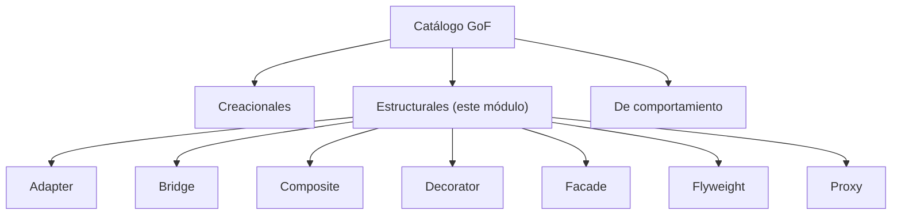
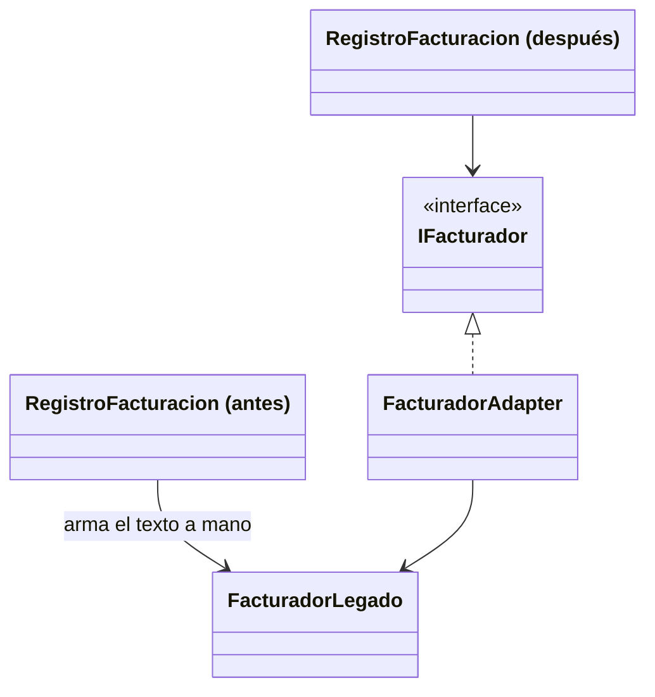
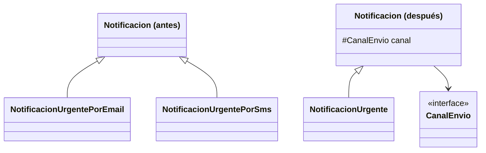
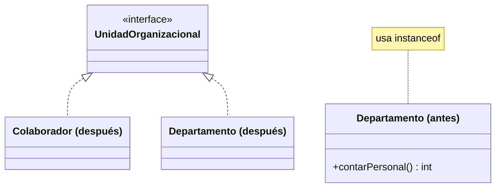
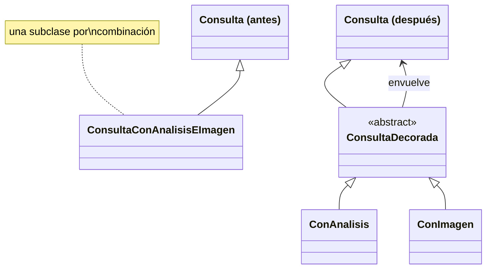
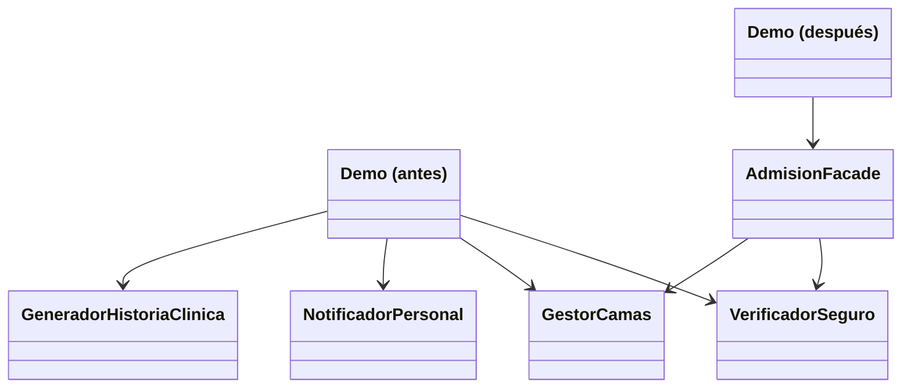
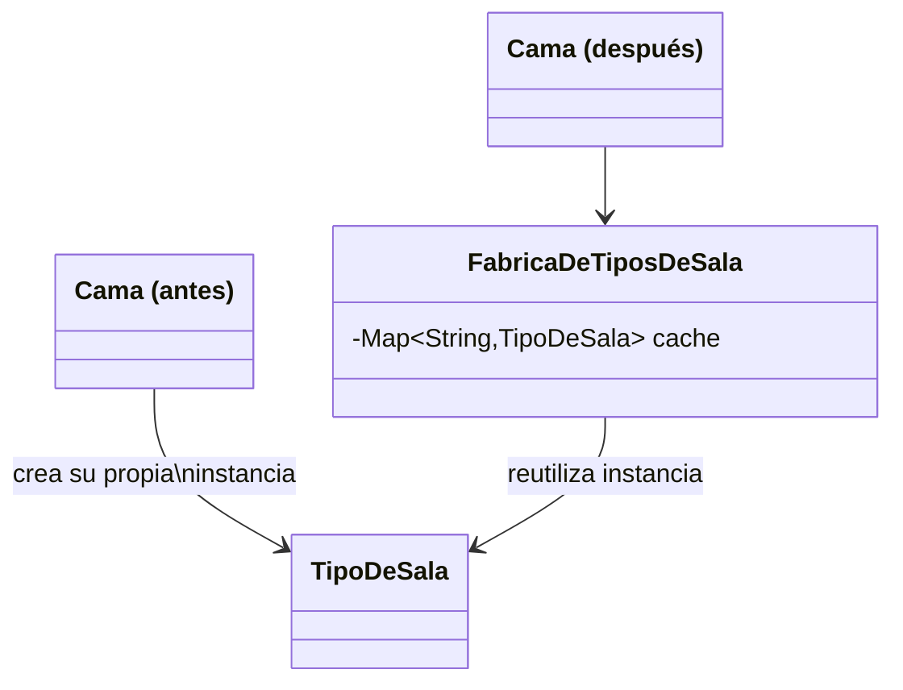
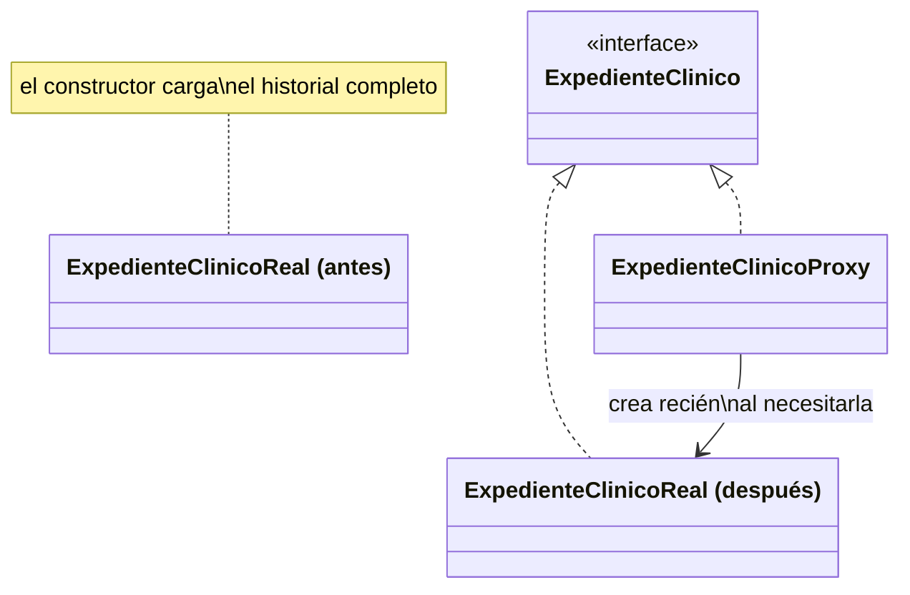

# Módulo 13 — Patrones de Diseño (Patrones Estructurales)

Curso de Java

---

## 🎯 Objetivos del módulo

- Explicar qué es un patrón estructural y qué lo distingue de los patrones creacionales y de
  comportamiento.
- Explicar el problema de composición que resuelve cada uno de los siete patrones: Adapter, Bridge,
  Composite, Decorator, Facade, Flyweight y Proxy.
- Identificar cuál de los siete patrones resuelve un problema de composición dado.
- Implementar cada patrón en Java para un caso real.

---

## 🗺️ Ruta de la sesión

1. Qué son los patrones estructurales.
2. Adapter.
3. Bridge.
4. Composite.
5. Decorator.
6. Facade.
7. Flyweight.
8. Proxy.

---

## 🧠 ¿Qué es un patrón estructural?

Un patrón estructural resuelve cómo se componen clases y objetos para formar estructuras más grandes,
sin acoplar el código cliente a los detalles de esa composición. Se distingue de los creacionales
(resuelven cómo se crean los objetos) y de los de comportamiento (resuelven cómo se comunican y reparten
responsabilidades).

---

## 🗺️ Diagrama: las tres categorías y los siete patrones de este módulo



---

## 🔌 Adapter

Convierte la interfaz de una clase existente en otra que el código cliente ya espera, sin modificar la
clase existente — centraliza en un único lugar una traducción que, de otro modo, quedaría duplicada en
el cliente.

---

## 🗺️ Diagrama: Adapter antes/después



---

## 💻 Adapter — antes

```java
public String facturarConsulta(String paciente, double monto) {
    String datosPago = "PACIENTE=" + paciente + ";MONTO=" + monto + ";TIPO=CONSULTA";
    return facturadorLegado.procesarPago(datosPago);
}
```

---

## 💻 Adapter — después

```java
public String facturarConsulta(String paciente, double monto) {
    return facturador.facturar(paciente, monto, "CONSULTA");
}
```

---

## 🔍 Adapter — la prueba concreta

Misma salida en ambas versiones. En la versión "antes", la traducción al formato de `FacturadorLegado`
está duplicada en dos métodos. En la versión "después", vive en un único lugar
(`FacturadorAdapter.facturar`), y `FacturadorLegado.java` no se modifica en absoluto.

---

## 🌉 Bridge

Separa una abstracción de su implementación en dos jerarquías independientes, combinadas por
composición — evita que dos dimensiones de variación mezcladas en una sola jerarquía produzcan una
explosión combinatoria de subclases.

---

## 🗺️ Diagrama: Bridge antes/después



---

## 💻 Bridge — antes

```java
// dentro de NotificacionUrgentePorEmail extends Notificacion
public String enviar(String paciente, String mensaje) {
    return "EMAIL URGENTE a " + paciente + ": " + mensaje;
}
```

---

## 💻 Bridge — después

```java
// dentro de NotificacionUrgente extends Notificacion
public String enviar(String paciente, String mensaje) {
    return canal.enviarPor(paciente, "URGENTE: " + mensaje);
}
```

---

## 🔍 Bridge — la prueba concreta

Ambas versiones dan la misma salida para las combinaciones existentes. La diferencia real aparece al
agregar un canal nuevo ("Push"): en la versión "antes" hacen falta 2 clases nuevas (una por cada tipo
existente); en la versión "después", las 6 clases existentes quedan **idénticas, byte a byte**, y el
canal nuevo se agrega con **una sola clase**.

---

## 🔍 Bridge — extender con un canal nuevo (el diff real)

| Comparación | Resultado |
|---|---|
| Agregar `"Push"` a la versión "antes" | 2 clases nuevas — una por cada tipo de notificación existente |
| Agregar `"Push"` a la versión "después" | Las 6 clases existentes, sin ninguna modificación (`diff` sin salida) — 1 sola clase nueva (`CanalPush`) |

En la versión "antes", el costo de un canal nuevo crece con la cantidad de tipos existentes. En la
versión "después", ese costo es siempre el mismo: una clase, sin importar cuántos tipos existan.

---

## 🌲 Composite

Compone objetos en una estructura de árbol para representar jerarquías "parte-todo", permitiendo tratar
un objeto individual y una composición de objetos con la misma interfaz — sin `instanceof`.

---

## 🗺️ Diagrama: Composite antes/después



---

## 💻 Composite — antes

```java
if (miembro instanceof Departamento) {
    total += ((Departamento) miembro).contarPersonal();
} else if (miembro instanceof Colaborador) {
    total += 1;
}
```

---

## 💻 Composite — después

```java
for (UnidadOrganizacional miembro : miembros) {
    total += miembro.contarPersonal();
}
```

---

## 🔍 Composite — la prueba concreta

Sobre la misma estructura anidada, ambas versiones dan `personal en Clinica Medica=4`. La versión
"antes" pregunta `instanceof` en cada llamada; la versión "después" no usa ningún `instanceof` — el
polimorfismo decide qué implementación ejecutar.

---

## 🎁 Decorator

Agrega responsabilidades a un objeto de forma dinámica, envolviéndolo, como alternativa a la herencia
para combinar extras opcionales sin una subclase por cada combinación posible.

---

## 🗺️ Diagrama: Decorator antes/después



---

## 💻 Decorator — antes

```java
// dentro de ConsultaConAnalisisEImagen extends Consulta
public double costo() {
    return 3000 + 1500 + 2500;
}
```

---

## 💻 Decorator — después

```java
Consulta consultaCompleta = new ConImagen(new ConAnalisis(new Consulta()));
System.out.println(consultaCompleta.costo());
```

---

## 🔍 Decorator — la prueba concreta

Ambas versiones dan el mismo costo final ($7000) para la combinación completa. La versión "antes"
necesitó una subclase (`ConsultaConAnalisisEImagen`) solo para esa combinación. La versión "después"
combina los mismos extras envolviendo decoradores, con **0 clases de combinación**.

---

## 🏢 Facade

Ofrece una interfaz única y simplificada sobre un conjunto de interfaces de un subsistema complejo,
ocultando su orquestación interna sin eliminar los subsistemas.

---

## 🗺️ Diagrama: Facade antes/después



---

## 💻 Facade — antes

```java
verificadorSeguro.verificar(paciente);
gestorCamas.reservar(paciente);
notificadorPersonal.avisar(paciente);
generadorHistoriaClinica.generar(paciente);
```

---

## 💻 Facade — después

```java
admisionFacade.admitirPaciente(paciente);
```

---

## 🔍 Facade — la prueba concreta

Misma salida de cuatro líneas en ambas versiones. En la versión "antes", el cliente conoce 4 clases de
subsistema. En la versión "después", el cliente conoce **1 sola clase** — la fachada sigue usando las
mismas 4 clases por dentro, sin modificarlas.

---

## 🪶 Flyweight

Comparte una única instancia de estado intrínseco (idéntico) entre muchos objetos de grano fino, en vez
de que cada uno cree su propia copia — reduce el costo de memoria.

---

## 🗺️ Diagrama: Flyweight antes/después



---

## 💻 Flyweight — antes

```java
public Cama(String numero, String nombreTipo) {
    this.tipoDeSala = new TipoDeSala(nombreTipo, "...");
}
```

---

## 💻 Flyweight — después

```java
public Cama(String numero, String nombreTipo) {
    this.tipoDeSala = FabricaDeTiposDeSala.obtener(nombreTipo);
}
```

---

## 🔍 Flyweight — la prueba concreta

Comparando dos camas del mismo tipo con `==`: en la versión "antes", `mismaInstancia=false` — cada cama
creó su propio objeto. En la versión "después", `mismaInstancia=true` — ambas camas comparten la misma
instancia cacheada.

---

## 🛡️ Proxy

Un sustituto que implementa la misma interfaz que un objeto real y controla el acceso a él: puede
retrasar su creación, verificar permisos, o registrar cada acceso.

---

## 🗺️ Diagrama: Proxy antes/después



---

## 💻 Proxy — antes

```java
public ExpedienteClinicoReal(String paciente) {
    System.out.println("Cargando historial completo...");
    this.historial = cargarHistorialCompleto(paciente);
}
```

---

## 💻 Proxy — después

```java
public String verHistorialCompleto() {
    if (real == null) {
        real = new ExpedienteClinicoReal(paciente);
    }
    return real.verHistorialCompleto();
}
```

---

## 🔍 Proxy — la prueba concreta

En la versión "antes", el mensaje de carga aparece **antes** de consultar el nombre, sin importar si el
historial completo se llega a pedir. En la versión "después", ese mismo mensaje aparece **recién** al
llamar a `verHistorialCompleto()` por primera vez — si nunca se llama, la carga costosa nunca ocurre.

---

## ⚠️ Errores frecuentes, uno por patrón

- **Adapter**: dejar que el cliente reciba la clase legada en algunos lugares y el adaptador en otros.
- **Bridge**: usarlo cuando en realidad solo hay una dimensión de variación.
- **Composite**: declarar la interfaz común pero seguir tipando la colección como `List<Object>`.
- **Decorator**: confundirlo con herencia simple, que fija la combinación en tiempo de compilación.
- **Facade**: confundirlo con Adapter — Facade orquesta varias clases, Adapter traduce una interfaz.
- **Flyweight**: guardar estado extrínseco (propio de cada usuario) dentro del objeto compartido.
- **Proxy**: crear la instancia real en el constructor del proxy, en vez de dentro del método que la usa.

---

## 📋 Resumen de los siete patrones estructurales

| Patrón | Qué resuelve |
|---|---|
| Adapter | Interfaz incompatible traducida a mano en varios lugares |
| Bridge | Dos dimensiones de variación mezcladas en una jerarquía |
| Composite | Condicionales para distinguir individuo de compuesto |
| Decorator | Combinaciones de extras resueltas con herencia |
| Facade | El cliente conoce y orquesta demasiados subsistemas |
| Flyweight | Muchos objetos casi idénticos desperdiciando memoria |
| Proxy | Objeto costoso o sensible sin control intermedio |

---

## 🛠️ Taller: Sistema de Gestión de Documentos Clínicos de MediSalud

Combina cuatro de los siete patrones: Adapter (`ResultadoLaboratorioAdapter`), Composite
(`CarpetaClinica`), Decorator (`DocumentoConMarcaUrgente`) y Proxy (`ImagenEstudioProxy`), integrados en
una única carpeta clínica.

---

## 🧪 Ejercicios: Biblioteca Universitaria

Un ejercicio Básico (identificar la violación) y uno Intermedio (aplicar el patrón) por cada uno de los
siete patrones, con la Biblioteca Universitaria como dominio.

---

## 🔴🏆 Avanzado y Desafío: Biblioteca Universitaria

**Avanzado**: corregir un diseño con dos patrones ausentes a la vez (Adapter + Facade). **Desafío**: sin
scaffold, elegir y justificar el patrón estructural más adecuado para un caso nuevo.

---

## ❓ Quiz 01

23 preguntas en formato entrevista técnica: 1 introductoria, 3 por cada uno de los siete patrones, y 1
integradora final sobre cómo elegir el patrón adecuado.

---

## 📚 Repaso: la pregunta clave de cada patrón

- **Adapter**: ¿la interfaz que tengo es distinta de la que el cliente espera?
- **Bridge**: ¿hay dos dimensiones de variación independientes mezcladas en una jerarquía?
- **Composite**: ¿necesito tratar un objeto individual y una composición de la misma forma?
- **Decorator**: ¿necesito combinar extras opcionales sin una subclase por combinación?
- **Facade**: ¿el cliente conoce y orquesta demasiados subsistemas?
- **Flyweight**: ¿muchos objetos repiten exactamente el mismo estado?
- **Proxy**: ¿necesito controlar el acceso a un objeto costoso o sensible?

---

## ✅ Checklist de cierre

- Puedo explicar qué resuelve cada uno de los siete patrones estructurales.
- Puedo identificar cuál de los siete resuelve un problema de composición dado.
- Puedo implementar cada patrón en Java para un caso nuevo.
- Completé el Taller, los ejercicios Básico e Intermedio de los siete patrones, y el Quiz 01.

---

## 🎓 Cierre

Los patrones estructurales no crean objetos nuevos ni deciden cómo se comunican — deciden cómo se
componen. La misma pregunta ("¿qué problema de composición tengo?") identifica cuál de los siete
aplica en cada caso nuevo.
