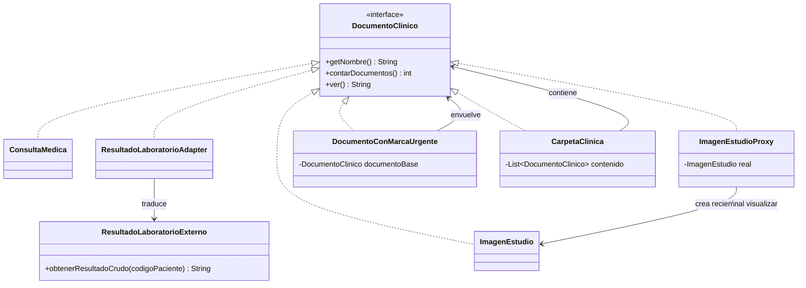

# 🔑 Solución del Taller 01 — Sistema de Gestión de Documentos Clínicos de MediSalud

> Material docente, no enlazar desde la audiencia estudiante.

## 🗺️ Diagrama de clases



## 🌳 Árbol de archivos

```text
GestionDocumentosClinicos/
└── com/medisalud/
    ├── DocumentoClinico.java
    ├── ConsultaMedica.java
    ├── ResultadoLaboratorioExterno.java
    ├── ResultadoLaboratorioAdapter.java
    ├── CarpetaClinica.java
    ├── DocumentoConMarcaUrgente.java
    ├── ImagenEstudio.java
    ├── ImagenEstudioProxy.java
    └── Demo.java
```

## 💻 Código completo

## 💻 Archivo: DocumentoClinico.java

```java
package com.medisalud;

public interface DocumentoClinico {
    String getNombre();
    int contarDocumentos();
    String ver();
}
```

## 💻 Archivo: ConsultaMedica.java

```java
package com.medisalud;

public class ConsultaMedica implements DocumentoClinico {
    private String nombre;
    private String notas;

    public ConsultaMedica(String nombre, String notas) {
        this.nombre = nombre;
        this.notas = notas;
    }

    public String getNombre() {
        return nombre;
    }

    public int contarDocumentos() {
        return 1;
    }

    public String ver() {
        return nombre + ": " + notas;
    }
}
```

## 💻 Archivo: ResultadoLaboratorioExterno.java

```java
package com.medisalud;

public class ResultadoLaboratorioExterno {
    public String obtenerResultadoCrudo(String codigoPaciente) {
        return "PACIENTE=" + codigoPaciente + ";RESULTADO=Hemograma dentro de parametros normales";
    }
}
```

## 💻 Archivo: ResultadoLaboratorioAdapter.java

```java
package com.medisalud;

public class ResultadoLaboratorioAdapter implements DocumentoClinico {
    private String nombre;
    private String codigoPaciente;
    private ResultadoLaboratorioExterno laboratorioExterno = new ResultadoLaboratorioExterno();

    public ResultadoLaboratorioAdapter(String nombre, String codigoPaciente) {
        this.nombre = nombre;
        this.codigoPaciente = codigoPaciente;
    }

    public String getNombre() {
        return nombre;
    }

    public int contarDocumentos() {
        return 1;
    }

    public String ver() {
        String crudo = laboratorioExterno.obtenerResultadoCrudo(codigoPaciente);
        String resultado = crudo.split("RESULTADO=")[1];
        return nombre + ": " + resultado;
    }
}
```

## 💻 Archivo: CarpetaClinica.java

```java
package com.medisalud;

import java.util.ArrayList;
import java.util.List;

public class CarpetaClinica implements DocumentoClinico {
    private String nombre;
    private List<DocumentoClinico> contenido = new ArrayList<>();

    public CarpetaClinica(String nombre) {
        this.nombre = nombre;
    }

    public void agregar(DocumentoClinico documento) {
        contenido.add(documento);
    }

    public String getNombre() {
        return nombre;
    }

    public int contarDocumentos() {
        int total = 0;
        for (DocumentoClinico documento : contenido) {
            total += documento.contarDocumentos();
        }
        return total;
    }

    public String ver() {
        StringBuilder resumen = new StringBuilder(nombre + ":");
        for (DocumentoClinico documento : contenido) {
            resumen.append(" [").append(documento.getNombre()).append("]");
        }
        return resumen.toString();
    }
}
```

## 💻 Archivo: DocumentoConMarcaUrgente.java

```java
package com.medisalud;

public class DocumentoConMarcaUrgente implements DocumentoClinico {
    private DocumentoClinico documentoBase;

    public DocumentoConMarcaUrgente(DocumentoClinico documentoBase) {
        this.documentoBase = documentoBase;
    }

    public String getNombre() {
        return documentoBase.getNombre();
    }

    public int contarDocumentos() {
        return documentoBase.contarDocumentos();
    }

    public String ver() {
        return "[URGENTE] " + documentoBase.ver();
    }
}
```

## 💻 Archivo: ImagenEstudio.java

```java
package com.medisalud;

public class ImagenEstudio implements DocumentoClinico {
    private String nombre;
    private String contenido;

    public ImagenEstudio(String nombre) {
        this.nombre = nombre;
        System.out.println("Cargando imagen pesada de " + nombre + "...");
        this.contenido = "Imagen de " + nombre + " (2048x2048)";
    }

    public String getNombre() {
        return nombre;
    }

    public int contarDocumentos() {
        return 1;
    }

    public String ver() {
        return nombre + ": " + contenido;
    }
}
```

## 💻 Archivo: ImagenEstudioProxy.java

```java
package com.medisalud;

public class ImagenEstudioProxy implements DocumentoClinico {
    private String nombre;
    private ImagenEstudio real;

    public ImagenEstudioProxy(String nombre) {
        this.nombre = nombre;
    }

    public String getNombre() {
        return nombre;
    }

    public int contarDocumentos() {
        return 1;
    }

    public String ver() {
        if (real == null) {
            real = new ImagenEstudio(nombre);
        }
        return real.ver();
    }
}
```

## 💻 Archivo: Demo.java

```java
package com.medisalud;

public class Demo {
    public static void main(String[] args) {
        CarpetaClinica carpetaPaciente = new CarpetaClinica("Carpeta de Ana Perez");

        DocumentoClinico consulta = new ConsultaMedica("Consulta de rutina", "Paciente estable, sin sintomas");
        DocumentoClinico laboratorio = new ResultadoLaboratorioAdapter("Hemograma completo", "P-001");
        DocumentoClinico radiografia = new DocumentoConMarcaUrgente(new ImagenEstudioProxy("Radiografia de torax"));

        CarpetaClinica subCarpetaEstudios = new CarpetaClinica("Estudios previos");
        subCarpetaEstudios.agregar(new ConsultaMedica("Consulta de control anterior", "Sin novedades"));

        carpetaPaciente.agregar(consulta);
        carpetaPaciente.agregar(laboratorio);
        carpetaPaciente.agregar(radiografia);
        carpetaPaciente.agregar(subCarpetaEstudios);

        System.out.println("total de documentos=" + carpetaPaciente.contarDocumentos());
        System.out.println(consulta.ver());
        System.out.println(laboratorio.ver());
        System.out.println("Antes de ver la radiografia (aun no se cargo)");
        System.out.println(radiografia.ver());
    }
}
```

## ✅ Salida real

```text
total de documentos=4
Consulta de rutina: Paciente estable, sin sintomas
Hemograma completo: Hemograma dentro de parametros normales
Antes de ver la radiografia (aun no se cargo)
Cargando imagen pesada de Radiografia de torax...
[URGENTE] Radiografia de torax: Imagen de Radiografia de torax (2048x2048)
```

## ⚠️ Errores comunes observados

- **Hacer que `CarpetaClinica.contarDocumentos()` pregunte con `instanceof` si un elemento es una
  `CarpetaClinica` o un documento simple**: aunque compile y dé el mismo resultado, reintroduce
  exactamente la violación de Composite que el taller pide evitar — el punto entero de la interfaz
  común es que `contarDocumentos()` no necesite distinguir el tipo concreto.
- **Hacer que `ImagenEstudioProxy` cree la `ImagenEstudio` real en su propio constructor**: si la
  creación se mueve al constructor del proxy en vez de a `ver()`, la imagen se carga apenas se instancia
  el proxy, sin importar si después se llega a visualizar o no — eso elimina por completo el beneficio de
  la carga diferida.
- **Que `DocumentoConMarcaUrgente` solo funcione envolviendo `ConsultaMedica`**: si el decorador declara
  su campo con el tipo concreto (`ConsultaMedica documentoBase`) en vez de con la interfaz
  (`DocumentoClinico documentoBase`), no podría envolver un `ResultadoLaboratorioAdapter` ni un
  `ImagenEstudioProxy` como en la integración final — la marca de urgencia dejaría de ser aplicable a
  cualquier documento clínico.
