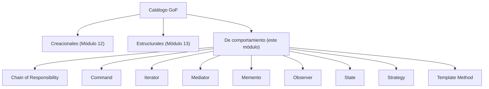

# 💡 Ejemplo 01 — Qué son los patrones de comportamiento

## 🌍 Contexto

Ya viste dos de las tres categorías del catálogo GoF: los patrones creacionales (Módulo 12, cómo se
crean los objetos) y los estructurales (Módulo 13, cómo se componen). Esta tercera categoría, los
patrones de comportamiento, resuelve un problema distinto: cómo se **comunican** los objetos entre sí y
cómo **reparten responsabilidades** de comportamiento, sin que esa comunicación quede rígida, dispersa
en condicionales, o repetida en varios lugares.

## 🗺️ Diagrama

## 🧭 Explicación paso a paso

1. Un patrón de comportamiento no crea objetos (eso es un patrón creacional) ni los compone en
   estructuras más grandes (eso es un patrón estructural): resuelve cómo un objeto reparte su
   comportamiento, o cómo varios objetos ya existentes se comunican entre sí.
2. Este módulo cubre los nueve patrones de comportamiento del catálogo GoF, en el orden del temario:
   Chain of Responsibility, Command, Iterator, Mediator, Memento, Observer, State, Strategy y Template
   Method.
3. Un caso particular: en el Módulo 11 (SOLID) ya construiste, para resolver el Principio Abierto/
   Cerrado, un diseño con una interfaz y una implementación por caso, intercambiable en tiempo de
   ejecución — sin llamarlo por su nombre en ese momento. Ese diseño es, exactamente, la intención de
   Strategy, uno de los nueve patrones de este módulo.
4. Cada uno de los nueve patrones aparece primero como un problema real (un condicional que elige un
   algoritmo, una notificación manual a cada interesado, una acción sin poder deshacerse, un
   comportamiento disperso en condicionales sobre un campo de estado, un esqueleto de pasos copiado y
   pegado, un único método que concentra la decisión de a quién delegar una solicitud, código acoplado a
   la estructura interna de una colección, varios objetos comunicándose directamente entre sí, un objeto
   editable sin forma de deshacer cambios), y después como su solución aplicando el patrón
   correspondiente.

## ✅ Resultado esperado

Al terminar este módulo vas a poder mirar un diseño Java real y reconocer cuál de estos nueve patrones
de comportamiento (o ninguno) resuelve el problema de comunicación o reparto de responsabilidades que
tiene delante.

## ❓ Preguntas de repaso

**1. [Selección]** ¿Qué resuelven los patrones de comportamiento, a diferencia de los creacionales y
los estructurales?

- A. Cómo se crean los objetos.
- B. Cómo se componen clases y objetos en estructuras más grandes.
- C. Cómo se comunican los objetos entre sí y cómo reparten responsabilidades de comportamiento.
- D. Cómo se organizan los archivos de un proyecto.

🔑 Ver respuesta

**Respuesta correcta: C.** Los creacionales (A) resuelven la creación de objetos; los estructurales (B)
resuelven la composición; los de comportamiento resuelven la comunicación y el reparto de
responsabilidades.

**2. [Selección]** ¿Cuántos patrones de comportamiento cubre este módulo?

- A. Cinco.
- B. Cuatro.
- C. Nueve.
- D. Once.

🔑 Ver respuesta

**Respuesta correcta: C.** Este módulo cubre los nueve patrones de comportamiento del temario: Chain of
Responsibility, Command, Iterator, Mediator, Memento, Observer, State, Strategy y Template Method.

**3. [Abierta]** Un compañero dice que ya vio "algo parecido a Strategy" en el Módulo 11, sin que se
llamara así en ese momento. Explica a qué se refiere.

🔑 Ver respuesta

Se refiere al diseño que resolvía el Principio Abierto/Cerrado (OCP): una interfaz con una
implementación distinta por cada caso, recibida por composición en vez de decidida con un condicional.
Ese diseño, sin nombrarlo entonces, es exactamente la intención de Strategy: encapsular una familia de
algoritmos intercambiables detrás de una interfaz común.

