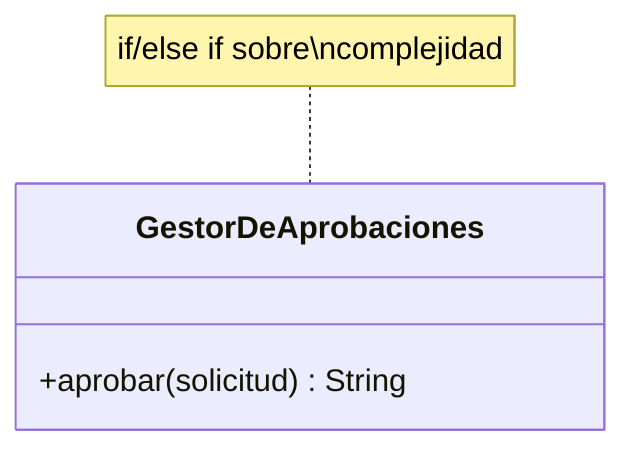
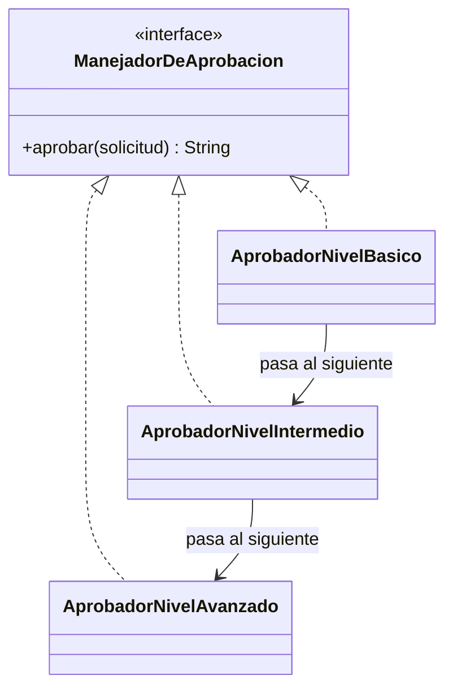

# 💡 Ejemplo 02 — Chain of Responsibility

## 🌍 Contexto

MediSalud aprueba solicitudes de estudio médico según su nivel de complejidad (básica, intermedia,
avanzada). El código actual resuelve esa aprobación con un único método que decide, con un condicional,
quién debería aprobar cada solicitud.

**Qué busca demostrar este ejemplo**: qué exige agregar un nivel de aprobación nuevo, comparado entre
un condicional único y una cadena de manejadores.

## 🏥 Caso de estudio

MediSalud aprueba solicitudes de estudio médico, cuyo nivel de aprobación requerido depende de su
complejidad.

## 🗺️ Diagrama





*Arriba, la versión "antes" (un condicional único). Abajo, la versión "después" (una cadena de
manejadores, cada uno decidiendo si aprueba o pasa la solicitud al siguiente).*

## 🌳 Árbol de archivos — antes

```text
chain-antes/
└── com/medisalud/
    ├── SolicitudDeEstudio.java
    ├── GestorDeAprobaciones.java
    └── Demo.java
```

## 💻 Archivo: SolicitudDeEstudio.java

```java
package com.medisalud;

public class SolicitudDeEstudio {
    private String nombreEstudio;
    private String complejidad;

    public SolicitudDeEstudio(String nombreEstudio, String complejidad) {
        this.nombreEstudio = nombreEstudio;
        this.complejidad = complejidad;
    }

    public String getNombreEstudio() {
        return nombreEstudio;
    }

    public String getComplejidad() {
        return complejidad;
    }
}
```

## 💻 Archivo: GestorDeAprobaciones.java

```java
package com.medisalud;

public class GestorDeAprobaciones {
    public String aprobar(SolicitudDeEstudio solicitud) {
        if (solicitud.getComplejidad().equals("BASICA")) {
            return "Aprobado por nivel basico: " + solicitud.getNombreEstudio();
        } else if (solicitud.getComplejidad().equals("INTERMEDIA")) {
            return "Aprobado por nivel intermedio: " + solicitud.getNombreEstudio();
        } else if (solicitud.getComplejidad().equals("AVANZADA")) {
            return "Aprobado por nivel avanzado: " + solicitud.getNombreEstudio();
        }
        throw new IllegalArgumentException("Complejidad desconocida: " + solicitud.getComplejidad());
    }
}
```

## 💻 Archivo: Demo.java

```java
package com.medisalud;

public class Demo {
    public static void main(String[] args) {
        GestorDeAprobaciones gestor = new GestorDeAprobaciones();

        SolicitudDeEstudio s1 = new SolicitudDeEstudio("Radiografia", "BASICA");
        SolicitudDeEstudio s2 = new SolicitudDeEstudio("Resonancia", "INTERMEDIA");
        SolicitudDeEstudio s3 = new SolicitudDeEstudio("Cirugia exploratoria", "AVANZADA");

        System.out.println(gestor.aprobar(s1));
        System.out.println(gestor.aprobar(s2));
        System.out.println(gestor.aprobar(s3));
    }
}
```

## ✅ Resultado esperado — antes

```text
Aprobado por nivel basico: Radiografia
Aprobado por nivel intermedio: Resonancia
Aprobado por nivel avanzado: Cirugia exploratoria
```

## 🌳 Árbol de archivos — después

```text
chain-despues/
└── com/medisalud/
    ├── SolicitudDeEstudio.java         (sin cambios)
    ├── ManejadorDeAprobacion.java      (nuevo)
    ├── AprobadorNivelBasico.java       (nuevo)
    ├── AprobadorNivelIntermedio.java   (nuevo)
    ├── AprobadorNivelAvanzado.java     (nuevo)
    └── Demo.java                       (cambió)
```

Sin cambios respecto de "antes": `SolicitudDeEstudio.java` — su código ya se mostró arriba y es
exactamente el mismo, byte a byte.

<details>
<summary>💻 Ver de nuevo el código sin cambios (SolicitudDeEstudio.java)</summary>

## 💻 Archivo: SolicitudDeEstudio.java

```java
package com.medisalud;

public class SolicitudDeEstudio {
    private String nombreEstudio;
    private String complejidad;

    public SolicitudDeEstudio(String nombreEstudio, String complejidad) {
        this.nombreEstudio = nombreEstudio;
        this.complejidad = complejidad;
    }

    public String getNombreEstudio() {
        return nombreEstudio;
    }

    public String getComplejidad() {
        return complejidad;
    }
}
```

</details>

## 💻 Archivo: ManejadorDeAprobacion.java — nuevo

```java
package com.medisalud;

public interface ManejadorDeAprobacion {
    String aprobar(SolicitudDeEstudio solicitud);
}
```

## 💻 Archivo: AprobadorNivelBasico.java — nuevo

```java
package com.medisalud;

public class AprobadorNivelBasico implements ManejadorDeAprobacion {
    private ManejadorDeAprobacion siguiente;

    public AprobadorNivelBasico(ManejadorDeAprobacion siguiente) {
        this.siguiente = siguiente;
    }

    public String aprobar(SolicitudDeEstudio solicitud) {
        if (solicitud.getComplejidad().equals("BASICA")) {
            return "Aprobado por nivel basico: " + solicitud.getNombreEstudio();
        }
        return siguiente.aprobar(solicitud);
    }
}
```

## 💻 Archivo: AprobadorNivelIntermedio.java — nuevo

```java
package com.medisalud;

public class AprobadorNivelIntermedio implements ManejadorDeAprobacion {
    private ManejadorDeAprobacion siguiente;

    public AprobadorNivelIntermedio(ManejadorDeAprobacion siguiente) {
        this.siguiente = siguiente;
    }

    public String aprobar(SolicitudDeEstudio solicitud) {
        if (solicitud.getComplejidad().equals("INTERMEDIA")) {
            return "Aprobado por nivel intermedio: " + solicitud.getNombreEstudio();
        }
        return siguiente.aprobar(solicitud);
    }
}
```

## 💻 Archivo: AprobadorNivelAvanzado.java — nuevo

```java
package com.medisalud;

public class AprobadorNivelAvanzado implements ManejadorDeAprobacion {
    public String aprobar(SolicitudDeEstudio solicitud) {
        if (solicitud.getComplejidad().equals("AVANZADA")) {
            return "Aprobado por nivel avanzado: " + solicitud.getNombreEstudio();
        }
        throw new IllegalArgumentException("Ningun nivel pudo aprobar: " + solicitud.getComplejidad());
    }
}
```

## 💻 Archivo: Demo.java — cambió

```java
package com.medisalud;

public class Demo {
    public static void main(String[] args) {
        ManejadorDeAprobacion avanzado = new AprobadorNivelAvanzado();
        ManejadorDeAprobacion intermedio = new AprobadorNivelIntermedio(avanzado);
        ManejadorDeAprobacion basico = new AprobadorNivelBasico(intermedio);

        SolicitudDeEstudio s1 = new SolicitudDeEstudio("Radiografia", "BASICA");
        SolicitudDeEstudio s2 = new SolicitudDeEstudio("Resonancia", "INTERMEDIA");
        SolicitudDeEstudio s3 = new SolicitudDeEstudio("Cirugia exploratoria", "AVANZADA");

        System.out.println(basico.aprobar(s1));
        System.out.println(basico.aprobar(s2));
        System.out.println(basico.aprobar(s3));
    }
}
```

## ✅ Resultado esperado — después

```text
Aprobado por nivel basico: Radiografia
Aprobado por nivel intermedio: Resonancia
Aprobado por nivel avanzado: Cirugia exploratoria
```

## 🔍 Comparación: la prueba concreta

Ambas versiones dan la misma salida para las tres complejidades probadas. En la versión "antes",
`GestorDeAprobaciones.aprobar()` resuelve con un único `if`/`else if` sobre la complejidad cuál nivel
aprueba. En la versión "después", la solicitud recorre una cadena de tres manejadores
(`AprobadorNivelBasico` → `AprobadorNivelIntermedio` → `AprobadorNivelAvanzado`): cada uno pregunta si
puede aprobarla, y si no puede, la pasa al siguiente de la cadena — sin que ningún manejador conozca a
los demás, salvo al siguiente.

## 🔍 Análisis: errores frecuentes

El error más frecuente al aplicar Chain of Responsibility es que el último manejador de la cadena no
tenga ningún manejador siguiente al que delegar y, en vez de resolver el caso restante o señalar
explícitamente que nadie pudo aprobar la solicitud, quede en un estado ambiguo. En este ejemplo,
`AprobadorNivelAvanzado` (el último de la cadena) señala explícitamente el caso en que ninguna
complejidad conocida coincide, en vez de dejarlo sin resolver.

## ❓ Preguntas de repaso

**1. [Selección]** En la versión "antes", ¿qué decide quién aprueba una solicitud?

- A. Una cadena de tres clases distintas.
- B. Un único condicional dentro de `GestorDeAprobaciones.aprobar()`.
- C. La propia `SolicitudDeEstudio`.
- D. `Demo.java`.

<details>
<summary>🔑 Ver respuesta</summary>

**Respuesta correcta: B.** `GestorDeAprobaciones.aprobar()` resuelve con un único condicional sobre la
complejidad cuál nivel corresponde.

</details>

**2. [Selección múltiple]** Sobre la versión "después", ¿cuáles afirmaciones son verdaderas?

- A. Cada manejador implementa la misma interfaz `ManejadorDeAprobacion`.
- B. Un manejador que no puede aprobar la solicitud la pasa al siguiente de la cadena.
- C. `AprobadorNivelBasico` conoce las clases concretas de todos los demás manejadores.
- D. La salida es la misma que en la versión "antes".

<details>
<summary>🔑 Ver respuesta</summary>

**Respuestas correctas: A, B y D.** C es falsa: cada manejador solo conoce al siguiente de la cadena
(recibido en su constructor), no a todos los demás.

</details>

**3. [Abierta]** Un compañero dice: "Chain of Responsibility es lo mismo que Strategy, porque ambos usan
una interfaz con varias implementaciones". ¿Estás de acuerdo? Justifica tu respuesta.

<details>
<summary>🔑 Ver respuesta</summary>

No. En Strategy, el código cliente elige una única implementación y la usa directamente. En Chain of
Responsibility, la solicitud recorre varias implementaciones **en secuencia**, y ninguna de ellas se
elige de antemano: se prueba cada una hasta que alguna la resuelve. La estructura (una interfaz, varias
implementaciones) es parecida, pero el flujo de control es distinto: elección única vs. recorrido
secuencial.

</details>
