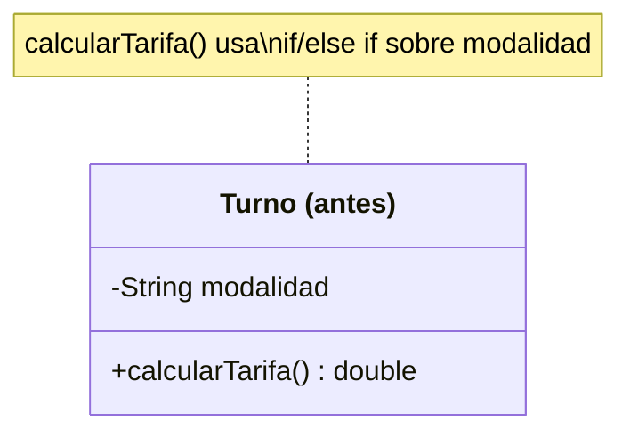
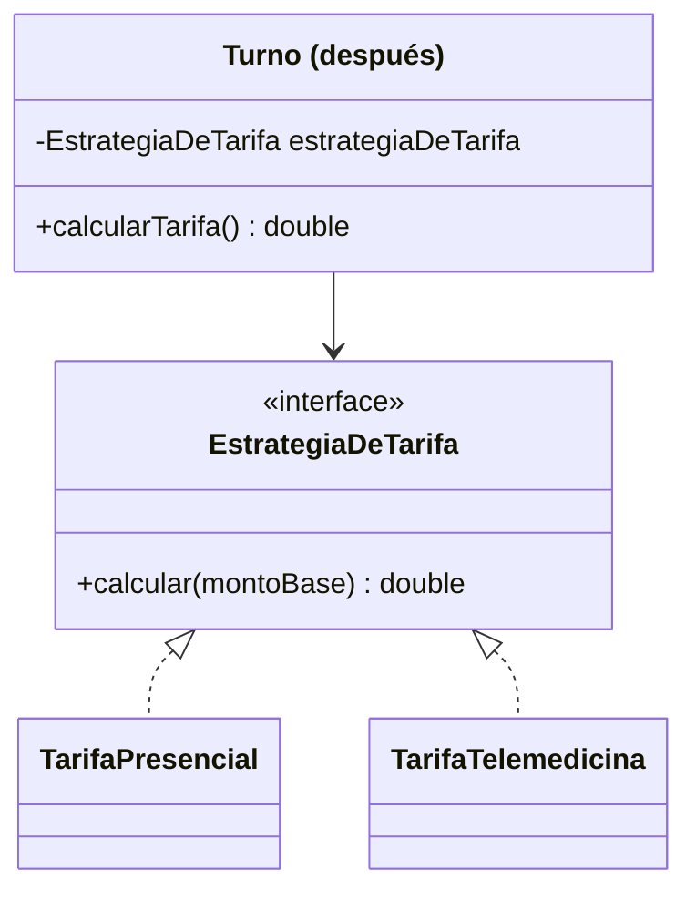

# 💡 Ejemplo 02 — Strategy

## 🌍 Contexto

MediSalud calcula la tarifa de un turno médico según su modalidad de atención (presencial,
telemedicina). El código actual resuelve ese cálculo con un condicional dentro del propio `Turno`.

**Qué busca demostrar este ejemplo**: cuántos lugares hay que modificar para agregar una modalidad
nueva, comparado entre resolver el cálculo con un condicional y encapsularlo en una estrategia
intercambiable.

## 🏥 Caso de estudio

MediSalud calcula la tarifa de un turno médico, que varía según la modalidad de atención elegida.

## 🗺️ Diagrama





*Arriba, la versión "antes" (un condicional decide el cálculo). Abajo, la versión "después" (una
estrategia intercambiable, recibida por composición).*

## 🌳 Árbol de archivos — antes

```text
strategy-antes/
└── com/medisalud/
    ├── Turno.java
    └── Demo.java
```

## 💻 Archivo: Turno.java

```java
package com.medisalud;

public class Turno {
    private String modalidad;
    private double montoBase;

    public Turno(String modalidad, double montoBase) {
        this.modalidad = modalidad;
        this.montoBase = montoBase;
    }

    public double calcularTarifa() {
        if (modalidad.equals("PRESENCIAL")) {
            return montoBase;
        } else if (modalidad.equals("TELEMEDICINA")) {
            return montoBase * 0.7;
        }
        throw new IllegalArgumentException("Modalidad desconocida: " + modalidad);
    }
}
```

## 💻 Archivo: Demo.java

```java
package com.medisalud;

public class Demo {
    public static void main(String[] args) {
        Turno turnoPresencial = new Turno("PRESENCIAL", 5000.0);
        Turno turnoTelemedicina = new Turno("TELEMEDICINA", 5000.0);
        System.out.println(turnoPresencial.calcularTarifa());
        System.out.println(turnoTelemedicina.calcularTarifa());
    }
}
```

## ✅ Resultado esperado — antes

```text
5000.0
3500.0
```

## 🌳 Árbol de archivos — después

```text
strategy-despues/
└── com/medisalud/
    ├── EstrategiaDeTarifa.java   (nuevo)
    ├── TarifaPresencial.java     (nuevo)
    ├── TarifaTelemedicina.java   (nuevo)
    ├── Turno.java                (cambió)
    └── Demo.java                 (cambió)
```

## 💻 Archivo: EstrategiaDeTarifa.java — nuevo

```java
package com.medisalud;

public interface EstrategiaDeTarifa {
    double calcular(double montoBase);
}
```

## 💻 Archivo: TarifaPresencial.java — nuevo

```java
package com.medisalud;

public class TarifaPresencial implements EstrategiaDeTarifa {
    public double calcular(double montoBase) {
        return montoBase;
    }
}
```

## 💻 Archivo: TarifaTelemedicina.java — nuevo

```java
package com.medisalud;

public class TarifaTelemedicina implements EstrategiaDeTarifa {
    public double calcular(double montoBase) {
        return montoBase * 0.7;
    }
}
```

## 💻 Archivo: Turno.java — cambió

```java
package com.medisalud;

public class Turno {
    private EstrategiaDeTarifa estrategiaDeTarifa;
    private double montoBase;

    public Turno(EstrategiaDeTarifa estrategiaDeTarifa, double montoBase) {
        this.estrategiaDeTarifa = estrategiaDeTarifa;
        this.montoBase = montoBase;
    }

    public double calcularTarifa() {
        return estrategiaDeTarifa.calcular(montoBase);
    }
}
```

## 💻 Archivo: Demo.java — cambió

```java
package com.medisalud;

public class Demo {
    public static void main(String[] args) {
        Turno turnoPresencial = new Turno(new TarifaPresencial(), 5000.0);
        Turno turnoTelemedicina = new Turno(new TarifaTelemedicina(), 5000.0);
        System.out.println(turnoPresencial.calcularTarifa());
        System.out.println(turnoTelemedicina.calcularTarifa());
    }
}
```

## ✅ Resultado esperado — después

```text
5000.0
3500.0
```

## 🔍 Comparación: la prueba concreta

Ambas versiones dan la misma salida (`5000.0`/`3500.0`). En la versión "antes",
`Turno.calcularTarifa()` resuelve el cálculo con `if (modalidad.equals("PRESENCIAL")) ... else if
(modalidad.equals("TELEMEDICINA")) ...`. En la versión "después", `Turno` recibe una
`EstrategiaDeTarifa` por composición y delega en ella, sin ningún condicional. Así queda el proyecto
extendido con una modalidad nueva ("DOMICILIO"):

## 🌳 Árbol de archivos — después (ampliado con TarifaDomicilio)

```text
strategy-despues-ampliado/
└── com/medisalud/
    ├── EstrategiaDeTarifa.java   (sin cambios)
    ├── TarifaPresencial.java     (sin cambios)
    ├── TarifaTelemedicina.java   (sin cambios)
    ├── TarifaDomicilio.java      (nuevo)
    ├── Turno.java                (sin cambios)
    └── Demo.java                 (cambió: agrega un turno a domicilio)
```

Sin cambios respecto de "después": `EstrategiaDeTarifa.java`, `TarifaPresencial.java`,
`TarifaTelemedicina.java` y `Turno.java` — exactamente el mismo código ya mostrado arriba.

<details>
<summary>💻 Ver de nuevo el código sin cambios (EstrategiaDeTarifa, TarifaPresencial,
TarifaTelemedicina, Turno)</summary>

## 💻 Archivo: EstrategiaDeTarifa.java

```java
package com.medisalud;

public interface EstrategiaDeTarifa {
    double calcular(double montoBase);
}
```

## 💻 Archivo: TarifaPresencial.java

```java
package com.medisalud;

public class TarifaPresencial implements EstrategiaDeTarifa {
    public double calcular(double montoBase) {
        return montoBase;
    }
}
```

## 💻 Archivo: TarifaTelemedicina.java

```java
package com.medisalud;

public class TarifaTelemedicina implements EstrategiaDeTarifa {
    public double calcular(double montoBase) {
        return montoBase * 0.7;
    }
}
```

## 💻 Archivo: Turno.java

```java
package com.medisalud;

public class Turno {
    private EstrategiaDeTarifa estrategiaDeTarifa;
    private double montoBase;

    public Turno(EstrategiaDeTarifa estrategiaDeTarifa, double montoBase) {
        this.estrategiaDeTarifa = estrategiaDeTarifa;
        this.montoBase = montoBase;
    }

    public double calcularTarifa() {
        return estrategiaDeTarifa.calcular(montoBase);
    }
}
```

</details>

## 💻 Archivo nuevo: TarifaDomicilio.java

```java
package com.medisalud;

public class TarifaDomicilio implements EstrategiaDeTarifa {
    public double calcular(double montoBase) {
        return montoBase * 1.3;
    }
}
```

## 💻 Archivo: Demo.java — agrega un turno a domicilio

```java
package com.medisalud;

public class Demo {
    public static void main(String[] args) {
        Turno turnoPresencial = new Turno(new TarifaPresencial(), 5000.0);
        Turno turnoTelemedicina = new Turno(new TarifaTelemedicina(), 5000.0);
        Turno turnoDomicilio = new Turno(new TarifaDomicilio(), 5000.0);
        System.out.println(turnoPresencial.calcularTarifa());
        System.out.println(turnoTelemedicina.calcularTarifa());
        System.out.println(turnoDomicilio.calcularTarifa());
    }
}
```

## ✅ Resultado esperado tras extender — después

```text
5000.0
3500.0
6500.0
```

Comparado con la misma extensión sobre la versión "antes" (agregar una rama
`else if (modalidad.equals("DOMICILIO"))` dentro de `Turno.calcularTarifa()`): la versión "antes" exige
**modificar** `Turno.java`; la versión "después" exige **agregar una clase nueva**
(`TarifaDomicilio.java`), dejando `EstrategiaDeTarifa.java`, `TarifaPresencial.java`,
`TarifaTelemedicina.java` y `Turno.java` **idénticos, byte a byte** (`diff` sin salida).

## 🔍 Análisis: errores frecuentes

El error más frecuente al aplicar Strategy es declarar la interfaz de la estrategia pero seguir
dejando, además, un condicional en el cliente que decide *cuál* estrategia instanciar en cada llamado
(en vez de recibirla ya resuelta por composición una sola vez). El beneficio real de Strategy aparece
cuando el objeto que la usa (`Turno`) nunca necesita preguntar de qué tipo es su propia estrategia.

## ❓ Preguntas de repaso

**1. [Selección]** En la versión "antes", ¿dónde se decide qué cálculo de tarifa aplicar?

- A. En una clase separada, elegida por el cliente.
- B. Dentro de `Turno.calcularTarifa()`, con un condicional sobre la modalidad.
- C. No se decide: siempre se aplica el mismo cálculo.
- D. En `Demo.java`, antes de crear el turno.

<details>
<summary>🔑 Ver respuesta</summary>

**Respuesta correcta: B.** `Turno.calcularTarifa()` resuelve el cálculo con un `if`/`else if` sobre el
campo `modalidad`.

</details>

**2. [Selección múltiple]** Sobre la versión "después", ¿cuáles afirmaciones son verdaderas?

- A. `Turno` recibe una `EstrategiaDeTarifa` por composición, no por herencia.
- B. Agregar una modalidad nueva exige una sola clase nueva, sin modificar `Turno.java`.
- C. `TarifaPresencial` y `TarifaTelemedicina` cambian al agregar una modalidad nueva.
- D. La salida del programa es la misma que en la versión "antes".

<details>
<summary>🔑 Ver respuesta</summary>

**Respuestas correctas: A, B y D.** C es falsa: ninguna de las dos estrategias existentes se modifica
al agregar una modalidad nueva — esa es la prueba de que Strategy separó correctamente el algoritmo del
objeto que lo usa.

</details>

**3. [Abierta]** Un compañero dice: "para usar Strategy, alcanza con declarar la interfaz
`EstrategiaDeTarifa`, sin importar si `Turno` sigue teniendo un condicional que arma la estrategia
correcta en cada llamado". ¿Estás de acuerdo? Justifica tu respuesta.

<details>
<summary>🔑 Ver respuesta</summary>

No completamente. Si `Turno` sigue armando la estrategia correcta con un condicional en cada llamado,
el problema original (un condicional que crece con cada modalidad nueva) sigue existiendo, solo que
movido de lugar. El beneficio real de Strategy aparece cuando quien construye el `Turno` (el código
cliente, una sola vez) decide qué estrategia usar, y `Turno` se limita a delegar en la que recibió, sin
preguntar nunca de qué tipo es.

</details>
