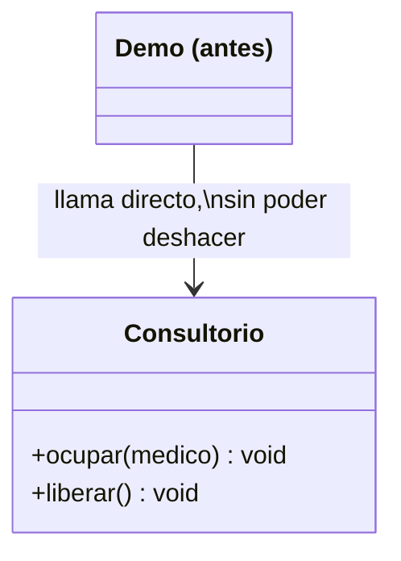
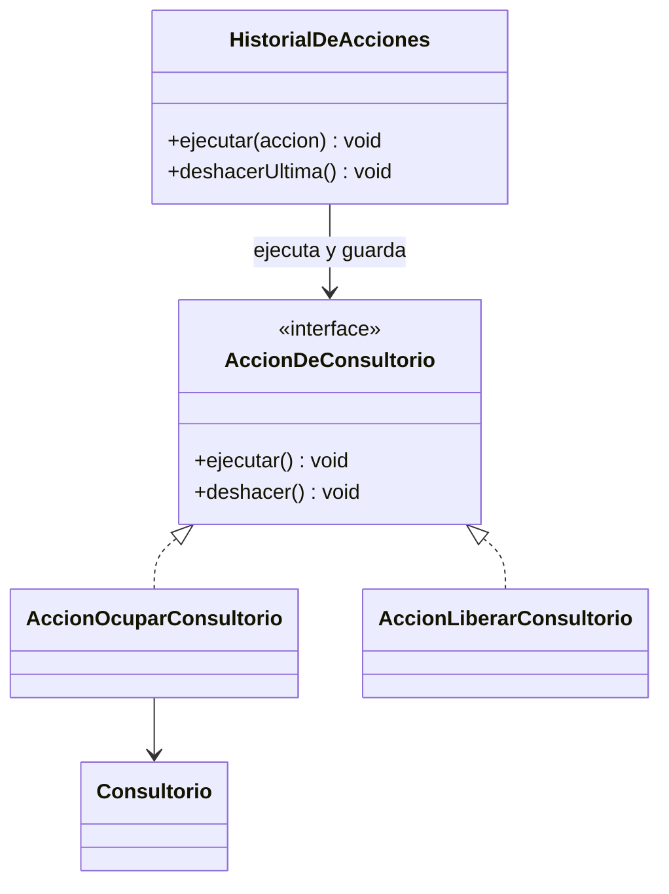

# 💡 Ejemplo 03 — Command

## 🌍 Contexto

El panel de recepción de MediSalud ocupa y libera consultorios llamando directamente a los métodos de
`Consultorio`. Si el personal ocupa un consultorio por error, no hay ninguna forma uniforme de deshacer
esa acción.

**Qué busca demostrar este ejemplo**: si el estado revierte exactamente al anterior después de deshacer,
comparado entre llamar directamente al receptor y encapsular la acción como un objeto.

## 🏥 Caso de estudio

MediSalud ocupa y libera consultorios desde un panel de recepción.

## 🗺️ Diagrama





*Arriba, la versión "antes" (llamada directa, sin deshacer). Abajo, la versión "después" (acciones
encapsuladas, ejecutadas y deshechas por un historial).*

## 🌳 Árbol de archivos — antes

```text
command-antes/
└── com/medisalud/
    ├── Consultorio.java
    └── Demo.java
```

## 💻 Archivo: Consultorio.java

```java
package com.medisalud;

public class Consultorio {
    private String numero;
    private String medicoAsignado;

    public Consultorio(String numero) {
        this.numero = numero;
    }

    public void ocupar(String medico) {
        this.medicoAsignado = medico;
        System.out.println("Consultorio " + numero + " ocupado por " + medico);
    }

    public void liberar() {
        System.out.println("Consultorio " + numero + " liberado (estaba " + medicoAsignado + ")");
        this.medicoAsignado = null;
    }

    public String getMedicoAsignado() {
        return medicoAsignado;
    }
}
```

## 💻 Archivo: Demo.java

```java
package com.medisalud;

public class Demo {
    public static void main(String[] args) {
        Consultorio consultorio = new Consultorio("101");
        consultorio.ocupar("Dra. Lopez");
        System.out.println("ocupado por=" + consultorio.getMedicoAsignado());
    }
}
```

## ✅ Resultado esperado — antes

```text
Consultorio 101 ocupado por Dra. Lopez
ocupado por=Dra. Lopez
```

## 🌳 Árbol de archivos — después

```text
command-despues/
└── com/medisalud/
    ├── Consultorio.java              (sin cambios)
    ├── AccionDeConsultorio.java      (nuevo)
    ├── AccionOcuparConsultorio.java  (nuevo)
    ├── AccionLiberarConsultorio.java (nuevo)
    ├── HistorialDeAcciones.java      (nuevo)
    └── Demo.java                     (cambió)
```

Sin cambios respecto de "antes": `Consultorio.java` — su código ya se mostró arriba y es exactamente el
mismo, byte a byte.

<details>
<summary>💻 Ver de nuevo el código sin cambios (Consultorio.java)</summary>

## 💻 Archivo: Consultorio.java

```java
package com.medisalud;

public class Consultorio {
    private String numero;
    private String medicoAsignado;

    public Consultorio(String numero) {
        this.numero = numero;
    }

    public void ocupar(String medico) {
        this.medicoAsignado = medico;
        System.out.println("Consultorio " + numero + " ocupado por " + medico);
    }

    public void liberar() {
        System.out.println("Consultorio " + numero + " liberado (estaba " + medicoAsignado + ")");
        this.medicoAsignado = null;
    }

    public String getMedicoAsignado() {
        return medicoAsignado;
    }
}
```

</details>

## 💻 Archivo: AccionDeConsultorio.java — nuevo

```java
package com.medisalud;

public interface AccionDeConsultorio {
    void ejecutar();
    void deshacer();
}
```

## 💻 Archivo: AccionOcuparConsultorio.java — nuevo

```java
package com.medisalud;

public class AccionOcuparConsultorio implements AccionDeConsultorio {
    private Consultorio consultorio;
    private String medico;
    private String medicoAnterior;

    public AccionOcuparConsultorio(Consultorio consultorio, String medico) {
        this.consultorio = consultorio;
        this.medico = medico;
    }

    public void ejecutar() {
        medicoAnterior = consultorio.getMedicoAsignado();
        consultorio.ocupar(medico);
    }

    public void deshacer() {
        if (medicoAnterior == null) {
            consultorio.liberar();
        } else {
            consultorio.ocupar(medicoAnterior);
        }
    }
}
```

## 💻 Archivo: AccionLiberarConsultorio.java — nuevo

```java
package com.medisalud;

public class AccionLiberarConsultorio implements AccionDeConsultorio {
    private Consultorio consultorio;
    private String medicoAnterior;

    public AccionLiberarConsultorio(Consultorio consultorio) {
        this.consultorio = consultorio;
    }

    public void ejecutar() {
        medicoAnterior = consultorio.getMedicoAsignado();
        consultorio.liberar();
    }

    public void deshacer() {
        consultorio.ocupar(medicoAnterior);
    }
}
```

## 💻 Archivo: HistorialDeAcciones.java — nuevo

```java
package com.medisalud;

import java.util.ArrayList;
import java.util.List;

public class HistorialDeAcciones {
    private List<AccionDeConsultorio> acciones = new ArrayList<>();

    public void ejecutar(AccionDeConsultorio accion) {
        accion.ejecutar();
        acciones.add(accion);
    }

    public void deshacerUltima() {
        if (acciones.isEmpty()) {
            return;
        }
        AccionDeConsultorio ultima = acciones.remove(acciones.size() - 1);
        ultima.deshacer();
    }
}
```

## 💻 Archivo: Demo.java — cambió

```java
package com.medisalud;

public class Demo {
    public static void main(String[] args) {
        Consultorio consultorio = new Consultorio("101");
        HistorialDeAcciones historial = new HistorialDeAcciones();

        historial.ejecutar(new AccionOcuparConsultorio(consultorio, "Dra. Lopez"));
        System.out.println("ocupado por=" + consultorio.getMedicoAsignado());

        historial.deshacerUltima();
        System.out.println("ocupado por=" + consultorio.getMedicoAsignado());
    }
}
```

## ✅ Resultado esperado — después

```text
Consultorio 101 ocupado por Dra. Lopez
ocupado por=Dra. Lopez
Consultorio 101 liberado (estaba Dra. Lopez)
ocupado por=null
```

## 🔍 Comparación: la prueba concreta

En la versión "antes", `Demo` llama directamente `consultorio.ocupar(...)`, sin ningún objeto que
represente esa acción. En la versión "después", `HistorialDeAcciones.ejecutar(new
AccionOcuparConsultorio(...))` ejecuta la acción y la guarda; `deshacerUltima()` la revierte. La salida
real confirma que, tras ejecutar y deshacer, `consultorio.getMedicoAsignado()` vuelve a `null` — el
estado exacto anterior a la acción — sin que `Demo` conociera la operación contraria de
`AccionOcuparConsultorio`.

## 🔍 Análisis: errores frecuentes

El error más frecuente al aplicar Command es tratarlo como una simple llamada indirecta a un método (una
clase que en `ejecutar()` solo hace `consultorio.ocupar(medico)`, sin guardar lo necesario para
deshacer). El beneficio real de Command aparece cuando la acción encapsulada guarda el estado anterior
(o los datos necesarios) para poder revertirse por sí misma, no solo para poder invocarse.

## ❓ Preguntas de repaso

**1. [Selección]** En la versión "antes", si el personal ocupa un consultorio por error, ¿cómo lo
revierte?

- A. Con `historial.deshacerUltima()`.
- B. Llamando manualmente a `liberar()`, si recuerda que esa fue la última acción.
- C. No hay forma de revertirlo.
- D. El sistema lo revierte automáticamente.

<details>
<summary>🔑 Ver respuesta</summary>

**Respuesta correcta: B.** No existe ningún objeto que represente la acción ejecutada, así que revertir
depende de que el código cliente recuerde manualmente cuál fue la última acción y llame a su operación
contraria.

</details>

**2. [Selección múltiple]** Sobre la versión "después", ¿cuáles afirmaciones son verdaderas?

- A. `AccionOcuparConsultorio` guarda el médico anterior antes de ocupar el consultorio.
- B. `HistorialDeAcciones` puede deshacer la última acción sin que el cliente conozca su operación
  contraria.
- C. `Consultorio.java` se modificó para agregar soporte de deshacer.
- D. Tras ejecutar y deshacer una acción, el consultorio vuelve a su estado exacto anterior.

<details>
<summary>🔑 Ver respuesta</summary>

**Respuestas correctas: A, B y D.** C es falsa: `Consultorio.java` queda exactamente igual — la lógica
de deshacer vive en la acción, no en el receptor.

</details>

**3. [Abierta]** Un compañero dice: "para usar Command, alcanza con declarar una interfaz con un método
`ejecutar()`, sin necesitar `deshacer()`". ¿Estás de acuerdo? Justifica tu respuesta.

<details>
<summary>🔑 Ver respuesta</summary>

Depende de qué se necesite. Si solo hace falta encapsular y ejecutar una acción, alcanza con
`ejecutar()`. Pero en este ejemplo la razón concreta para aplicar Command es poder deshacer, registrar
un historial, y revertir el estado exacto anterior — para eso, cada acción necesita guardar lo necesario
para revertirse (`medicoAnterior`), y eso exige el método `deshacer()`. Sin él, Command seguiría
encapsulando la acción, pero no resolvería el problema real que motivó usarlo en este caso.

</details>
