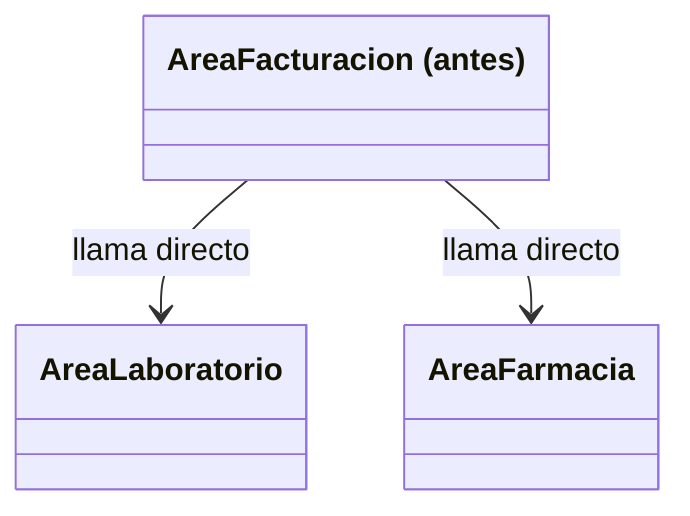
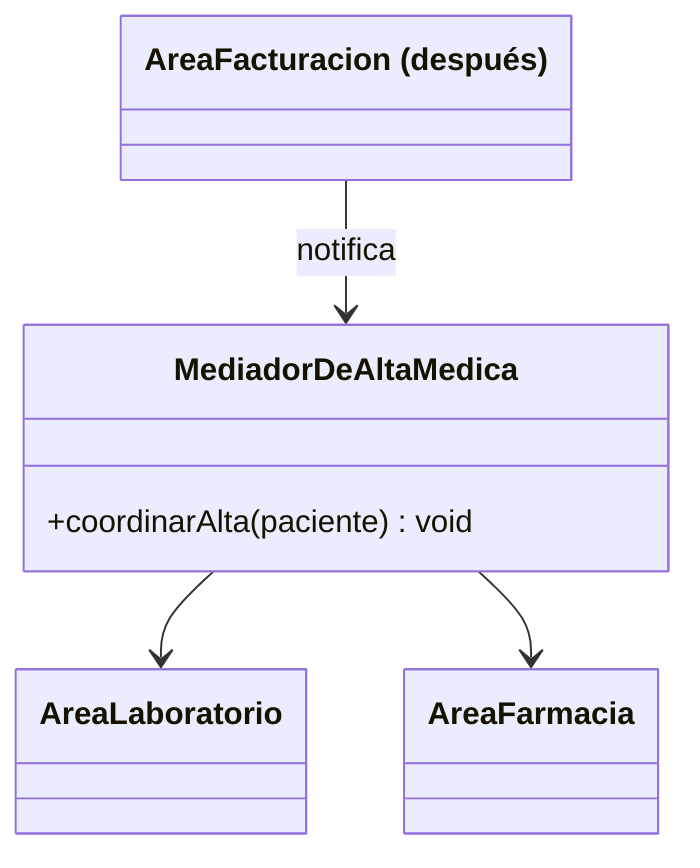

# 💡 Ejemplo 05 — Mediator

## 🌍 Contexto

Cuando ocurre un alta médica en MediSalud, el área de facturación necesita avisar al área de
laboratorio y al área de farmacia. El código actual hace que `AreaFacturacion` llame directamente a
ambas.

**Qué busca demostrar este ejemplo**: qué clase cambia al agregar un área nueva, comparado entre el
acoplamiento directo entre áreas y un mediador que centraliza la comunicación.

## 🏥 Caso de estudio

MediSalud coordina, al dar de alta a un paciente, la comunicación entre las áreas de facturación,
laboratorio y farmacia.

## 🗺️ Diagrama





*Arriba, la versión "antes" (acoplamiento directo). Abajo, la versión "después" (comunicación
centralizada en el mediador).*

## 🌳 Árbol de archivos — antes

```text
mediator-antes/
└── com/medisalud/
    ├── AreaLaboratorio.java
    ├── AreaFarmacia.java
    ├── AreaFacturacion.java
    └── Demo.java
```

## 💻 Archivo: AreaLaboratorio.java

```java
package com.medisalud;

public class AreaLaboratorio {
    public void recibirAvisoDeAlta(String paciente) {
        System.out.println("Laboratorio: archivando resultados de " + paciente);
    }
}
```

## 💻 Archivo: AreaFarmacia.java

```java
package com.medisalud;

public class AreaFarmacia {
    public void recibirAvisoDeAlta(String paciente) {
        System.out.println("Farmacia: cerrando pedidos pendientes de " + paciente);
    }
}
```

## 💻 Archivo: AreaFacturacion.java

```java
package com.medisalud;

public class AreaFacturacion {
    private AreaLaboratorio areaLaboratorio;
    private AreaFarmacia areaFarmacia;

    public AreaFacturacion(AreaLaboratorio areaLaboratorio, AreaFarmacia areaFarmacia) {
        this.areaLaboratorio = areaLaboratorio;
        this.areaFarmacia = areaFarmacia;
    }

    public void registrarAlta(String paciente) {
        System.out.println("Facturacion: cerrando cuenta de " + paciente);
        areaLaboratorio.recibirAvisoDeAlta(paciente);
        areaFarmacia.recibirAvisoDeAlta(paciente);
    }
}
```

## 💻 Archivo: Demo.java

```java
package com.medisalud;

public class Demo {
    public static void main(String[] args) {
        AreaLaboratorio areaLaboratorio = new AreaLaboratorio();
        AreaFarmacia areaFarmacia = new AreaFarmacia();
        AreaFacturacion areaFacturacion = new AreaFacturacion(areaLaboratorio, areaFarmacia);

        areaFacturacion.registrarAlta("Ana Torres");
    }
}
```

## ✅ Resultado esperado — antes

```text
Facturacion: cerrando cuenta de Ana Torres
Laboratorio: archivando resultados de Ana Torres
Farmacia: cerrando pedidos pendientes de Ana Torres
```

## 🌳 Árbol de archivos — después

```text
mediator-despues/
└── com/medisalud/
    ├── AreaLaboratorio.java        (sin cambios)
    ├── AreaFarmacia.java           (sin cambios)
    ├── MediadorDeAltaMedica.java   (nuevo)
    ├── AreaFacturacion.java        (cambió)
    └── Demo.java                   (cambió)
```

Sin cambios respecto de "antes": `AreaLaboratorio.java` y `AreaFarmacia.java` — su código ya se mostró
arriba y es exactamente el mismo, byte a byte.

<details>
<summary>💻 Ver de nuevo el código sin cambios (AreaLaboratorio, AreaFarmacia)</summary>

## 💻 Archivo: AreaLaboratorio.java

```java
package com.medisalud;

public class AreaLaboratorio {
    public void recibirAvisoDeAlta(String paciente) {
        System.out.println("Laboratorio: archivando resultados de " + paciente);
    }
}
```

## 💻 Archivo: AreaFarmacia.java

```java
package com.medisalud;

public class AreaFarmacia {
    public void recibirAvisoDeAlta(String paciente) {
        System.out.println("Farmacia: cerrando pedidos pendientes de " + paciente);
    }
}
```

</details>

## 💻 Archivo: MediadorDeAltaMedica.java — nuevo

```java
package com.medisalud;

public class MediadorDeAltaMedica {
    private AreaLaboratorio areaLaboratorio;
    private AreaFarmacia areaFarmacia;

    public void registrarLaboratorio(AreaLaboratorio areaLaboratorio) {
        this.areaLaboratorio = areaLaboratorio;
    }

    public void registrarFarmacia(AreaFarmacia areaFarmacia) {
        this.areaFarmacia = areaFarmacia;
    }

    public void coordinarAlta(String paciente) {
        areaLaboratorio.recibirAvisoDeAlta(paciente);
        areaFarmacia.recibirAvisoDeAlta(paciente);
    }
}
```

## 💻 Archivo: AreaFacturacion.java — cambió

```java
package com.medisalud;

public class AreaFacturacion {
    private MediadorDeAltaMedica mediador;

    public AreaFacturacion(MediadorDeAltaMedica mediador) {
        this.mediador = mediador;
    }

    public void registrarAlta(String paciente) {
        System.out.println("Facturacion: cerrando cuenta de " + paciente);
        mediador.coordinarAlta(paciente);
    }
}
```

## 💻 Archivo: Demo.java — cambió

```java
package com.medisalud;

public class Demo {
    public static void main(String[] args) {
        MediadorDeAltaMedica mediador = new MediadorDeAltaMedica();
        AreaLaboratorio areaLaboratorio = new AreaLaboratorio();
        AreaFarmacia areaFarmacia = new AreaFarmacia();
        mediador.registrarLaboratorio(areaLaboratorio);
        mediador.registrarFarmacia(areaFarmacia);

        AreaFacturacion areaFacturacion = new AreaFacturacion(mediador);
        areaFacturacion.registrarAlta("Ana Torres");
    }
}
```

## ✅ Resultado esperado — después

```text
Facturacion: cerrando cuenta de Ana Torres
Laboratorio: archivando resultados de Ana Torres
Farmacia: cerrando pedidos pendientes de Ana Torres
```

## 🔍 Comparación: la prueba concreta

Ambas versiones dan la misma salida. En la versión "antes", `AreaFacturacion` conoce y llama
directamente a `AreaLaboratorio` y a `AreaFarmacia`. En la versión "después", `AreaFacturacion` solo
conoce a `MediadorDeAltaMedica`, que coordina internamente a las otras dos (sin cambios en ellas). Así
queda el proyecto extendido con un área nueva (radiología):

## 🌳 Árbol de archivos — después (ampliado con AreaRadiologia)

```text
mediator-despues-ampliado/
└── com/medisalud/
    ├── AreaLaboratorio.java        (sin cambios)
    ├── AreaFarmacia.java           (sin cambios)
    ├── AreaFacturacion.java        (sin cambios)
    ├── AreaRadiologia.java         (nuevo)
    ├── MediadorDeAltaMedica.java   (cambió)
    └── Demo.java                   (cambió: registra y usa el area nueva)
```

Sin cambios respecto de "después": `AreaLaboratorio.java`, `AreaFarmacia.java` y
`AreaFacturacion.java` — exactamente el mismo código ya mostrado arriba, confirmado con `diff` real.

<details>
<summary>💻 Ver de nuevo el código sin cambios (AreaLaboratorio, AreaFarmacia, AreaFacturacion)</summary>

## 💻 Archivo: AreaLaboratorio.java

```java
package com.medisalud;

public class AreaLaboratorio {
    public void recibirAvisoDeAlta(String paciente) {
        System.out.println("Laboratorio: archivando resultados de " + paciente);
    }
}
```

## 💻 Archivo: AreaFarmacia.java

```java
package com.medisalud;

public class AreaFarmacia {
    public void recibirAvisoDeAlta(String paciente) {
        System.out.println("Farmacia: cerrando pedidos pendientes de " + paciente);
    }
}
```

## 💻 Archivo: AreaFacturacion.java

```java
package com.medisalud;

public class AreaFacturacion {
    private MediadorDeAltaMedica mediador;

    public AreaFacturacion(MediadorDeAltaMedica mediador) {
        this.mediador = mediador;
    }

    public void registrarAlta(String paciente) {
        System.out.println("Facturacion: cerrando cuenta de " + paciente);
        mediador.coordinarAlta(paciente);
    }
}
```

</details>

## 💻 Archivo nuevo: AreaRadiologia.java

```java
package com.medisalud;

public class AreaRadiologia {
    public void recibirAvisoDeAlta(String paciente) {
        System.out.println("Radiologia: archivando estudios de imagen de " + paciente);
    }
}
```

## 💻 Archivo: MediadorDeAltaMedica.java — cambió

```java
package com.medisalud;

public class MediadorDeAltaMedica {
    private AreaLaboratorio areaLaboratorio;
    private AreaFarmacia areaFarmacia;
    private AreaRadiologia areaRadiologia;

    public void registrarLaboratorio(AreaLaboratorio areaLaboratorio) {
        this.areaLaboratorio = areaLaboratorio;
    }

    public void registrarFarmacia(AreaFarmacia areaFarmacia) {
        this.areaFarmacia = areaFarmacia;
    }

    public void registrarRadiologia(AreaRadiologia areaRadiologia) {
        this.areaRadiologia = areaRadiologia;
    }

    public void coordinarAlta(String paciente) {
        areaLaboratorio.recibirAvisoDeAlta(paciente);
        areaFarmacia.recibirAvisoDeAlta(paciente);
        areaRadiologia.recibirAvisoDeAlta(paciente);
    }
}
```

## 💻 Archivo: Demo.java — registra y usa el área nueva

```java
package com.medisalud;

public class Demo {
    public static void main(String[] args) {
        MediadorDeAltaMedica mediador = new MediadorDeAltaMedica();
        AreaLaboratorio areaLaboratorio = new AreaLaboratorio();
        AreaFarmacia areaFarmacia = new AreaFarmacia();
        AreaRadiologia areaRadiologia = new AreaRadiologia();
        mediador.registrarLaboratorio(areaLaboratorio);
        mediador.registrarFarmacia(areaFarmacia);
        mediador.registrarRadiologia(areaRadiologia);

        AreaFacturacion areaFacturacion = new AreaFacturacion(mediador);
        areaFacturacion.registrarAlta("Ana Torres");
    }
}
```

## ✅ Resultado esperado tras extender — después

```text
Facturacion: cerrando cuenta de Ana Torres
Laboratorio: archivando resultados de Ana Torres
Farmacia: cerrando pedidos pendientes de Ana Torres
Radiologia: archivando estudios de imagen de Ana Torres
```

Comparado con la misma extensión sobre la versión "antes" (donde `AreaFacturacion.java` **debe**
modificarse para recibir y llamar a la nueva `AreaRadiologia`): en la versión "después", ninguna de las
tres áreas existentes cambia — solo `MediadorDeAltaMedica.java` absorbe la complejidad de coordinar el
área nueva.

## 🔍 Análisis: errores frecuentes

El error más frecuente al aplicar Mediator es dejar que dos colegas (por ejemplo, `AreaLaboratorio` y
`AreaFarmacia`) sigan llamándose directamente entre sí "para un caso particular", además de comunicarse
a través del mediador — eso reintroduce parcialmente el acoplamiento directo que el patrón busca
eliminar. Toda la comunicación entre colegas debe pasar por el mediador, sin excepciones puntuales.

## ❓ Preguntas de repaso

**1. [Selección]** En la versión "antes", ¿qué clases conoce directamente `AreaFacturacion`?

- A. Ninguna otra clase.
- B. `AreaLaboratorio` y `AreaFarmacia`.
- C. Solo `Demo`.
- D. Todas las clases del proyecto.

<details>
<summary>🔑 Ver respuesta</summary>

**Respuesta correcta: B.** `AreaFacturacion` recibe ambas áreas en su constructor y les llama
directamente `recibirAvisoDeAlta(...)`.

</details>

**2. [Selección múltiple]** Sobre la versión "después" extendida con `AreaRadiologia`, ¿cuáles
afirmaciones son verdaderas?

- A. `AreaFacturacion.java` queda idéntico, byte a byte, al de antes de la extensión.
- B. `MediadorDeAltaMedica.java` cambia para registrar y coordinar la nueva área.
- C. `AreaLaboratorio.java` y `AreaFarmacia.java` también cambian.
- D. La salida agrega una línea nueva para radiología.

<details>
<summary>🔑 Ver respuesta</summary>

**Respuestas correctas: A, B y D.** C es falsa: ninguna de las dos áreas existentes cambia — solo el
mediador y la nueva área.

</details>

**3. [Abierta]** Un compañero dice: "si igual hay que modificar el mediador cada vez que se agrega un
área nueva, Mediator no resolvió nada". ¿Estás de acuerdo? Justifica tu respuesta.

<details>
<summary>🔑 Ver respuesta</summary>

No. Mediator no promete que **nada** cambie al agregar un colega nuevo — promete que el cambio quede
**concentrado en un único lugar** (el mediador), en vez de disperso entre todos los colegas existentes.
En la versión "antes", agregar un área nueva exige modificar la clase que origina la comunicación
(`AreaFacturacion`); en la versión "después", exige modificar el mediador, pero ninguna de las áreas
(`AreaLaboratorio`, `AreaFarmacia`, `AreaFacturacion`) — confirmado con `diff` real. Esa concentración
es, precisamente, el beneficio del patrón.

</details>
