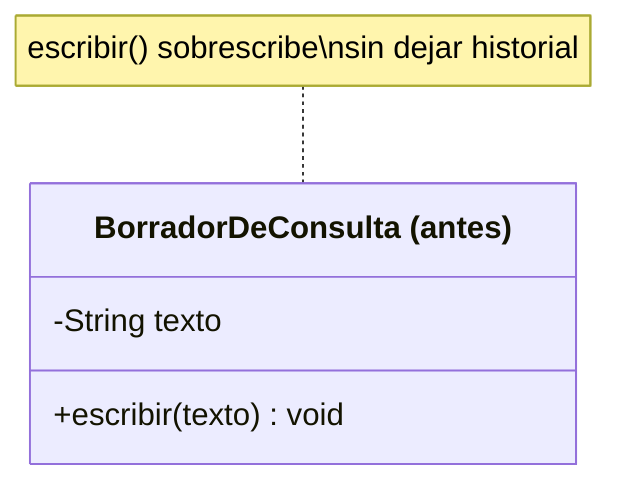
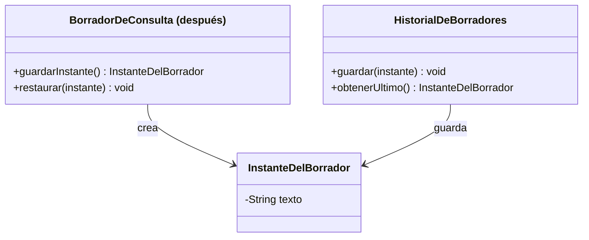

# 💡 Ejemplo 06 — Memento

## 🌍 Contexto

Un borrador de consulta médica en MediSalud se edita escribiendo texto nuevo, que sobrescribe el
anterior. Si se aplica un cambio por error, no hay ninguna forma de volver al texto anterior.

**Qué busca demostrar este ejemplo**: si un cambio se puede revertir, comparado entre sobrescribir sin
historial y guardar instantes restaurables.

## 🏥 Caso de estudio

MediSalud edita un borrador de consulta médica antes de guardarlo definitivamente en la historia
clínica del paciente.

## 🗺️ Diagrama





*Arriba, la versión "antes" (sin historial). Abajo, la versión "después" (instantes guardables y
restaurables, sin exponer la estructura interna del borrador).*

## 🌳 Árbol de archivos — antes

```text
memento-antes/
└── com/medisalud/
    ├── BorradorDeConsulta.java
    └── Demo.java
```

## 💻 Archivo: BorradorDeConsulta.java

```java
package com.medisalud;

public class BorradorDeConsulta {
    private String texto;

    public void escribir(String texto) {
        this.texto = texto;
    }

    public String getTexto() {
        return texto;
    }
}
```

## 💻 Archivo: Demo.java

```java
package com.medisalud;

public class Demo {
    public static void main(String[] args) {
        BorradorDeConsulta borrador = new BorradorDeConsulta();
        borrador.escribir("Paciente estable, sin sintomas");
        System.out.println(borrador.getTexto());

        borrador.escribir("Paciente con fiebre alta");
        System.out.println(borrador.getTexto());
    }
}
```

## ✅ Resultado esperado — antes

```text
Paciente estable, sin sintomas
Paciente con fiebre alta
```

## 🌳 Árbol de archivos — después

```text
memento-despues/
└── com/medisalud/
    ├── InstanteDelBorrador.java    (nuevo)
    ├── BorradorDeConsulta.java     (cambió)
    ├── HistorialDeBorradores.java  (nuevo)
    └── Demo.java                   (cambió)
```

## 💻 Archivo: InstanteDelBorrador.java — nuevo

```java
package com.medisalud;

public class InstanteDelBorrador {
    private String texto;

    InstanteDelBorrador(String texto) {
        this.texto = texto;
    }

    String getTexto() {
        return texto;
    }
}
```

## 💻 Archivo: BorradorDeConsulta.java — cambió

```java
package com.medisalud;

public class BorradorDeConsulta {
    private String texto;

    public void escribir(String texto) {
        this.texto = texto;
    }

    public String getTexto() {
        return texto;
    }

    public InstanteDelBorrador guardarInstante() {
        return new InstanteDelBorrador(texto);
    }

    public void restaurar(InstanteDelBorrador instante) {
        this.texto = instante.getTexto();
    }
}
```

## 💻 Archivo: HistorialDeBorradores.java — nuevo

```java
package com.medisalud;

import java.util.ArrayList;
import java.util.List;

public class HistorialDeBorradores {
    private List<InstanteDelBorrador> instantes = new ArrayList<>();

    public void guardar(InstanteDelBorrador instante) {
        instantes.add(instante);
    }

    public InstanteDelBorrador obtenerUltimo() {
        return instantes.remove(instantes.size() - 1);
    }
}
```

## 💻 Archivo: Demo.java — cambió

```java
package com.medisalud;

public class Demo {
    public static void main(String[] args) {
        BorradorDeConsulta borrador = new BorradorDeConsulta();
        HistorialDeBorradores historial = new HistorialDeBorradores();

        borrador.escribir("Paciente estable, sin sintomas");
        historial.guardar(borrador.guardarInstante());
        System.out.println(borrador.getTexto());

        borrador.escribir("Paciente con fiebre alta");
        System.out.println(borrador.getTexto());

        borrador.restaurar(historial.obtenerUltimo());
        System.out.println(borrador.getTexto());
    }
}
```

## ✅ Resultado esperado — después

```text
Paciente estable, sin sintomas
Paciente con fiebre alta
Paciente estable, sin sintomas
```

## 🔍 Comparación: la prueba concreta

En la versión "antes", una vez escrito un segundo texto, el primero se pierde para siempre. En la
versión "después", `Demo` guarda un instante después del primer texto, escribe un segundo texto, y
luego restaura el instante guardado: la salida real confirma que `borrador.getTexto()` vuelve a ser
exactamente `"Paciente estable, sin sintomas"` — el primero, no el segundo — sin que
`HistorialDeBorradores` necesite conocer cómo `BorradorDeConsulta` guarda su texto por dentro.

## 🔍 Análisis: errores frecuentes

El error más frecuente al aplicar Memento es declarar `InstanteDelBorrador` con un constructor y un
método de lectura **públicos**, permitiendo que cualquier clase (no solo `BorradorDeConsulta`) cree o
lea instantes directamente. En este ejemplo, `InstanteDelBorrador` declara su constructor y
`getTexto()` sin modificador de acceso (visibilidad de paquete): `HistorialDeBorradores` guarda y
devuelve instantes sin necesitar ni usar `getTexto()`, solo los pasa de un lado a otro — es
`BorradorDeConsulta`, en el mismo paquete, quien los crea y los interpreta.

## ❓ Preguntas de repaso

**1. [Selección]** En la versión "antes", si se escribe un texto nuevo por error, ¿cómo se recupera el
texto anterior?

- A. Con `borrador.restaurar()`.
- B. No hay forma: `escribir()` sobrescribe sin dejar ningún registro anterior.
- C. Con `HistorialDeBorradores`.
- D. El texto anterior se recupera automáticamente.

<details>
<summary>🔑 Ver respuesta</summary>

**Respuesta correcta: B.** `escribir()` reemplaza el campo `texto` sin guardar el valor anterior en
ningún lado.

</details>

**2. [Selección múltiple]** Sobre la versión "después", ¿cuáles afirmaciones son verdaderas?

- A. `guardarInstante()` produce un `InstanteDelBorrador` con el texto en ese momento.
- B. `restaurar(instante)` reemplaza el texto actual por el del instante recibido.
- C. `HistorialDeBorradores` necesita conocer cómo `BorradorDeConsulta` guarda su texto por dentro.
- D. Después de restaurar, el texto vuelve exactamente al del instante guardado.

<details>
<summary>🔑 Ver respuesta</summary>

**Respuestas correctas: A, B y D.** C es falsa: `HistorialDeBorradores` solo guarda y devuelve
instantes opacos, sin necesitar leer su contenido.

</details>

**3. [Abierta]** Un compañero dice: "Memento es lo mismo que Command, porque los dos
permiten deshacer algo". ¿Estás de acuerdo? Justifica tu respuesta.

<details>
<summary>🔑 Ver respuesta</summary>

No. Command encapsula una **acción** y sabe revertirla ejecutando su **operación contraria** (por
ejemplo, `AccionOcuparConsultorio.deshacer()` llama a `liberar()`). Memento no ejecuta ninguna operación
inversa: captura un **estado completo** en un momento dado (`InstanteDelBorrador`) y lo restaura tal
cual, reemplazando el estado actual — en este ejemplo, `restaurar()` simplemente copia el texto guardado,
sin revertir ningún paso intermedio.

</details>
