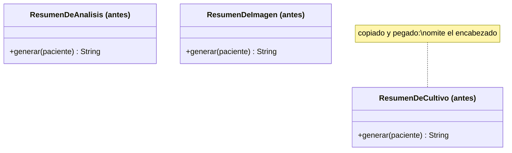
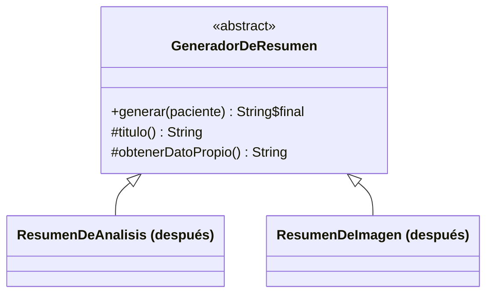

# 💡 Ejemplo 06 — Template Method

## 🌍 Contexto

MediSalud genera resúmenes de distintos tipos de estudio (análisis, imagen), y cada uno repite, copiado
y pegado, el mismo esqueleto de cuatro pasos (validar datos, obtener el dato propio del estudio,
formatear encabezado, formatear cuerpo).

**Qué busca demostrar este ejemplo**: si el esqueleto se puede omitir por error al copiar y pegar,
comparado entre repetirlo en cada clase y fijarlo en un único método `final`.

## 🏥 Caso de estudio

MediSalud genera resúmenes de estudios médicos (análisis de laboratorio, estudios de imagen), todos con
el mismo esqueleto de secciones.

## 🗺️ Diagrama





*Arriba, la versión "antes" (esqueleto copiado en cada clase, con un paso omitido por error). Abajo, la
versión "después" (esqueleto fijo en un método `final`).*

## 🌳 Árbol de archivos — antes

```text
template-method-antes/
└── com/medisalud/
    ├── ResumenDeAnalisis.java
    ├── ResumenDeImagen.java
    ├── ResumenDeCultivo.java
    └── Demo.java
```

## 💻 Archivo: ResumenDeAnalisis.java

```java
package com.medisalud;

public class ResumenDeAnalisis {
    public String generar(String paciente) {
        StringBuilder resumen = new StringBuilder();
        resumen.append("Validando datos de ").append(paciente).append("\n");
        String datoPropio = "Hemograma dentro de parametros normales";
        resumen.append("=== Resumen de Analisis ===\n");
        resumen.append("Paciente: ").append(paciente).append("\n");
        resumen.append(datoPropio);
        return resumen.toString();
    }
}
```

## 💻 Archivo: ResumenDeImagen.java

```java
package com.medisalud;

public class ResumenDeImagen {
    public String generar(String paciente) {
        StringBuilder resumen = new StringBuilder();
        resumen.append("Validando datos de ").append(paciente).append("\n");
        String datoPropio = "Radiografia de torax sin hallazgos";
        resumen.append("=== Resumen de Imagen ===\n");
        resumen.append("Paciente: ").append(paciente).append("\n");
        resumen.append(datoPropio);
        return resumen.toString();
    }
}
```

## 💻 Archivo: ResumenDeCultivo.java

```java
package com.medisalud;

public class ResumenDeCultivo {
    public String generar(String paciente) {
        StringBuilder resumen = new StringBuilder();
        resumen.append("Validando datos de ").append(paciente).append("\n");
        String datoPropio = "Cultivo negativo";
        // Copiado y pegado de ResumenDeImagen: aca se olvido el encabezado "=== Resumen de X ===".
        resumen.append("Paciente: ").append(paciente).append("\n");
        resumen.append(datoPropio);
        return resumen.toString();
    }
}
```

## 💻 Archivo: Demo.java

```java
package com.medisalud;

public class Demo {
    public static void main(String[] args) {
        System.out.println(new ResumenDeAnalisis().generar("Ana Torres"));
        System.out.println("---");
        System.out.println(new ResumenDeImagen().generar("Ana Torres"));
        System.out.println("---");
        System.out.println(new ResumenDeCultivo().generar("Ana Torres"));
    }
}
```

## ✅ Resultado esperado — antes

```text
Validando datos de Ana Torres
=== Resumen de Analisis ===
Paciente: Ana Torres
Hemograma dentro de parametros normales
---
Validando datos de Ana Torres
=== Resumen de Imagen ===
Paciente: Ana Torres
Radiografia de torax sin hallazgos
---
Validando datos de Ana Torres
Paciente: Ana Torres
Cultivo negativo
```

Fíjate que a `ResumenDeCultivo` le falta la línea `=== Resumen de Cultivo ===`: al copiar y pegar
`ResumenDeImagen` para crear esta tercera clase, ese paso del esqueleto se omitió por error, y nada en
el lenguaje lo impidió.

## 🌳 Árbol de archivos — después

```text
template-method-despues/
└── com/medisalud/
    ├── GeneradorDeResumen.java   (nuevo)
    ├── ResumenDeAnalisis.java    (cambió)
    └── ResumenDeImagen.java      (cambió)
```

## 💻 Archivo: GeneradorDeResumen.java — nuevo

```java
package com.medisalud;

public abstract class GeneradorDeResumen {
    public final String generar(String paciente) {
        StringBuilder resumen = new StringBuilder();
        resumen.append("Validando datos de ").append(paciente).append("\n");
        String datoPropio = obtenerDatoPropio();
        resumen.append("=== ").append(titulo()).append(" ===\n");
        resumen.append("Paciente: ").append(paciente).append("\n");
        resumen.append(datoPropio);
        return resumen.toString();
    }

    protected abstract String titulo();

    protected abstract String obtenerDatoPropio();
}
```

## 💻 Archivo: ResumenDeAnalisis.java — cambió

```java
package com.medisalud;

public class ResumenDeAnalisis extends GeneradorDeResumen {
    protected String titulo() {
        return "Resumen de Analisis";
    }

    protected String obtenerDatoPropio() {
        return "Hemograma dentro de parametros normales";
    }
}
```

## 💻 Archivo: ResumenDeImagen.java — cambió

```java
package com.medisalud;

public class ResumenDeImagen extends GeneradorDeResumen {
    protected String titulo() {
        return "Resumen de Imagen";
    }

    protected String obtenerDatoPropio() {
        return "Radiografia de torax sin hallazgos";
    }
}
```

## 💻 Archivo: Demo.java

```java
package com.medisalud;

public class Demo {
    public static void main(String[] args) {
        System.out.println(new ResumenDeAnalisis().generar("Ana Torres"));
        System.out.println("---");
        System.out.println(new ResumenDeImagen().generar("Ana Torres"));
    }
}
```

## ✅ Resultado esperado — después

```text
Validando datos de Ana Torres
=== Resumen de Analisis ===
Paciente: Ana Torres
Hemograma dentro de parametros normales
---
Validando datos de Ana Torres
=== Resumen de Imagen ===
Paciente: Ana Torres
Radiografia de torax sin hallazgos
```

## 🔍 Comparación: la prueba concreta

`GeneradorDeResumen.generar()` fija el esqueleto de cuatro pasos en un método marcado `final`,
delegando en dos métodos abstractos (`titulo()`, `obtenerDatoPropio()`) los pasos que varían.
`ResumenDeAnalisis` y `ResumenDeImagen` solo implementan esos dos métodos — ninguna de las dos puede
omitir ni reordenar el resto del esqueleto. Así se ve el proyecto extendido con una tercera variante
nueva:

## 🌳 Árbol de archivos — después (ampliado con ResumenDeCultivo)

```text
template-method-despues-ampliado/
└── com/medisalud/
    ├── GeneradorDeResumen.java   (sin cambios)
    ├── ResumenDeAnalisis.java    (sin cambios)
    ├── ResumenDeImagen.java      (sin cambios)
    ├── ResumenDeCultivo.java     (nuevo)
    └── Demo.java                 (cambió: agrega el resumen de cultivo)
```

Sin cambios respecto de "después": `GeneradorDeResumen.java`, `ResumenDeAnalisis.java` y
`ResumenDeImagen.java` — exactamente el mismo código ya mostrado arriba.

<details>
<summary>💻 Ver de nuevo el código sin cambios (GeneradorDeResumen, ResumenDeAnalisis,
ResumenDeImagen)</summary>

## 💻 Archivo: GeneradorDeResumen.java

```java
package com.medisalud;

public abstract class GeneradorDeResumen {
    public final String generar(String paciente) {
        StringBuilder resumen = new StringBuilder();
        resumen.append("Validando datos de ").append(paciente).append("\n");
        String datoPropio = obtenerDatoPropio();
        resumen.append("=== ").append(titulo()).append(" ===\n");
        resumen.append("Paciente: ").append(paciente).append("\n");
        resumen.append(datoPropio);
        return resumen.toString();
    }

    protected abstract String titulo();

    protected abstract String obtenerDatoPropio();
}
```

## 💻 Archivo: ResumenDeAnalisis.java

```java
package com.medisalud;

public class ResumenDeAnalisis extends GeneradorDeResumen {
    protected String titulo() {
        return "Resumen de Analisis";
    }

    protected String obtenerDatoPropio() {
        return "Hemograma dentro de parametros normales";
    }
}
```

## 💻 Archivo: ResumenDeImagen.java

```java
package com.medisalud;

public class ResumenDeImagen extends GeneradorDeResumen {
    protected String titulo() {
        return "Resumen de Imagen";
    }

    protected String obtenerDatoPropio() {
        return "Radiografia de torax sin hallazgos";
    }
}
```

</details>

## 💻 Archivo nuevo: ResumenDeCultivo.java

```java
package com.medisalud;

public class ResumenDeCultivo extends GeneradorDeResumen {
    protected String titulo() {
        return "Resumen de Cultivo";
    }

    protected String obtenerDatoPropio() {
        return "Cultivo negativo";
    }
}
```

## 💻 Archivo: Demo.java — agrega el resumen de cultivo

```java
package com.medisalud;

public class Demo {
    public static void main(String[] args) {
        System.out.println(new ResumenDeAnalisis().generar("Ana Torres"));
        System.out.println("---");
        System.out.println(new ResumenDeImagen().generar("Ana Torres"));
        System.out.println("---");
        System.out.println(new ResumenDeCultivo().generar("Ana Torres"));
    }
}
```

## ✅ Resultado esperado tras extender — después

```text
Validando datos de Ana Torres
=== Resumen de Analisis ===
Paciente: Ana Torres
Hemograma dentro de parametros normales
---
Validando datos de Ana Torres
=== Resumen de Imagen ===
Paciente: Ana Torres
Radiografia de torax sin hallazgos
---
Validando datos de Ana Torres
=== Resumen de Cultivo ===
Paciente: Ana Torres
Cultivo negativo
```

A diferencia de `ResumenDeCultivo` en la versión "antes" (que omitió el encabezado por copiar y pegar),
esta nueva `ResumenDeCultivo extends GeneradorDeResumen` **no puede** omitirlo: la salida real confirma
que la línea `=== Resumen de Cultivo ===` aparece siempre, porque `generar()` es `final` y ninguna
subclase puede saltear ese paso.

## 🔍 Análisis: errores frecuentes

El error más frecuente al aplicar Template Method es declarar el método plantilla sin `final`,
permitiendo que una subclase lo sobrescriba por completo y rompa el esqueleto — eso reintroduce
exactamente el riesgo que el patrón busca evitar. El método plantilla DEBE ser `final`; solo los pasos
que varían quedan `abstract` para que las subclases los implementen.

## ❓ Preguntas de repaso

**1. [Selección]** En la versión "antes", ¿qué hizo que `ResumenDeCultivo` omitiera el encabezado?

- A. Un error de compilación que el compilador no reportó.
- B. Copiar y pegar el método `generar()` de otra clase, y olvidar ese paso al hacerlo.
- C. `GeneradorDeResumen` no existía todavía.
- D. `ResumenDeCultivo` no compila.

<details>
<summary>🔑 Ver respuesta</summary>

**Respuesta correcta: B.** `ResumenDeCultivo.generar()` se escribió copiando y pegando el de otra clase,
y ese paso del esqueleto se omitió por error — el código compila y se ejecuta igual, solo que con una
salida incompleta.

</details>

**2. [Selección múltiple]** Sobre la versión "después", ¿cuáles afirmaciones son verdaderas?

- A. `GeneradorDeResumen.generar()` está marcado `final`.
- B. Una subclase nueva no puede omitir ningún paso del esqueleto.
- C. Cada subclase implementa los cuatro pasos del esqueleto por su cuenta.
- D. `titulo()` y `obtenerDatoPropio()` son los únicos métodos que cada subclase implementa.

<details>
<summary>🔑 Ver respuesta</summary>

**Respuestas correctas: A, B y D.** C es falsa: cada subclase implementa solo los dos pasos que varían;
el esqueleto completo de cuatro pasos vive una única vez, en `GeneradorDeResumen.generar()`.

</details>

**3. [Abierta]** Un compañero dice: "si tengo cuidado al copiar y pegar, no necesito Template Method".
¿Estás de acuerdo? Justifica tu respuesta con el ejemplo de este módulo.

<details>
<summary>🔑 Ver respuesta</summary>

No. "Tener cuidado" no es una garantía verificable por el lenguaje — el error real de
`ResumenDeCultivo` en la versión "antes" (el encabezado omitido) prueba exactamente eso: compiló y se
ejecutó sin ningún aviso, con una salida incompleta. Template Method no depende del cuidado de quien
escribe cada subclase: el método `final` hace que sea **imposible**, no solo improbable, que una
subclase omita o reordene el esqueleto.

</details>
