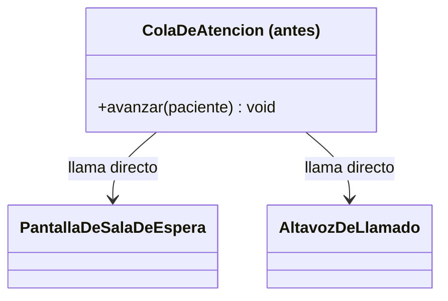
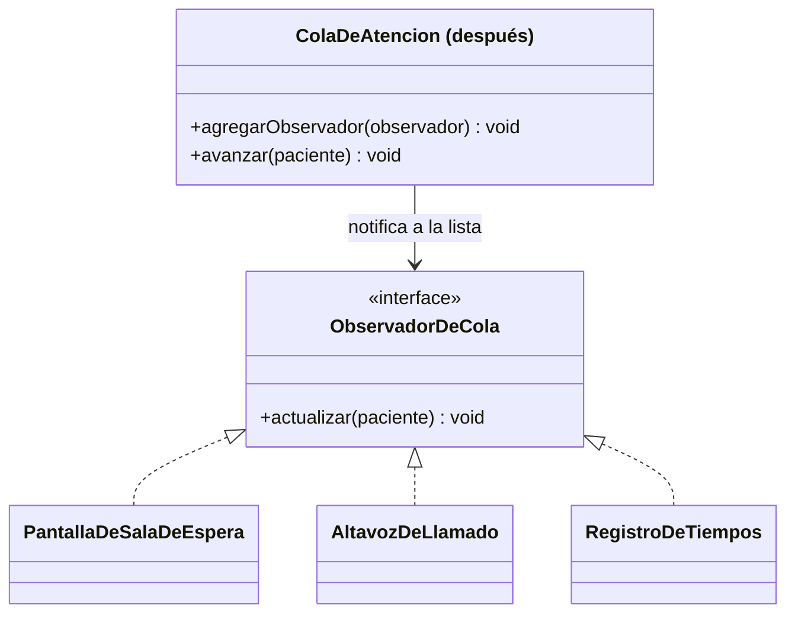

# 💡 Ejemplo 07 — Observer

## 🌍 Contexto

Cuando la cola de atención de MediSalud avanza al siguiente paciente, varios interesados necesitan
enterarse: la pantalla de la sala de espera y el altavoz de llamado. El código actual llama a cada uno
directamente, dentro del mismo método que avanza la cola.

**Qué busca demostrar este ejemplo**: qué exige agregar un interesado nuevo, comparado entre notificar
con llamadas directas y notificar a una lista de observadores registrados dinámicamente.

## 🏥 Caso de estudio

MediSalud llama al siguiente paciente de la cola de atención, avisando a distintos interesados cada vez
que la cola avanza.

## 🗺️ Diagrama





*Arriba, la versión "antes" (llamadas directas). Abajo, la versión "después" (lista de observadores
registrados dinámicamente).*

## 🌳 Árbol de archivos — antes

```text
observer-antes/
└── com/medisalud/
    ├── PantallaDeSalaDeEspera.java
    ├── AltavozDeLlamado.java
    ├── ColaDeAtencion.java
    └── Demo.java
```

## 💻 Archivo: PantallaDeSalaDeEspera.java

```java
package com.medisalud;

public class PantallaDeSalaDeEspera {
    public void actualizar(String paciente) {
        System.out.println("Pantalla: ahora atendiendo a " + paciente);
    }
}
```

## 💻 Archivo: AltavozDeLlamado.java

```java
package com.medisalud;

public class AltavozDeLlamado {
    public void anunciar(String paciente) {
        System.out.println("Altavoz: " + paciente + ", por favor acercarse al consultorio");
    }
}
```

## 💻 Archivo: ColaDeAtencion.java

```java
package com.medisalud;

public class ColaDeAtencion {
    private PantallaDeSalaDeEspera pantalla = new PantallaDeSalaDeEspera();
    private AltavozDeLlamado altavoz = new AltavozDeLlamado();

    public void avanzar(String siguientePaciente) {
        pantalla.actualizar(siguientePaciente);
        altavoz.anunciar(siguientePaciente);
    }
}
```

## 💻 Archivo: Demo.java

```java
package com.medisalud;

public class Demo {
    public static void main(String[] args) {
        ColaDeAtencion cola = new ColaDeAtencion();
        cola.avanzar("Ana Torres");
        cola.avanzar("Carlos Ruiz");
    }
}
```

## ✅ Resultado esperado — antes

```text
Pantalla: ahora atendiendo a Ana Torres
Altavoz: Ana Torres, por favor acercarse al consultorio
Pantalla: ahora atendiendo a Carlos Ruiz
Altavoz: Carlos Ruiz, por favor acercarse al consultorio
```

## 🌳 Árbol de archivos — después

```text
observer-despues/
└── com/medisalud/
    ├── ObservadorDeCola.java         (nuevo)
    ├── PantallaDeSalaDeEspera.java   (cambió: implementa la interfaz)
    ├── AltavozDeLlamado.java         (cambió: implementa la interfaz)
    ├── RegistroDeTiempos.java        (nuevo)
    ├── ColaDeAtencion.java           (cambió)
    └── Demo.java                     (cambió)
```

## 💻 Archivo: ObservadorDeCola.java — nuevo

```java
package com.medisalud;

public interface ObservadorDeCola {
    void actualizar(String paciente);
}
```

## 💻 Archivo: PantallaDeSalaDeEspera.java — cambió

```java
package com.medisalud;

public class PantallaDeSalaDeEspera implements ObservadorDeCola {
    public void actualizar(String paciente) {
        System.out.println("Pantalla: ahora atendiendo a " + paciente);
    }
}
```

## 💻 Archivo: AltavozDeLlamado.java — cambió

```java
package com.medisalud;

public class AltavozDeLlamado implements ObservadorDeCola {
    public void actualizar(String paciente) {
        System.out.println("Altavoz: " + paciente + ", por favor acercarse al consultorio");
    }
}
```

## 💻 Archivo: RegistroDeTiempos.java — nuevo

```java
package com.medisalud;

public class RegistroDeTiempos implements ObservadorDeCola {
    private int cantidadAtendidos = 0;

    public void actualizar(String paciente) {
        cantidadAtendidos = cantidadAtendidos + 1;
        System.out.println("Registro: paciente numero " + cantidadAtendidos + " (" + paciente + ")");
    }
}
```

## 💻 Archivo: ColaDeAtencion.java — cambió

```java
package com.medisalud;

import java.util.ArrayList;
import java.util.List;

public class ColaDeAtencion {
    private List<ObservadorDeCola> observadores = new ArrayList<>();

    public void agregarObservador(ObservadorDeCola observador) {
        observadores.add(observador);
    }

    public void avanzar(String siguientePaciente) {
        for (ObservadorDeCola observador : observadores) {
            observador.actualizar(siguientePaciente);
        }
    }
}
```

## 💻 Archivo: Demo.java — cambió

```java
package com.medisalud;

public class Demo {
    public static void main(String[] args) {
        ColaDeAtencion cola = new ColaDeAtencion();
        cola.agregarObservador(new PantallaDeSalaDeEspera());
        cola.agregarObservador(new AltavozDeLlamado());
        cola.agregarObservador(new RegistroDeTiempos());

        cola.avanzar("Ana Torres");
        cola.avanzar("Carlos Ruiz");
    }
}
```

## ✅ Resultado esperado — después

```text
Pantalla: ahora atendiendo a Ana Torres
Altavoz: Ana Torres, por favor acercarse al consultorio
Registro: paciente numero 1 (Ana Torres)
Pantalla: ahora atendiendo a Carlos Ruiz
Altavoz: Carlos Ruiz, por favor acercarse al consultorio
Registro: paciente numero 2 (Carlos Ruiz)
```

## 🔍 Comparación: la prueba concreta

En la versión "antes", `ColaDeAtencion.avanzar()` llama directamente a `pantalla.actualizar(...)` y
`altavoz.anunciar(...)`: agregar un tercer interesado exigiría modificar ese mismo método. En la versión
"después", se agregó un tercer observador nuevo (`RegistroDeTiempos`, que ni siquiera existía en la
versión "antes") con una sola línea (`agregarObservador(new RegistroDeTiempos())`), y la salida real
confirma que las tres notificaciones ocurren para cada paciente — sin que `ColaDeAtencion.avanzar()`
haya sido modificado ni conozca ninguna de las tres clases concretas.

## 🔍 Análisis: errores frecuentes

El error más frecuente al aplicar Observer es declarar la interfaz de observador pero seguir
inicializando la lista de observadores con instancias fijas dentro del propio sujeto (en vez de
recibirlas desde afuera con `agregarObservador(...)`), lo que impide agregar o quitar interesados sin
modificar la clase del sujeto — exactamente el problema que Observer busca evitar.

## ❓ Preguntas de repaso

**1. [Selección]** En la versión "antes", ¿qué exige agregar un interesado nuevo a la notificación?

- A. Nada: los interesados se registran solos.
- B. Modificar `ColaDeAtencion.avanzar()`, agregando una llamada más.
- C. Modificar `PantallaDeSalaDeEspera` y `AltavozDeLlamado`.
- D. No es posible agregar un interesado nuevo.

<details>
<summary>🔑 Ver respuesta</summary>

**Respuesta correcta: B.** `avanzar()` llama directamente a cada interesado dentro de su propio cuerpo,
así que un interesado nuevo exige agregar una llamada más ahí mismo.

</details>

**2. [Selección múltiple]** Sobre la versión "después", ¿cuáles afirmaciones son verdaderas?

- A. `ColaDeAtencion` mantiene una lista de `ObservadorDeCola`, no de clases concretas.
- B. Un observador nuevo se agrega sin modificar `ColaDeAtencion.avanzar()`.
- C. `ColaDeAtencion` necesita conocer si el observador es una pantalla, un altavoz o un registro.
- D. Los tres observadores reciben la misma llamada (`actualizar(paciente)`).

<details>
<summary>🔑 Ver respuesta</summary>

**Respuestas correctas: A, B y D.** C es falsa: `avanzar()` llama `actualizar(paciente)` sobre cada
elemento de la lista sin distinguir su clase concreta — esa es la razón por la que un observador nuevo
no exige ningún cambio.

</details>

**3. [Abierta]** Un compañero dice: "Observer es solo una lista de objetos a los que se les llama a un
método en un bucle, nada más". ¿Estás de acuerdo? Justifica tu respuesta.

<details>
<summary>🔑 Ver respuesta</summary>

Es una descripción incompleta. Lo esencial de Observer no es el bucle en sí, sino que el sujeto
(`ColaDeAtencion`) queda **desacoplado** de sus interesados: los conoce solo a través de una interfaz
común (`ObservadorDeCola`), se registran dinámicamente desde afuera, y agregar o quitar uno no exige
tocar el sujeto. Un bucle sobre una lista de clases concretas conocidas de antemano no lograría ese
desacoplamiento.

</details>
