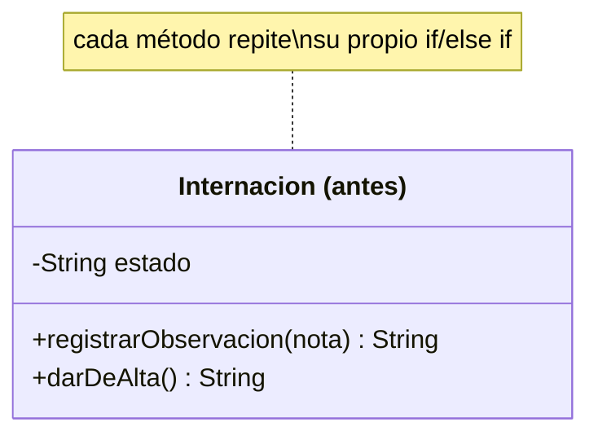
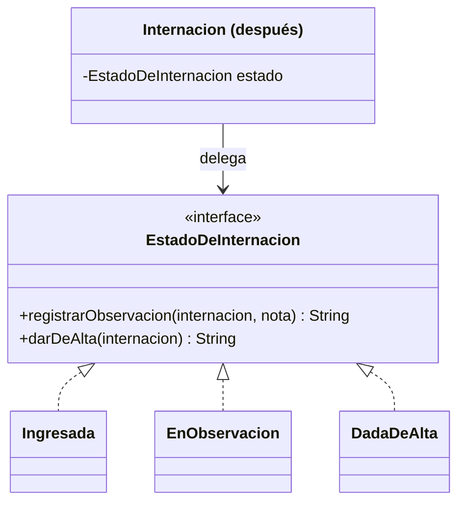

# 💡 Ejemplo 08 — State

## 🌍 Contexto

Una internación de MediSalud tiene un campo de estado (`Ingresada`, `EnObservacion`, `DadaDeAlta`) y dos
métodos (`registrarObservacion()`, `darDeAlta()`) que empiezan, cada uno, con su propio condicional
sobre ese campo para decidir si la operación es válida.

**Qué busca demostrar este ejemplo**: si el comportamiento se puede delegar al estado actual sin ningún
condicional, comparado entre un campo de estado con condicionales dispersos y una clase por estado.

## 🏥 Caso de estudio

MediSalud registra observaciones y altas de una internación, cuyo comportamiento válido depende de su
estado actual.

## 🗺️ Diagrama





*Arriba, la versión "antes" (condicionales dispersos). Abajo, la versión "después" (una clase por
estado, que decide su propia transición).*

## 🌳 Árbol de archivos — antes

```text
state-antes/
└── com/medisalud/
    ├── Internacion.java
    └── Demo.java
```

## 💻 Archivo: Internacion.java

```java
package com.medisalud;

public class Internacion {
    private String estado = "INGRESADA";

    public String registrarObservacion(String nota) {
        if (estado.equals("INGRESADA")) {
            estado = "EN_OBSERVACION";
            return "Observacion registrada, pasa a EN_OBSERVACION: " + nota;
        } else if (estado.equals("EN_OBSERVACION")) {
            return "Observacion registrada: " + nota;
        }
        return "No se puede registrar observacion: la internacion ya fue dada de alta";
    }

    public String darDeAlta() {
        if (estado.equals("EN_OBSERVACION")) {
            estado = "DADA_DE_ALTA";
            return "Paciente dado de alta";
        }
        return "No se puede dar de alta: la internacion no esta en observacion";
    }

    public String getEstado() {
        return estado;
    }
}
```

## 💻 Archivo: Demo.java

```java
package com.medisalud;

public class Demo {
    public static void main(String[] args) {
        Internacion internacion = new Internacion();
        System.out.println(internacion.darDeAlta());
        System.out.println(internacion.registrarObservacion("Signos vitales estables"));
        System.out.println(internacion.darDeAlta());
        System.out.println("estado final=" + internacion.getEstado());
    }
}
```

## ✅ Resultado esperado — antes

```text
No se puede dar de alta: la internacion no esta en observacion
Observacion registrada, pasa a EN_OBSERVACION: Signos vitales estables
Paciente dado de alta
estado final=DADA_DE_ALTA
```

## 🌳 Árbol de archivos — después

```text
state-despues/
└── com/medisalud/
    ├── EstadoDeInternacion.java   (nuevo)
    ├── Ingresada.java             (nuevo)
    ├── EnObservacion.java         (nuevo)
    ├── DadaDeAlta.java            (nuevo)
    ├── Internacion.java           (cambió)
    └── Demo.java                  (sin cambios)
```

## 💻 Archivo: EstadoDeInternacion.java — nuevo

```java
package com.medisalud;

public interface EstadoDeInternacion {
    String registrarObservacion(Internacion internacion, String nota);
    String darDeAlta(Internacion internacion);
    String nombre();
}
```

## 💻 Archivo: Ingresada.java — nuevo

```java
package com.medisalud;

public class Ingresada implements EstadoDeInternacion {
    public String registrarObservacion(Internacion internacion, String nota) {
        internacion.setEstado(new EnObservacion());
        return "Observacion registrada, pasa a EN_OBSERVACION: " + nota;
    }

    public String darDeAlta(Internacion internacion) {
        return "No se puede dar de alta: la internacion no esta en observacion";
    }

    public String nombre() {
        return "INGRESADA";
    }
}
```

## 💻 Archivo: EnObservacion.java — nuevo

```java
package com.medisalud;

public class EnObservacion implements EstadoDeInternacion {
    public String registrarObservacion(Internacion internacion, String nota) {
        return "Observacion registrada: " + nota;
    }

    public String darDeAlta(Internacion internacion) {
        internacion.setEstado(new DadaDeAlta());
        return "Paciente dado de alta";
    }

    public String nombre() {
        return "EN_OBSERVACION";
    }
}
```

## 💻 Archivo: DadaDeAlta.java — nuevo

```java
package com.medisalud;

public class DadaDeAlta implements EstadoDeInternacion {
    public String registrarObservacion(Internacion internacion, String nota) {
        return "No se puede registrar observacion: la internacion ya fue dada de alta";
    }

    public String darDeAlta(Internacion internacion) {
        return "No se puede dar de alta: la internacion no esta en observacion";
    }

    public String nombre() {
        return "DADA_DE_ALTA";
    }
}
```

## 💻 Archivo: Internacion.java — cambió

```java
package com.medisalud;

public class Internacion {
    private EstadoDeInternacion estado = new Ingresada();

    public String registrarObservacion(String nota) {
        return estado.registrarObservacion(this, nota);
    }

    public String darDeAlta() {
        return estado.darDeAlta(this);
    }

    public void setEstado(EstadoDeInternacion estado) {
        this.estado = estado;
    }

    public String getEstado() {
        return estado.nombre();
    }
}
```

Sin cambios respecto de "antes": `Demo.java` — su código ya se mostró arriba y es exactamente el mismo,
byte a byte.

<details>
<summary>💻 Ver de nuevo el código sin cambios (Demo.java)</summary>

## 💻 Archivo: Demo.java

```java
package com.medisalud;

public class Demo {
    public static void main(String[] args) {
        Internacion internacion = new Internacion();
        System.out.println(internacion.darDeAlta());
        System.out.println(internacion.registrarObservacion("Signos vitales estables"));
        System.out.println(internacion.darDeAlta());
        System.out.println("estado final=" + internacion.getEstado());
    }
}
```

</details>

## ✅ Resultado esperado — después

```text
No se puede dar de alta: la internacion no esta en observacion
Observacion registrada, pasa a EN_OBSERVACION: Signos vitales estables
Paciente dado de alta
estado final=DADA_DE_ALTA
```

## 🔍 Comparación: la prueba concreta

Ejecutada la misma secuencia de llamadas (un alta inválida, una observación válida, un alta válida),
ambas versiones dan **exactamente la misma salida**, línea por línea, incluida la representación final
del estado (`estado final=DADA_DE_ALTA`). En la versión "antes", cada método repite su propio
condicional sobre el campo `estado`. En la versión "después", `Internacion` no tiene ningún
condicional: delega cada operación en `estado.registrarObservacion(this, nota)` o
`estado.darDeAlta(this)`, y es el propio objeto de estado quien decide y, si corresponde, cambia el
estado de `Internacion` a otro.

## 🔍 Análisis: errores frecuentes

El error más frecuente al aplicar State es dejar, además de las clases de estado, un campo adicional
(por ejemplo, un `String estado` paralelo) "por las dudas" — eso duplica la fuente de verdad sobre el
estado actual y reintroduce el riesgo de que ambos queden desincronizados. El único lugar donde debe
vivir el estado actual es la referencia al objeto `EstadoDeInternacion`.

## ❓ Preguntas de repaso

**1. [Selección]** En la versión "antes", ¿qué necesita cada método para saber si la operación pedida
es válida en el estado actual?

- A. Nada: el polimorfismo lo resuelve automáticamente.
- B. Su propio condicional sobre el campo `estado`.
- C. Una clase separada para cada estado.
- D. Un método `esValido()` en cada estado.

<details>
<summary>🔑 Ver respuesta</summary>

**Respuesta correcta: B.** `registrarObservacion()` y `darDeAlta()` repiten, cada uno por su cuenta, un
condicional sobre el campo `estado` para decidir si la operación es válida.

</details>

**2. [Selección múltiple]** Sobre la versión "después", ¿cuáles afirmaciones son verdaderas?

- A. `Internacion` no tiene ningún condicional sobre el estado.
- B. Cada clase de estado decide su propia transición válida.
- C. El resultado de la misma secuencia de llamadas es distinto al de la versión "antes".
- D. `Ingresada`, `EnObservacion` y `DadaDeAlta` implementan la misma interfaz.

<details>
<summary>🔑 Ver respuesta</summary>

**Respuestas correctas: A, B y D.** C es falsa: ambas versiones dan exactamente la misma salida sobre
la misma secuencia — lo que cambia es cómo se organiza el comportamiento, no el resultado.

</details>

**3. [Abierta]** Un compañero dice: "State y Strategy son el mismo patrón, porque los dos delegan
comportamiento a un objeto intercambiable". ¿Estás de acuerdo? Justifica tu respuesta.

<details>
<summary>🔑 Ver respuesta</summary>

No completamente. La estructura (una interfaz, varias implementaciones, delegación por composición) es
parecida, pero la intención es distinta: en Strategy, el código cliente **elige y fija** la estrategia
una vez (por ejemplo, al crear el `Turno`). En State, el propio objeto **cambia su estado con el
tiempo**, en respuesta a sus propias operaciones (`Internacion` pasa de `Ingresada` a `EnObservacion` a
`DadaDeAlta` por sí sola) — el cliente nunca decide ni conoce el estado actual desde afuera.

</details>
