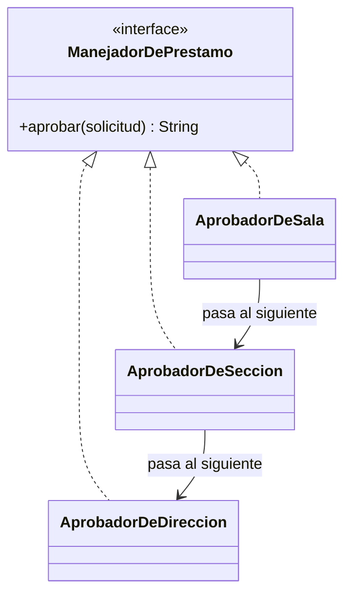

# 🟡 Intermedio 01 — Aplicar Chain of Responsibility

## 🧩 Problema

Tienes las mismas clases de la Biblioteca Universitaria del ejercicio Básico 01:

## 💻 Código o contexto de partida

```java
package com.biblioteca;

public class SolicitudDePrestamoEspecial {
    private String tituloEjemplar;
    private String excepcionalidad;

    public SolicitudDePrestamoEspecial(String tituloEjemplar, String excepcionalidad) {
        this.tituloEjemplar = tituloEjemplar;
        this.excepcionalidad = excepcionalidad;
    }

    public String getTituloEjemplar() {
        return tituloEjemplar;
    }

    public String getExcepcionalidad() {
        return excepcionalidad;
    }
}
```

```java
package com.biblioteca;

public class GestorDePrestamos {
    public String aprobar(SolicitudDePrestamoEspecial solicitud) {
        if (solicitud.getExcepcionalidad().equals("BAJA")) {
            return "Aprobado por la sala: " + solicitud.getTituloEjemplar();
        } else if (solicitud.getExcepcionalidad().equals("MEDIA")) {
            return "Aprobado por la seccion: " + solicitud.getTituloEjemplar();
        } else if (solicitud.getExcepcionalidad().equals("ALTA")) {
            return "Aprobado por la direccion: " + solicitud.getTituloEjemplar();
        }
        throw new IllegalArgumentException("Excepcionalidad desconocida: " + solicitud.getExcepcionalidad());
    }
}
```

```java
package com.biblioteca;

public class Demo {
    public static void main(String[] args) {
        GestorDePrestamos gestor = new GestorDePrestamos();

        SolicitudDePrestamoEspecial s1 = new SolicitudDePrestamoEspecial("Manuscrito comun", "BAJA");
        SolicitudDePrestamoEspecial s2 = new SolicitudDePrestamoEspecial("Primera edicion", "MEDIA");
        SolicitudDePrestamoEspecial s3 = new SolicitudDePrestamoEspecial("Manuscrito unico", "ALTA");

        System.out.println(gestor.aprobar(s1));
        System.out.println(gestor.aprobar(s2));
        System.out.println(gestor.aprobar(s3));
    }
}
```

Rediséñalas para que respeten Chain of Responsibility: declara una cadena de manejadores, cada uno
decidiendo si aprueba la solicitud o la pasa al siguiente.

## 🗺️ Diagrama



## 🧪 Casos de prueba

| Entrada | Verificación | Resultado esperado |
|---|---|---|
| Solicitudes de excepcionalidad `"BAJA"`, `"MEDIA"` y `"ALTA"` | Salida completa del programa antes y después de refactorizar | Idéntica, carácter por carácter |
| Se agrega un nivel nuevo (`"CRITICA"`) como una clase que implementa `ManejadorDePrestamo` | Archivo `AprobadorDeSala.java` | Sin ninguna modificación |

## 📏 Criterios de evaluación de la solución

- Declara una interfaz (por ejemplo, `ManejadorDePrestamo`) con un método `aprobar(solicitud)`.
- Declara tres manejadores (`AprobadorDeSala`, `AprobadorDeSeccion`, `AprobadorDeDireccion`), cada uno
  recibiendo al siguiente de la cadena por composición.
- La salida por consola no cambia respecto de la versión original.
- Un nivel nuevo se agrega con una clase nueva, insertada en la cadena, sin modificar los manejadores
  existentes.

## 🚧 Restricciones

- No se usan `Set`, `Map` ni excepciones como parte del diseño (más allá de señalar, sin capturarla, que
  ningún nivel pudo aprobar).

## 📊 Dificultad

Intermedio

## 🎓 Resultados de aprendizaje

- **RA-4**: implementar Chain of Responsibility para un caso dado.
