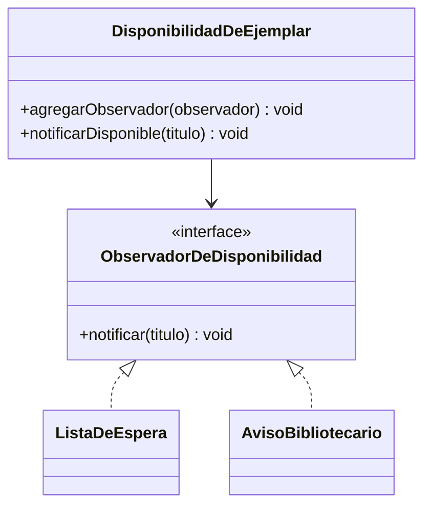

# 🟡 Intermedio 02 — Aplicar Observer

## 🧩 Problema

Tienes la misma clase de la Biblioteca Universitaria del ejercicio Básico 02:

## 💻 Código o contexto de partida

```java
package com.biblioteca;

public class DisponibilidadDeEjemplar {
    public void notificarDisponible(String titulo) {
        System.out.println("Lista de espera: " + titulo + " ya esta disponible");
        System.out.println("Bibliotecario: preparar " + titulo + " para el proximo retiro");
    }
}
```

```java
package com.biblioteca;

public class Demo {
    public static void main(String[] args) {
        DisponibilidadDeEjemplar disponibilidad = new DisponibilidadDeEjemplar();
        disponibilidad.notificarDisponible("Cien anios de soledad");
    }
}
```

Rediséñala para que respete Observer: declara una lista de observadores registrados dinámicamente, de
forma que `notificarDisponible()` no necesite conocer sus clases concretas.

## 🗺️ Diagrama



## 🧪 Casos de prueba

| Entrada | Verificación | Resultado esperado |
|---|---|---|
| Notificar la disponibilidad de un ejemplar, con los dos observadores registrados | Salida completa del programa antes y después de refactorizar | Idéntica, carácter por carácter |
| Se agrega un tercer observador nuevo, registrado dinámicamente | Archivo `DisponibilidadDeEjemplar.java` | Sin ninguna modificación en `notificarDisponible()` |

## 📏 Criterios de evaluación de la solución

- Declara una interfaz (por ejemplo, `ObservadorDeDisponibilidad`) con un método `notificar(String
  titulo)`.
- `DisponibilidadDeEjemplar` mantiene una lista de observadores, agregada con `agregarObservador(...)`.
- La salida por consola no cambia respecto de la versión original.
- Un observador nuevo se agrega registrándolo, sin modificar `notificarDisponible()`.

## 🚧 Restricciones

- No se usan `Set` ni excepciones como parte del diseño.

## 📊 Dificultad

Intermedio

## 🎓 Resultados de aprendizaje

- **RA-7**: implementar Observer para un caso dado.
