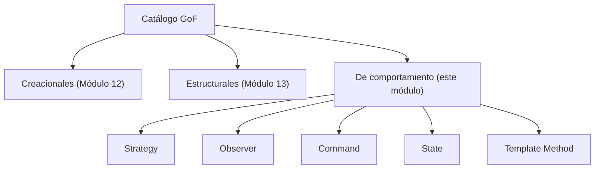
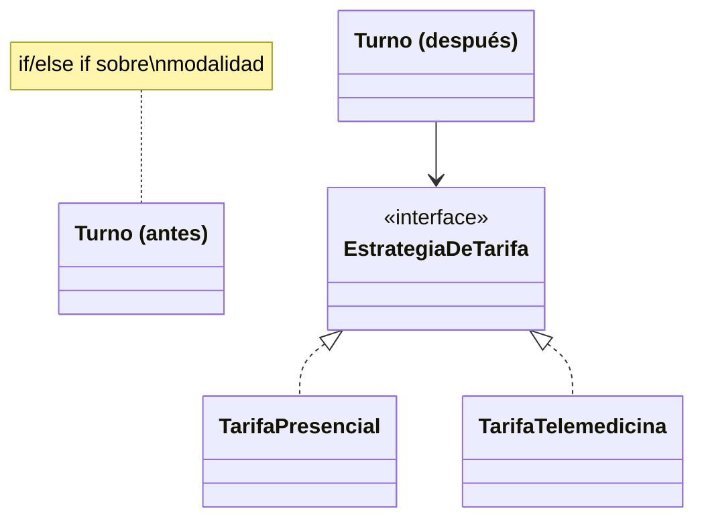
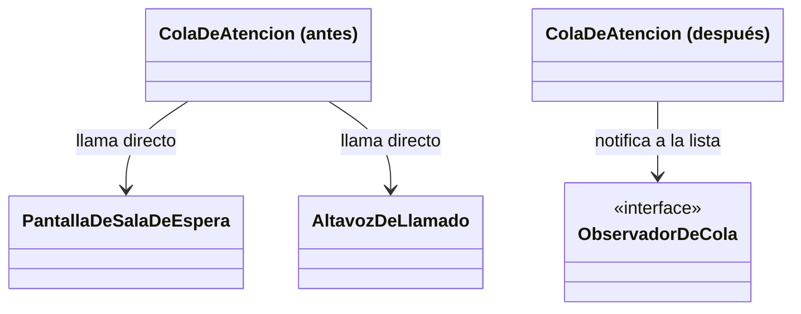
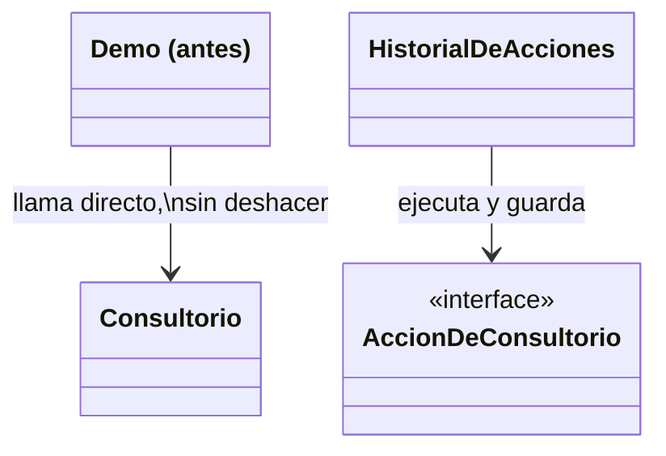
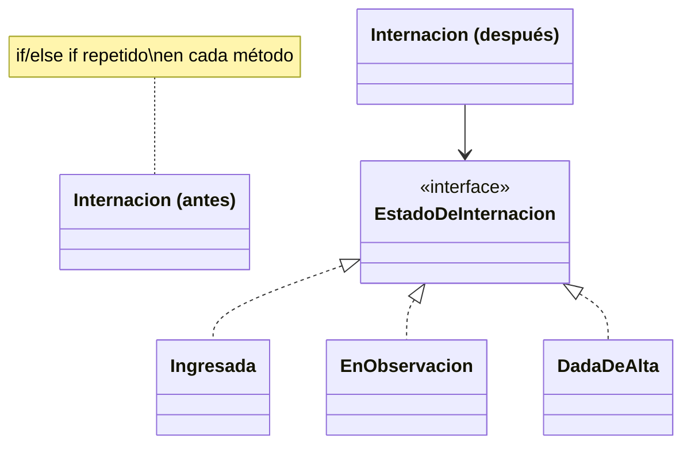
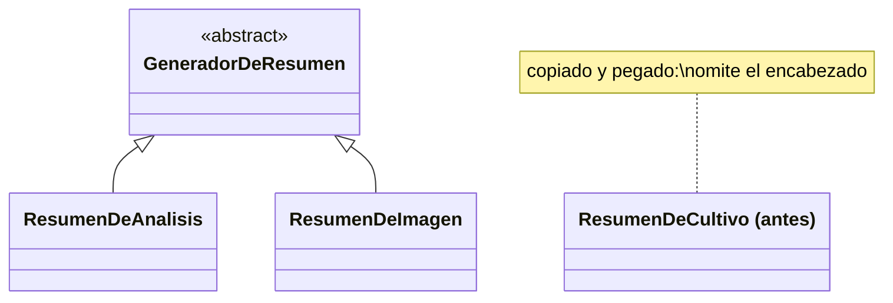

# Módulo 14 — Patrones de Diseño (Patrones de Comportamiento I)

Curso de Java

---

## 🎯 Objetivos del módulo

- Explicar qué es un patrón de comportamiento y qué lo distingue de los patrones creacionales y
  estructurales.
- Explicar el problema de comunicación o reparto de responsabilidades que resuelve cada uno de los
  cinco patrones: Strategy, Observer, Command, State y Template Method.
- Identificar cuál de los cinco patrones resuelve un problema de comportamiento dado.
- Implementar cada patrón en Java para un caso real.

---

## 🗺️ Ruta de la sesión

1. Qué son los patrones de comportamiento.
2. Strategy.
3. Observer.
4. Command.
5. State.
6. Template Method.

---

## 🧠 ¿Qué es un patrón de comportamiento?

Un patrón de comportamiento resuelve cómo se comunican los objetos entre sí y cómo reparten
responsabilidades, a diferencia de los creacionales (cómo se crean) y los estructurales (cómo se
componen). Este módulo cubre cinco de los once patrones de comportamiento del catálogo GoF; los seis
restantes quedan para el Módulo 15.

---

## 🗺️ Diagrama: las tres categorías y los cinco patrones de este módulo



---

## 🔗 De OCP a Strategy

En el Módulo 11, el diseño que resolvía OCP —una interfaz con una implementación por caso, recibida por
composición— coincidía, sin nombrarlo, con el patrón Strategy. Este módulo formaliza ese vocabulario,
con clases completamente nuevas.

---

## 🧩 Strategy

Encapsula una familia de algoritmos intercambiables detrás de una interfaz común, para que el algoritmo
pueda variar independientemente del código que lo usa.

---

## 🗺️ Diagrama: Strategy antes/después



---

## 💻 Strategy — antes

```java
public double calcularTarifa() {
    if (modalidad.equals("PRESENCIAL")) {
        return montoBase;
    } else if (modalidad.equals("TELEMEDICINA")) {
        return montoBase * 0.7;
    }
    throw new IllegalArgumentException("Modalidad desconocida: " + modalidad);
}
```

---

## 💻 Strategy — después

```java
public double calcularTarifa() {
    return estrategiaDeTarifa.calcular(montoBase);
}
```

---

## 🔍 Strategy — la prueba concreta

Agregar una modalidad nueva (`"DOMICILIO"`): la versión "antes" modifica `Turno.java`. La versión
"después" agrega una sola clase (`TarifaDomicilio`), dejando `EstrategiaDeTarifa`, `TarifaPresencial`,
`TarifaTelemedicina` y `Turno` **idénticos, byte a byte**.

---

## 👀 Observer

Define una dependencia uno-a-muchos: cuando un sujeto cambia de estado, todos sus observadores se
notifican automáticamente, sin que el sujeto conozca sus clases concretas.

---

## 🗺️ Diagrama: Observer antes/después



---

## 💻 Observer — antes

```java
public void avanzar(String paciente) {
    pantalla.actualizar(paciente);
    altavoz.anunciar(paciente);
}
```

---

## 💻 Observer — después

```java
public void avanzar(String paciente) {
    for (ObservadorDeCola observador : observadores) {
        observador.actualizar(paciente);
    }
}
```

---

## 🔍 Observer — la prueba concreta

Se agregó un tercer observador nuevo (`RegistroDeTiempos`) con una sola línea
(`agregarObservador(...)`). La salida real confirma que las tres notificaciones ocurren para cada
paciente, sin que `avanzar()` haya sido modificado.

---

## 🕹️ Command

Encapsula una solicitud como un objeto, permitiendo parametrizarla, registrarla o deshacerla.

---

## 🗺️ Diagrama: Command antes/después



---

## 💻 Command — antes

```java
consultorio.ocupar(medico);
```

---

## 💻 Command — después

```java
historial.ejecutar(new AccionOcuparConsultorio(consultorio, medico));
// ...
historial.deshacerUltima();
```

---

## 🔍 Command — la prueba concreta

Tras ejecutar y deshacer, `consultorio.getMedicoAsignado()` vuelve a `null` — el estado exacto anterior
a la acción — sin que el cliente conociera la operación contraria de `AccionOcuparConsultorio`.

---

## 🔁 State

Permite que un objeto altere su comportamiento cuando cambia su estado interno, delegando en un objeto
de estado en vez de un condicional.

---

## 🗺️ Diagrama: State antes/después



---

## 💻 State — antes

```java
public String darDeAlta() {
    if (estado.equals("EN_OBSERVACION")) {
        estado = "DADA_DE_ALTA";
        return "Paciente dado de alta";
    }
    return "No se puede dar de alta: la internacion no esta en observacion";
}
```

---

## 💻 State — después

```java
public String darDeAlta() {
    return estado.darDeAlta(this);
}
```

---

## 🔍 State — la prueba concreta

Ejecutada la misma secuencia de llamadas, ambas versiones dan **exactamente la misma salida**, línea
por línea. En la versión "después", `Internacion` no tiene ningún condicional: delega en el objeto de
estado actual.

---

## 📐 Template Method

Fija el esqueleto de un algoritmo en un método `final`, dejando que las subclases redefinan solo los
pasos que varían.

---

## 🗺️ Diagrama: Template Method antes/después



---

## 💻 Template Method — antes

```java
// ResumenDeCultivo, copiado y pegado: omite el encabezado por error
public String generar(String paciente) {
    // ...
    // falta: resumen.append("=== Resumen de Cultivo ===\n");
    resumen.append("Paciente: ").append(paciente).append("\n");
    resumen.append(datoPropio);
    return resumen.toString();
}
```

---

## 💻 Template Method — después

```java
public final String generar(String paciente) {
    // ... esqueleto fijo, incluido el encabezado ...
    resumen.append("=== ").append(titulo()).append(" ===\n");
    // ...
}
```

---

## 🔍 Template Method — la prueba concreta

En la versión "antes", `ResumenDeCultivo` (copiado y pegado) omite realmente el encabezado en su salida.
En la versión "después", una subclase nueva (`ResumenDeCultivo extends GeneradorDeResumen`) **no
puede** omitirlo: `generar()` es `final`.

---

## ⚠️ Errores frecuentes, uno por patrón

- **Strategy**: dejar que el cliente siga eligiendo la estrategia con un condicional en cada llamado.
- **Observer**: inicializar la lista de observadores con instancias fijas dentro del sujeto.
- **Command**: tratarlo como una llamada indirecta, sin guardar lo necesario para deshacer.
- **State**: dejar, además de las clases de estado, un campo de estado paralelo.
- **Template Method**: declarar el método plantilla sin `final`, permitiendo romper el esqueleto.

---

## 📋 Resumen de los cinco patrones de comportamiento

| Patrón | Qué resuelve |
|---|---|
| Strategy | Un condicional elige, en el cliente, cuál algoritmo aplicar |
| Observer | El sujeto notifica a mano a cada interesado |
| Command | El cliente llama directo al receptor, sin poder deshacer |
| State | Condicionales repetidos sobre un campo de estado |
| Template Method | Un esqueleto de pasos copiado y pegado |

---

## 🛠️ Taller: Sistema de Gestión de Turnos de MediSalud

Combina cuatro de los cinco patrones: Strategy (`ReglaDeTarifa`), State (`EstadoDeTurnoMedico`),
Observer (`ObservadorDeTurnoMedico`) y Command (`AccionSobreTurnoMedico`), integrados en un mismo
`TurnoMedico`.

---

## 🧪 Ejercicios: Biblioteca Universitaria

Un ejercicio Básico (identificar la violación) y uno Intermedio (aplicar el patrón) por cada uno de los
cinco patrones, con la Biblioteca Universitaria como dominio.

---

## 🔴🏆 Avanzado y Desafío: Biblioteca Universitaria

**Avanzado**: corregir un diseño con dos patrones ausentes a la vez (Strategy + Observer). **Desafío**:
sin scaffold, elegir y justificar el patrón de comportamiento más adecuado para un caso nuevo.

---

## ❓ Quiz 01

17 preguntas en formato entrevista técnica: 1 introductoria, 3 por cada uno de los cinco patrones, y 1
integradora final sobre cómo elegir el patrón adecuado.

---

## 📚 Repaso: la pregunta clave de cada patrón

- **Strategy**: ¿un condicional elige, en el cliente, cuál algoritmo aplicar?
- **Observer**: ¿varios interesados necesitan enterarse cuando algo cambia?
- **Command**: ¿necesito deshacer o registrar una acción?
- **State**: ¿el comportamiento válido depende del estado interno de un objeto?
- **Template Method**: ¿varias clases repiten el mismo esqueleto de pasos?

---

## ✅ Checklist de cierre

- Puedo explicar qué resuelve cada uno de los cinco patrones de comportamiento.
- Puedo identificar cuál de los cinco resuelve un problema de comportamiento dado.
- Puedo implementar cada patrón en Java para un caso nuevo.
- Completé el Taller, los ejercicios Básico e Intermedio de los cinco patrones, y el Quiz 01.

---

## 🎓 Cierre

Los patrones de comportamiento no crean objetos ni deciden cómo se componen — deciden cómo se
comunican y reparten responsabilidades. La misma pregunta ("¿qué problema de comunicación tengo?")
identifica cuál de los cinco aplica en cada caso nuevo. Los seis restantes del catálogo GoF esperan en
el Módulo 15.
