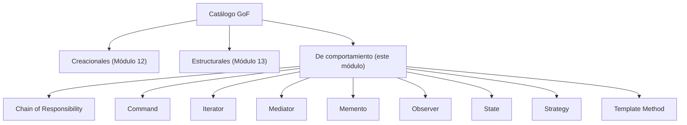
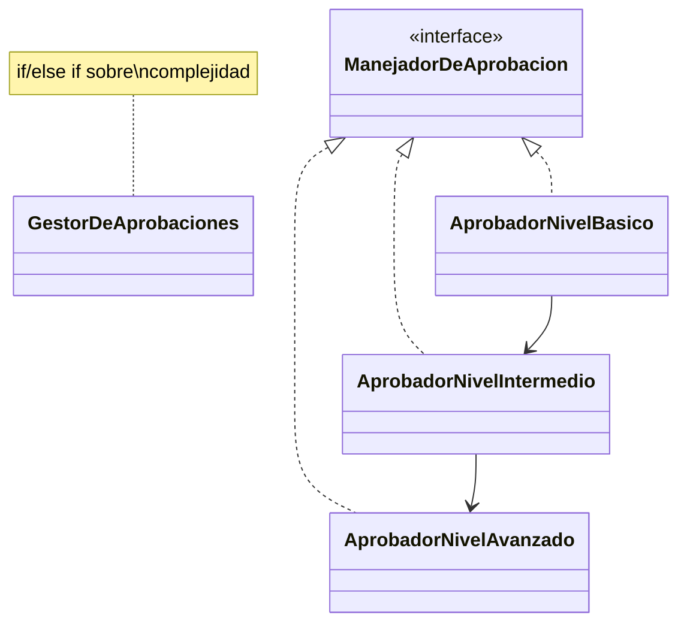
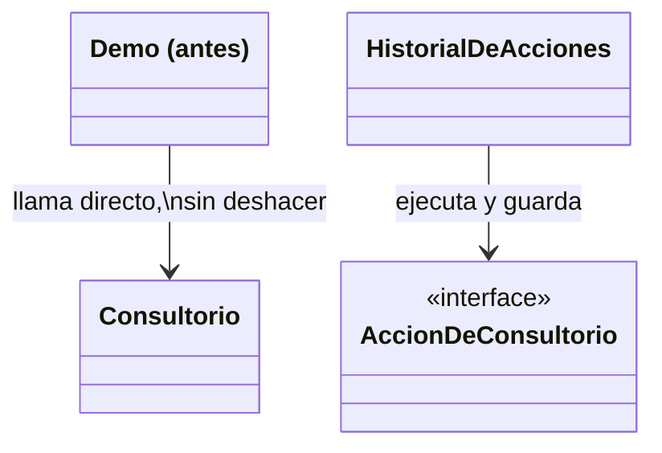
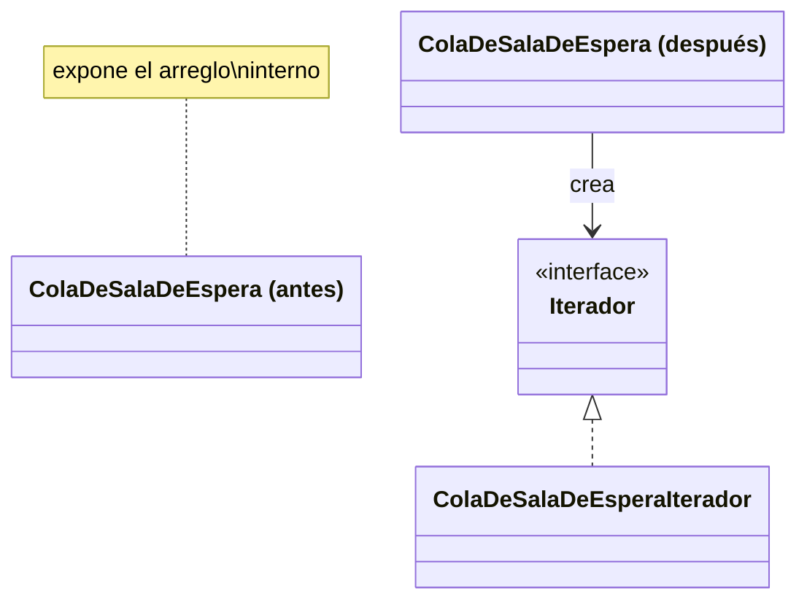
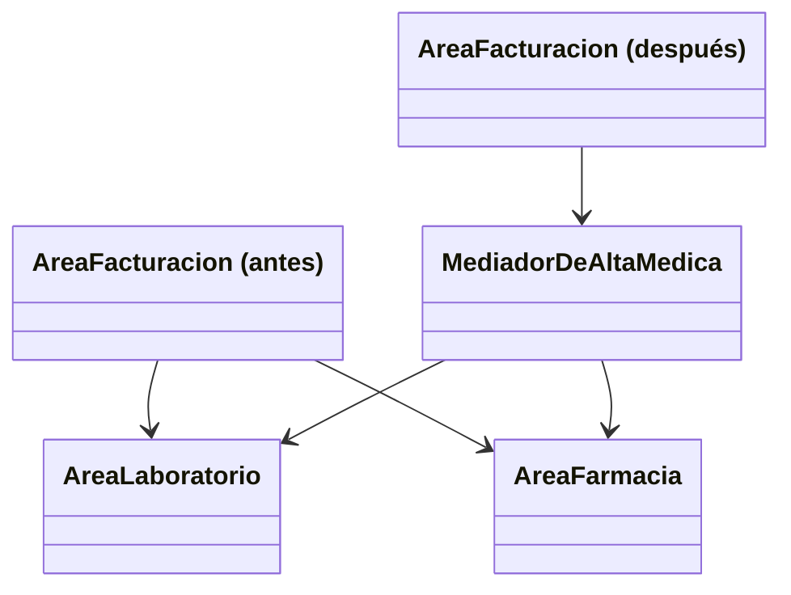
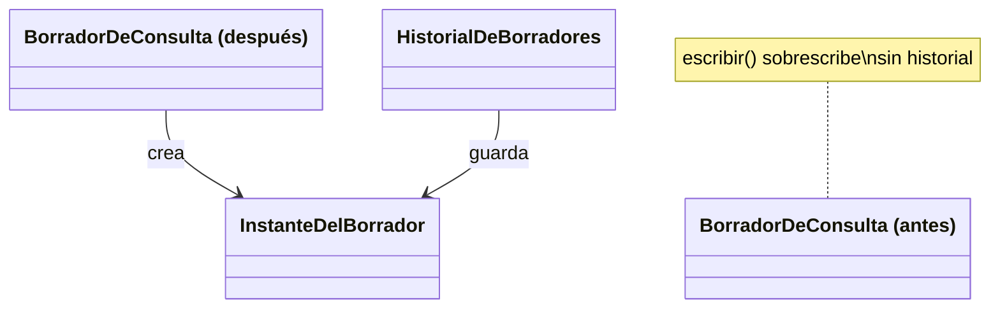
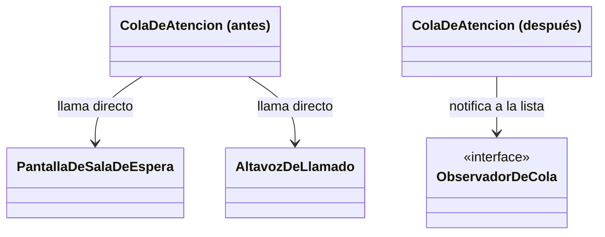
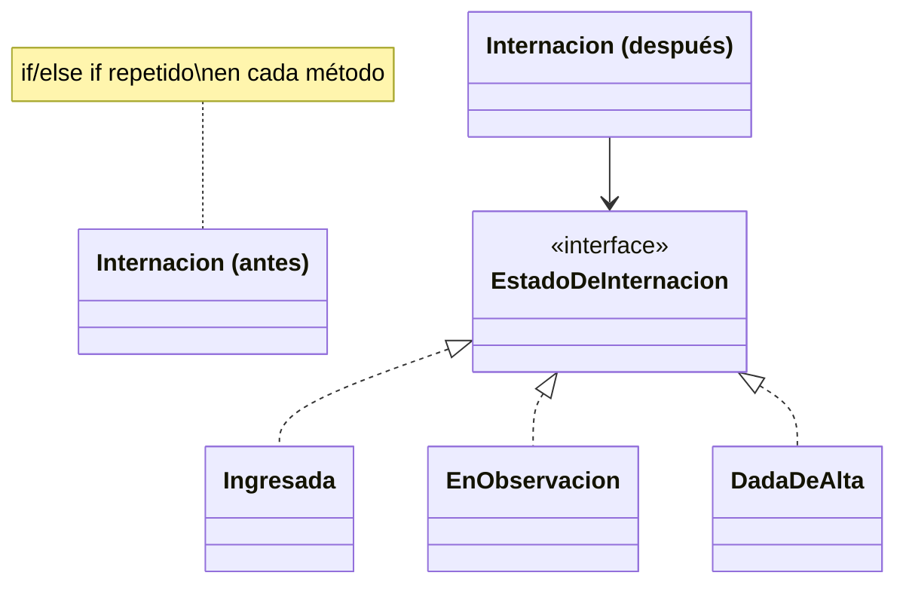
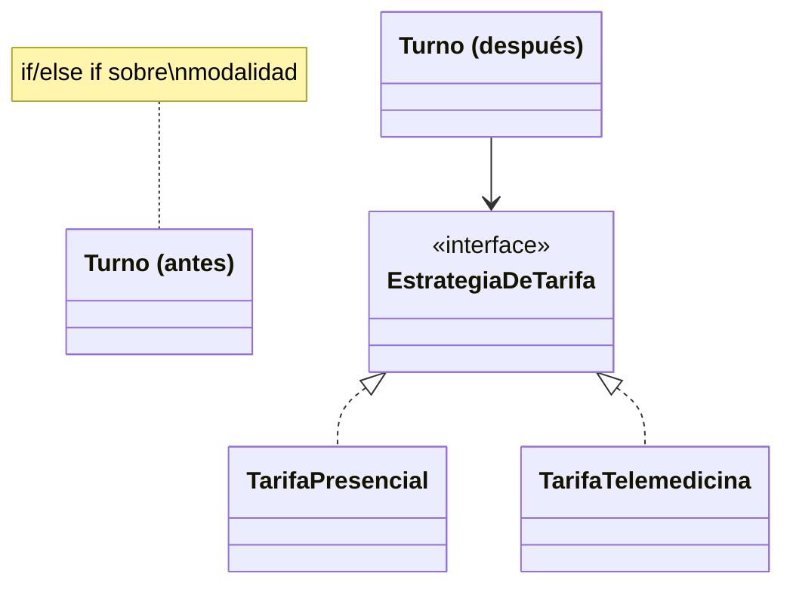
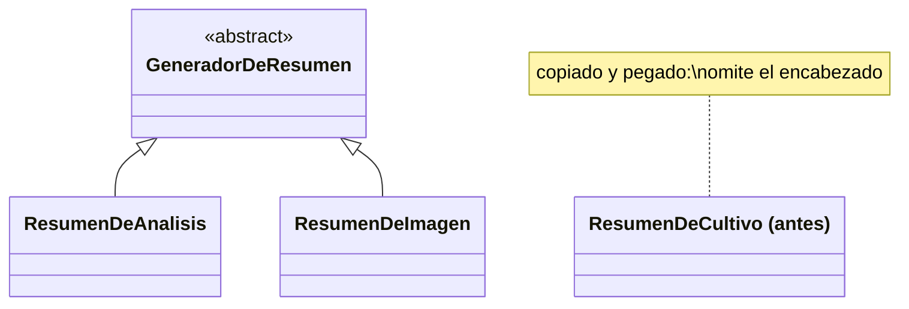

# Módulo 14 — Patrones de Diseño (Patrones de Comportamiento)

Curso de Java
---
## 🎯 Objetivos del módulo

- Explicar qué es un patrón de comportamiento y qué lo distingue de los patrones creacionales y
  estructurales.
- Explicar el problema de comunicación o reparto de responsabilidades que resuelve cada uno de los
  nueve patrones: Chain of Responsibility, Command, Iterator, Mediator, Memento, Observer, State,
  Strategy y Template Method.
- Identificar cuál de los nueve patrones resuelve un problema de comportamiento dado.
- Implementar cada patrón en Java para un caso real.
---
## 🗺️ Ruta de la sesión

1. Qué son los patrones de comportamiento.
2. Chain of Responsibility.
3. Command.
4. Iterator.
5. Mediator.
6. Memento.
7. Observer.
8. State.
9. Strategy.
10. Template Method.
---
## 🧠 ¿Qué es un patrón de comportamiento?

Un patrón de comportamiento resuelve cómo se comunican los objetos entre sí y cómo reparten
responsabilidades, a diferencia de los creacionales (cómo se crean) y los estructurales (cómo se
componen). Este módulo cubre los nueve patrones de comportamiento del catálogo GoF.
---
## 🗺️ Diagrama: las tres categorías y los nueve patrones de este módulo


---
## 🔗 De OCP a Strategy

En el Módulo 11, el diseño que resolvía OCP —una interfaz con una implementación por caso, recibida por
composición— coincidía, sin nombrarlo, con el patrón Strategy. Este módulo formaliza ese vocabulario,
con clases completamente nuevas.
---
## 🔗 Chain of Responsibility

Pasa una solicitud a lo largo de una cadena de manejadores hasta que uno de ellos la resuelve, sin que
quien la envía conozca cuál.
---
## 🗺️ Diagrama: Chain of Responsibility antes/después


---
## 💻 Chain of Responsibility — antes

```java
public String aprobar(SolicitudDeEstudio solicitud) {
    if (solicitud.getComplejidad().equals("BASICA")) {
        return "Aprobado por nivel basico: " + solicitud.getNombreEstudio();
    } else if (solicitud.getComplejidad().equals("INTERMEDIA")) {
        return "Aprobado por nivel intermedio: " + solicitud.getNombreEstudio();
    }
    // ...
}
```
---
## 💻 Chain of Responsibility — después

```java
public String aprobar(SolicitudDeEstudio solicitud) {
    if (solicitud.getComplejidad().equals("BASICA")) {
        return "Aprobado por nivel basico: " + solicitud.getNombreEstudio();
    }
    return siguiente.aprobar(solicitud);
}
```
---
## 🔍 Chain of Responsibility — la prueba concreta

Ambas versiones dan la misma salida para las tres complejidades probadas. En la versión "después",
ningún manejador conoce a los demás, salvo al siguiente de la cadena.
---
## 🕹️ Command

Encapsula una solicitud como un objeto, permitiendo parametrizarla, registrarla o deshacerla.
---
## 🗺️ Diagrama: Command antes/después


---
## 💻 Command — antes

```java
consultorio.ocupar(medico);
```
---
## 💻 Command — después

```java
historial.ejecutar(new AccionOcuparConsultorio(consultorio, medico));
// ...
historial.deshacerUltima();
```
---
## 🔍 Command — la prueba concreta

Tras ejecutar y deshacer, `consultorio.getMedicoAsignado()` vuelve a `null` — el estado exacto anterior
a la acción — sin que el cliente conociera la operación contraria de `AccionOcuparConsultorio`.
---
## 🔁 Iterator

Recorre los elementos de una colección sin exponer su representación interna.
---
## 🗺️ Diagrama: Iterator antes/después


---
## 💻 Iterator — antes

```java
for (int i = 0; i < cola.getCantidad(); i = i + 1) {
    System.out.println(cola.getPacientes()[i]);
}
```
---
## 💻 Iterator — después

```java
Iterador iterador = cola.crearIterador();
while (iterador.haySiguiente()) {
    System.out.println(iterador.siguiente());
}
```
---
## 🔍 Iterator — la prueba concreta

Ambas versiones dan la misma salida (los mismos pacientes, en el mismo orden). En la versión
"después", el cliente nunca accede al arreglo interno de la cola.
---
## 🤝 Mediator

Centraliza en un único objeto la comunicación entre varios objetos que, de otro modo, se
referenciarían directamente entre sí.
---
## 🗺️ Diagrama: Mediator antes/después


---
## 💻 Mediator — antes

```java
public void registrarAlta(String paciente) {
    System.out.println("Facturacion: cerrando cuenta de " + paciente);
    areaLaboratorio.recibirAvisoDeAlta(paciente);
    areaFarmacia.recibirAvisoDeAlta(paciente);
}
```
---
## 💻 Mediator — después

```java
public void registrarAlta(String paciente) {
    System.out.println("Facturacion: cerrando cuenta de " + paciente);
    mediador.coordinarAlta(paciente);
}
```
---
## 🔍 Mediator — la prueba concreta

Agregar un área nueva (radiología): en la versión "antes", `AreaFacturacion.java` cambia. En la
versión "después", ninguna de las tres áreas existentes cambia — solo el mediador, confirmado con
`diff` real.
---
## ⏪ Memento

Captura el estado interno de un objeto para poder restaurarlo más tarde, sin romper su
encapsulamiento.
---
## 🗺️ Diagrama: Memento antes/después


---
## 💻 Memento — antes

```java
public void escribir(String texto) {
    this.texto = texto;
}
```
---
## 💻 Memento — después

```java
public InstanteDelBorrador guardarInstante() {
    return new InstanteDelBorrador(texto);
}

public void restaurar(InstanteDelBorrador instante) {
    this.texto = instante.getTexto();
}
```
---
## 🔍 Memento — la prueba concreta

Tras escribir dos textos distintos y restaurar el primer instante guardado, el texto vuelve
exactamente al primero, no al segundo — verificado con la salida real.
---
## 👀 Observer

Define una dependencia uno-a-muchos: cuando un sujeto cambia de estado, todos sus observadores se
notifican automáticamente, sin que el sujeto conozca sus clases concretas.
---
## 🗺️ Diagrama: Observer antes/después


---
## 💻 Observer — antes

```java
public void avanzar(String paciente) {
    pantalla.actualizar(paciente);
    altavoz.anunciar(paciente);
}
```
---
## 💻 Observer — después

```java
public void avanzar(String paciente) {
    for (ObservadorDeCola observador : observadores) {
        observador.actualizar(paciente);
    }
}
```
---
## 🔍 Observer — la prueba concreta

Se agregó un tercer observador nuevo (`RegistroDeTiempos`) con una sola línea
(`agregarObservador(...)`). La salida real confirma que las tres notificaciones ocurren para cada
paciente, sin que `avanzar()` haya sido modificado.
---
## 🔁 State

Permite que un objeto altere su comportamiento cuando cambia su estado interno, delegando en un objeto
de estado en vez de un condicional.
---
## 🗺️ Diagrama: State antes/después


---
## 💻 State — antes

```java
public String darDeAlta() {
    if (estado.equals("EN_OBSERVACION")) {
        estado = "DADA_DE_ALTA";
        return "Paciente dado de alta";
    }
    return "No se puede dar de alta: la internacion no esta en observacion";
}
```
---
## 💻 State — después

```java
public String darDeAlta() {
    return estado.darDeAlta(this);
}
```
---
## 🔍 State — la prueba concreta

Ejecutada la misma secuencia de llamadas, ambas versiones dan **exactamente la misma salida**, línea
por línea. En la versión "después", `Internacion` no tiene ningún condicional: delega en el objeto de
estado actual.
---
## 🧩 Strategy

Encapsula una familia de algoritmos intercambiables detrás de una interfaz común, para que el algoritmo
pueda variar independientemente del código que lo usa.
---
## 🗺️ Diagrama: Strategy antes/después


---
## 💻 Strategy — antes

```java
public double calcularTarifa() {
    if (modalidad.equals("PRESENCIAL")) {
        return montoBase;
    } else if (modalidad.equals("TELEMEDICINA")) {
        return montoBase * 0.7;
    }
    throw new IllegalArgumentException("Modalidad desconocida: " + modalidad);
}
```
---
## 💻 Strategy — después

```java
public double calcularTarifa() {
    return estrategiaDeTarifa.calcular(montoBase);
}
```
---
## 🔍 Strategy — la prueba concreta

Agregar una modalidad nueva (`"DOMICILIO"`): la versión "antes" modifica `Turno.java`. La versión
"después" agrega una sola clase (`TarifaDomicilio`), dejando `EstrategiaDeTarifa`, `TarifaPresencial`,
`TarifaTelemedicina` y `Turno` **idénticos, byte a byte**.
---
## 📐 Template Method

Fija el esqueleto de un algoritmo en un método `final`, dejando que las subclases redefinan solo los
pasos que varían.
---
## 🗺️ Diagrama: Template Method antes/después


---
## 💻 Template Method — antes

```java
// ResumenDeCultivo, copiado y pegado: omite el encabezado por error
public String generar(String paciente) {
    // ...
    // falta: resumen.append("=== Resumen de Cultivo ===\n");
    resumen.append("Paciente: ").append(paciente).append("\n");
    resumen.append(datoPropio);
    return resumen.toString();
}
```
---
## 💻 Template Method — después

```java
public final String generar(String paciente) {
    // ... esqueleto fijo, incluido el encabezado ...
    resumen.append("=== ").append(titulo()).append(" ===\n");
    // ...
}
```
---
## 🔍 Template Method — la prueba concreta

En la versión "antes", `ResumenDeCultivo` (copiado y pegado) omite realmente el encabezado en su salida.
En la versión "después", una subclase nueva (`ResumenDeCultivo extends GeneradorDeResumen`) **no
puede** omitirlo: `generar()` es `final`.
---
## ⚠️ Errores frecuentes, uno por patrón

- **Chain of Responsibility**: el último manejador de la cadena no señala explícitamente que nadie
  pudo resolver la solicitud.
- **Command**: tratarlo como una llamada indirecta, sin guardar lo necesario para deshacer.
- **Iterator**: la colección sigue exponiendo, además del iterador, un método que devuelve la
  estructura interna completa.
- **Mediator**: dos colegas siguen llamándose directamente entre sí "para un caso particular".
- **Memento**: el instante expone su contenido con métodos públicos, rompiendo el encapsulamiento.
- **Observer**: inicializar la lista de observadores con instancias fijas dentro del sujeto.
- **State**: dejar, además de las clases de estado, un campo de estado paralelo.
- **Strategy**: dejar que el cliente siga eligiendo la estrategia con un condicional en cada llamado.
- **Template Method**: declarar el método plantilla sin `final`, permitiendo romper el esqueleto.
---
## 📋 Resumen de los nueve patrones de comportamiento

| Patrón | Qué resuelve |
|---|---|
| Chain of Responsibility | Un condicional único decide quién resuelve una solicitud |
| Command | El cliente llama directo al receptor, sin poder deshacer |
| Iterator | El cliente accede a la estructura interna de una colección |
| Mediator | Varios objetos se llaman directamente entre sí |
| Memento | Un objeto editable no puede deshacer cambios |
| Observer | El sujeto notifica a mano a cada interesado |
| State | Condicionales repetidos sobre un campo de estado |
| Strategy | Un condicional elige, en el cliente, cuál algoritmo aplicar |
| Template Method | Un esqueleto de pasos copiado y pegado |
---
## 🛠️ Talleres: MediSalud

**Taller 01** (Sistema de Gestión de Solicitudes Clínicas): combina Chain of Responsibility, Mediator y
Memento. **Taller 02** (Sistema de Gestión de Turnos): combina Strategy, State, Observer y Command.
---
## 🧪 Ejercicios: Biblioteca Universitaria

Un ejercicio Básico (identificar la violación) y uno Intermedio (aplicar el patrón) por cada uno de los
nueve patrones, con la Biblioteca Universitaria como dominio.
---
## 🔴🏆 Avanzado y Desafío: Biblioteca Universitaria

**Avanzado 01**: corregir un diseño con dos patrones ausentes (Chain of Responsibility + Mediator).
**Avanzado 02**: corregir un diseño con dos patrones ausentes (Strategy + Observer). **Desafío 01**
(Memento) y **Desafío 02** (State): sin scaffold, elegir y justificar el patrón adecuado para un caso
nuevo.
---
## ❓ Quiz 01

29 preguntas en formato entrevista técnica: 1 introductoria, 3 por cada uno de los nueve patrones, y 1
integradora final sobre cómo elegir el patrón adecuado.
---
## 📚 Repaso: la pregunta clave de cada patrón

- **Chain of Responsibility**: ¿una solicitud debe resolverse por uno de varios niveles posibles?
- **Command**: ¿necesito deshacer o registrar una acción?
- **Iterator**: ¿necesito recorrer una colección sin exponer su estructura interna?
- **Mediator**: ¿varios objetos se comunican directamente entre sí?
- **Memento**: ¿necesito guardar y restaurar el estado de un objeto?
- **Observer**: ¿varios interesados necesitan enterarse cuando algo cambia?
- **State**: ¿el comportamiento válido depende del estado interno de un objeto?
- **Strategy**: ¿un condicional elige, en el cliente, cuál algoritmo aplicar?
- **Template Method**: ¿varias clases repiten el mismo esqueleto de pasos?
---
## ✅ Checklist de cierre

- Puedo explicar qué resuelve cada uno de los nueve patrones de comportamiento.
- Puedo identificar cuál de los nueve resuelve un problema de comportamiento dado.
- Puedo implementar cada patrón en Java para un caso nuevo.
- Completé los dos talleres, los ejercicios Básico e Intermedio de los nueve patrones, y el Quiz 01.
---
## 🎓 Cierre

Los patrones de comportamiento no crean objetos ni deciden cómo se componen — deciden cómo se
comunican y reparten responsabilidades. La misma pregunta ("¿qué problema de comunicación tengo?")
identifica cuál de los nueve aplica en cada caso nuevo.
