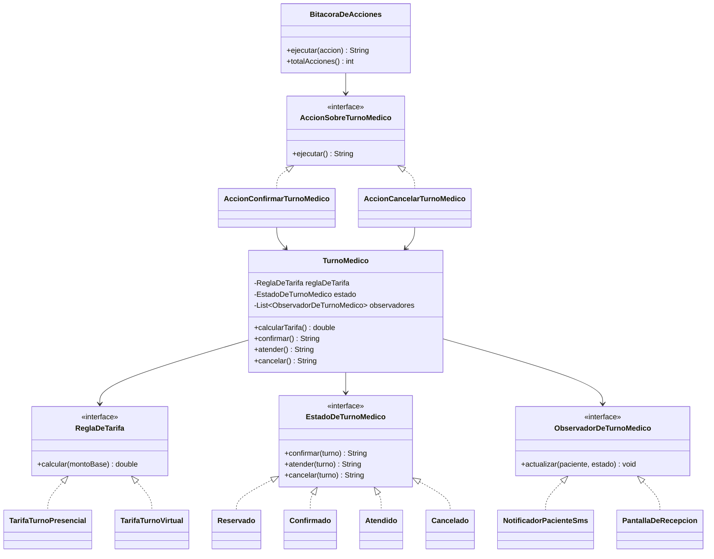

# 🔑 Solución del Taller 01 — Sistema de Gestión de Turnos de MediSalud

> Material docente, no enlazar desde la audiencia estudiante.

## 🗺️ Diagrama de clases



## 🌳 Árbol de archivos

```text
GestionDeTurnos/
└── com/medisalud/
    ├── ReglaDeTarifa.java
    ├── TarifaTurnoPresencial.java
    ├── TarifaTurnoVirtual.java
    ├── EstadoDeTurnoMedico.java
    ├── Reservado.java
    ├── Confirmado.java
    ├── Atendido.java
    ├── Cancelado.java
    ├── ObservadorDeTurnoMedico.java
    ├── NotificadorPacienteSms.java
    ├── PantallaDeRecepcion.java
    ├── AccionSobreTurnoMedico.java
    ├── AccionConfirmarTurnoMedico.java
    ├── AccionCancelarTurnoMedico.java
    ├── BitacoraDeAcciones.java
    ├── TurnoMedico.java
    └── Demo.java
```

## 💻 Código completo

## 💻 Archivo: ReglaDeTarifa.java

```java
package com.medisalud;

public interface ReglaDeTarifa {
    double calcular(double montoBase);
}
```

## 💻 Archivo: TarifaTurnoPresencial.java

```java
package com.medisalud;

public class TarifaTurnoPresencial implements ReglaDeTarifa {
    public double calcular(double montoBase) {
        return montoBase;
    }
}
```

## 💻 Archivo: TarifaTurnoVirtual.java

```java
package com.medisalud;

public class TarifaTurnoVirtual implements ReglaDeTarifa {
    public double calcular(double montoBase) {
        return montoBase * 0.7;
    }
}
```

## 💻 Archivo: EstadoDeTurnoMedico.java

```java
package com.medisalud;

public interface EstadoDeTurnoMedico {
    String confirmar(TurnoMedico turno);
    String atender(TurnoMedico turno);
    String cancelar(TurnoMedico turno);
    String nombre();
}
```

## 💻 Archivo: Reservado.java

```java
package com.medisalud;

public class Reservado implements EstadoDeTurnoMedico {
    public String confirmar(TurnoMedico turno) {
        turno.setEstado(new Confirmado());
        return "Turno confirmado";
    }

    public String atender(TurnoMedico turno) {
        return "No se puede atender: el turno no esta confirmado";
    }

    public String cancelar(TurnoMedico turno) {
        turno.setEstado(new Cancelado());
        return "Turno cancelado";
    }

    public String nombre() {
        return "RESERVADO";
    }
}
```

## 💻 Archivo: Confirmado.java

```java
package com.medisalud;

public class Confirmado implements EstadoDeTurnoMedico {
    public String confirmar(TurnoMedico turno) {
        return "No se puede confirmar: el turno ya esta confirmado";
    }

    public String atender(TurnoMedico turno) {
        turno.setEstado(new Atendido());
        return "Turno atendido";
    }

    public String cancelar(TurnoMedico turno) {
        turno.setEstado(new Cancelado());
        return "Turno cancelado";
    }

    public String nombre() {
        return "CONFIRMADO";
    }
}
```

## 💻 Archivo: Atendido.java

```java
package com.medisalud;

public class Atendido implements EstadoDeTurnoMedico {
    public String confirmar(TurnoMedico turno) {
        return "No se puede confirmar: el turno ya fue atendido";
    }

    public String atender(TurnoMedico turno) {
        return "No se puede atender: el turno ya fue atendido";
    }

    public String cancelar(TurnoMedico turno) {
        return "No se puede cancelar: el turno ya fue atendido";
    }

    public String nombre() {
        return "ATENDIDO";
    }
}
```

## 💻 Archivo: Cancelado.java

```java
package com.medisalud;

public class Cancelado implements EstadoDeTurnoMedico {
    public String confirmar(TurnoMedico turno) {
        return "No se puede confirmar: el turno esta cancelado";
    }

    public String atender(TurnoMedico turno) {
        return "No se puede atender: el turno esta cancelado";
    }

    public String cancelar(TurnoMedico turno) {
        return "No se puede cancelar: el turno ya esta cancelado";
    }

    public String nombre() {
        return "CANCELADO";
    }
}
```

## 💻 Archivo: ObservadorDeTurnoMedico.java

```java
package com.medisalud;

public interface ObservadorDeTurnoMedico {
    void actualizar(String paciente, String estado);
}
```

## 💻 Archivo: NotificadorPacienteSms.java

```java
package com.medisalud;

public class NotificadorPacienteSms implements ObservadorDeTurnoMedico {
    public void actualizar(String paciente, String estado) {
        System.out.println("SMS a " + paciente + ": tu turno paso a " + estado);
    }
}
```

## 💻 Archivo: PantallaDeRecepcion.java

```java
package com.medisalud;

public class PantallaDeRecepcion implements ObservadorDeTurnoMedico {
    public void actualizar(String paciente, String estado) {
        System.out.println("Recepcion: turno de " + paciente + " ahora " + estado);
    }
}
```

## 💻 Archivo: AccionSobreTurnoMedico.java

```java
package com.medisalud;

public interface AccionSobreTurnoMedico {
    String ejecutar();
}
```

## 💻 Archivo: AccionConfirmarTurnoMedico.java

```java
package com.medisalud;

public class AccionConfirmarTurnoMedico implements AccionSobreTurnoMedico {
    private TurnoMedico turno;

    public AccionConfirmarTurnoMedico(TurnoMedico turno) {
        this.turno = turno;
    }

    public String ejecutar() {
        return turno.confirmar();
    }
}
```

## 💻 Archivo: AccionCancelarTurnoMedico.java

```java
package com.medisalud;

public class AccionCancelarTurnoMedico implements AccionSobreTurnoMedico {
    private TurnoMedico turno;

    public AccionCancelarTurnoMedico(TurnoMedico turno) {
        this.turno = turno;
    }

    public String ejecutar() {
        return turno.cancelar();
    }
}
```

## 💻 Archivo: BitacoraDeAcciones.java

```java
package com.medisalud;

import java.util.ArrayList;
import java.util.List;

public class BitacoraDeAcciones {
    private List<String> registro = new ArrayList<>();

    public String ejecutar(AccionSobreTurnoMedico accion) {
        String resultado = accion.ejecutar();
        registro.add(resultado);
        return resultado;
    }

    public int totalAcciones() {
        return registro.size();
    }
}
```

## 💻 Archivo: TurnoMedico.java

```java
package com.medisalud;

import java.util.ArrayList;
import java.util.List;

public class TurnoMedico {
    private String paciente;
    private ReglaDeTarifa reglaDeTarifa;
    private double montoBase;
    private EstadoDeTurnoMedico estado = new Reservado();
    private List<ObservadorDeTurnoMedico> observadores = new ArrayList<>();

    public TurnoMedico(String paciente, ReglaDeTarifa reglaDeTarifa, double montoBase) {
        this.paciente = paciente;
        this.reglaDeTarifa = reglaDeTarifa;
        this.montoBase = montoBase;
    }

    public void agregarObservador(ObservadorDeTurnoMedico observador) {
        observadores.add(observador);
    }

    public double calcularTarifa() {
        return reglaDeTarifa.calcular(montoBase);
    }

    public String confirmar() {
        String resultado = estado.confirmar(this);
        notificarObservadores();
        return resultado;
    }

    public String atender() {
        String resultado = estado.atender(this);
        notificarObservadores();
        return resultado;
    }

    public String cancelar() {
        String resultado = estado.cancelar(this);
        notificarObservadores();
        return resultado;
    }

    private void notificarObservadores() {
        for (ObservadorDeTurnoMedico observador : observadores) {
            observador.actualizar(paciente, estado.nombre());
        }
    }

    public void setEstado(EstadoDeTurnoMedico estado) {
        this.estado = estado;
    }

    public String getEstado() {
        return estado.nombre();
    }

    public String getPaciente() {
        return paciente;
    }
}
```

## 💻 Archivo: Demo.java

```java
package com.medisalud;

public class Demo {
    public static void main(String[] args) {
        TurnoMedico turnoPresencial = new TurnoMedico("Ana Torres", new TarifaTurnoPresencial(), 5000.0);
        TurnoMedico turnoVirtual = new TurnoMedico("Carlos Ruiz", new TarifaTurnoVirtual(), 5000.0);

        turnoPresencial.agregarObservador(new NotificadorPacienteSms());
        turnoPresencial.agregarObservador(new PantallaDeRecepcion());
        turnoVirtual.agregarObservador(new PantallaDeRecepcion());

        BitacoraDeAcciones bitacora = new BitacoraDeAcciones();

        System.out.println(bitacora.ejecutar(new AccionConfirmarTurnoMedico(turnoPresencial)));
        System.out.println("tarifa presencial=" + turnoPresencial.calcularTarifa());

        System.out.println(bitacora.ejecutar(new AccionConfirmarTurnoMedico(turnoVirtual)));
        System.out.println("tarifa virtual=" + turnoVirtual.calcularTarifa());

        System.out.println(bitacora.ejecutar(new AccionCancelarTurnoMedico(turnoVirtual)));

        System.out.println("estado turno presencial=" + turnoPresencial.getEstado());
        System.out.println("estado turno virtual=" + turnoVirtual.getEstado());
        System.out.println("total de acciones registradas=" + bitacora.totalAcciones());
    }
}
```

## ✅ Salida real

```text
SMS a Ana Torres: tu turno paso a CONFIRMADO
Recepcion: turno de Ana Torres ahora CONFIRMADO
Turno confirmado
tarifa presencial=5000.0
Recepcion: turno de Carlos Ruiz ahora CONFIRMADO
Turno confirmado
tarifa virtual=3500.0
Recepcion: turno de Carlos Ruiz ahora CANCELADO
Turno cancelado
estado turno presencial=CONFIRMADO
estado turno virtual=CANCELADO
total de acciones registradas=3
```

## ⚠️ Errores comunes observados

- **Dejar, además del objeto `EstadoDeTurnoMedico`, un campo `String estado` paralelo en
  `TurnoMedico`**: aunque el resto del diseño esté bien, esa duplicación reintroduce el riesgo de que
  ambas fuentes de verdad queden desincronizadas — el único lugar donde debe vivir el estado actual es
  la referencia al objeto de estado.
- **Hacer que `TurnoMedico.calcularTarifa()` reciba la modalidad como `String` y arme la `ReglaDeTarifa`
  con un condicional interno**: eso reintroduce exactamente la violación de Strategy que el taller pide
  evitar — la regla de tarifa debe recibirse ya resuelta, por composición, no elegirse con un
  condicional dentro de `TurnoMedico`.
- **Que las clases de acción (`AccionConfirmarTurnoMedico`) llamen directamente a los métodos de
  `TurnoMedico` sin pasar por `BitacoraDeAcciones.ejecutar(...)`**: si el código cliente sigue llamando
  a las acciones sin pasar por la bitácora, el registro de acciones queda incompleto — el punto entero
  de Command en este taller es que **todas** las acciones se ejecuten a través del registro central.
