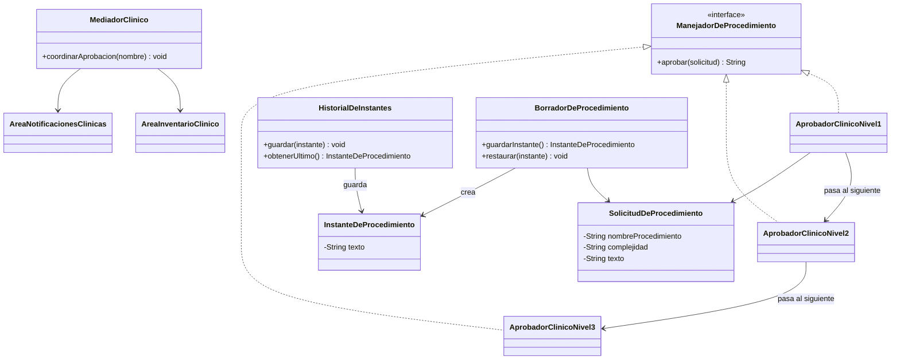

# 🔑 Solución del Taller 01 — Sistema de Gestión de Solicitudes Clínicas de MediSalud

> Material docente, no enlazar desde la audiencia estudiante.

## 🗺️ Diagrama de clases



## 🌳 Árbol de archivos

```text
GestionDeSolicitudesClinicas/
└── com/medisalud/
    ├── SolicitudDeProcedimiento.java
    ├── ManejadorDeProcedimiento.java
    ├── AprobadorClinicoNivel1.java
    ├── AprobadorClinicoNivel2.java
    ├── AprobadorClinicoNivel3.java
    ├── AreaInventarioClinico.java
    ├── AreaNotificacionesClinicas.java
    ├── MediadorClinico.java
    ├── InstanteDeProcedimiento.java
    ├── HistorialDeInstantes.java
    ├── BorradorDeProcedimiento.java
    └── Demo.java
```

## 💻 Código completo

## 💻 Archivo: SolicitudDeProcedimiento.java

```java
package com.medisalud;

public class SolicitudDeProcedimiento {
    private String nombreProcedimiento;
    private String complejidad;
    private String texto;

    public SolicitudDeProcedimiento(String nombreProcedimiento, String complejidad, String texto) {
        this.nombreProcedimiento = nombreProcedimiento;
        this.complejidad = complejidad;
        this.texto = texto;
    }

    public String getNombreProcedimiento() {
        return nombreProcedimiento;
    }

    public String getComplejidad() {
        return complejidad;
    }

    public String getTexto() {
        return texto;
    }

    public void setTexto(String texto) {
        this.texto = texto;
    }
}
```

## 💻 Archivo: ManejadorDeProcedimiento.java

```java
package com.medisalud;

public interface ManejadorDeProcedimiento {
    String aprobar(SolicitudDeProcedimiento solicitud);
}
```

## 💻 Archivo: AprobadorClinicoNivel1.java

```java
package com.medisalud;

public class AprobadorClinicoNivel1 implements ManejadorDeProcedimiento {
    private ManejadorDeProcedimiento siguiente;

    public AprobadorClinicoNivel1(ManejadorDeProcedimiento siguiente) {
        this.siguiente = siguiente;
    }

    public String aprobar(SolicitudDeProcedimiento solicitud) {
        if (solicitud.getComplejidad().equals("BASICA")) {
            return "Aprobado nivel 1: " + solicitud.getNombreProcedimiento();
        }
        return siguiente.aprobar(solicitud);
    }
}
```

## 💻 Archivo: AprobadorClinicoNivel2.java

```java
package com.medisalud;

public class AprobadorClinicoNivel2 implements ManejadorDeProcedimiento {
    private ManejadorDeProcedimiento siguiente;

    public AprobadorClinicoNivel2(ManejadorDeProcedimiento siguiente) {
        this.siguiente = siguiente;
    }

    public String aprobar(SolicitudDeProcedimiento solicitud) {
        if (solicitud.getComplejidad().equals("INTERMEDIA")) {
            return "Aprobado nivel 2: " + solicitud.getNombreProcedimiento();
        }
        return siguiente.aprobar(solicitud);
    }
}
```

## 💻 Archivo: AprobadorClinicoNivel3.java

```java
package com.medisalud;

public class AprobadorClinicoNivel3 implements ManejadorDeProcedimiento {
    public String aprobar(SolicitudDeProcedimiento solicitud) {
        if (solicitud.getComplejidad().equals("AVANZADA")) {
            return "Aprobado nivel 3: " + solicitud.getNombreProcedimiento();
        }
        throw new IllegalArgumentException("Ningun nivel pudo aprobar: " + solicitud.getComplejidad());
    }
}
```

## 💻 Archivo: AreaInventarioClinico.java

```java
package com.medisalud;

public class AreaInventarioClinico {
    public void reservarInsumos(String nombreProcedimiento) {
        System.out.println("Inventario clinico: reservando insumos para " + nombreProcedimiento);
    }
}
```

## 💻 Archivo: AreaNotificacionesClinicas.java

```java
package com.medisalud;

public class AreaNotificacionesClinicas {
    public void notificarAprobacion(String nombreProcedimiento) {
        System.out.println("Notificaciones: avisando aprobacion de " + nombreProcedimiento);
    }
}
```

## 💻 Archivo: MediadorClinico.java

```java
package com.medisalud;

public class MediadorClinico {
    private AreaInventarioClinico areaInventario = new AreaInventarioClinico();
    private AreaNotificacionesClinicas areaNotificaciones = new AreaNotificacionesClinicas();

    public void coordinarAprobacion(String nombreProcedimiento) {
        areaInventario.reservarInsumos(nombreProcedimiento);
        areaNotificaciones.notificarAprobacion(nombreProcedimiento);
    }
}
```

## 💻 Archivo: InstanteDeProcedimiento.java

```java
package com.medisalud;

public class InstanteDeProcedimiento {
    private String texto;

    InstanteDeProcedimiento(String texto) {
        this.texto = texto;
    }

    String getTexto() {
        return texto;
    }
}
```

## 💻 Archivo: HistorialDeInstantes.java

```java
package com.medisalud;

import java.util.ArrayList;
import java.util.List;

public class HistorialDeInstantes {
    private List<InstanteDeProcedimiento> instantes = new ArrayList<>();

    public void guardar(InstanteDeProcedimiento instante) {
        instantes.add(instante);
    }

    public InstanteDeProcedimiento obtenerUltimo() {
        return instantes.remove(instantes.size() - 1);
    }
}
```

## 💻 Archivo: BorradorDeProcedimiento.java

```java
package com.medisalud;

public class BorradorDeProcedimiento {
    private SolicitudDeProcedimiento solicitud;

    public BorradorDeProcedimiento(SolicitudDeProcedimiento solicitud) {
        this.solicitud = solicitud;
    }

    public void escribir(String texto) {
        solicitud.setTexto(texto);
    }

    public String getTexto() {
        return solicitud.getTexto();
    }

    public InstanteDeProcedimiento guardarInstante() {
        return new InstanteDeProcedimiento(solicitud.getTexto());
    }

    public void restaurar(InstanteDeProcedimiento instante) {
        solicitud.setTexto(instante.getTexto());
    }
}
```

## 💻 Archivo: Demo.java

```java
package com.medisalud;

public class Demo {
    public static void main(String[] args) {
        SolicitudDeProcedimiento solicitud1 = new SolicitudDeProcedimiento("Curacion simple", "BASICA", "Version inicial");
        SolicitudDeProcedimiento solicitud2 = new SolicitudDeProcedimiento("Cirugia compleja", "AVANZADA", "Version inicial");

        BorradorDeProcedimiento borrador1 = new BorradorDeProcedimiento(solicitud1);
        HistorialDeInstantes historial = new HistorialDeInstantes();

        borrador1.escribir("Curacion de herida menor, sin complicaciones");
        historial.guardar(borrador1.guardarInstante());
        System.out.println(borrador1.getTexto());

        borrador1.escribir("Texto editado por error");
        System.out.println(borrador1.getTexto());

        borrador1.restaurar(historial.obtenerUltimo());
        System.out.println(borrador1.getTexto());

        ManejadorDeProcedimiento nivel3 = new AprobadorClinicoNivel3();
        ManejadorDeProcedimiento nivel2 = new AprobadorClinicoNivel2(nivel3);
        ManejadorDeProcedimiento nivel1 = new AprobadorClinicoNivel1(nivel2);

        MediadorClinico mediador = new MediadorClinico();

        String resultado1 = nivel1.aprobar(solicitud1);
        System.out.println(resultado1);
        mediador.coordinarAprobacion(solicitud1.getNombreProcedimiento());

        String resultado2 = nivel1.aprobar(solicitud2);
        System.out.println(resultado2);
        mediador.coordinarAprobacion(solicitud2.getNombreProcedimiento());
    }
}
```

## ✅ Salida real

```text
Curacion de herida menor, sin complicaciones
Texto editado por error
Curacion de herida menor, sin complicaciones
Aprobado nivel 1: Curacion simple
Inventario clinico: reservando insumos para Curacion simple
Notificaciones: avisando aprobacion de Curacion simple
Aprobado nivel 3: Cirugia compleja
Inventario clinico: reservando insumos para Cirugia compleja
Notificaciones: avisando aprobacion de Cirugia compleja
```

## ⚠️ Errores comunes observados

- **Hacer que `BorradorDeProcedimiento` guarde su propia copia del texto, en vez de leer y escribir
  directamente el campo de `SolicitudDeProcedimiento`**: si el borrador y la solicitud terminan con dos
  copias del texto que pueden desincronizarse, la aprobación posterior podría usar un texto distinto
  del que el borrador muestra — el borrador debe operar siempre sobre el mismo objeto `SolicitudDeProcedimiento` que luego se aprueba.
- **Declarar `InstanteDeProcedimiento` con un constructor o un método de lectura públicos**: eso
  permite que cualquier clase (no solo `BorradorDeProcedimiento`) cree o lea instantes directamente,
  rompiendo el encapsulamiento que Memento busca proteger. Deben quedar con visibilidad de paquete.
- **Que `AreaInventarioClinico` y `AreaNotificacionesClinicas` reciban una referencia directa entre
  sí** (por ejemplo, para que inventario avise a notificaciones cuando termina), en vez de que toda su
  coordinación pase por `MediadorClinico`: eso reintroduce el acoplamiento directo entre áreas que el
  taller pide evitar.
