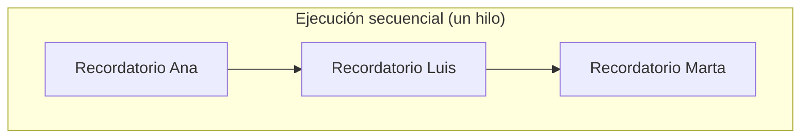
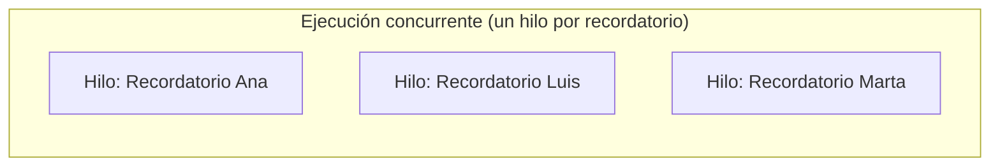

# 💡 Ejemplo 01 — Qué es la concurrencia en Java

## 🌍 Contexto

MediSalud envía un recordatorio de cita a cada paciente del día. El código actual envía los
recordatorios uno después de otro, desde el mismo hilo que ejecuta el resto del programa.

**Qué busca demostrar este ejemplo**: la diferencia entre ejecutar tareas independientes de forma
secuencial (una espera a la otra) y de forma concurrente (cada una en su propio hilo), incluido que el
orden de finalización entre hilos que corren sin sincronizarse entre sí no está garantizado.

## 🗺️ Diagrama





*Arriba, la versión "antes": un solo hilo ejecuta los tres recordatorios, uno detrás de otro, siempre en
el mismo orden. Abajo, la versión "después": tres hilos corren al mismo tiempo, y nada garantiza en qué
orden terminan.*

## 🌳 Árbol de archivos — antes

```text
concurrencia-antes/
└── com/medisalud/
    └── Demo.java
```

## 💻 Archivo: Demo.java

```java
package com.medisalud;

public class Demo {

    public static void main(String[] args) throws InterruptedException {
        String[] pacientes = {"Ana Torres", "Luis Rios", "Marta Diaz"};

        long inicio = System.currentTimeMillis();
        for (String paciente : pacientes) {
            enviarRecordatorio(paciente);
        }
        long fin = System.currentTimeMillis();

        System.out.println("Tiempo total secuencial: " + (fin - inicio) + " ms");
    }

    private static void enviarRecordatorio(String paciente) throws InterruptedException {
        Thread.sleep(150);
        System.out.println("Recordatorio enviado a " + paciente);
    }
}
```

## ✅ Resultado esperado — antes

```text
Recordatorio enviado a Ana Torres
Recordatorio enviado a Luis Rios
Recordatorio enviado a Marta Diaz
Tiempo total secuencial: 461 ms
```

## 🌳 Árbol de archivos — después

```text
concurrencia-despues/
└── com/medisalud/
    └── Demo.java                       (cambió)
```

## 💻 Archivo: Demo.java — cambió

```java
package com.medisalud;

import java.util.concurrent.ThreadLocalRandom;

public class Demo {

    public static void main(String[] args) throws InterruptedException {
        String[] pacientes = {"Ana Torres", "Luis Rios", "Marta Diaz"};

        long inicio = System.currentTimeMillis();
        for (String paciente : pacientes) {
            Thread hilo = new Thread(() -> enviarRecordatorio(paciente));
            hilo.start();
        }
        // Nota didactica: no se usa join() a proposito en este ejemplo introductorio,
        // para poder observar que el orden de finalizacion entre hilos no esta garantizado.
        Thread.sleep(700);
        long fin = System.currentTimeMillis();

        System.out.println("Tiempo total con hilos (aprox.): " + (fin - inicio) + " ms");
    }

    private static void enviarRecordatorio(String paciente) {
        int duracionMs = ThreadLocalRandom.current().nextInt(80, 250);
        try {
            Thread.sleep(duracionMs);
        } catch (InterruptedException e) {
            Thread.currentThread().interrupt();
            return;
        }
        System.out.println("Recordatorio enviado a " + paciente);
    }
}
```

## ✅ Resultado esperado — después

Esta versión es deliberadamente no determinista: dos ejecuciones reales, capturadas una detrás de la
otra sin cambiar ni una línea de código, dan un orden de finalización distinto.

**Corrida A:**

```text
Recordatorio enviado a Ana Torres
Recordatorio enviado a Marta Diaz
Recordatorio enviado a Luis Rios
Tiempo total con hilos (aprox.): 707 ms
```

**Corrida B:**

```text
Recordatorio enviado a Luis Rios
Recordatorio enviado a Ana Torres
Recordatorio enviado a Marta Diaz
Tiempo total con hilos (aprox.): 706 ms
```

## 🔍 Comparación: la prueba concreta

En la versión "antes", los tres recordatorios terminan siempre en el mismo orden (Ana, Luis, Marta),
porque un único hilo los ejecuta uno después del otro. En la versión "después", cada recordatorio corre
en su propio hilo: la Corrida A termina en el orden Ana/Marta/Luis, y la Corrida B en el orden
Luis/Ana/Marta, sin haber cambiado ni una línea de código entre una corrida y la otra. Que el orden varíe
es el comportamiento esperado y correcto de la concurrencia sin sincronizar, no un error: ningún hilo
sabe nada sobre cuándo van a terminar los demás.

## ❓ Preguntas de repaso

**1. [Selección]** En la versión "antes", ¿qué garantiza el orden en que se envían los tres
recordatorios?

- A. Que cada recordatorio corre en su propio hilo.
- B. Que un único hilo ejecuta los tres, uno después del otro, en el orden en que se llaman.
- C. El sistema operativo, al azar.
- D. Nada lo garantiza; el orden podría variar igual que en la versión "después".

<details>
<summary>🔑 Ver respuesta</summary>

**Respuesta correcta: B.** En la versión secuencial, un único hilo llama a `enviarRecordatorio` tres
veces seguidas: cada llamada termina antes de que empiece la siguiente, así que el orden es siempre el
mismo.

</details>

**2. [Selección múltiple]** Sobre la versión "después" (con hilos), ¿cuáles afirmaciones son verdaderas?

- A. El orden de finalización entre los tres hilos no está garantizado.
- B. Las Corridas A y B demuestran que el mismo código puede terminar en órdenes distintos.
- C. Para que el orden fuera siempre el mismo, haría falta alguna forma de sincronización adicional.
- D. El código de la versión "después" tiene un error, porque el orden debería ser siempre igual.

<details>
<summary>🔑 Ver respuesta</summary>

**Respuestas correctas: A, B y C.** D es falsa: que el orden varíe entre ejecuciones sin sincronización
es el comportamiento esperado, no un defecto del código.

</details>

**3. [Abierta]** Un compañero dice: "si el orden entre hilos no está garantizado, la concurrencia es
demasiado impredecible para usarla nunca". ¿Estás de acuerdo? Justifica tu respuesta.

<details>
<summary>🔑 Ver respuesta</summary>

No necesariamente. Que el **orden de finalización** no esté garantizado no significa que el programa sea
impredecible en todo sentido: cuando el resultado final no depende de en qué orden terminan las tareas
(como enviar recordatorios independientes entre sí), la concurrencia es segura y útil porque reduce el
tiempo total. El problema aparece solo cuando el resultado sí depende del orden o de datos compartidos
entre hilos — casos que este módulo evita por diseño, y que un módulo posterior de concurrencia cubre con
herramientas de sincronización.

</details>
