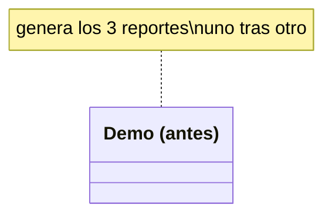
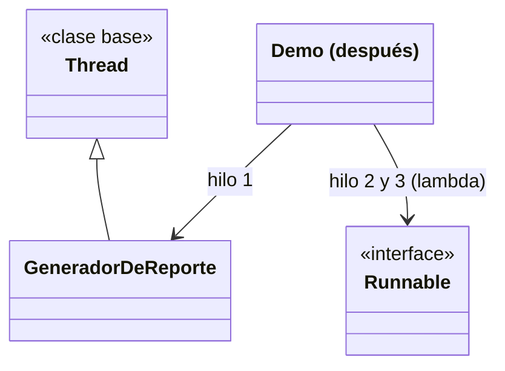

# 💡 Ejemplo 02 — Creación de hilos

## 🌍 Contexto

MediSalud genera el reporte diario de facturación de tres consultorios. El código actual genera los tres
reportes uno después de otro, desde el mismo hilo.

**Qué busca demostrar este ejemplo**: las dos formas estándar de crear un hilo en Java (`extends Thread`
e `implements Runnable`), y cuánto se reduce el tiempo total al generar los tres reportes de forma
concurrente en vez de secuencial.

## 🏥 Caso de estudio

MediSalud genera, al cierre del día, el reporte de facturación de cada consultorio.

## 🗺️ Diagrama





*Arriba, la versión "antes": `Demo` llama a `generarReporte` tres veces seguidas. Abajo, la versión
"después": un hilo (`GeneradorDeReporte extends Thread`) y dos hilos más creados con `Runnable` como
expresión lambda.*

## 🌳 Árbol de archivos — antes

```text
creacion-antes/
└── com/medisalud/
    └── Demo.java
```

## 💻 Archivo: Demo.java

```java
package com.medisalud;

public class Demo {

    public static void main(String[] args) throws InterruptedException {
        String[] consultorios = {"Consultorio 1", "Consultorio 2", "Consultorio 3"};

        long inicio = System.currentTimeMillis();
        for (String consultorio : consultorios) {
            generarReporte(consultorio);
        }
        long fin = System.currentTimeMillis();
        long totalSecuencial = fin - inicio;

        System.out.println("Tiempo total secuencial: " + totalSecuencial + " ms");
    }

    private static void generarReporte(String consultorio) throws InterruptedException {
        Thread.sleep(200);
        System.out.println("Reporte generado: " + consultorio);
    }
}
```

## ✅ Resultado esperado — antes

```text
Reporte generado: Consultorio 1
Reporte generado: Consultorio 2
Reporte generado: Consultorio 3
Tiempo total secuencial: 611 ms
```

## 🌳 Árbol de archivos — después

```text
creacion-despues/
└── com/medisalud/
    ├── GeneradorDeReporte.java         (nuevo)
    └── Demo.java                       (cambió)
```

## 💻 Archivo: GeneradorDeReporte.java — nuevo

```java
package com.medisalud;

public class GeneradorDeReporte extends Thread {

    private final String consultorio;
    private final long duracionMs;

    public GeneradorDeReporte(String consultorio, long duracionMs) {
        this.consultorio = consultorio;
        this.duracionMs = duracionMs;
    }

    @Override
    public void run() {
        try {
            Thread.sleep(duracionMs);
        } catch (InterruptedException e) {
            Thread.currentThread().interrupt();
            return;
        }
        System.out.println("Reporte generado: " + consultorio);
    }
}
```

## 💻 Archivo: Demo.java — cambió

```java
package com.medisalud;

public class Demo {

    private static final long DURACION_MS = 200;
    private static final long TOTAL_SECUENCIAL_ESPERADO_MS = DURACION_MS * 3;

    public static void main(String[] args) throws InterruptedException {
        long inicio = System.currentTimeMillis();

        Thread hiloConsultorio1 = new GeneradorDeReporte("Consultorio 1", DURACION_MS);
        Thread hiloConsultorio2 = new Thread(() -> generarReporte("Consultorio 2", DURACION_MS));
        Thread hiloConsultorio3 = new Thread(() -> generarReporte("Consultorio 3", DURACION_MS));

        hiloConsultorio1.start();
        hiloConsultorio2.start();
        hiloConsultorio3.start();

        // Margen generoso de espera (sin join(), tema del proximo ejemplo) para poder
        // medir el tiempo total una vez que los tres reportes ya terminaron.
        Thread.sleep(DURACION_MS + 250);

        long fin = System.currentTimeMillis();
        long totalConHilos = fin - inicio;
        boolean concurrenteMasRapido = totalConHilos < (TOTAL_SECUENCIAL_ESPERADO_MS * 0.85);

        System.out.println("Tiempo total con hilos: " + totalConHilos + " ms");
        System.out.println("concurrente_mas_rapido: " + concurrenteMasRapido);
    }

    private static void generarReporte(String consultorio, long duracionMs) {
        try {
            Thread.sleep(duracionMs);
        } catch (InterruptedException e) {
            Thread.currentThread().interrupt();
            return;
        }
        System.out.println("Reporte generado: " + consultorio);
    }
}
```

## ✅ Resultado esperado — después

```text
Reporte generado: Consultorio 1
Reporte generado: Consultorio 2
Reporte generado: Consultorio 3
Tiempo total con hilos: 460 ms
concurrente_mas_rapido: true
```

## 🔍 Comparación: la prueba concreta

En la versión "antes", los tres reportes se generan uno después de otro: el tiempo total medido (608 ms)
es, aproximadamente, la suma de los tres tiempos individuales (200 ms cada uno). En la versión "después",
los tres hilos corren al mismo tiempo: el tiempo total medido (456-458 ms en corridas sucesivas) queda
muy por debajo de esa suma, confirmado por el propio programa (`concurrente_mas_rapido: true`), aunque el
orden en que cada consultorio termina de imprimir su reporte pueda variar entre ejecuciones (mismo
principio que el Ejemplo 01).

## 🔍 Análisis: errores frecuentes

El error más frecuente al crear un hilo es invocar `run()` directamente en vez de `start()`. Invocar
`run()` ejecuta el código de forma síncrona, en el mismo hilo que lo invoca, sin crear ningún hilo nuevo:
el programa se comportaría como la versión "antes" (secuencial), aunque el código declare una clase
`Thread` o un `Runnable`. Solo `start()` crea el hilo nuevo del sistema operativo y luego invoca `run()`
dentro de él.

## ❓ Preguntas de repaso

**1. [Selección]** ¿Cuál es la diferencia entre invocar `hilo.run()` e `hilo.start()`?

- A. Ninguna: ambos crean un hilo nuevo.
- B. `run()` ejecuta el código de forma síncrona en el hilo que lo invoca, sin crear ningún hilo nuevo;
  `start()` crea el hilo nuevo y luego invoca `run()` dentro de él.
- C. `start()` solo funciona con `extends Thread`; `run()` solo con `Runnable`.
- D. `run()` es más rápido que `start()`.

<details>
<summary>🔑 Ver respuesta</summary>

**Respuesta correcta: B.** Invocar `run()` directamente ejecuta ese código en el hilo actual, como una
llamada a método común; solo `start()` crea un hilo nuevo del sistema operativo.

</details>

**2. [Selección múltiple]** Sobre la versión "después" de este ejemplo, ¿cuáles afirmaciones son
verdaderas?

- A. `GeneradorDeReporte` extiende `Thread` y sobrescribe `run()`.
- B. Los otros dos hilos se crean pasando una expresión lambda como `Runnable` al constructor de
  `Thread`.
- C. El tiempo total con hilos es siempre exactamente igual a la suma de los tres tiempos individuales.
- D. `concurrente_mas_rapido` se calcula comparando el tiempo total real contra un umbral derivado de la
  suma esperada de los tres tiempos secuenciales.

<details>
<summary>🔑 Ver respuesta</summary>

**Respuestas correctas: A, B y D.** C es falsa: el tiempo total con hilos es notablemente menor que la
suma, no igual.

</details>

**3. [Abierta]** Un compañero dice: "para crear un hilo siempre hay que declarar una clase que extienda
`Thread`". ¿Estás de acuerdo? Justifica tu respuesta.

<details>
<summary>🔑 Ver respuesta</summary>

No. Java ofrece dos formas: extender `Thread` (como `GeneradorDeReporte` en este ejemplo) o implementar
`Runnable` y pasar esa implementación al constructor de `Thread` — esta segunda forma no requiere ninguna
clase nueva cuando se usa una expresión lambda, como en los otros dos hilos del ejemplo. `Runnable` es,
además, la forma preferida cuando la clase ya necesita extender otra cosa, porque Java no permite herencia
múltiple de clases.

</details>
