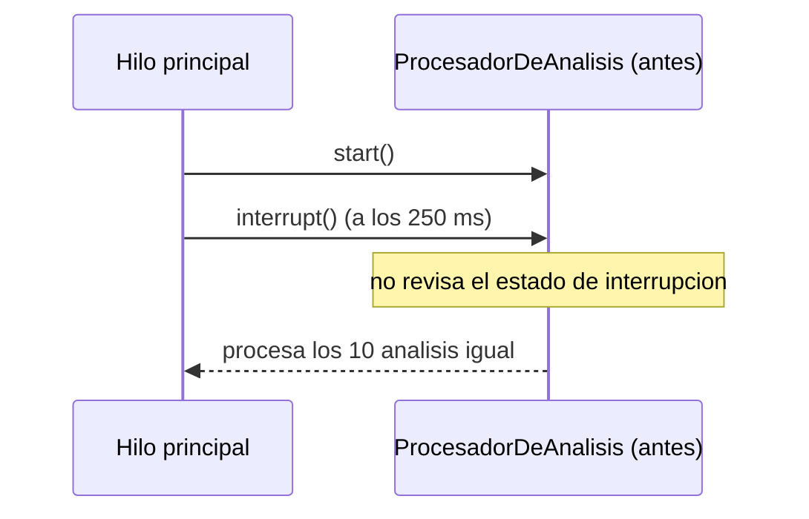
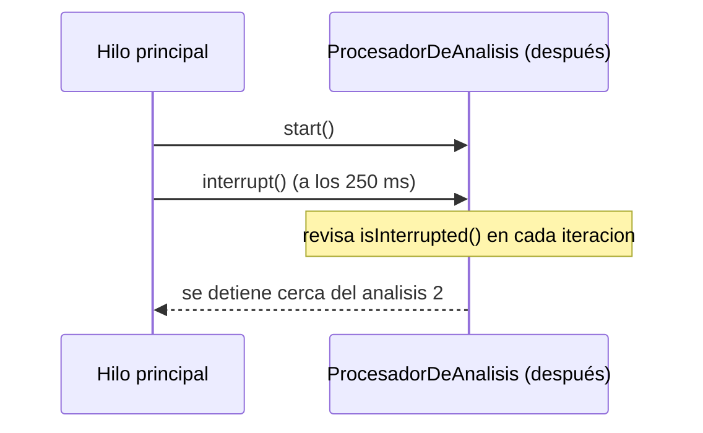

# 💡 Ejemplo 03 — Interrupción de hilos

## 🌍 Contexto

MediSalud procesa un lote de análisis de laboratorio pendientes en un hilo propio. El código actual no
tiene ninguna forma de detener ese procesamiento antes de que termine el lote completo, aunque ya no haga
falta seguir (por ejemplo, si el paciente cancela el estudio).

**Qué busca demostrar este ejemplo**: la diferencia entre un hilo que ignora cualquier pedido de
interrupción y uno que la revisa cooperativamente para detenerse antes de tiempo.

## 🏥 Caso de estudio

MediSalud procesa, en un hilo propio, un lote de análisis de laboratorio pendientes.

## 🗺️ Diagrama





## 🌳 Árbol de archivos — antes

```text
interrupcion-antes/
└── com/medisalud/
    ├── ProcesadorDeAnalisis.java
    └── Demo.java
```

## 💻 Archivo: ProcesadorDeAnalisis.java

```java
package com.medisalud;

public class ProcesadorDeAnalisis extends Thread {

    private static final int CANTIDAD_ANALISIS = 10;
    private static final long DURACION_POR_ANALISIS_MS = 100;

    private int cantidadProcesada = 0;

    @Override
    public void run() {
        for (int i = 1; i <= CANTIDAD_ANALISIS; i++) {
            try {
                Thread.sleep(DURACION_POR_ANALISIS_MS);
            } catch (InterruptedException e) {
                // No revisa ni reacciona al estado de interrupcion: sigue procesando igual.
            }
            cantidadProcesada++;
            System.out.println("Analisis " + i + " de " + CANTIDAD_ANALISIS + " procesado");
        }
    }

    public int getCantidadProcesada() {
        return cantidadProcesada;
    }
}
```

## 💻 Archivo: Demo.java

```java
package com.medisalud;

public class Demo {

    public static void main(String[] args) throws InterruptedException {
        ProcesadorDeAnalisis procesador = new ProcesadorDeAnalisis();
        procesador.start();

        Thread.sleep(250);
        procesador.interrupt();

        // Margen generoso de espera (sin join(), tema de un ejemplo posterior) para que
        // el procesador termine antes de leer su resultado final.
        Thread.sleep(1200);

        System.out.println("Cantidad procesada tras interrupcion: " + procesador.getCantidadProcesada());
    }
}
```

## ✅ Resultado esperado — antes

```text
Analisis 1 de 10 procesado
Analisis 2 de 10 procesado
Analisis 3 de 10 procesado
Analisis 4 de 10 procesado
Analisis 5 de 10 procesado
Analisis 6 de 10 procesado
Analisis 7 de 10 procesado
Analisis 8 de 10 procesado
Analisis 9 de 10 procesado
Analisis 10 de 10 procesado
Cantidad procesada tras interrupcion: 10
```

## 🌳 Árbol de archivos — después

```text
interrupcion-despues/
└── com/medisalud/
    ├── ProcesadorDeAnalisis.java       (cambió)
    └── Demo.java                       (sin cambios)
```

Sin cambios respecto de "antes": `Demo.java` — su código ya se mostró arriba y es exactamente el mismo,
byte a byte.

<details>
<summary>💻 Ver de nuevo el código sin cambios (Demo.java)</summary>

## 💻 Archivo: Demo.java

```java
package com.medisalud;

public class Demo {

    public static void main(String[] args) throws InterruptedException {
        ProcesadorDeAnalisis procesador = new ProcesadorDeAnalisis();
        procesador.start();

        Thread.sleep(250);
        procesador.interrupt();

        // Margen generoso de espera (sin join(), tema de un ejemplo posterior) para que
        // el procesador termine antes de leer su resultado final.
        Thread.sleep(1200);

        System.out.println("Cantidad procesada tras interrupcion: " + procesador.getCantidadProcesada());
    }
}
```

</details>

## 💻 Archivo: ProcesadorDeAnalisis.java — cambió

```java
package com.medisalud;

public class ProcesadorDeAnalisis extends Thread {

    private static final int CANTIDAD_ANALISIS = 10;
    private static final long DURACION_POR_ANALISIS_MS = 100;

    private int cantidadProcesada = 0;

    @Override
    public void run() {
        for (int i = 1; i <= CANTIDAD_ANALISIS; i++) {
            if (Thread.currentThread().isInterrupted()) {
                System.out.println("Interrupcion detectada: se detiene antes de completar el lote");
                return;
            }
            try {
                Thread.sleep(DURACION_POR_ANALISIS_MS);
            } catch (InterruptedException e) {
                System.out.println("Interrupcion detectada durante la espera: se detiene antes de completar el lote");
                Thread.currentThread().interrupt();
                return;
            }
            cantidadProcesada++;
            System.out.println("Analisis " + i + " de " + CANTIDAD_ANALISIS + " procesado");
        }
    }

    public int getCantidadProcesada() {
        return cantidadProcesada;
    }
}
```

## ✅ Resultado esperado — después

```text
Analisis 1 de 10 procesado
Analisis 2 de 10 procesado
Interrupcion detectada durante la espera: se detiene antes de completar el lote
Cantidad procesada tras interrupcion: 2
```

## 🔍 Comparación: la prueba concreta

Ambas versiones reciben el mismo pedido de interrupción a los 250 ms. En la versión "antes",
`ProcesadorDeAnalisis` nunca revisa su estado de interrupción: procesa los 10 análisis completos,
ignorando el pedido. En la versión "después", revisa `isInterrupted()` al inicio de cada iteración (y
maneja `InterruptedException` si el pedido llega mientras duerme): se detiene habiendo procesado
exactamente 2 análisis, sin completar el lote — una diferencia real y medible en la cantidad de análisis
procesados, no una excepción no manejada.

## 🔍 Análisis: errores frecuentes

El error más frecuente al interrumpir un hilo es creer que `interrupt()` lo detiene por la fuerza. En
realidad, `interrupt()` solo marca un indicador (o lanza `InterruptedException` si el hilo está
bloqueado en `sleep()`/`wait()`/`join()`): el hilo interrumpido sigue corriendo hasta que su propio código
decide terminar. Un hilo que nunca revisa ese indicador, como en la versión "antes", simplemente ignora
cualquier pedido de interrupción.

## ❓ Preguntas de repaso

**1. [Selección]** ¿Qué hace exactamente `hilo.interrupt()`?

- A. Detiene el hilo de inmediato, sin que el hilo pueda hacer nada al respecto.
- B. Marca un indicador cooperativo que el hilo debe revisar (`isInterrupted()`), o lanza
  `InterruptedException` si el hilo está bloqueado en una espera; el hilo sigue corriendo si no reacciona.
- C. Lanza una excepción que termina el programa completo.
- D. Solo funciona si el hilo fue creado con `Runnable`, no con `extends Thread`.

<details>
<summary>🔑 Ver respuesta</summary>

**Respuesta correcta: B.** `interrupt()` es cooperativo: no detiene el hilo por la fuerza, solo pide la
interrupción de una forma que el propio hilo debe revisar o que se manifiesta como
`InterruptedException` en una espera bloqueante.

</details>

**2. [Selección múltiple]** Sobre la versión "antes" de este ejemplo, ¿cuáles afirmaciones son
verdaderas?

- A. `ProcesadorDeAnalisis` procesa los 10 análisis completos, sin importar que se lo interrumpa.
- B. El hilo revisa `isInterrupted()` pero decide ignorarlo.
- C. Nada en el código de `run()` consulta el estado de interrupción del hilo.
- D. Este comportamiento es un error de diseño frecuente, no una limitación del lenguaje.

<details>
<summary>🔑 Ver respuesta</summary>

**Respuestas correctas: A, C y D.** B es falsa: el hilo no revisa el estado en absoluto, no es que lo
revise y lo ignore a propósito.

</details>

**3. [Abierta]** Un compañero dice: "si mi hilo hace un trabajo largo sin ningún `Thread.sleep()` de por
medio, `interrupt()` de todas formas lo va a detener automáticamente". ¿Estás de acuerdo? Justifica tu
respuesta.

<details>
<summary>🔑 Ver respuesta</summary>

No. `interrupt()` solo marca el indicador o lanza `InterruptedException` en una llamada bloqueante como
`sleep()`, `wait()` o `join()`. Si el hilo hace un trabajo largo sin ninguna de esas llamadas y sin
revisar `isInterrupted()` en ningún punto (como en la versión "antes" de este ejemplo), el pedido de
interrupción no tiene ningún efecto: el hilo sigue corriendo hasta que termina su trabajo por su cuenta.

</details>
