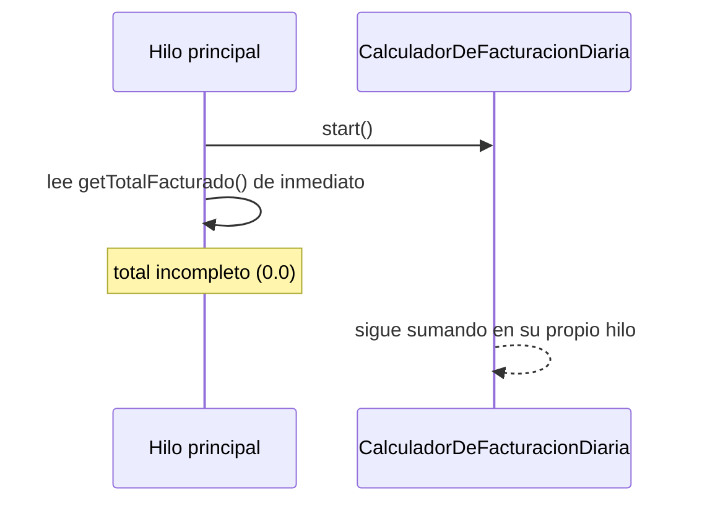
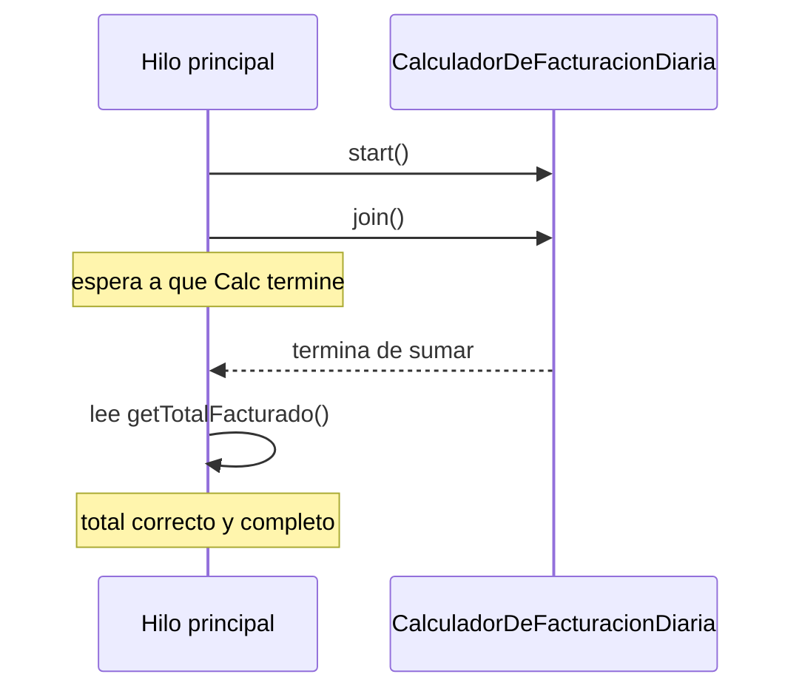

# 💡 Ejemplo 04 — Unir hilos

## 🌍 Contexto

MediSalud calcula, en un hilo propio, el total facturado del día. El código actual lee ese total desde
el hilo principal inmediatamente después de iniciar el cálculo, sin esperar a que termine.

**Qué busca demostrar este ejemplo**: la diferencia entre leer el resultado de un hilo sin esperarlo
(una condición de carrera) y sincronizar su finalización con `join()` antes de leerlo.

## 🏥 Caso de estudio

MediSalud calcula, al cierre del día, el total facturado sumando los montos de las consultas del día.

## 🗺️ Diagrama





## 🌳 Árbol de archivos — antes

```text
union-antes/
└── com/medisalud/
    ├── CalculadorDeFacturacionDiaria.java
    └── Demo.java
```

## 💻 Archivo: CalculadorDeFacturacionDiaria.java

```java
package com.medisalud;

public class CalculadorDeFacturacionDiaria extends Thread {

    private static final int CANTIDAD_MONTOS = 10;
    private static final long DURACION_POR_MONTO_MS = 30;

    private double totalFacturado = 0.0;

    @Override
    public void run() {
        for (int i = 1; i <= CANTIDAD_MONTOS; i++) {
            try {
                Thread.sleep(DURACION_POR_MONTO_MS);
            } catch (InterruptedException e) {
                Thread.currentThread().interrupt();
                return;
            }
            totalFacturado += 1000.0;
        }
    }

    public double getTotalFacturado() {
        return totalFacturado;
    }
}
```

## 💻 Archivo: Demo.java

```java
package com.medisalud;

public class Demo {

    public static void main(String[] args) {
        CalculadorDeFacturacionDiaria calculador = new CalculadorDeFacturacionDiaria();
        calculador.start();

        // Se lee el total inmediatamente, sin esperar a que el hilo termine.
        System.out.println("Total facturado (leido de inmediato): " + calculador.getTotalFacturado());
    }
}
```

## ✅ Resultado esperado — antes

```text
Total facturado (leido de inmediato): 0.0
```

## 🌳 Árbol de archivos — después

```text
union-despues/
└── com/medisalud/
    ├── CalculadorDeFacturacionDiaria.java   (sin cambios)
    └── Demo.java                             (cambió)
```

Sin cambios respecto de "antes": `CalculadorDeFacturacionDiaria.java` — su código ya se mostró arriba y
es exactamente el mismo, byte a byte.

<details>
<summary>💻 Ver de nuevo el código sin cambios (CalculadorDeFacturacionDiaria.java)</summary>

## 💻 Archivo: CalculadorDeFacturacionDiaria.java

```java
package com.medisalud;

public class CalculadorDeFacturacionDiaria extends Thread {

    private static final int CANTIDAD_MONTOS = 10;
    private static final long DURACION_POR_MONTO_MS = 30;

    private double totalFacturado = 0.0;

    @Override
    public void run() {
        for (int i = 1; i <= CANTIDAD_MONTOS; i++) {
            try {
                Thread.sleep(DURACION_POR_MONTO_MS);
            } catch (InterruptedException e) {
                Thread.currentThread().interrupt();
                return;
            }
            totalFacturado += 1000.0;
        }
    }

    public double getTotalFacturado() {
        return totalFacturado;
    }
}
```

</details>

## 💻 Archivo: Demo.java — cambió

```java
package com.medisalud;

public class Demo {

    public static void main(String[] args) throws InterruptedException {
        CalculadorDeFacturacionDiaria calculador = new CalculadorDeFacturacionDiaria();
        calculador.start();

        calculador.join();

        // Se lee el total solo despues de que el hilo termino, garantizado por join().
        System.out.println("Total facturado (tras join): " + calculador.getTotalFacturado());
    }
}
```

## ✅ Resultado esperado — después

```text
Total facturado (tras join): 10000.0
```

## 🔍 Comparación: la prueba concreta

En la versión "antes", el hilo principal lee `getTotalFacturado()` inmediatamente después de `start()`,
sin ninguna garantía de que el cálculo haya avanzado: la salida real es `0.0`, un resultado incompleto.
En la versión "después", el hilo principal invoca `join()` antes de leer el mismo campo: la salida real
es siempre `10000.0`, el total correcto y completo, de forma repetible en ejecuciones sucesivas — a
diferencia del Ejemplo 01, aquí la sincronización con `join()` sí elimina la variabilidad entre
ejecuciones, porque el hilo principal directamente espera a que el otro termine.

## 🔍 Análisis: errores frecuentes

El error más frecuente es asumir que, como `start()` "ya arrancó" el hilo, su resultado va a estar listo
para cuando el código siguiente lo necesite. Sin `join()`, no hay ninguna garantía de en qué punto de su
trabajo está el otro hilo en el momento en que se lee su resultado — puede no haber avanzado nada, haber
avanzado parcialmente, o (con menos probabilidad, en una tarea muy corta) haber terminado por completo.
`join()` es la forma explícita de eliminar esa incertidumbre.

## ❓ Preguntas de repaso

**1. [Selección]** ¿Qué hace `hiloSecundario.join()`, invocado desde el hilo principal?

- A. Detiene el hilo secundario de inmediato.
- B. Hace que el hilo principal espere a que el hilo secundario termine, antes de continuar su propia
  ejecución.
- C. Crea un hilo nuevo que combina el trabajo de ambos.
- D. Interrumpe el hilo secundario.

<details>
<summary>🔑 Ver respuesta</summary>

**Respuesta correcta: B.** `join()` bloquea al hilo que lo invoca hasta que el hilo sobre el que se
invoca termina.

</details>

**2. [Selección múltiple]** Sobre la versión "antes" de este ejemplo, ¿cuáles afirmaciones son
verdaderas?

- A. El hilo principal lee `getTotalFacturado()` sin ninguna garantía de que el cálculo haya terminado.
- B. La salida real observada es `0.0`, un resultado incompleto.
- C. El programa lanza una excepción al leer el campo antes de tiempo.
- D. Agregar `join()` antes de la lectura resolvería el problema.

<details>
<summary>🔑 Ver respuesta</summary>

**Respuestas correctas: A, B y D.** C es falsa: leer un campo antes de tiempo no lanza ninguna
excepción, solo da un valor incompleto o desactualizado — es precisamente lo que hace a este tipo de
error difícil de detectar.

</details>

**3. [Abierta]** Un compañero dice: "si mi hilo secundario es muy rápido, no hace falta `join()`: para
cuando el hilo principal llegue a leer el resultado, ya va a estar listo". ¿Estás de acuerdo? Justifica
tu respuesta.

<details>
<summary>🔑 Ver respuesta</summary>

No. Que un hilo sea "rápido" no da ninguna garantía formal sobre cuándo termina en relación con el hilo
principal: depende del sistema operativo, de la carga de la máquina en ese momento, y de otros factores
fuera del control del programa. Puede funcionar la mayoría de las veces en una máquina poco cargada y
fallar justo en producción, bajo más carga — es una condición de carrera, no un error que se manifieste
siempre igual. `join()` es la única forma de tener una garantía real, no una expectativa basada en la
velocidad observada.

</details>
