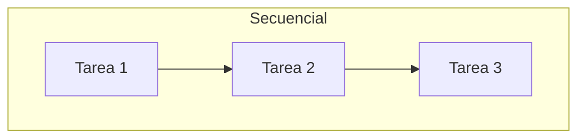
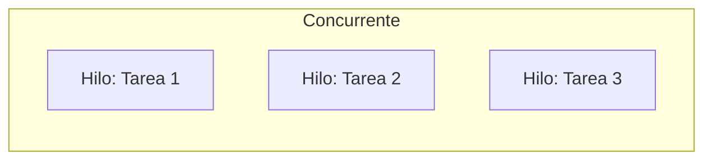
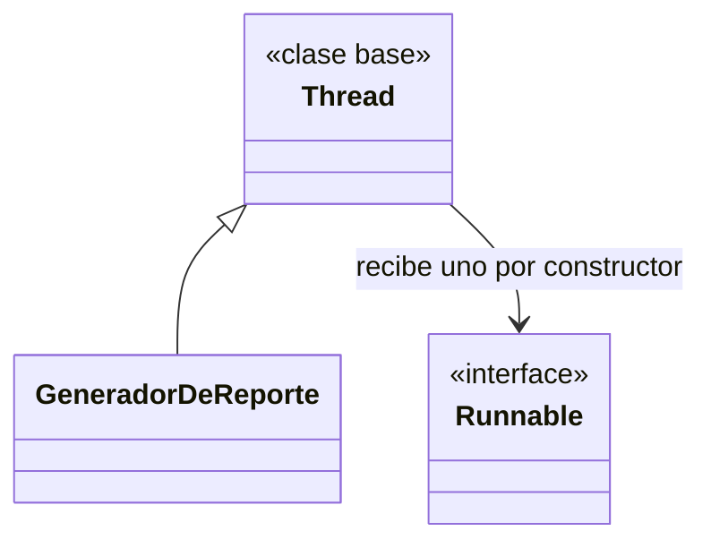
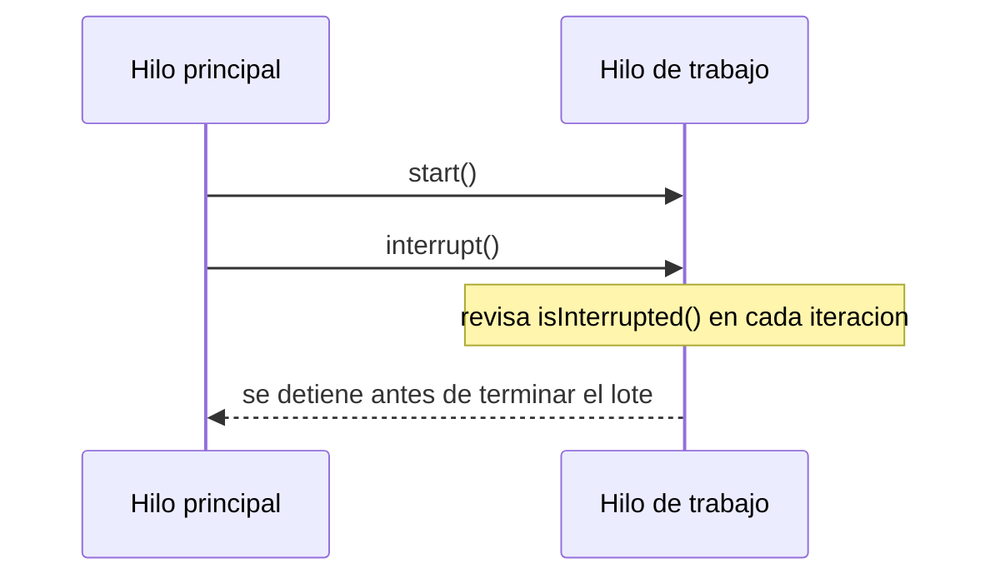
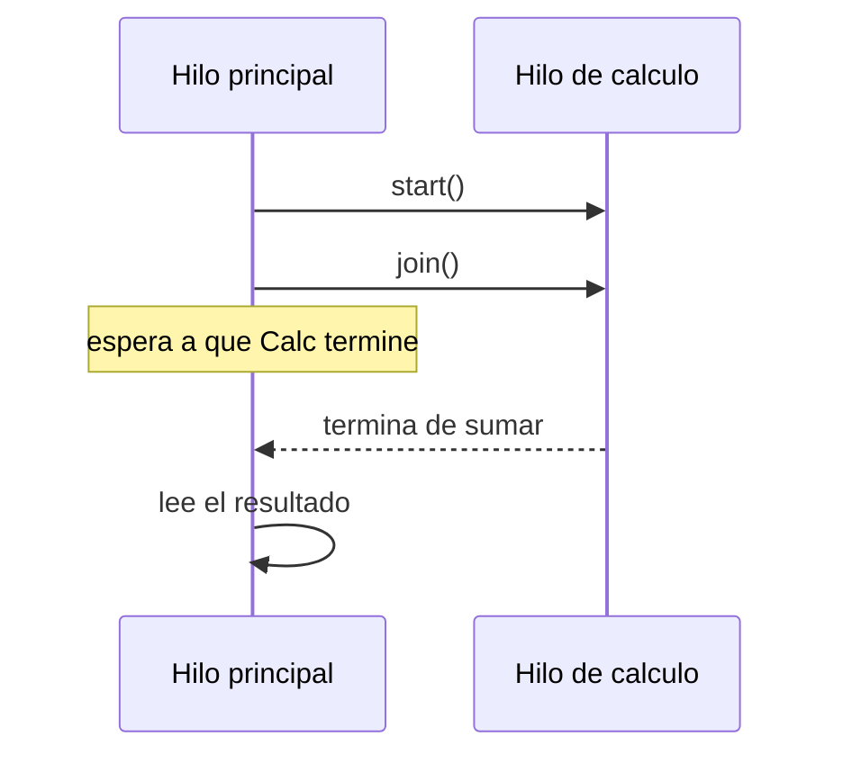

# Módulo 15 — Introducción a la Concurrencia en Java

Curso de Java
---
## 🎯 Objetivos del módulo

- Explicar qué es un hilo y en qué se distingue la ejecución concurrente de la secuencial.
- Crear hilos en Java con `extends Thread` e `implements Runnable`.
- Pedirle a un hilo que se detenga antes de tiempo de forma cooperativa.
- Sincronizar la finalización de un hilo con `join()` antes de usar su resultado.
---
## 🗺️ Ruta de la sesión

1. Concurrencia en Java.
2. Creación de hilos.
3. Interrupción de hilos.
4. Unir hilos.
---
## 🌍 Por qué importa la concurrencia

Muchos programas reales (servidores, aplicaciones con interfaz gráfica, sistemas que atienden a varios
usuarios a la vez) necesitan ejecutar varias tareas al mismo tiempo. Sin hilos, cada tarea tendría que
esperar a que la anterior termine, aunque no dependan entre sí.
---
## 🧠 ¿Qué es la concurrencia?

Un programa **secuencial** ejecuta sus instrucciones una detrás de otra, en un único hilo. La
**concurrencia** permite que varias tareas avancen al mismo tiempo, cada una en su propio **hilo**
(`Thread`) — sin garantizar en qué orden terminan.
---
## 🗺️ Diagrama: secuencial vs. concurrente




---
## 💻 Concurrencia — antes (secuencial)

```java
for (String paciente : pacientes) {
    enviarRecordatorio(paciente);
}
```

Los tres recordatorios terminan siempre en el mismo orden.
---
## 💻 Concurrencia — después (con hilos)

```java
for (String paciente : pacientes) {
    new Thread(() -> enviarRecordatorio(paciente)).start();
}
```

Cada recordatorio corre en su propio hilo.
---
## 🔍 Concurrencia — la prueba concreta

Dos ejecuciones reales, mismo código, sin cambiar ni una línea:

- **Corrida A**: Ana, Marta, Luis.
- **Corrida B**: Luis, Ana, Marta.

El orden varía entre ejecuciones — comportamiento esperado, no un error.
---
## 🧩 El orden entre hilos no está garantizado

Sin alguna forma de sincronización, nada asegura en qué orden terminan varios hilos. Eso es aceptable
cuando el resultado final no depende de ese orden — como enviar recordatorios independientes entre sí.
---
## 🧵 Creación de hilos

Dos formas estándar en Java: extender `Thread` (sobrescribiendo `run()`), o implementar `Runnable`
(clase, clase anónima o expresión lambda) pasado al constructor de `Thread`.
---
## 🧵 Dos formas de crear un hilo

```java
public class GeneradorDeReporte extends Thread {
    public void run() { /* ... */ }
}
```

```java
Thread hilo = new Thread(() -> generarReporte(consultorio));
```

Ambas formas crean un hilo nuevo; ninguna se ejecuta hasta invocar `start()`.
---
## 🗺️ Diagrama: extends Thread vs. Runnable


---
## 💻 Creación de hilos — antes

```java
for (String consultorio : consultorios) {
    generarReporte(consultorio);
}
// Tiempo total: 608 ms (suma de los tres)
```
---
## 💻 Creación de hilos — después

```java
Thread h1 = new GeneradorDeReporte("Consultorio 1", 200);
Thread h2 = new Thread(() -> generarReporte("Consultorio 2", 200));
Thread h3 = new Thread(() -> generarReporte("Consultorio 3", 200));
h1.start(); h2.start(); h3.start();
// Tiempo total: 456-458 ms
```
---
## 🔍 Creación de hilos — la prueba concreta

608 ms secuencial vs. 456-458 ms concurrente, confirmado por el propio programa:
`concurrente_mas_rapido: true`, en tres corridas sucesivas.
---
## ⚠️ Error frecuente: `run()` en vez de `start()`

Invocar `run()` directamente ejecuta el código de forma síncrona, en el hilo actual — sin crear ningún
hilo nuevo. Solo `start()` crea el hilo nuevo del sistema operativo.
---
## 🛑 Interrupción de hilos

`interrupt()` es **cooperativo**: marca un indicador que el hilo debe revisar (`isInterrupted()`), o
lanza `InterruptedException` si el hilo está bloqueado en una espera. El hilo sigue corriendo si no
reacciona.
---
## 🗺️ Diagrama: interrupción cooperativa


---
## 💻 Interrupción — antes

```java
public void run() {
    for (int i = 1; i <= 10; i++) {
        Thread.sleep(100);   // ignora cualquier interrupcion
        cantidadProcesada++;
    }
}
```
---
## 💻 Interrupción — después

```java
public void run() {
    for (int i = 1; i <= 10; i++) {
        if (Thread.currentThread().isInterrupted()) return;
        try {
            Thread.sleep(100);
        } catch (InterruptedException e) {
            Thread.currentThread().interrupt();
            return;
        }
        cantidadProcesada++;
    }
}
```
---
## 🔍 Interrupción — la prueba concreta

Mismo pedido de interrupción a los 250 ms: **10 de 10** análisis procesados (antes, ignorando el pedido)
vs. **2 de 10** (después, deteniéndose cooperativamente).
---
## ⚠️ Error frecuente: `interrupt()` no detiene por la fuerza

Java no ofrece ninguna forma segura de forzar la detención inmediata de un hilo desde afuera. Los
métodos antiguos que lo intentaban (`Thread.stop()`, `Thread.suspend()`) están obsoletos.
---
## 🔗 Unir hilos

`hiloSecundario.join()`, invocado desde el hilo principal, hace que el hilo principal espere a que
`hiloSecundario` termine antes de continuar su propia ejecución.
---
## 🗺️ Diagrama: `join()`


---
## 💻 Unión de hilos — antes

```java
calculador.start();
System.out.println(calculador.getTotalFacturado());
// 0.0 — resultado incompleto
```
---
## 💻 Unión de hilos — después

```java
calculador.start();
calculador.join();
System.out.println(calculador.getTotalFacturado());
// 10000.0 — correcto y repetible
```
---
## 🔍 Unión de hilos — la prueba concreta

`0.0` sin `join()` (condición de carrera) vs. `10000.0` con `join()`, repetible en ejecuciones
sucesivas — a diferencia del Ejemplo 01, aquí `join()` sí elimina la variabilidad.
---
## ⚠️ Error frecuente: leer sin `join()`

Que un hilo sea "rápido" no da ninguna garantía formal sobre cuándo termina respecto del hilo principal.
Sin `join()`, es una condición de carrera — puede funcionar la mayoría de las veces y fallar bajo carga.
---
## 🚧 Qué NO cubre este módulo

Sincronización de datos compartidos (`synchronized`, `Lock`, `volatile`), colecciones concurrentes, y el
framework `ExecutorService`/`CompletableFuture` quedan para un módulo posterior de concurrencia.
---
## 🔎 Guía rápida: ¿cuál uso?

- ¿Necesito ejecutar una tarea en paralelo? → **Creación de hilos**.
- ¿Necesito poder cancelarla antes de tiempo? → **Interrupción**.
- ¿Necesito su resultado antes de continuar? → **Unir hilos** (`join()`).
---
## 📋 Resumen de los tres temas técnicos

| Tema técnico | Qué resuelve | Método de `Thread` |
|---|---|---|
| Creación de hilos | Ejecutar una tarea en un hilo propio | `extends Thread`/`Runnable` + `start()` |
| Interrupción de hilos | Detener un hilo antes de tiempo, cooperativamente | `interrupt()` / `isInterrupted()` |
| Unir hilos | Esperar a que un hilo termine antes de usar su resultado | `join()` |
---
## 🛠️ Taller: MediSalud

**Taller 01** (Sistema de Procesamiento de Tareas de Fin de Día): combina los tres temas técnicos —
recordatorios y facturación en paralelo, análisis cancelable, resumen final tras `join()`.
---
## 🧪 Ejercicios: Biblioteca Universitaria

Un ejercicio Básico (identificar la violación) y uno Intermedio (aplicar la herramienta) por cada uno de
los tres temas técnicos, con la Biblioteca Universitaria como dominio.
---
## 🔴🏆 Avanzado y Desafío: Biblioteca Universitaria

**Avanzado 01**: corregir un diseño con dos temas técnicos ausentes (creación estructurada +
interrupción). **Desafío 01**: sin scaffold, diseñar un caso nuevo que combine los tres.
---
## ❓ Quiz 01

11 preguntas en formato entrevista técnica: 1 introductoria, 3 por cada uno de los tres temas técnicos,
y 1 integradora final sobre cómo combinarlos en un problema nuevo.
---
## 📚 Repaso: la pregunta clave de cada tema técnico

- **Creación de hilos**: ¿tengo tareas independientes que podrían ejecutarse en paralelo?
- **Interrupción de hilos**: ¿necesito poder cancelar un hilo antes de tiempo?
- **Unir hilos**: ¿necesito el resultado de un hilo antes de seguir?
---
## ✅ Checklist de cierre

- Puedo explicar la diferencia entre ejecución secuencial y concurrente.
- Puedo crear hilos con `extends Thread` e `implements Runnable`.
- Puedo interrumpir un hilo cooperativamente y unirlo con `join()`.
- Completé el taller, los ejercicios Básico e Intermedio de los tres temas técnicos, y el Quiz 01.
---
## 🎓 Cierre

La concurrencia no cambia qué calcula un programa — cambia cuándo y en qué orden se ejecutan sus partes.
Crear, interrumpir y unir hilos son las tres herramientas básicas para controlar ese orden con
seguridad, antes de llegar a la sincronización de datos compartidos en un módulo posterior.
