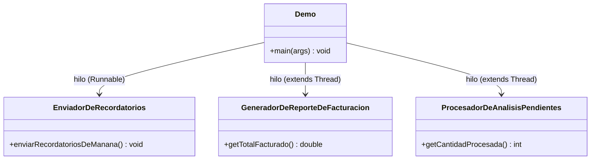

# 🔑 Solución del Taller 01 — Sistema de Procesamiento de Tareas de Fin de Día de MediSalud

> Material docente, no enlazar desde la audiencia estudiante.

## 🗺️ Diagrama de clases



## 🌳 Árbol de archivos

```text
GestionDeTareasClinicas/
└── com/medisalud/
    ├── EnviadorDeRecordatorios.java
    ├── GeneradorDeReporteDeFacturacion.java
    ├── ProcesadorDeAnalisisPendientes.java
    └── Demo.java
```

## 💻 Código completo

## 💻 Archivo: EnviadorDeRecordatorios.java

```java
package com.medisalud;

public class EnviadorDeRecordatorios {

    public static void enviarRecordatoriosDeManana() {
        String[] pacientes = {"Ana Torres", "Luis Rios", "Marta Diaz"};
        for (String paciente : pacientes) {
            try {
                Thread.sleep(80);
            } catch (InterruptedException e) {
                Thread.currentThread().interrupt();
                return;
            }
            System.out.println("Recordatorio enviado a " + paciente);
        }
    }
}
```

## 💻 Archivo: GeneradorDeReporteDeFacturacion.java

```java
package com.medisalud;

public class GeneradorDeReporteDeFacturacion extends Thread {

    private static final int CANTIDAD_CONSULTAS = 5;
    private static final long DURACION_POR_CONSULTA_MS = 60;

    private double totalFacturado = 0.0;

    @Override
    public void run() {
        for (int i = 1; i <= CANTIDAD_CONSULTAS; i++) {
            try {
                Thread.sleep(DURACION_POR_CONSULTA_MS);
            } catch (InterruptedException e) {
                Thread.currentThread().interrupt();
                return;
            }
            totalFacturado += 2000.0;
        }
    }

    public double getTotalFacturado() {
        return totalFacturado;
    }
}
```

## 💻 Archivo: ProcesadorDeAnalisisPendientes.java

```java
package com.medisalud;

public class ProcesadorDeAnalisisPendientes extends Thread {

    private static final int CANTIDAD_ANALISIS = 10;
    private static final long DURACION_POR_ANALISIS_MS = 100;

    private int cantidadProcesada = 0;

    @Override
    public void run() {
        for (int i = 1; i <= CANTIDAD_ANALISIS; i++) {
            if (Thread.currentThread().isInterrupted()) {
                return;
            }
            try {
                Thread.sleep(DURACION_POR_ANALISIS_MS);
            } catch (InterruptedException e) {
                Thread.currentThread().interrupt();
                return;
            }
            cantidadProcesada++;
        }
    }

    public int getCantidadProcesada() {
        return cantidadProcesada;
    }
}
```

## 💻 Archivo: Demo.java

```java
package com.medisalud;

public class Demo {

    private static final long TIEMPO_MAXIMO_ANALISIS_MS = 350;

    public static void main(String[] args) throws InterruptedException {
        Thread hiloRecordatorios = new Thread(EnviadorDeRecordatorios::enviarRecordatoriosDeManana);
        GeneradorDeReporteDeFacturacion hiloReporte = new GeneradorDeReporteDeFacturacion();
        ProcesadorDeAnalisisPendientes hiloAnalisis = new ProcesadorDeAnalisisPendientes();

        hiloRecordatorios.start();
        hiloReporte.start();
        hiloAnalisis.start();

        Thread.sleep(TIEMPO_MAXIMO_ANALISIS_MS);
        hiloAnalisis.interrupt();

        hiloRecordatorios.join();
        hiloReporte.join();
        hiloAnalisis.join();

        System.out.println("=== Resumen de fin de dia ===");
        System.out.println("Facturacion total: " + hiloReporte.getTotalFacturado());
        System.out.println("Analisis procesados: " + hiloAnalisis.getCantidadProcesada() + " de 10");
    }
}
```

## ✅ Salida real

```text
Recordatorio enviado a Ana Torres
Recordatorio enviado a Luis Rios
Recordatorio enviado a Marta Diaz
=== Resumen de fin de dia ===
Facturacion total: 10000.0
Analisis procesados: 3 de 10
```

## ⚠️ Errores comunes observados

- **Iniciar los tres hilos, pero invocar `join()` en el mismo orden en que se esperaría que terminaran**
  (por ejemplo, esperar primero al de análisis, que es el más largo): `join()` no bloquea a los demás
  hilos entre sí, así que el orden en que se invoca sobre cada uno no afecta la corrección del resultado
  final, mientras se invoque sobre los tres antes de leer cualquier resultado — pero mezclar `join()` con
  lecturas intermedias de otros hilos sí podría reintroducir la condición de carrera que el Ejemplo 04 ya
  mostró.
- **Interrumpir `ProcesadorDeAnalisisPendientes` sin que revise `isInterrupted()` en cada iteración,
  esperando que el pedido de interrupción lo detenga solo**: sin esa revisión (o sin bloquearse en una
  espera donde `InterruptedException` se manifieste), el hilo completa el lote igual, ignorando el
  pedido — mismo error frecuente que el Ejemplo 03.
- **Imprimir el resumen final antes de invocar `join()` sobre los tres hilos**: eso reintroduce la
  condición de carrera del Ejemplo 04 (leer un resultado antes de que el hilo que lo produce termine),
  aunque el error solo se manifieste esporádicamente según la carga de la máquina.
