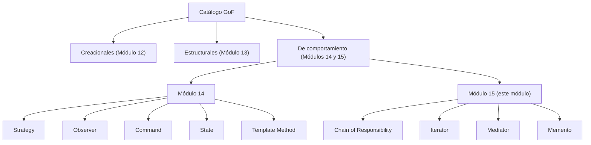

# 💡 Ejemplo 01 — Cómo se completa la categoría de comportamiento

## 🌍 Contexto

El Módulo 14 cubrió cinco patrones de comportamiento (Strategy, Observer, Command, State, Template
Method), los de uso más frecuente en código Java real. El temario original de "Patrones de
comportamiento" tiene nueve puntos en total: los cinco ya vistos, más cuatro que este módulo completa
ahora: Chain of Responsibility, Iterator, Mediator y Memento.

## 🗺️ Diagrama

## 🧭 Explicación paso a paso

1. Los patrones de comportamiento resuelven cómo se comunican los objetos entre sí y cómo reparten
   responsabilidades — a diferencia de los creacionales (Módulo 12, cómo se crean) y los estructurales
   (Módulo 13, cómo se componen).
2. El temario de esta categoría tiene nueve patrones. El Módulo 14 ya cubrió cinco: Strategy, Observer,
   Command, State y Template Method.
3. Este módulo (15) completa los cuatro restantes: Chain of Responsibility (pasar una solicitud a lo
   largo de una cadena de manejadores), Iterator (recorrer una colección sin exponer su estructura
   interna), Mediator (centralizar la comunicación entre varios objetos) y Memento (capturar y restaurar
   el estado de un objeto).
4. Entre los Módulos 14 y 15, quedan cubiertos los nueve patrones de comportamiento del temario, sin
   repetir ninguno.

## ✅ Resultado esperado

Al terminar este módulo vas a poder mirar un diseño Java real y reconocer cuál de los nueve patrones de
comportamiento (los cinco del Módulo 14 o los cuatro de este) resuelve el problema de comunicación o
reparto de responsabilidades que tiene delante.

## ❓ Preguntas de repaso

**1. [Selección]** ¿Cuántos patrones de comportamiento tiene el temario original, y cuántos cubre este
módulo?

- A. Nueve en total; este módulo cubre los nueve.
- B. Nueve en total; el Módulo 14 ya cubrió cinco, y este módulo cubre los cuatro restantes.
- C. Cuatro en total; todos se cubren en este módulo.
- D. Nueve en total; este módulo repite los cinco del Módulo 14 con más detalle.

🔑 Ver respuesta

**Respuesta correcta: B.** El Módulo 14 cubrió Strategy, Observer, Command, State y Template Method;
este módulo cubre los cuatro restantes: Chain of Responsibility, Iterator, Mediator y Memento.

**2. [Selección]** ¿Cuáles de los siguientes son los cuatro patrones de este módulo?

- A. Strategy, Observer, Command, State.
- B. Chain of Responsibility, Iterator, Mediator, Memento.
- C. Adapter, Bridge, Composite, Decorator.
- D. Visitor, Interpreter, Chain of Responsibility, Iterator.

🔑 Ver respuesta

**Respuesta correcta: B.** Los cuatro patrones de este módulo son Chain of Responsibility, Iterator,
Mediator y Memento.

**3. [Abierta]** Un compañero dice que este módulo "repite" el Módulo 14 porque ambos son de patrones
de comportamiento. Explica por qué eso no es correcto.

🔑 Ver respuesta

Ambos módulos son de la misma categoría (comportamiento), pero cubren patrones distintos y
complementarios: el Módulo 14 cubrió Strategy, Observer, Command, State y Template Method; este módulo
cubre Chain of Responsibility, Iterator, Mediator y Memento. Entre los dos, sin superposición, quedan
completos los nueve patrones de comportamiento del temario original.

