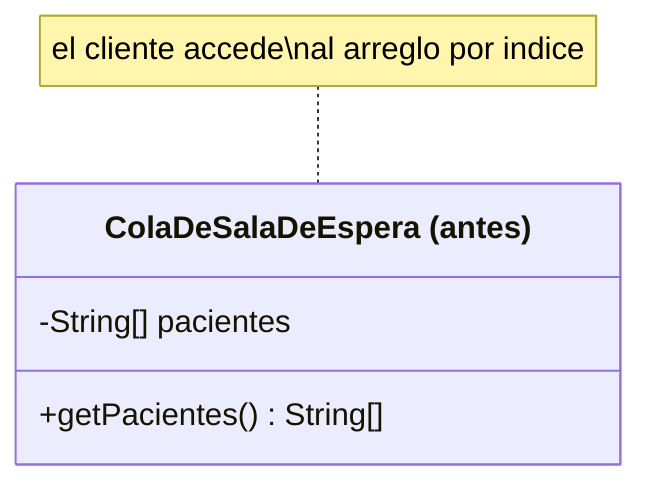
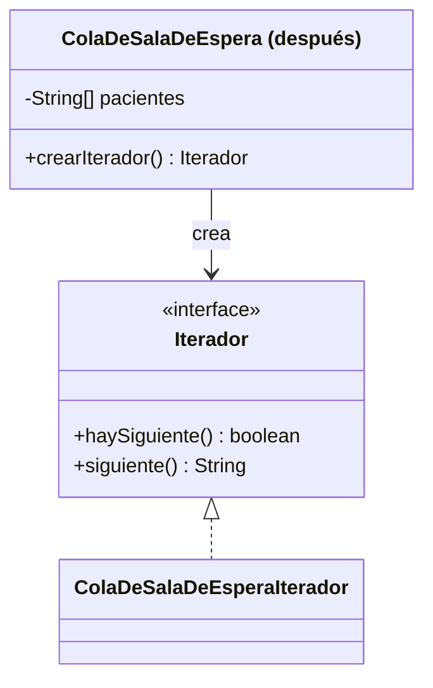

# 💡 Ejemplo 03 — Iterator

## 🌍 Contexto

La cola de sala de espera de MediSalud guarda pacientes en un arreglo interno. El código que la recorre
accede directamente a ese arreglo por índice, acoplado a que la cola use, específicamente, un arreglo.

**Qué busca demostrar este ejemplo**: qué pasaría si la estructura interna cambiara, comparado entre
acceder directamente al arreglo y recorrer la cola a través de un iterador propio.

## 🏥 Caso de estudio

MediSalud recorre la cola de pacientes en sala de espera, en el orden en que fueron llegando.

## 🗺️ Diagrama





*Arriba, la versión "antes" (el cliente accede al arreglo interno). Abajo, la versión "después" (el
cliente recorre a través de un iterador, sin conocer el arreglo).*

## 🌳 Árbol de archivos — antes

```text
iterator-antes/
└── com/medisalud/
    ├── ColaDeSalaDeEspera.java
    └── Demo.java
```

## 💻 Archivo: ColaDeSalaDeEspera.java

```java
package com.medisalud;

public class ColaDeSalaDeEspera {
    private String[] pacientes;
    private int cantidad;

    public ColaDeSalaDeEspera(int capacidad) {
        this.pacientes = new String[capacidad];
        this.cantidad = 0;
    }

    public void agregar(String paciente) {
        pacientes[cantidad] = paciente;
        cantidad = cantidad + 1;
    }

    public String[] getPacientes() {
        return pacientes;
    }

    public int getCantidad() {
        return cantidad;
    }
}
```

## 💻 Archivo: Demo.java

```java
package com.medisalud;

public class Demo {
    public static void main(String[] args) {
        ColaDeSalaDeEspera cola = new ColaDeSalaDeEspera(3);
        cola.agregar("Ana Torres");
        cola.agregar("Carlos Ruiz");
        cola.agregar("Lucia Fernandez");

        for (int i = 0; i < cola.getCantidad(); i = i + 1) {
            System.out.println(cola.getPacientes()[i]);
        }
    }
}
```

## ✅ Resultado esperado — antes

```text
Ana Torres
Carlos Ruiz
Lucia Fernandez
```

## 🌳 Árbol de archivos — después

```text
iterator-despues/
└── com/medisalud/
    ├── Iterador.java                     (nuevo)
    ├── ColaDeSalaDeEsperaIterador.java    (nuevo)
    ├── ColaDeSalaDeEspera.java            (cambió)
    └── Demo.java                          (cambió)
```

## 💻 Archivo: Iterador.java — nuevo

```java
package com.medisalud;

public interface Iterador {
    boolean haySiguiente();
    String siguiente();
}
```

## 💻 Archivo: ColaDeSalaDeEsperaIterador.java — nuevo

```java
package com.medisalud;

public class ColaDeSalaDeEsperaIterador implements Iterador {
    private String[] pacientes;
    private int cantidad;
    private int posicionActual;

    public ColaDeSalaDeEsperaIterador(String[] pacientes, int cantidad) {
        this.pacientes = pacientes;
        this.cantidad = cantidad;
        this.posicionActual = 0;
    }

    public boolean haySiguiente() {
        return posicionActual < cantidad;
    }

    public String siguiente() {
        String paciente = pacientes[posicionActual];
        posicionActual = posicionActual + 1;
        return paciente;
    }
}
```

## 💻 Archivo: ColaDeSalaDeEspera.java — cambió

```java
package com.medisalud;

public class ColaDeSalaDeEspera {
    private String[] pacientes;
    private int cantidad;

    public ColaDeSalaDeEspera(int capacidad) {
        this.pacientes = new String[capacidad];
        this.cantidad = 0;
    }

    public void agregar(String paciente) {
        pacientes[cantidad] = paciente;
        cantidad = cantidad + 1;
    }

    public Iterador crearIterador() {
        return new ColaDeSalaDeEsperaIterador(pacientes, cantidad);
    }
}
```

## 💻 Archivo: Demo.java — cambió

```java
package com.medisalud;

public class Demo {
    public static void main(String[] args) {
        ColaDeSalaDeEspera cola = new ColaDeSalaDeEspera(3);
        cola.agregar("Ana Torres");
        cola.agregar("Carlos Ruiz");
        cola.agregar("Lucia Fernandez");

        Iterador iterador = cola.crearIterador();
        while (iterador.haySiguiente()) {
            System.out.println(iterador.siguiente());
        }
    }
}
```

## ✅ Resultado esperado — después

```text
Ana Torres
Carlos Ruiz
Lucia Fernandez
```

## 🔍 Comparación: la prueba concreta

Ambas versiones dan la misma salida: los mismos tres pacientes, en el mismo orden. En la versión
"antes", `Demo` recorre `cola.getPacientes()[i]` con un `for` indexado — acoplado a que la cola use un
arreglo. En la versión "después", `Demo` recorre `iterador.haySiguiente()`/`iterador.siguiente()`, sin
acceder nunca al arreglo interno: si `ColaDeSalaDeEspera` cambiara su representación interna (por
ejemplo, a otra estructura), solo `ColaDeSalaDeEsperaIterador` necesitaría ajustarse, no `Demo`.

## 🔍 Análisis: errores frecuentes

El error más frecuente al aplicar Iterator es declarar la interfaz de iterador pero seguir exponiendo,
además, un método que devuelve el arreglo o la estructura interna completa (como el
`getPacientes()` de la versión "antes"). Si ese método sigue existiendo en la versión "después", el
cliente puede seguir accediendo directamente a la estructura interna, sin pasar por el iterador — el
beneficio real de Iterator exige que la única forma de recorrer la colección sea a través de él.

## ❓ Preguntas de repaso

**1. [Selección]** En la versión "antes", ¿cómo recorre `Demo` la cola de pacientes?

- A. A través de un iterador.
- B. Accediendo directamente al arreglo interno con un índice.
- C. `ColaDeSalaDeEspera` no se puede recorrer.
- D. Con una consulta a una base de datos.

<details>
<summary>🔑 Ver respuesta</summary>

**Respuesta correcta: B.** `Demo` accede a `cola.getPacientes()[i]`, acoplado a que la cola use,
específicamente, un arreglo.

</details>

**2. [Selección múltiple]** Sobre la versión "después", ¿cuáles afirmaciones son verdaderas?

- A. `Demo` nunca accede al arreglo interno de la cola.
- B. `ColaDeSalaDeEsperaIterador` es quien conoce la estructura interna.
- C. La salida es distinta a la de la versión "antes".
- D. `Iterador` es una interfaz con `haySiguiente()` y `siguiente()`.

<details>
<summary>🔑 Ver respuesta</summary>

**Respuestas correctas: A, B y D.** C es falsa: ambas versiones dan la misma salida — lo que cambia es
cómo se recorre la cola, no el resultado.

</details>

**3. [Abierta]** Un compañero dice: "en Java ya existe `for-each`, así que Iterator no sirve para nada
en la práctica". ¿Estás de acuerdo? Justifica tu respuesta.

<details>
<summary>🔑 Ver respuesta</summary>

Parcialmente. Es cierto que, para las colecciones estándar de Java (`List`, `Set`, etc.), el `for-each`
ya usa `Iterator` por dentro, así que rara vez hace falta escribir uno a mano. Pero cuando se diseña una
colección propia (como `ColaDeSalaDeEspera` en este ejemplo), el patrón sigue siendo necesario para
lograr lo mismo: que el código cliente la recorra sin conocer cómo está armada por dentro. Entender
Iterator ayuda, además, a entender qué hace posible el `for-each` que ya se usa desde el Módulo 8.

</details>
