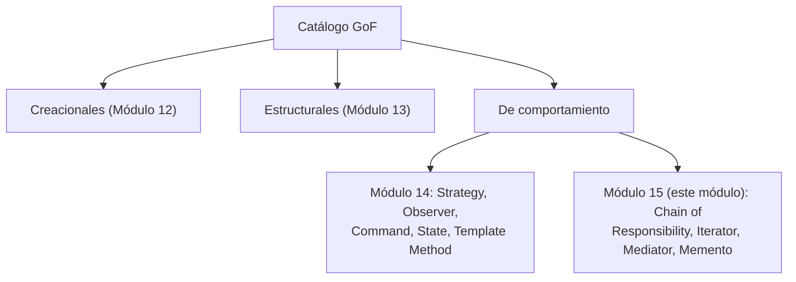
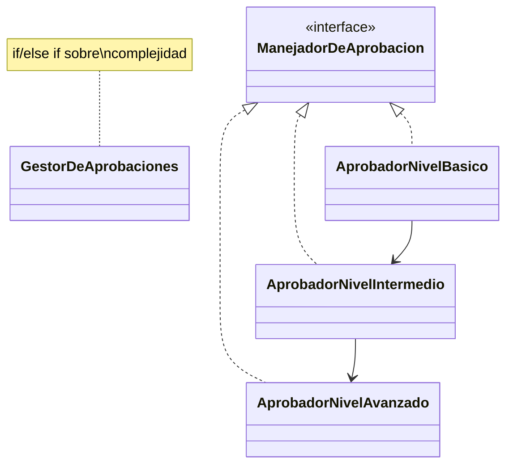
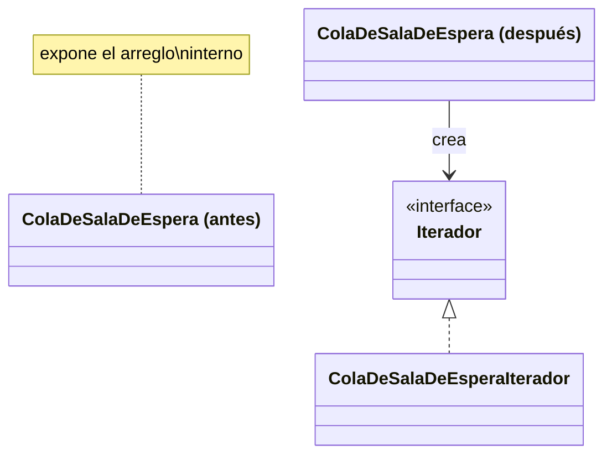
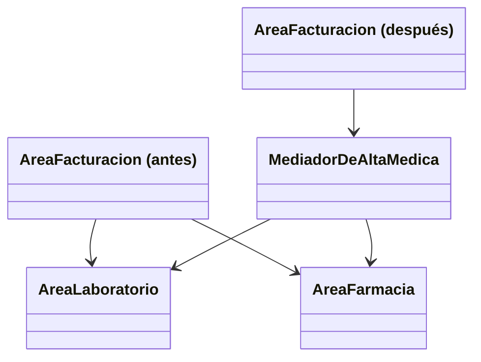
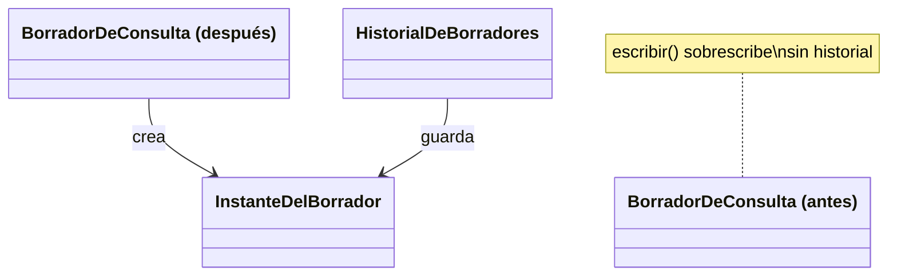

# Módulo 15 — Patrones de Diseño (Patrones de Comportamiento II)

Curso de Java

---

## 🎯 Objetivos del módulo

- Explicar cómo este módulo completa, junto con el Módulo 14, los nueve patrones de comportamiento del
  temario.
- Explicar el problema de comunicación que resuelve cada uno de los cuatro patrones: Chain of
  Responsibility, Iterator, Mediator y Memento.
- Identificar cuál de los nueve patrones de comportamiento (los de este módulo o los del Módulo 14)
  resuelve un problema dado.
- Implementar cada patrón en Java para un caso real.

---

## 🗺️ Ruta de la sesión

1. Cómo se completa la categoría de comportamiento.
2. Chain of Responsibility.
3. Iterator.
4. Mediator.
5. Memento.

---

## 🧠 Este módulo completa el Módulo 14

El Módulo 14 cubrió Strategy, Observer, Command, State y Template Method — los cinco patrones de
comportamiento de uso más frecuente. Este módulo cubre los cuatro restantes del temario: Chain of
Responsibility, Iterator, Mediator y Memento.

---

## 🗺️ Diagrama: los nueve patrones de comportamiento, en dos módulos



---

## 🔗 Chain of Responsibility

Pasa una solicitud a lo largo de una cadena de manejadores hasta que uno de ellos la resuelve, sin que
quien la envía conozca cuál.

---

## 🗺️ Diagrama: Chain of Responsibility antes/después



---

## 💻 Chain of Responsibility — antes

```java
public String aprobar(SolicitudDeEstudio solicitud) {
    if (solicitud.getComplejidad().equals("BASICA")) {
        return "Aprobado por nivel basico: " + solicitud.getNombreEstudio();
    } else if (solicitud.getComplejidad().equals("INTERMEDIA")) {
        return "Aprobado por nivel intermedio: " + solicitud.getNombreEstudio();
    }
    // ...
}
```

---

## 💻 Chain of Responsibility — después

```java
public String aprobar(SolicitudDeEstudio solicitud) {
    if (solicitud.getComplejidad().equals("BASICA")) {
        return "Aprobado por nivel basico: " + solicitud.getNombreEstudio();
    }
    return siguiente.aprobar(solicitud);
}
```

---

## 🔍 Chain of Responsibility — la prueba concreta

Ambas versiones dan la misma salida para las tres complejidades probadas. En la versión "después",
ningún manejador conoce a los demás, salvo al siguiente de la cadena.

---

## 🔁 Iterator

Recorre los elementos de una colección sin exponer su representación interna.

---

## 🗺️ Diagrama: Iterator antes/después



---

## 💻 Iterator — antes

```java
for (int i = 0; i < cola.getCantidad(); i = i + 1) {
    System.out.println(cola.getPacientes()[i]);
}
```

---

## 💻 Iterator — después

```java
Iterador iterador = cola.crearIterador();
while (iterador.haySiguiente()) {
    System.out.println(iterador.siguiente());
}
```

---

## 🔍 Iterator — la prueba concreta

Ambas versiones dan la misma salida (los mismos pacientes, en el mismo orden). En la versión
"después", el cliente nunca accede al arreglo interno de la cola.

---

## 🤝 Mediator

Centraliza en un único objeto la comunicación entre varios objetos que, de otro modo, se
referenciarían directamente entre sí.

---

## 🗺️ Diagrama: Mediator antes/después



---

## 💻 Mediator — antes

```java
public void registrarAlta(String paciente) {
    System.out.println("Facturacion: cerrando cuenta de " + paciente);
    areaLaboratorio.recibirAvisoDeAlta(paciente);
    areaFarmacia.recibirAvisoDeAlta(paciente);
}
```

---

## 💻 Mediator — después

```java
public void registrarAlta(String paciente) {
    System.out.println("Facturacion: cerrando cuenta de " + paciente);
    mediador.coordinarAlta(paciente);
}
```

---

## 🔍 Mediator — la prueba concreta

Agregar un área nueva (radiología): en la versión "antes", `AreaFacturacion.java` cambia. En la
versión "después", ninguna de las tres áreas existentes cambia — solo el mediador, confirmado con
`diff` real.

---

## ⏪ Memento

Captura el estado interno de un objeto para poder restaurarlo más tarde, sin romper su
encapsulamiento.

---

## 🗺️ Diagrama: Memento antes/después



---

## 💻 Memento — antes

```java
public void escribir(String texto) {
    this.texto = texto;
}
```

---

## 💻 Memento — después

```java
public InstanteDelBorrador guardarInstante() {
    return new InstanteDelBorrador(texto);
}

public void restaurar(InstanteDelBorrador instante) {
    this.texto = instante.getTexto();
}
```

---

## 🔍 Memento — la prueba concreta

Tras escribir dos textos distintos y restaurar el primer instante guardado, el texto vuelve
exactamente al primero, no al segundo — verificado con la salida real.

---

## ⚠️ Errores frecuentes, uno por patrón

- **Chain of Responsibility**: el último manejador de la cadena no señala explícitamente que nadie
  pudo resolver la solicitud.
- **Iterator**: la colección sigue exponiendo, además del iterador, un método que devuelve la
  estructura interna completa.
- **Mediator**: dos colegas siguen llamándose directamente entre sí "para un caso particular".
- **Memento**: el instante expone su contenido con métodos públicos, rompiendo el encapsulamiento.

---

## 📋 Resumen de los cuatro patrones de este módulo

| Patrón | Qué resuelve |
|---|---|
| Chain of Responsibility | Un condicional único decide quién resuelve una solicitud |
| Iterator | El cliente accede a la estructura interna de una colección |
| Mediator | Varios objetos se llaman directamente entre sí |
| Memento | Un objeto editable no puede deshacer cambios |

---

## 🛠️ Taller: Sistema de Gestión de Solicitudes Clínicas de MediSalud

Combina tres de los cuatro patrones: Chain of Responsibility (`ManejadorDeProcedimiento`), Mediator
(`MediadorClinico`) y Memento (`BorradorDeProcedimiento`).

---

## 🧪 Ejercicios: Biblioteca Universitaria

Un ejercicio Básico (identificar la violación) y uno Intermedio (aplicar el patrón) por cada uno de
los cuatro patrones, con la Biblioteca Universitaria como dominio.

---

## 🔴🏆 Avanzado y Desafío: Biblioteca Universitaria

**Avanzado**: corregir un diseño con dos patrones ausentes a la vez (Chain of Responsibility +
Mediator). **Desafío**: sin scaffold, elegir y justificar el patrón de comportamiento más adecuado
para un caso nuevo.

---

## ❓ Quiz 01

14 preguntas en formato entrevista técnica: 1 introductoria, 3 por cada uno de los cuatro patrones, y
1 integradora final sobre cómo elegir el patrón adecuado entre los nueve vistos en total.

---

## 📚 Repaso: la pregunta clave de cada patrón

- **Chain of Responsibility**: ¿una solicitud debe resolverse por uno de varios niveles posibles?
- **Iterator**: ¿necesito recorrer una colección sin exponer su estructura interna?
- **Mediator**: ¿varios objetos se comunican directamente entre sí?
- **Memento**: ¿necesito guardar y restaurar el estado de un objeto?

---

## ✅ Checklist de cierre

- Puedo explicar qué resuelve cada uno de los cuatro patrones de este módulo.
- Puedo identificar cuál de los nueve patrones de comportamiento resuelve un problema dado.
- Puedo implementar cada patrón en Java para un caso nuevo.
- Completé el Taller, los ejercicios Básico e Intermedio de los cuatro patrones, y el Quiz 01.

---

## 🎓 Cierre

Con este módulo, los nueve patrones de comportamiento del temario quedan completos entre los Módulos
14 y 15. La misma pregunta ("¿qué problema de comunicación tengo?") identifica cuál de los nueve
aplica en cada caso nuevo.
