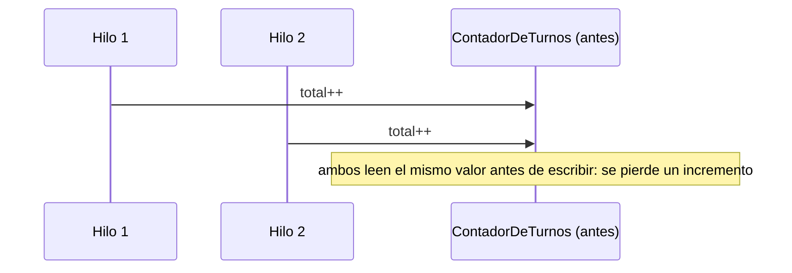
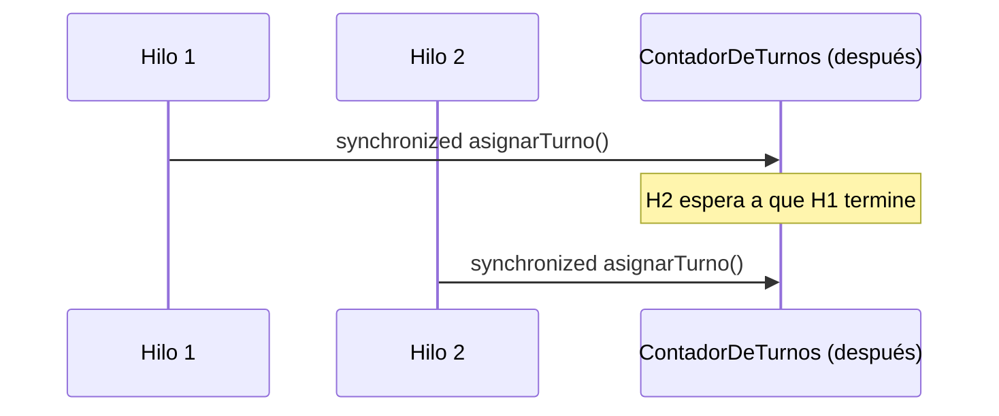

# 💡 Ejemplo 01 — Sincronización

## 🌍 Contexto

MediSalud asigna turnos de atención con un contador compartido. Varios hilos incrementan ese contador al
mismo tiempo, sin ninguna coordinación entre ellos.

**Qué busca demostrar este ejemplo**: qué le pasa a un dato mutable compartido cuando varios hilos lo
modifican sin sincronizar, y cómo `synchronized` lo resuelve con exclusión mutua.

## 🏥 Caso de estudio

MediSalud asigna turnos de atención a través de un contador compartido por varios hilos.

## 🗺️ Diagrama





## 🌳 Árbol de archivos — antes

```text
sincronizacion-antes/
└── com/medisalud/
    ├── ContadorDeTurnos.java
    └── Demo.java
```

## 💻 Archivo: ContadorDeTurnos.java

```java
package com.medisalud;

public class ContadorDeTurnos {

    private int total = 0;

    public void asignarTurno() {
        total++;
    }

    public int getTotal() {
        return total;
    }
}
```

## 💻 Archivo: Demo.java

```java
package com.medisalud;

public class Demo {

    private static final int CANTIDAD_HILOS = 10;
    private static final int TURNOS_POR_HILO = 100_000;

    public static void main(String[] args) throws InterruptedException {
        ContadorDeTurnos contador = new ContadorDeTurnos();

        Thread[] hilos = new Thread[CANTIDAD_HILOS];
        for (int i = 0; i < CANTIDAD_HILOS; i++) {
            hilos[i] = new Thread(() -> {
                for (int j = 0; j < TURNOS_POR_HILO; j++) {
                    contador.asignarTurno();
                }
            });
            hilos[i].start();
        }
        for (Thread hilo : hilos) {
            hilo.join();
        }

        int esperado = CANTIDAD_HILOS * TURNOS_POR_HILO;
        System.out.println("Esperado: " + esperado);
        System.out.println("Real: " + contador.getTotal());
        System.out.println("total_correcto: " + (contador.getTotal() == esperado));
    }
}
```

## ✅ Resultado esperado — antes

```text
Esperado: 1000000
Real: 291845
total_correcto: false
```

## 🌳 Árbol de archivos — después

```text
sincronizacion-despues/
└── com/medisalud/
    ├── ContadorDeTurnos.java   (cambió)
    └── Demo.java                (sin cambios)
```

Sin cambios respecto de "antes": `Demo.java` — su código ya se mostró arriba y es exactamente el mismo,
byte a byte.

<details>
<summary>💻 Ver de nuevo el código sin cambios (Demo.java)</summary>

## 💻 Archivo: Demo.java

```java
package com.medisalud;

public class Demo {

    private static final int CANTIDAD_HILOS = 10;
    private static final int TURNOS_POR_HILO = 100_000;

    public static void main(String[] args) throws InterruptedException {
        ContadorDeTurnos contador = new ContadorDeTurnos();

        Thread[] hilos = new Thread[CANTIDAD_HILOS];
        for (int i = 0; i < CANTIDAD_HILOS; i++) {
            hilos[i] = new Thread(() -> {
                for (int j = 0; j < TURNOS_POR_HILO; j++) {
                    contador.asignarTurno();
                }
            });
            hilos[i].start();
        }
        for (Thread hilo : hilos) {
            hilo.join();
        }

        int esperado = CANTIDAD_HILOS * TURNOS_POR_HILO;
        System.out.println("Esperado: " + esperado);
        System.out.println("Real: " + contador.getTotal());
        System.out.println("total_correcto: " + (contador.getTotal() == esperado));
    }
}
```

</details>

## 💻 Archivo: ContadorDeTurnos.java — cambió

```java
package com.medisalud;

public class ContadorDeTurnos {

    private int total = 0;

    public synchronized void asignarTurno() {
        total++;
    }

    public synchronized int getTotal() {
        return total;
    }
}
```

## ✅ Resultado esperado — después

```text
Esperado: 1000000
Real: 1000000
total_correcto: true
```

## 🔍 Comparación: la prueba concreta

Con 10 hilos incrementando 100.000 veces cada uno (esperado: 1.000.000), la versión "antes" dio un total
real menor al esperado — la cifra exacta varía entre ejecuciones (puede no coincidir con la citada
arriba si se vuelve a ejecutar), pero siempre es menor a 1.000.000: cada incremento (`total++`) en
realidad son tres pasos (leer, sumar, escribir), y dos hilos pueden leer el mismo valor antes de que
cualquiera de los dos escriba el suyo, perdiendo un incremento. La versión "después" declara
`asignarTurno()` y `getTotal()` como `synchronized`: solo un hilo a la vez puede ejecutar ese código
sobre la misma instancia, así que el total final es siempre exactamente 1.000.000, sin variar entre
ejecuciones.

## 🔍 Análisis: errores frecuentes

El error más frecuente al sincronizar es proteger el método que escribe el dato pero no el que lo lee
(por ejemplo, dejar `getTotal()` sin `synchronized`): aunque menos grave que no sincronizar nada, el
estudiante podría leer un valor a medio actualizar en máquinas con más de un núcleo. En este ejemplo,
ambos métodos —`asignarTurno()` y `getTotal()`— están sincronizados sobre la misma instancia.

## ❓ Preguntas de repaso

**1. [Selección]** ¿Por qué `total++` no es seguro cuando varios hilos lo ejecutan sobre el mismo objeto
sin sincronizar?

- A. Porque `int` no puede superar cierto valor.
- B. Porque `total++` en realidad son tres pasos (leer, sumar, escribir), y dos hilos pueden intercalarse
  entre esos pasos, perdiendo un incremento.
- C. Porque Java prohíbe incrementar variables desde más de un hilo.
- D. No hay ningún problema real: es solo una cuestión de estilo.

<details>
<summary>🔑 Ver respuesta</summary>

**Respuesta correcta: B.** `total++` no es una operación atómica: leer, sumar y escribir son tres pasos
separados, y dos hilos pueden intercalarse entre ellos, causando que se pierda un incremento.

</details>

**2. [Selección múltiple]** Sobre la versión "antes" de este ejemplo, ¿cuáles afirmaciones son
verdaderas?

- A. El total final observado es siempre menor al esperado.
- B. La cantidad exacta de incrementos perdidos es siempre la misma, ejecución tras ejecución.
- C. El problema es una condición de carrera real sobre un dato compartido.
- D. El programa lanza una excepción cuando se pierde un incremento.

<details>
<summary>🔑 Ver respuesta</summary>

**Respuestas correctas: A y C.** B es falsa: la cantidad exacta de incrementos perdidos varía entre
ejecuciones. D es falsa: perder un incremento no lanza ninguna excepción, por eso es un error silencioso
y peligroso.

</details>

**3. [Abierta]** Un compañero dice: "si declaro `total` como `synchronized`, ya está protegido". ¿Estás
de acuerdo? Justifica tu respuesta.

<details>
<summary>🔑 Ver respuesta</summary>

No exactamente: `synchronized` no es un modificador que se aplique a variables, sino a métodos o
bloques de código. Lo que hay que sincronizar es el **código que accede** a la variable compartida (por
ejemplo, `asignarTurno()` y `getTotal()`), no la variable en sí misma.

</details>
