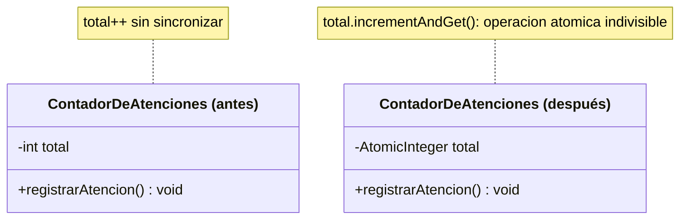

# 💡 Ejemplo 02 — Acceso atómico

## 🌍 Contexto

MediSalud lleva un contador de atenciones realizadas, incrementado por varios hilos a la vez. El mismo
problema del Ejemplo 01 puede resolverse sin declarar ningún método `synchronized`.

**Qué busca demostrar este ejemplo**: cómo una clase atómica (`AtomicInteger`) resuelve la misma
condición de carrera que `synchronized`, sin necesitar un bloqueo explícito.

## 🏥 Caso de estudio

MediSalud registra la cantidad de atenciones realizadas a través de un contador compartido por varios
hilos.

## 🗺️ Diagrama



## 🌳 Árbol de archivos — antes

```text
atomico-antes/
└── com/medisalud/
    ├── ContadorDeAtenciones.java
    └── Demo.java
```

## 💻 Archivo: ContadorDeAtenciones.java

```java
package com.medisalud;

public class ContadorDeAtenciones {

    private int total = 0;

    public void registrarAtencion() {
        total++;
    }

    public int getTotal() {
        return total;
    }
}
```

## 💻 Archivo: Demo.java

```java
package com.medisalud;

public class Demo {

    private static final int CANTIDAD_HILOS = 10;
    private static final int ATENCIONES_POR_HILO = 100_000;

    public static void main(String[] args) throws InterruptedException {
        ContadorDeAtenciones contador = new ContadorDeAtenciones();

        Thread[] hilos = new Thread[CANTIDAD_HILOS];
        for (int i = 0; i < CANTIDAD_HILOS; i++) {
            hilos[i] = new Thread(() -> {
                for (int j = 0; j < ATENCIONES_POR_HILO; j++) {
                    contador.registrarAtencion();
                }
            });
            hilos[i].start();
        }
        for (Thread hilo : hilos) {
            hilo.join();
        }

        int esperado = CANTIDAD_HILOS * ATENCIONES_POR_HILO;
        System.out.println("Esperado: " + esperado);
        System.out.println("Real: " + contador.getTotal());
        System.out.println("total_correcto: " + (contador.getTotal() == esperado));
    }
}
```

## ✅ Resultado esperado — antes

```text
Esperado: 1000000
Real: 317606
total_correcto: false
```

## 🌳 Árbol de archivos — después

```text
atomico-despues/
└── com/medisalud/
    ├── ContadorDeAtenciones.java   (cambió)
    └── Demo.java                    (sin cambios)
```

Sin cambios respecto de "antes": `Demo.java` — su código ya se mostró arriba y es exactamente el mismo,
byte a byte.

<details>
<summary>💻 Ver de nuevo el código sin cambios (Demo.java)</summary>

## 💻 Archivo: Demo.java

```java
package com.medisalud;

public class Demo {

    private static final int CANTIDAD_HILOS = 10;
    private static final int ATENCIONES_POR_HILO = 100_000;

    public static void main(String[] args) throws InterruptedException {
        ContadorDeAtenciones contador = new ContadorDeAtenciones();

        Thread[] hilos = new Thread[CANTIDAD_HILOS];
        for (int i = 0; i < CANTIDAD_HILOS; i++) {
            hilos[i] = new Thread(() -> {
                for (int j = 0; j < ATENCIONES_POR_HILO; j++) {
                    contador.registrarAtencion();
                }
            });
            hilos[i].start();
        }
        for (Thread hilo : hilos) {
            hilo.join();
        }

        int esperado = CANTIDAD_HILOS * ATENCIONES_POR_HILO;
        System.out.println("Esperado: " + esperado);
        System.out.println("Real: " + contador.getTotal());
        System.out.println("total_correcto: " + (contador.getTotal() == esperado));
    }
}
```

</details>

## 💻 Archivo: ContadorDeAtenciones.java — cambió

```java
package com.medisalud;

import java.util.concurrent.atomic.AtomicInteger;

public class ContadorDeAtenciones {

    private final AtomicInteger total = new AtomicInteger(0);

    public void registrarAtencion() {
        total.incrementAndGet();
    }

    public int getTotal() {
        return total.get();
    }
}
```

## ✅ Resultado esperado — después

```text
Esperado: 1000000
Real: 1000000
total_correcto: true
```

## 🔍 Comparación: la prueba concreta

Con la misma prueba de 10 hilos × 100.000 incrementos, la versión "antes" (int sin sincronizar) pierde
incrementos de forma real (el número exacto varía entre ejecuciones, siempre menor a 1.000.000). La
versión "después" reemplaza el `int` por un `AtomicInteger` y usa `incrementAndGet()`, una operación que
se completa como una única unidad indivisible: el total final es siempre exactamente 1.000.000, igual de
correcto que con `synchronized` (Ejemplo 01), pero sin declarar ningún método `synchronized` ni ningún
bloque de sincronización explícito.

## 🔍 Análisis: errores frecuentes

El error más frecuente es creer que una clase atómica reemplaza a `synchronized` en cualquier caso. Una
clase atómica protege **una única variable con una única operación** (incrementar, leer, comparar y
reemplazar). Un caso que necesita ejecutar **varias operaciones relacionadas como una sola unidad** —por
ejemplo, verificar un saldo y luego descontarlo, solo si alcanza— sigue necesitando `synchronized`,
porque una clase atómica no puede agrupar dos operaciones distintas en una sola unidad indivisible.

## ❓ Preguntas de repaso

**1. [Selección]** ¿Qué garantiza `AtomicInteger.incrementAndGet()`?

- A. Que el valor nunca supere cierto límite.
- B. Que el incremento se complete como una única operación indivisible, sin que otro hilo pueda
  intercalarse en medio.
- C. Que el hilo que la invoca quede bloqueado hasta que termine el programa.
- D. Lo mismo que `total++` sobre un `int` común.

<details>
<summary>🔑 Ver respuesta</summary>

**Respuesta correcta: B.** Las operaciones de las clases atómicas son indivisibles: no hay ningún punto
intermedio donde otro hilo pueda intercalarse.

</details>

**2. [Selección múltiple]** ¿Cuáles de los siguientes casos alcanzan con una clase atómica simple, sin
necesitar `synchronized`?

- A. Incrementar un contador compartido.
- B. Verificar el saldo de una cuenta y, solo si alcanza, descontar un monto, como una sola unidad.
- C. Leer el valor actual de una bandera compartida (`AtomicBoolean`).
- D. Actualizar dos contadores relacionados de forma consistente entre sí.

<details>
<summary>🔑 Ver respuesta</summary>

**Respuestas correctas: A y C.** B y D necesitan `synchronized`: ambas requieren ejecutar más de una
operación relacionada como una sola unidad, algo que una clase atómica (que protege una única variable
con una única operación) no puede garantizar por sí sola.

</details>

**3. [Abierta]** Un compañero dice: "las clases atómicas son siempre mejores que `synchronized`, porque
no bloquean ningún hilo". ¿Estás de acuerdo? Justifica tu respuesta.

<details>
<summary>🔑 Ver respuesta</summary>

No del todo. Es cierto que las clases atómicas suelen ser más livianas para el caso que sí resuelven
(una única variable, una única operación). Pero su alcance es más limitado: cuando el problema real
necesita ejecutar varias operaciones relacionadas como una sola unidad (por ejemplo, verificar-y-
descontar un saldo), una clase atómica no alcanza, y `synchronized` sigue siendo la herramienta correcta
— no es una cuestión de cuál es "mejor" en general, sino de cuál resuelve el problema concreto.

</details>
