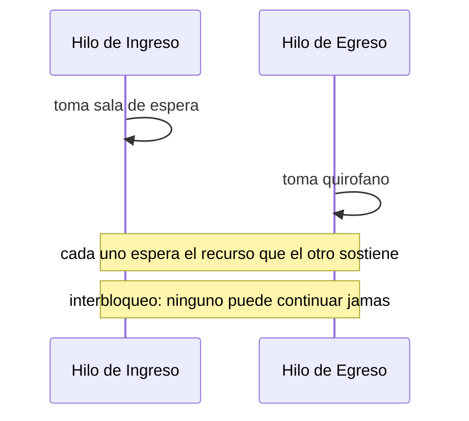
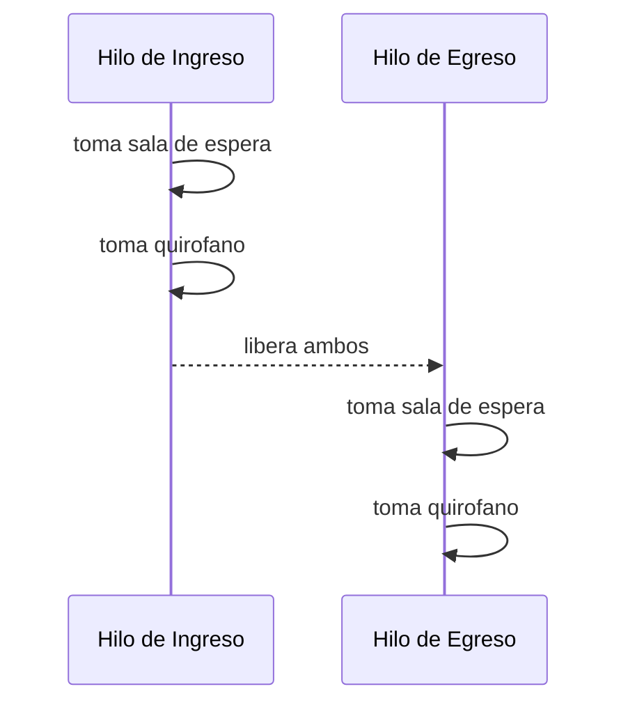

# 💡 Ejemplo 03 — Interbloqueo

## 🌍 Contexto

MediSalud coordina el ingreso y el egreso de pacientes entre la sala de espera y el quirofano,
sincronizando el acceso a ambos recursos. Si dos hilos los toman en orden inverso uno del otro, el
programa puede quedar bloqueado para siempre.

**Qué busca demostrar este ejemplo**: el riesgo de interbloqueo (deadlock) cuando dos hilos sincronizan
sobre los mismos dos recursos en orden inconsistente, y cómo un orden de adquisición consistente lo
evita por completo.

## 🏥 Caso de estudio

MediSalud coordina, entre dos hilos, el acceso a la sala de espera y al quirofano.

## 🗺️ Diagrama





## 🌳 Árbol de archivos — antes

```text
interbloqueo-antes/
└── com/medisalud/
    └── Demo.java
```

**Nota**: `SalaDeEspera` y `Quirofano` se declaran dentro del mismo archivo que `Demo` en esta versión
(en vez de en archivos separados como en el resto del módulo), porque este bloque usa la categoría
especial `no-termina`: se verifica compilándolo y ejecutándolo de forma aislada, con un límite de tiempo
real, sin poder depender de otros archivos de la unidad (Decisión 3 de `research.md`).

> ⚠️ **Este programa no termina.** Si lo ejecutas, quedará interbloqueado para siempre. Detenlo con
> `Ctrl+C` en la terminal donde se ejecuta, o con el botón de detener de la barra de depuración.

## 💻 Archivo: Demo.java

```java no-termina
package com.medisalud;

class SalaDeEspera {
}

class Quirofano {
}

public class Demo {

    private static final SalaDeEspera salaDeEspera = new SalaDeEspera();
    private static final Quirofano quirofano = new Quirofano();

    public static void main(String[] args) throws InterruptedException {
        Thread hiloIngreso = new Thread(() -> {
            synchronized (salaDeEspera) {
                System.out.println("Ingreso: tomo sala de espera");
                dormir(100);
                synchronized (quirofano) {
                    System.out.println("Ingreso: tomo quirofano");
                }
            }
        });

        Thread hiloEgreso = new Thread(() -> {
            synchronized (quirofano) {
                System.out.println("Egreso: tomo quirofano");
                dormir(100);
                synchronized (salaDeEspera) {
                    System.out.println("Egreso: tomo sala de espera");
                }
            }
        });

        hiloIngreso.start();
        hiloEgreso.start();
        hiloIngreso.join();
        hiloEgreso.join();

        System.out.println("Ambos hilos terminaron");
    }

    private static void dormir(long ms) {
        try {
            Thread.sleep(ms);
        } catch (InterruptedException e) {
            Thread.currentThread().interrupt();
        }
    }
}
```

## ✅ Resultado esperado — antes

Esto es lo único que verás en la consola (salida parcial, capturada justo antes de agotar un límite de
tiempo real de 3 segundos):

```text
Ingreso: tomo sala de espera
Egreso: tomo quirofano
```

El programa imprime esas dos líneas y no imprime nada más: cada hilo tomó su primer recurso y quedó
esperando el segundo, que el otro hilo ya sostiene. Ninguno de los dos puede continuar jamás — no es
una cuestión de esperar más tiempo, sino un bloqueo permanente.

## 🌳 Árbol de archivos — después

```text
interbloqueo-despues/
└── com/medisalud/
    ├── SalaDeEspera.java   (nuevo, en archivo propio)
    ├── Quirofano.java    (nuevo, en archivo propio)
    └── Demo.java             (cambió)
```

## 💻 Archivo: SalaDeEspera.java

```java
package com.medisalud;

public class SalaDeEspera {
}
```

## 💻 Archivo: Quirofano.java

```java
package com.medisalud;

public class Quirofano {
}
```

## 💻 Archivo: Demo.java — cambió

```java
package com.medisalud;

public class Demo {

    private static final SalaDeEspera salaDeEspera = new SalaDeEspera();
    private static final Quirofano quirofano = new Quirofano();

    public static void main(String[] args) throws InterruptedException {
        Thread hiloIngreso = new Thread(() -> {
            synchronized (salaDeEspera) {
                System.out.println("Ingreso: tomo sala de espera");
                dormir(100);
                synchronized (quirofano) {
                    System.out.println("Ingreso: tomo quirofano");
                }
            }
        });

        Thread hiloEgreso = new Thread(() -> {
            synchronized (salaDeEspera) {
                System.out.println("Egreso: tomo sala de espera");
                dormir(100);
                synchronized (quirofano) {
                    System.out.println("Egreso: tomo quirofano");
                }
            }
        });

        hiloIngreso.start();
        hiloEgreso.start();
        hiloIngreso.join();
        hiloEgreso.join();

        System.out.println("Ambos hilos terminaron");
    }

    private static void dormir(long ms) {
        try {
            Thread.sleep(ms);
        } catch (InterruptedException e) {
            Thread.currentThread().interrupt();
        }
    }
}
```

## ✅ Resultado esperado — después

```text
Ingreso: tomo sala de espera
Ingreso: tomo quirofano
Egreso: tomo sala de espera
Egreso: tomo quirofano
Ambos hilos terminaron
```

## 🔍 Comparación: la prueba concreta

El único cambio entre ambas versiones es el orden en que el segundo hilo (Egreso) adquiere los
recursos: en la versión "antes", toma `quirofano` primero y `salaDeEspera` después (orden inverso al
del hilo de Ingreso); en la versión "después", toma `salaDeEspera` primero y `quirofano` después
(mismo orden que el hilo de Ingreso). Verificado con un límite de tiempo real: la versión "antes" nunca
termina (código de salida 124, interbloqueo confirmado); la versión "después" termina siempre con
éxito, en corridas sucesivas.

## 🔍 Análisis: errores frecuentes

El error de diseño que causa este interbloqueo es que cada hilo adquiere los mismos dos recursos, pero
en un orden distinto. La corrección no agrega ningún recurso nuevo ni cambia la lógica de negocio: solo
exige que **todos** los hilos que necesiten los mismos recursos compartidos los adquieran siempre en el
mismo orden — una regla de diseño simple, pero fácil de violar sin darse cuenta cuando el código crece.

## ❓ Preguntas de repaso

**1. [Selección]** ¿Qué causa el interbloqueo de la versión "antes" de este ejemplo?

- A. Que los dos hilos comparten demasiadas variables.
- B. Que cada hilo adquiere los mismos dos recursos sincronizados, pero en un orden distinto del otro.
- C. Que ninguno de los dos hilos usa `synchronized`.
- D. Que uno de los dos hilos lanza una excepción.

<details>
<summary>🔑 Ver respuesta</summary>

**Respuesta correcta: B.** El interbloqueo ocurre porque un hilo toma A y espera B, mientras el otro
toma B y espera A: ninguno puede continuar, porque cada uno sostiene el recurso que el otro necesita.

</details>

**2. [Selección múltiple]** ¿Cuáles afirmaciones son verdaderas sobre cómo evitar este interbloqueo?

- A. Alcanza con que todos los hilos adquieran los recursos compartidos siempre en el mismo orden.
- B. Hace falta agregar un tercer recurso para romper el ciclo.
- C. El programa corregido puede seguir teniendo demoras entre adquisiciones, sin volver a
  interbloquearse.
- D. Quitar toda sincronización también evitaría el interbloqueo.

<details>
<summary>🔑 Ver respuesta</summary>

**Respuestas correctas: A y C.** D es engañosa: quitar la sincronización evitaría el interbloqueo, pero
reintroduciría la condición de carrera original sobre los recursos — no es una solución real.

</details>

**3. [Abierta]** Un compañero dice: "un interbloqueo es solo cuestión de mala suerte; si ejecuto el
programa varias veces, en algún momento va a terminar". ¿Estás de acuerdo? Justifica tu respuesta.

<details>
<summary>🔑 Ver respuesta</summary>

No. A diferencia de una condición de carrera (que depende del orden en que se intercalan las
operaciones, y puede dar distintos resultados entre ejecuciones), un interbloqueo real como este —una
vez que ambos hilos ya sostienen su primer recurso y esperan el segundo— es un bloqueo permanente: no
hay ninguna cantidad de tiempo adicional que lo resuelva, porque ninguno de los dos hilos puede avanzar
sin que el otro libere el recurso que sostiene, y ninguno lo va a liberar.

</details>
