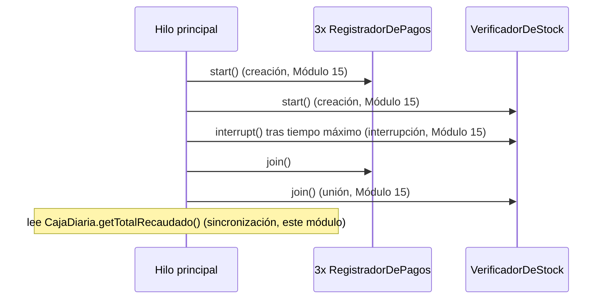

# 💡 Ejemplo 04 — Ejemplo práctico integrador

## 🌍 Contexto

MediSalud registra pagos concurrentemente en una caja diaria compartida, mientras un hilo adicional
verifica el stock de insumos y puede cancelarse si tarda demasiado.

**Qué busca demostrar este ejemplo**: cómo combinar creación, interrupción y unión de hilos (Módulo 15)
con sincronización (este módulo) en un caso práctico realista, y que solo el dato genuinamente
compartido por varios hilos necesita protección.

## 🏥 Caso de estudio

MediSalud registra los pagos del día en una `CajaDiaria` compartida por tres hilos de registro,
mientras un cuarto hilo verifica el stock de insumos.

## 🗺️ Diagrama



## 🌳 Árbol de archivos — antes

```text
integrador-antes/
└── com/medisalud/
    ├── CajaDiaria.java
    ├── RegistradorDePagos.java
    ├── VerificadorDeStock.java
    └── Demo.java
```

## 💻 Archivo: CajaDiaria.java

```java
package com.medisalud;

public class CajaDiaria {

    private int totalRecaudado = 0;

    public void registrarPago(int monto) {
        totalRecaudado += monto;
    }

    public int getTotalRecaudado() {
        return totalRecaudado;
    }
}
```

## 💻 Archivo: RegistradorDePagos.java

```java
package com.medisalud;

public class RegistradorDePagos extends Thread {

    private static final int CANTIDAD_PAGOS = 50_000;
    private static final int MONTO_POR_PAGO = 10;

    private final CajaDiaria caja;

    public RegistradorDePagos(CajaDiaria caja) {
        this.caja = caja;
    }

    @Override
    public void run() {
        for (int i = 0; i < CANTIDAD_PAGOS; i++) {
            caja.registrarPago(MONTO_POR_PAGO);
        }
    }
}
```

## 💻 Archivo: VerificadorDeStock.java

```java
package com.medisalud;

public class VerificadorDeStock extends Thread {

    private static final int CANTIDAD_MAXIMA_CHEQUEOS = 20;
    private static final long DURACION_POR_CHEQUEO_MS = 100;

    private int cantidadChequeada = 0;

    @Override
    public void run() {
        for (int i = 0; i < CANTIDAD_MAXIMA_CHEQUEOS; i++) {
            if (Thread.currentThread().isInterrupted()) {
                return;
            }
            try {
                Thread.sleep(DURACION_POR_CHEQUEO_MS);
            } catch (InterruptedException e) {
                Thread.currentThread().interrupt();
                return;
            }
            cantidadChequeada++;
        }
    }

    public int getCantidadChequeada() {
        return cantidadChequeada;
    }
}
```

## 💻 Archivo: Demo.java

```java
package com.medisalud;

public class Demo {

    private static final int CANTIDAD_REGISTRADORES = 3;
    private static final long TIEMPO_MAXIMO_STOCK_MS = 350;

    public static void main(String[] args) throws InterruptedException {
        CajaDiaria caja = new CajaDiaria();

        RegistradorDePagos[] registradores = new RegistradorDePagos[CANTIDAD_REGISTRADORES];
        for (int i = 0; i < CANTIDAD_REGISTRADORES; i++) {
            registradores[i] = new RegistradorDePagos(caja);
            registradores[i].start();
        }

        VerificadorDeStock verificador = new VerificadorDeStock();
        verificador.start();

        Thread.sleep(TIEMPO_MAXIMO_STOCK_MS);
        verificador.interrupt();

        for (RegistradorDePagos registrador : registradores) {
            registrador.join();
        }
        verificador.join();

        int esperado = CANTIDAD_REGISTRADORES * 50_000 * 10;
        System.out.println("Total recaudado esperado: " + esperado);
        System.out.println("Total recaudado real: " + caja.getTotalRecaudado());
        System.out.println("total_correcto: " + (caja.getTotalRecaudado() == esperado));
        System.out.println("Chequeos de stock completados: " + verificador.getCantidadChequeada());
    }
}
```

## ✅ Resultado esperado — antes

```text
Total recaudado esperado: 1500000
Total recaudado real: 589300
total_correcto: false
Chequeos de stock completados: 3
```

## 🌳 Árbol de archivos — después

```text
integrador-despues/
└── com/medisalud/
    ├── CajaDiaria.java             (cambió)
    ├── RegistradorDePagos.java     (sin cambios)
    ├── VerificadorDeStock.java     (sin cambios)
    └── Demo.java                    (sin cambios)
```

Sin cambios respecto de "antes": `RegistradorDePagos.java`, `VerificadorDeStock.java` y `Demo.java` — su
código ya se mostró arriba y es exactamente el mismo, byte a byte.

<details>
<summary>💻 Ver de nuevo el código sin cambios (RegistradorDePagos.java, VerificadorDeStock.java, Demo.java)</summary>

## 💻 Archivo: RegistradorDePagos.java

```java
package com.medisalud;

public class RegistradorDePagos extends Thread {

    private static final int CANTIDAD_PAGOS = 50_000;
    private static final int MONTO_POR_PAGO = 10;

    private final CajaDiaria caja;

    public RegistradorDePagos(CajaDiaria caja) {
        this.caja = caja;
    }

    @Override
    public void run() {
        for (int i = 0; i < CANTIDAD_PAGOS; i++) {
            caja.registrarPago(MONTO_POR_PAGO);
        }
    }
}
```

## 💻 Archivo: VerificadorDeStock.java

```java
package com.medisalud;

public class VerificadorDeStock extends Thread {

    private static final int CANTIDAD_MAXIMA_CHEQUEOS = 20;
    private static final long DURACION_POR_CHEQUEO_MS = 100;

    private int cantidadChequeada = 0;

    @Override
    public void run() {
        for (int i = 0; i < CANTIDAD_MAXIMA_CHEQUEOS; i++) {
            if (Thread.currentThread().isInterrupted()) {
                return;
            }
            try {
                Thread.sleep(DURACION_POR_CHEQUEO_MS);
            } catch (InterruptedException e) {
                Thread.currentThread().interrupt();
                return;
            }
            cantidadChequeada++;
        }
    }

    public int getCantidadChequeada() {
        return cantidadChequeada;
    }
}
```

## 💻 Archivo: Demo.java

```java
package com.medisalud;

public class Demo {

    private static final int CANTIDAD_REGISTRADORES = 3;
    private static final long TIEMPO_MAXIMO_STOCK_MS = 350;

    public static void main(String[] args) throws InterruptedException {
        CajaDiaria caja = new CajaDiaria();

        RegistradorDePagos[] registradores = new RegistradorDePagos[CANTIDAD_REGISTRADORES];
        for (int i = 0; i < CANTIDAD_REGISTRADORES; i++) {
            registradores[i] = new RegistradorDePagos(caja);
            registradores[i].start();
        }

        VerificadorDeStock verificador = new VerificadorDeStock();
        verificador.start();

        Thread.sleep(TIEMPO_MAXIMO_STOCK_MS);
        verificador.interrupt();

        for (RegistradorDePagos registrador : registradores) {
            registrador.join();
        }
        verificador.join();

        int esperado = CANTIDAD_REGISTRADORES * 50_000 * 10;
        System.out.println("Total recaudado esperado: " + esperado);
        System.out.println("Total recaudado real: " + caja.getTotalRecaudado());
        System.out.println("total_correcto: " + (caja.getTotalRecaudado() == esperado));
        System.out.println("Chequeos de stock completados: " + verificador.getCantidadChequeada());
    }
}
```

</details>

## 💻 Archivo: CajaDiaria.java — cambió

```java
package com.medisalud;

public class CajaDiaria {

    private int totalRecaudado = 0;

    public synchronized void registrarPago(int monto) {
        totalRecaudado += monto;
    }

    public synchronized int getTotalRecaudado() {
        return totalRecaudado;
    }
}
```

## ✅ Resultado esperado — después

```text
Total recaudado esperado: 1500000
Total recaudado real: 1500000
total_correcto: true
Chequeos de stock completados: 3
```

## 🔍 Comparación: la prueba concreta

El único cambio entre ambas versiones es que `CajaDiaria` protege `registrarPago()` y
`getTotalRecaudado()` con `synchronized`. Con tres hilos registrando 50.000 pagos de $10 cada uno
(esperado: $1.500.000), la versión "antes" pierde recaudación real (una condición de carrera real sobre
`totalRecaudado`); la versión "después" da siempre exactamente $1.500.000. La cantidad de chequeos de
stock cancelados (3, tras un tiempo máximo de 350 ms) es idéntica en ambas versiones: `VerificadorDeStock`
es el único hilo que modifica ese conteo, así que nunca tuvo una condición de carrera real — no todo dato
compartido por el programa necesita protección, solo el que varios hilos modifican a la vez.

## 🔍 Análisis: errores frecuentes

El error más frecuente en un caso combinado como este es proteger todos los datos "por las dudas",
incluidos los que un solo hilo modifica. Eso no es incorrecto, pero agrega sincronización innecesaria: la
pregunta correcta no es "¿es un campo de una clase usada por varios hilos?", sino "¿más de un hilo
**escribe** este dato al mismo tiempo?". En este ejemplo, `cantidadChequeada` de `VerificadorDeStock`
nunca necesitó protección, precisamente porque un solo hilo la modifica.

## ❓ Preguntas de repaso

**1. [Selección]** ¿Por qué `cantidadChequeada` de `VerificadorDeStock` no necesita `synchronized`,
mientras que `totalRecaudado` de `CajaDiaria` sí?

- A. Porque `cantidadChequeada` es un `int` y `totalRecaudado` no.
- B. Porque solo `VerificadorDeStock` (un único hilo) modifica `cantidadChequeada`, mientras que tres
  hilos distintos modifican `totalRecaudado` a la vez.
- C. Porque `cantidadChequeada` nunca cambia durante la ejecución.
- D. No hay ninguna diferencia real; ambos deberían protegerse igual.

<details>
<summary>🔑 Ver respuesta</summary>

**Respuesta correcta: B.** Una condición de carrera solo puede ocurrir cuando más de un hilo escribe el
mismo dato al mismo tiempo; con un único escritor, no hace falta ninguna sincronización.

</details>

**2. [Selección múltiple]** Sobre este ejemplo, ¿cuáles afirmaciones son verdaderas?

- A. Combina las tres herramientas de hilos del Módulo 15 (creación, interrupción, unión) con
  sincronización de este módulo.
- B. El hilo principal invoca `join()` sobre los cuatro hilos antes de leer cualquier resultado.
- C. `VerificadorDeStock` se cancela cooperativamente si supera un tiempo máximo.
- D. El total recaudado es correcto en ambas versiones, "antes" y "después".

<details>
<summary>🔑 Ver respuesta</summary>

**Respuestas correctas: A, B y C.** D es falsa: el total recaudado solo es correcto en la versión
"después", protegida con `synchronized`.

</details>

**3. [Abierta]** Un compañero dice: "si un dato es un campo de una clase que se usa desde varios hilos,
siempre hay que protegerlo con `synchronized`, sin excepción". ¿Estás de acuerdo? Justifica tu
respuesta.

<details>
<summary>🔑 Ver respuesta</summary>

No necesariamente. Lo que determina si hace falta sincronizar no es si la clase se usa desde varios
hilos, sino si **más de un hilo escribe ese dato en particular al mismo tiempo**. En este ejemplo,
`cantidadChequeada` es un campo de una clase (`VerificadorDeStock`) que corre en su propio hilo, pero
como ningún otro hilo la modifica, nunca hubo una condición de carrera real que proteger.

</details>
