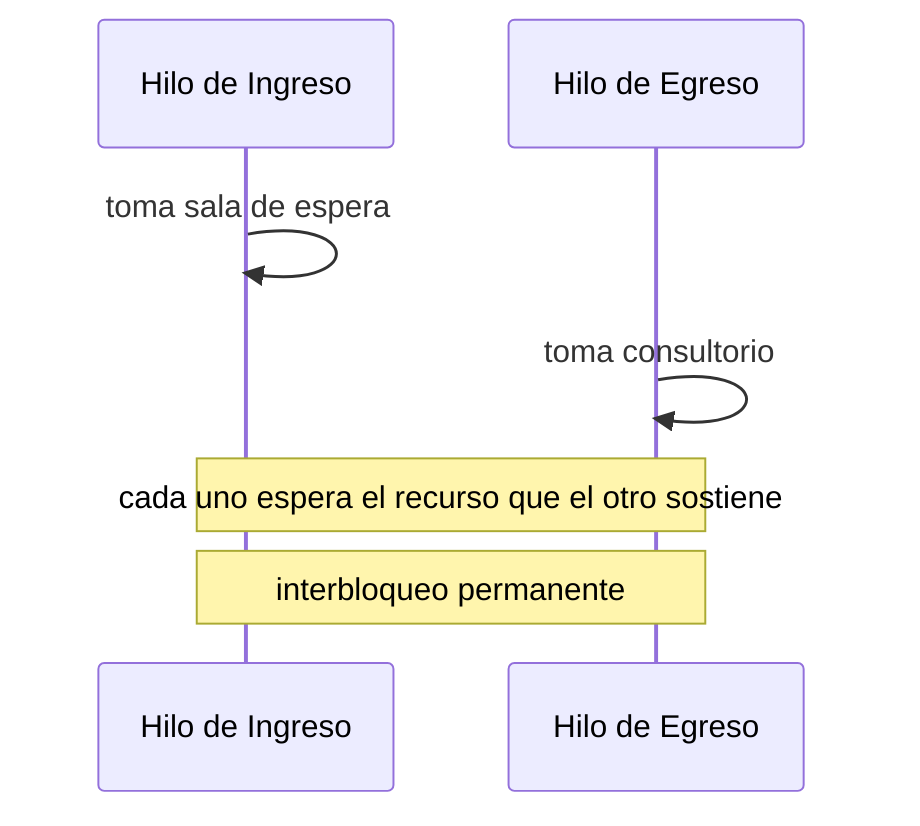
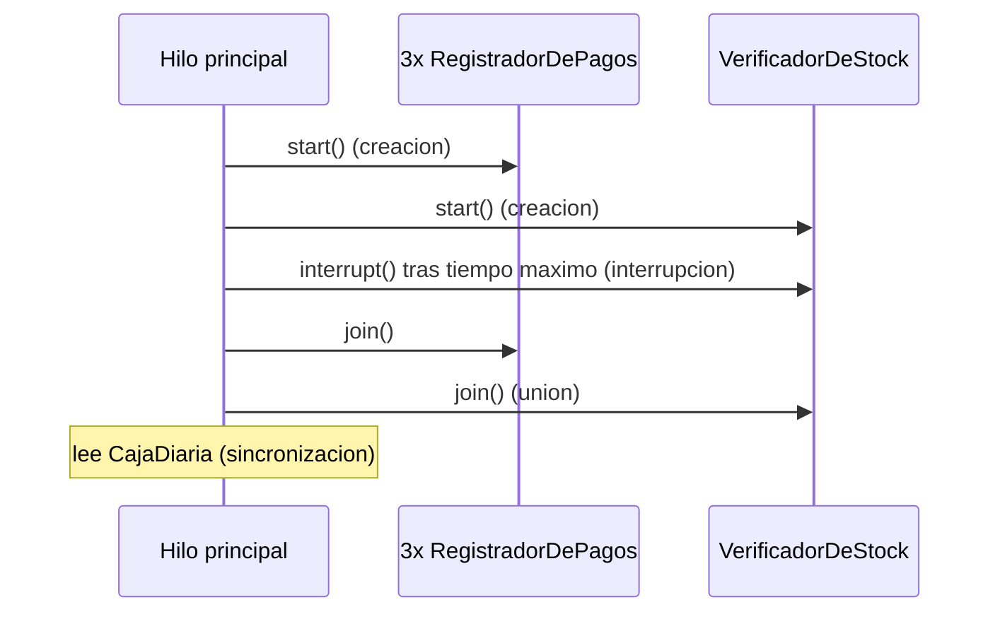
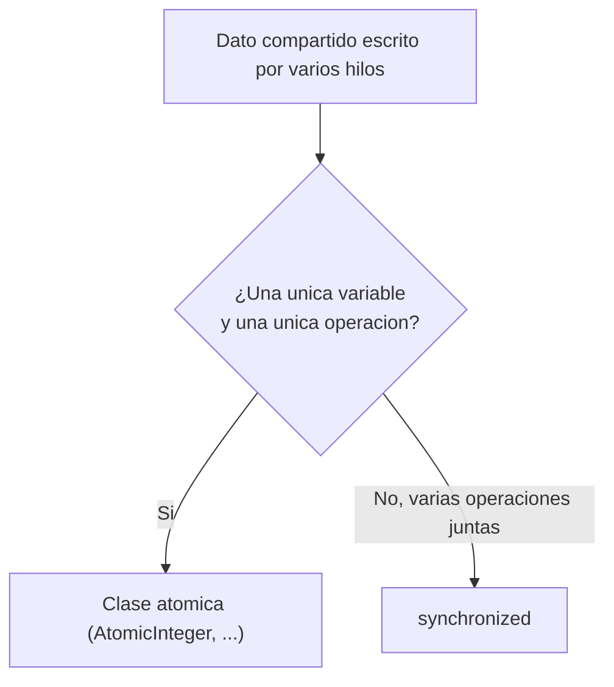

# Módulo 16 — Sincronización de Hilos y Procesos Atómicos

Curso de Java
---
## 🎯 Objetivos del módulo

- Explicar qué es una condición de carrera y qué hace `synchronized` para resolverla.
- Proteger un dato compartido con una clase atómica cuando alcanza, en vez de `synchronized`.
- Reconocer y evitar el riesgo de interbloqueo.
- Combinar estas herramientas con las de creación, interrupción y unión de hilos del Módulo 15.
---
## 🗺️ Ruta de la sesión

1. Sincronización.
2. Acceso atómico.
3. Ejemplos prácticos de concurrencia.
---
## 🌍 Por qué proteger datos compartidos

El Módulo 15 creó, interrumpió y unió hilos que no compartían datos mutables entre sí, por diseño. Este
módulo cubre qué pasa cuando sí los comparten, y cómo protegerlos correctamente.
---
## 🔗 Repaso rápido: herramientas del Módulo 15

- **Creación**: `extends Thread` / `Runnable` + `start()`.
- **Interrupción**: `interrupt()` / `isInterrupted()`, cooperativa.
- **Unión**: `join()`, espera a que un hilo termine.

Este módulo las combina con dos herramientas nuevas: `synchronized` y las clases atómicas.
---
## 🧠 ¿Qué es una condición de carrera?

Ocurre cuando varios hilos leen y escriben el mismo dato mutable sin coordinarse. Una operación
aparentemente simple como `total++` en realidad son tres pasos (leer, sumar, escribir): dos hilos
pueden intercalarse entre esos pasos y perder un incremento — un error silencioso, sin excepción.
---
## 🗺️ Diagrama: condición de carrera

```mermaid
sequenceDiagram
    participant H1 as Hilo 1
    participant H2 as Hilo 2
    participant C as total (compartido)
    H1->>C: lee 41
    H2->>C: lee 41
    H1->>C: escribe 42
    H2->>C: escribe 42
    Note over C: se esperaban dos incrementos; solo se aplico uno
```
---
## 💻 Sincronización — antes (sin proteger)

```java
public void asignarTurno() {
    total++;
}
```

Con 10 hilos × 100.000 incrementos (esperado 1.000.000): real 292.638 en la corrida citada.
---
## 💻 Sincronización — después (`synchronized`)

```java
public synchronized void asignarTurno() {
    total++;
}
```

Mismo total esperado: siempre exactamente 1.000.000, en corridas sucesivas.
---
## 🔍 Sincronización — la prueba concreta

`synchronized` garantiza exclusión mutua: solo un hilo a la vez ejecuta el código protegido sobre la
misma instancia. El total final pasa de ser incorrecto y variable a ser siempre exactamente el esperado.
---
## ⚠️ Error frecuente: proteger solo la escritura

Sincronizar el método que escribe el dato pero no el que lo lee sigue arriesgando leer un valor a medio
actualizar. Hay que sincronizar ambos: escritura y lectura.
---
## 🧠 ¿Qué es el acceso atómico?

Las clases de `java.util.concurrent.atomic` (`AtomicInteger`, `AtomicLong`, `AtomicBoolean`,
`AtomicReference`) ofrecen operaciones que se completan como una única unidad indivisible, sin
necesitar un bloqueo explícito.
---
## 💻 Acceso atómico — después

```java
private final AtomicInteger total = new AtomicInteger(0);

public void registrarAtencion() {
    total.incrementAndGet();
}
```

Mismo problema que Sincronización, mismo resultado: siempre exactamente 1.000.000.
---
## 🔍 Acceso atómico — la prueba concreta

173.871 (antes, sin proteger) vs. 1.000.000 exacto (después, con `AtomicInteger`) — igual de correcto
que `synchronized`, sin declarar ningún método `synchronized`.
---
## 🔎 ¿`synchronized` o clase atómica?

- Una única variable, una única operación (incrementar, leer) → **clase atómica**.
- Varias operaciones relacionadas como una sola unidad (verificar-y-descontar un saldo) →
  **`synchronized`**.
---
## ⚠️ Error frecuente: clase atómica para lo que no alcanza

Una clase atómica protege una única variable con una única operación. Un caso que necesita ejecutar
varias operaciones relacionadas como una sola unidad sigue necesitando `synchronized`.
---
## 🧠 El riesgo de interbloqueo

Cuando dos hilos sincronizan sobre los mismos dos recursos en orden inverso, cada uno puede terminar
esperando el recurso que el otro ya sostiene: ninguno puede continuar jamás.
---
## 🗺️ Diagrama: interbloqueo


---
## 💻 Interbloqueo — antes (orden inverso)

```java
// Hilo de Ingreso
synchronized (salaDeEspera) {
    synchronized (consultorio) { /* ... */ }
}
// Hilo de Egreso
synchronized (consultorio) {
    synchronized (salaDeEspera) { /* ... */ }
}
```

> ⚠️ Este programa no termina.
---
## 💻 Interbloqueo — después (orden consistente)

```java
// Ambos hilos
synchronized (salaDeEspera) {
    synchronized (consultorio) { /* ... */ }
}
```

Mismo orden en los dos hilos: el interbloqueo desaparece por completo.
---
## 🔍 Interbloqueo — la prueba concreta

Verificado con un límite de tiempo real: "antes" agota 3 segundos (código 124, interbloqueo
confirmado); "después" termina siempre con éxito (código 0), en corridas sucesivas.
---
## ⚠️ Un interbloqueo no se resuelve esperando más

Una vez que ambos hilos ya sostienen su primer recurso, ninguno puede avanzar sin que el otro libere el
suyo — y ninguno lo va a liberar. No es una condición de carrera sensible al tiempo: es un bloqueo
permanente.
---
## 🧩 Ejemplo práctico integrador

Combina creación, interrupción y unión de hilos (Módulo 15) con sincronización (este módulo): varios
hilos registran pagos en una caja compartida; un hilo de verificación cancelable; `join()` antes de leer
el resultado final.
---
## 🗺️ Diagrama: ejemplo integrador


---
## 🔍 Ejemplo integrador — la prueba concreta

656.070 (antes, caja sin proteger) vs. $1.500.000 exacto (después, `synchronized`), de $1.500.000
esperados. Los chequeos de stock cancelados (3) son idénticos en ambas versiones.
---
## 💡 No todo dato compartido necesita protección

Solo el dato que **más de un hilo escribe al mismo tiempo** necesita sincronización o acceso atómico. Un
contador modificado por un único hilo (como los chequeos de stock cancelados) nunca tuvo una condición
de carrera real.
---
## ⚠️ Errores frecuentes de este módulo

- Sincronizar la escritura de un dato pero no su lectura.
- Usar una clase atómica para una secuencia de varias operaciones relacionadas.
- Adquirir varios recursos sincronizados en un orden inconsistente entre hilos.
---
## 🗺️ Diagrama: sincronización vs. acceso atómico


---
## 📋 Resumen de las herramientas de protección

| Herramienta | Qué resuelve | Cuándo usarla |
|---|---|---|
| `synchronized` | Exclusión mutua | Varias operaciones relacionadas como una unidad |
| Clases atómicas | Operación indivisible sin bloqueo | Una única variable, una única operación |
---
## 🛠️ Taller: MediSalud

**Taller 01** (Sistema de Registro de Pagos Concurrentes): combina sincronización, orden consistente de
recursos, y las tres herramientas de hilos del Módulo 15.
---
## 🧪 Ejercicios: Biblioteca Universitaria

Un ejercicio Básico (identificar la violación) y uno Intermedio (aplicar la herramienta) por cada uno de
los dos temas técnicos (sincronización, acceso atómico), con la Biblioteca Universitaria como dominio.
---
## 🔴🏆 Avanzado y Desafío: Biblioteca Universitaria

**Avanzado 01**: corregir un diseño con dos temas técnicos ausentes (sincronización + riesgo de
interbloqueo). **Desafío 01**: sin scaffold, combinar el Módulo 15 con este módulo.
---
## ❓ Quiz 01

8 preguntas en formato entrevista técnica: distribuidas entre sincronización, acceso atómico e
interbloqueo/ejemplos prácticos, con la última integradora.
---
## 📚 Repaso: la pregunta clave de cada tema

- **Sincronización**: ¿varios hilos escriben el mismo dato mutable al mismo tiempo?
- **Acceso atómico**: ¿alcanza con proteger una única variable con una única operación?
- **Interbloqueo**: ¿mi diseño sincroniza sobre más de un recurso compartido? ¿siempre en el mismo
  orden?
---
## ✅ Checklist de cierre

- Puedo explicar una condición de carrera y protegerla con `synchronized`.
- Puedo reconocer cuándo una clase atómica alcanza en vez de `synchronized`.
- Puedo reconocer y evitar el riesgo de interbloqueo.
- Completé el taller, los ejercicios Básico e Intermedio de ambos temas técnicos, y el Quiz 01.
---
## 🎓 Cierre

Proteger datos compartidos no es "sincronizar todo por las dudas": es identificar qué dato escriben
varios hilos a la vez, elegir la herramienta correcta (`synchronized` o una clase atómica), y —si hace
falta más de un recurso— adquirirlos siempre en el mismo orden.
