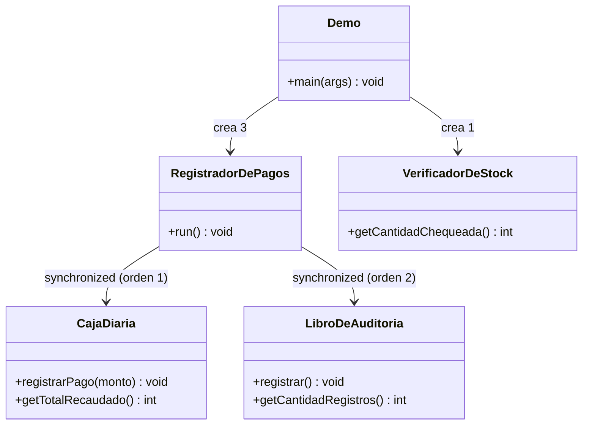

# 🔑 Solución del Taller 01 — Sistema de Registro de Pagos Concurrentes de MediSalud

> Material docente, no enlazar desde la audiencia estudiante.

## 🗺️ Diagrama de clases



## 🌳 Árbol de archivos

```text
GestionDePagosConcurrentes/
└── com/medisalud/
    ├── CajaDiaria.java
    ├── LibroDeAuditoria.java
    ├── RegistradorDePagos.java
    ├── VerificadorDeStock.java
    └── Demo.java
```

## 💻 Código completo

## 💻 Archivo: CajaDiaria.java

```java
package com.medisalud;

public class CajaDiaria {

    private int totalRecaudado = 0;

    public void registrarPago(int monto) {
        totalRecaudado += monto;
    }

    public int getTotalRecaudado() {
        return totalRecaudado;
    }
}
```

## 💻 Archivo: LibroDeAuditoria.java

```java
package com.medisalud;

public class LibroDeAuditoria {

    private int cantidadRegistros = 0;

    public void registrar() {
        cantidadRegistros++;
    }

    public int getCantidadRegistros() {
        return cantidadRegistros;
    }
}
```

## 💻 Archivo: RegistradorDePagos.java

```java
package com.medisalud;

public class RegistradorDePagos extends Thread {

    private static final int CANTIDAD_PAGOS = 50_000;
    private static final int MONTO_POR_PAGO = 10;

    private final CajaDiaria caja;
    private final LibroDeAuditoria auditoria;

    public RegistradorDePagos(CajaDiaria caja, LibroDeAuditoria auditoria) {
        this.caja = caja;
        this.auditoria = auditoria;
    }

    @Override
    public void run() {
        for (int i = 0; i < CANTIDAD_PAGOS; i++) {
            // Orden consistente de adquisicion (caja, luego auditoria) en todos los hilos:
            // evita el riesgo de interbloqueo del Ejemplo 03.
            synchronized (caja) {
                synchronized (auditoria) {
                    caja.registrarPago(MONTO_POR_PAGO);
                    auditoria.registrar();
                }
            }
        }
    }
}
```

## 💻 Archivo: VerificadorDeStock.java

```java
package com.medisalud;

public class VerificadorDeStock extends Thread {

    private static final int CANTIDAD_MAXIMA_CHEQUEOS = 20;
    private static final long DURACION_POR_CHEQUEO_MS = 100;

    private int cantidadChequeada = 0;

    @Override
    public void run() {
        for (int i = 0; i < CANTIDAD_MAXIMA_CHEQUEOS; i++) {
            if (Thread.currentThread().isInterrupted()) {
                return;
            }
            try {
                Thread.sleep(DURACION_POR_CHEQUEO_MS);
            } catch (InterruptedException e) {
                Thread.currentThread().interrupt();
                return;
            }
            cantidadChequeada++;
        }
    }

    public int getCantidadChequeada() {
        return cantidadChequeada;
    }
}
```

## 💻 Archivo: Demo.java

```java
package com.medisalud;

public class Demo {

    private static final int CANTIDAD_REGISTRADORES = 3;
    private static final long TIEMPO_MAXIMO_STOCK_MS = 350;

    public static void main(String[] args) throws InterruptedException {
        CajaDiaria caja = new CajaDiaria();
        LibroDeAuditoria auditoria = new LibroDeAuditoria();

        RegistradorDePagos[] registradores = new RegistradorDePagos[CANTIDAD_REGISTRADORES];
        for (int i = 0; i < CANTIDAD_REGISTRADORES; i++) {
            registradores[i] = new RegistradorDePagos(caja, auditoria);
            registradores[i].start();
        }

        VerificadorDeStock verificador = new VerificadorDeStock();
        verificador.start();

        Thread.sleep(TIEMPO_MAXIMO_STOCK_MS);
        verificador.interrupt();

        for (RegistradorDePagos registrador : registradores) {
            registrador.join();
        }
        verificador.join();

        int esperado = CANTIDAD_REGISTRADORES * 50_000 * 10;
        System.out.println("=== Resumen de pagos del dia ===");
        System.out.println("Total recaudado: " + caja.getTotalRecaudado() + " (esperado: " + esperado + ")");
        System.out.println("total_correcto: " + (caja.getTotalRecaudado() == esperado));
        System.out.println("Registros de auditoria: " + auditoria.getCantidadRegistros() + " (esperado: " + (CANTIDAD_REGISTRADORES * 50_000) + ")");
        System.out.println("Chequeos de stock completados: " + verificador.getCantidadChequeada());
    }
}
```

## ✅ Salida real

```text
=== Resumen de pagos del dia ===
Total recaudado: 1500000 (esperado: 1500000)
total_correcto: true
Registros de auditoria: 150000 (esperado: 150000)
Chequeos de stock completados: 3
```

## ⚠️ Errores comunes observados

- **Sincronizar `caja` y `auditoria` en órdenes distintos en dos métodos distintos** (por ejemplo, si más
  adelante se agrega un método que revierte un pago y toma `auditoria` antes que `caja`): eso reintroduce
  el riesgo de interbloqueo del Ejemplo 03, aunque cada método individual esté correctamente
  sincronizado — la regla es que **todos** los métodos que compartan los mismos recursos los adquieran
  siempre en el mismo orden, no solo el método que se está escribiendo en el momento.
- **Interrumpir `VerificadorDeStock` sin que revise `isInterrupted()` en cada iteración**: sin esa
  revisión (o sin bloquearse en una espera donde `InterruptedException` se manifieste), el hilo completa
  el lote igual, ignorando el pedido — mismo error frecuente que el Módulo 15.
- **Imprimir el resumen final antes de invocar `join()` sobre los cuatro hilos**: eso reintroduce una
  condición de carrera (leer un resultado antes de que los hilos que lo producen terminen), aunque el
  error solo se manifieste esporádicamente según la carga de la máquina.
