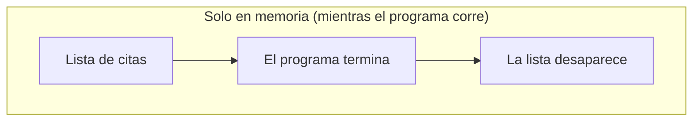
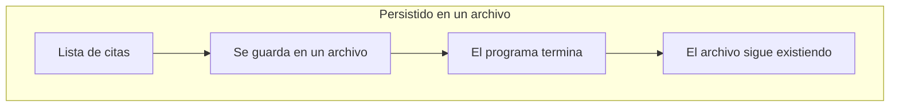

# 💡 Ejemplo 01 — Persistencia de datos

## 🌍 Contexto

MediSalud guarda las citas médicas del día en una lista, en memoria, mientras el programa de gestión de
turnos está corriendo. En cuanto el programa termina, esa lista deja de existir.

## 🗺️ Diagrama

*Arriba: los datos que solo viven en memoria desaparecen apenas termina el programa. Abajo: los datos
persistidos en un archivo sobreviven a la ejecución que los creó.*

## 🧭 Explicación paso a paso

1. Mientras un programa Java corre, todas sus variables (listas, objetos, contadores) viven en la memoria
   del proceso.
2. Cuando el programa termina —normalmente o por un error—, esa memoria se libera por completo: nada de
   lo que estaba solo en una variable sigue existiendo.
3. Si el programa se vuelve a ejecutar, empieza de cero: no hay ningún rastro de la ejecución anterior,
   salvo que los datos se hayan guardado explícitamente en algún lugar que sobreviva al proceso — como un
   archivo en el disco.
4. **Persistir datos** significa, precisamente, guardarlos fuera de la memoria volátil del proceso, en un
   lugar que siga existiendo después de que el programa termine.
5. Este módulo cubre dos formas de persistir datos en Java: como texto plano en un archivo (que se puede
   abrir y leer con cualquier editor), y como objetos completos serializados (que se reconstruyen
   directamente con Java, sin pasar por texto intermedio).

## ✅ Resultado esperado

Un programa de MediSalud que guarda las citas del día solo en una `List` en memoria, ejecutado una vez y
cerrado, y vuelto a ejecutar: la segunda ejecución arranca con una lista vacía. Ninguna cita de la primera
ejecución sobrevivió, porque nunca se guardó en ningún archivo.

## ❓ Preguntas de repaso

**1. [Selección]** ¿Por qué un programa Java pierde todos los datos que tenía en una `List` en memoria
apenas termina?

- A. Porque Java borra automáticamente las listas al final de cada programa.
- B. Porque la memoria del proceso se libera por completo cuando el programa termina, y nada de lo que
  vivía solo ahí sigue existiendo.
- C. Porque las listas tienen un límite de tiempo de vida fijo.
- D. Esto no es cierto: los datos siempre se guardan automáticamente.

🔑 Ver respuesta

**Respuesta correcta: B.** La memoria de un proceso se libera al terminar; cualquier dato que solo vivía
en una variable (como una `List`) desaparece con ella.

**2. [Selección múltiple]** ¿Cuáles de las siguientes afirmaciones sobre la persistencia de datos son
verdaderas?

- A. Persistir datos significa guardarlos en un lugar que sobreviva a la ejecución del programa.
- B. Un archivo en el disco es un ejemplo de almacenamiento persistente.
- C. Una variable local de un método es un ejemplo de almacenamiento persistente.
- D. Sin persistir explícitamente los datos, cada ejecución de un programa empieza de cero.

🔑 Ver respuesta

**Respuestas correctas: A, B y D.** C es falsa: una variable local vive solo en memoria, durante la
ejecución del método — es memoria volátil, no persistente.

**3. [Abierta]** Un compañero dice: "si mi programa imprime los datos por consola, ya están guardados".
¿Estás de acuerdo? Justifica tu respuesta.

🔑 Ver respuesta

No. Imprimir por consola muestra los datos mientras el programa corre, pero no los guarda en ningún
lugar: una vez que la terminal se cierra o se desplaza, esa salida desaparece igual que cualquier otro
dato que solo vivía en memoria. Guardar datos de verdad requiere persistirlos explícitamente, por ejemplo
en un archivo.

