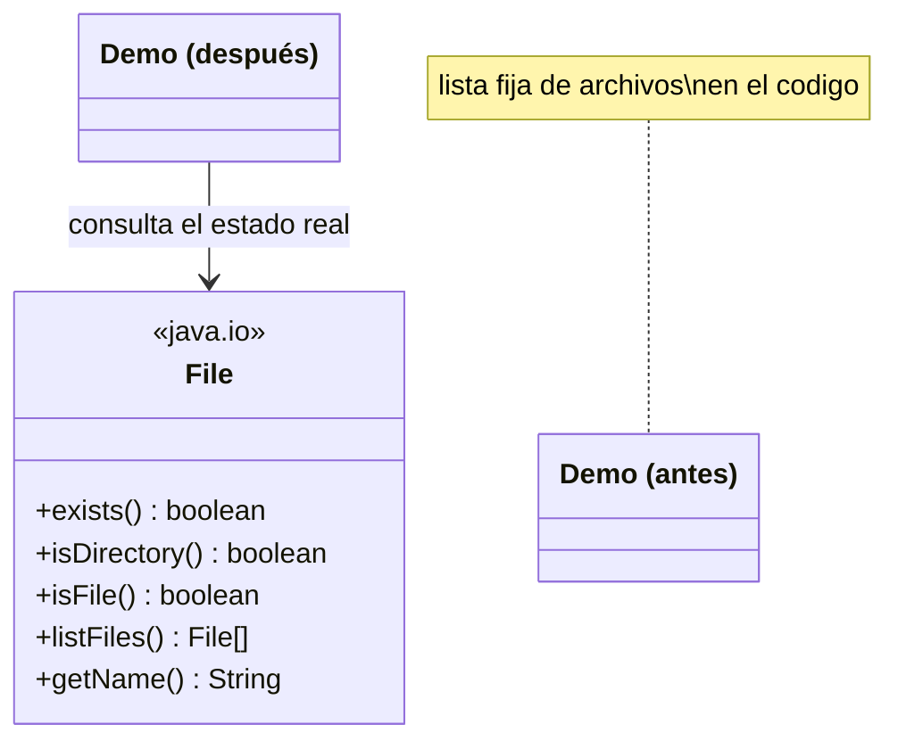

# 💡 Ejemplo 02 — Archivos en Java y la clase File

## 🌍 Contexto

MediSalud guarda las historias clínicas escaneadas en una carpeta del sistema de archivos. El código
actual asume, con una lista fija en el código, cuáles archivos hay en esa carpeta.

**Qué busca demostrar este ejemplo**: qué es un archivo en Java (una ruta en el sistema de archivos) y
cómo la clase `File` permite consultar su estado real, en vez de asumirlo.

## 🏥 Caso de estudio

MediSalud guarda las historias clínicas escaneadas de sus pacientes en la carpeta
`historias_clinicas/`.

## 🗺️ Diagrama



## 🌳 Árbol de archivos — antes

```text
archivos-file-antes/
└── com/medisalud/
    └── Demo.java
```

## 💻 Archivo: Demo.java

```java
package com.medisalud;

public class Demo {

    public static void main(String[] args) {
        String[] archivosEsperados = {"paciente1.txt", "paciente2.txt"};

        System.out.println("Historias clinicas en la carpeta (segun lista fija en el codigo):");
        for (String nombre : archivosEsperados) {
            System.out.println("- " + nombre);
        }
    }
}
```

## ✅ Resultado esperado — antes

```text
Historias clinicas en la carpeta (segun lista fija en el codigo):
- paciente1.txt
- paciente2.txt
```

## 🌳 Árbol de archivos — después

```text
archivos-file-despues/
├── historias_clinicas/         (carpeta real, 3 archivos)
│   ├── paciente1.txt
│   ├── paciente2.txt
│   └── paciente3.txt
└── com/medisalud/
    └── Demo.java                (cambió)
```

## 💻 Archivo: Demo.java — cambió

```java
package com.medisalud;

import java.io.File;
import java.util.Arrays;

public class Demo {

    public static void main(String[] args) {
        File carpeta = new File("historias_clinicas");

        System.out.println("La carpeta existe: " + carpeta.exists());
        System.out.println("Es un directorio: " + carpeta.isDirectory());
        System.out.println("Historias clinicas en la carpeta (listado real):");

        File[] archivos = carpeta.listFiles();
        // El sistema operativo no garantiza ningun orden en listFiles(): se ordena
        // explicitamente para que el listado sea siempre reproducible.
        Arrays.sort(archivos);
        for (File archivo : archivos) {
            System.out.println("- " + archivo.getName() + " (es archivo: " + archivo.isFile() + ")");
        }
    }
}
```

## ✅ Resultado esperado — después

```text
La carpeta existe: true
Es un directorio: true
Historias clinicas en la carpeta (listado real):
- paciente1.txt (es archivo: true)
- paciente2.txt (es archivo: true)
- paciente3.txt (es archivo: true)
```

## 🔍 Comparación: la prueba concreta

La carpeta `historias_clinicas/` tiene realmente **tres** archivos. La versión "antes" solo menciona dos
nombres fijos en el código — desactualizados, porque nadie los actualizó cuando se agregó el tercer
archivo. La versión "después" usa `File.listFiles()` para listar el contenido **real** de la carpeta en
el momento en que el programa corre: siempre muestra los tres archivos, sin importar cuántos haya de
verdad, porque los consulta en vez de asumirlos. El orden se fija explícitamente con `Arrays.sort()`,
porque el sistema operativo no garantiza ningún orden en `listFiles()`.

## 🔍 Análisis: errores frecuentes

El error más frecuente es asumir el contenido de una carpeta con una lista fija en el código, en vez de
consultarlo con `File`. Eso funciona mientras la carpeta no cambie, pero queda desactualizado apenas se
agrega, renombra o borra un archivo — un error silencioso, porque el programa sigue compilando y
ejecutándose sin ningún aviso.

## ❓ Preguntas de repaso

**1. [Selección]** ¿Qué representa un objeto `File` en Java?

- A. El contenido completo de un archivo, cargado en memoria.
- B. Una ruta (absoluta o relativa) en el sistema de archivos, que puede existir o no.
- C. Una conexión abierta a un archivo, lista para leer o escribir.
- D. Una copia del archivo real, independiente del disco.

<details>
<summary>🔑 Ver respuesta</summary>

**Respuesta correcta: B.** `File` representa una ruta del sistema de archivos, no el contenido: por eso
tiene métodos como `exists()` para consultar si esa ruta corresponde a algo real.

</details>

**2. [Selección múltiple]** Sobre la versión "después" de este ejemplo, ¿cuáles afirmaciones son
verdaderas?

- A. `listFiles()` siempre refleja el contenido real y actual de la carpeta.
- B. El orden de `listFiles()` está garantizado por Java, igual en cualquier sistema operativo.
- C. `isFile()` permite distinguir un archivo de un subdirectorio dentro del listado.
- D. Si se agrega un cuarto archivo a la carpeta, el listado lo mostraría sin cambiar el código.

<details>
<summary>🔑 Ver respuesta</summary>

**Respuestas correctas: A, C y D.** B es falsa: el orden de `listFiles()` no está garantizado por la
especificación de Java, por eso el ejemplo lo ordena explícitamente con `Arrays.sort()`.

</details>

**3. [Abierta]** Un compañero dice: "si mi programa ya sabe qué archivos necesita, no hace falta usar
`File` para consultarlos". ¿Estás de acuerdo? Justifica tu respuesta.

<details>
<summary>🔑 Ver respuesta</summary>

No siempre. Si la lista de archivos puede cambiar con el tiempo (se agregan, se borran, se renombran),
una lista fija en el código queda desactualizada sin ningún aviso. Usar `File` para consultar el estado
real del sistema de archivos hace que el programa siga siendo correcto aunque el contenido de la carpeta
cambie, sin tener que tocar el código cada vez.

</details>
