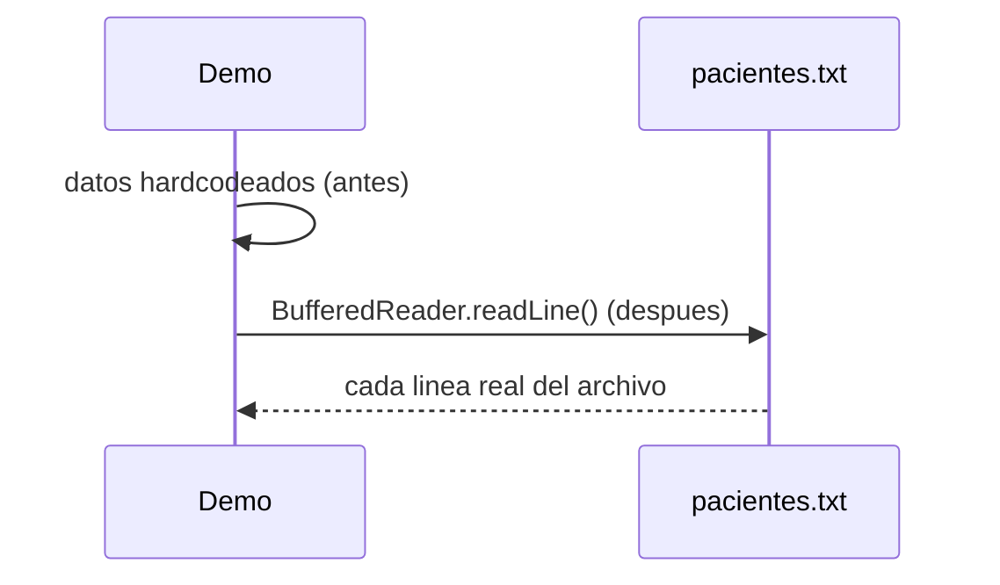

# 💡 Ejemplo 03 — Lectura de datos de un archivo

## 🌍 Contexto

MediSalud mantiene la lista de pacientes citados hoy. El código actual tiene esa lista hardcodeada
directamente en el programa.

**Qué busca demostrar este ejemplo**: cómo leer datos reales desde un archivo de texto, línea por línea,
y cómo manejar el caso real de que el archivo no exista.

## 🏥 Caso de estudio

MediSalud guarda la lista de pacientes citados en un archivo de texto, `pacientes.txt`.

## 🗺️ Diagrama



## 🌳 Árbol de archivos — antes

```text
lectura-antes/
└── com/medisalud/
    └── Demo.java
```

## 💻 Archivo: Demo.java

```java
package com.medisalud;

public class Demo {

    public static void main(String[] args) {
        String[] pacientes = {
            "Ana Torres,BASICA",
            "Luis Rios,INTERMEDIA",
            "Marta Diaz,AVANZADA"
        };

        System.out.println("Pacientes (hardcodeados en el codigo):");
        for (String linea : pacientes) {
            System.out.println(linea);
        }
    }
}
```

## ✅ Resultado esperado — antes

```text
Pacientes (hardcodeados en el codigo):
Ana Torres,BASICA
Luis Rios,INTERMEDIA
Marta Diaz,AVANZADA
```

## 🌳 Árbol de archivos — después

```text
lectura-despues/
├── pacientes.txt              (archivo real, 3 líneas)
└── com/medisalud/
    └── Demo.java                (cambió)
```

## 💻 Archivo: Demo.java — cambió

```java
package com.medisalud;

import java.io.BufferedReader;
import java.io.FileNotFoundException;
import java.io.FileReader;
import java.io.IOException;

public class Demo {

    public static void main(String[] args) {
        System.out.println("Pacientes (leidos desde pacientes.txt):");
        try (BufferedReader lector = new BufferedReader(new FileReader("pacientes.txt"))) {
            String linea;
            while ((linea = lector.readLine()) != null) {
                System.out.println(linea);
            }
        } catch (IOException e) {
            System.out.println("No se pudo leer pacientes.txt: " + e.getMessage());
        }

        System.out.println("Intentando leer un archivo que no existe:");
        try (BufferedReader lector = new BufferedReader(new FileReader("archivo_faltante.txt"))) {
            lector.readLine();
        } catch (FileNotFoundException e) {
            System.out.println("Archivo no encontrado, manejado correctamente.");
        } catch (IOException e) {
            System.out.println("Error inesperado: " + e.getMessage());
        }
    }
}
```

## ✅ Resultado esperado — después

```text
Pacientes (leidos desde pacientes.txt):
Ana Torres,BASICA
Luis Rios,INTERMEDIA
Marta Diaz,AVANZADA
Intentando leer un archivo que no existe:
Archivo no encontrado, manejado correctamente.
```

## 🔍 Comparación: la prueba concreta

Ambas versiones dan la misma salida para los tres pacientes: la versión "antes" porque están hardcodeados
en el código; la versión "después" porque se leen realmente desde `pacientes.txt`, línea por línea, con
`BufferedReader`. Además, la versión "después" intenta leer un archivo que no existe
(`archivo_faltante.txt`) y captura la `FileNotFoundException` real de forma controlada, terminando con
éxito de todas formas.

## 🔍 Análisis: errores frecuentes

El error más frecuente es asumir que el archivo que se va a leer siempre existe, sin manejar
`FileNotFoundException`. Un archivo puede no existir por muchas razones (se borró, se movió, nunca se
creó): un programa que no maneja ese caso termina abruptamente en vez de dar un mensaje claro.

## ❓ Preguntas de repaso

**1. [Selección]** ¿Qué hace `BufferedReader.readLine()`?

- A. Lee todo el archivo de una sola vez, como un único `String`.
- B. Lee una línea del archivo y devuelve `null` cuando ya no quedan más líneas.
- C. Borra la línea leída del archivo original.
- D. Solo funciona con archivos que tienen exactamente una línea.

<details>
<summary>🔑 Ver respuesta</summary>

**Respuesta correcta: B.** `readLine()` devuelve una línea por vez, y `null` cuando llega al final del
archivo — por eso el patrón típico es un `while ((linea = lector.readLine()) != null)`.

</details>

**2. [Selección múltiple]** Sobre la versión "después" de este ejemplo, ¿cuáles afirmaciones son
verdaderas?

- A. Usa try-with-resources para asegurarse de que el archivo se cierre.
- B. `FileNotFoundException` es una excepción real, capturada de forma controlada.
- C. El programa termina con un error no manejado al intentar leer el archivo ausente.
- D. La salida de los tres pacientes es idéntica a la de la versión "antes".

<details>
<summary>🔑 Ver respuesta</summary>

**Respuestas correctas: A, B y D.** C es falsa: el programa maneja la excepción y termina con éxito
(código 0), no con un error no manejado.

</details>

**3. [Abierta]** Un compañero dice: "si uso `BufferedReader`, no hace falta preocuparme por cerrar el
archivo". ¿Estás de acuerdo? Justifica tu respuesta.

<details>
<summary>🔑 Ver respuesta</summary>

No exactamente: `BufferedReader` no se cierra solo. Lo que evita tener que cerrarlo manualmente es
usarlo dentro de un bloque try-with-resources (`try (BufferedReader lector = ...) { ... }`), que
garantiza que se cierre automáticamente al salir del bloque, incluso si ocurre una excepción — pero esa
garantía viene del try-with-resources, no de `BufferedReader` por sí solo.

</details>
