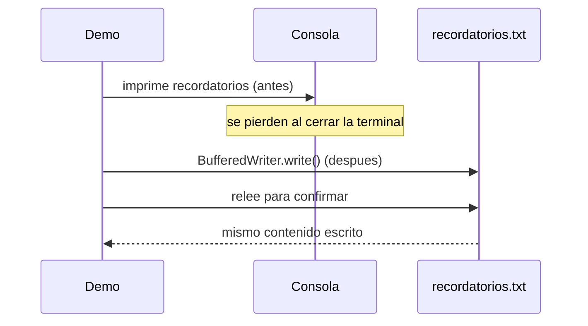

# 💡 Ejemplo 04 — Escritura de datos de un archivo

## 🌍 Contexto

MediSalud genera recordatorios de citas para el día siguiente. El código actual solo los imprime por
consola.

**Qué busca demostrar este ejemplo**: cómo escribir datos en un archivo de texto para que sobrevivan a la
ejecución del programa, en vez de perderse apenas termina.

## 🏥 Caso de estudio

MediSalud genera recordatorios de citas para el día siguiente.

## 🗺️ Diagrama



## 🌳 Árbol de archivos — antes

```text
escritura-antes/
└── com/medisalud/
    └── Demo.java
```

## 💻 Archivo: Demo.java

```java
package com.medisalud;

public class Demo {

    public static void main(String[] args) {
        String[] recordatorios = {
            "Recordatorio: cita de Ana Torres manana a las 9:00",
            "Recordatorio: cita de Luis Rios manana a las 10:00"
        };

        for (String recordatorio : recordatorios) {
            System.out.println(recordatorio);
        }
        System.out.println("Los recordatorios se imprimieron, pero no quedan guardados en ningun lado.");
    }
}
```

## ✅ Resultado esperado — antes

```text
Recordatorio: cita de Ana Torres manana a las 9:00
Recordatorio: cita de Luis Rios manana a las 10:00
Los recordatorios se imprimieron, pero no quedan guardados en ningun lado.
```

## 🌳 Árbol de archivos — después

```text
escritura-despues/
└── com/medisalud/
    └── Demo.java                (cambió)
```

## 💻 Archivo: Demo.java — cambió

```java
package com.medisalud;

import java.io.BufferedReader;
import java.io.BufferedWriter;
import java.io.File;
import java.io.FileReader;
import java.io.FileWriter;
import java.io.IOException;

public class Demo {

    public static void main(String[] args) {
        String[] recordatorios = {
            "Recordatorio: cita de Ana Torres manana a las 9:00",
            "Recordatorio: cita de Luis Rios manana a las 10:00"
        };

        try (BufferedWriter escritor = new BufferedWriter(new FileWriter("recordatorios.txt"))) {
            for (String recordatorio : recordatorios) {
                escritor.write(recordatorio);
                escritor.newLine();
            }
        } catch (IOException e) {
            System.out.println("No se pudo escribir recordatorios.txt: " + e.getMessage());
            return;
        }

        File archivo = new File("recordatorios.txt");
        System.out.println("El archivo existe despues de escribirlo: " + archivo.exists());

        System.out.println("Contenido real leido de vuelta desde recordatorios.txt:");
        try (BufferedReader lector = new BufferedReader(new FileReader("recordatorios.txt"))) {
            String linea;
            while ((linea = lector.readLine()) != null) {
                System.out.println(linea);
            }
        } catch (IOException e) {
            System.out.println("No se pudo leer recordatorios.txt: " + e.getMessage());
        }
    }
}
```

## ✅ Resultado esperado — después

```text
El archivo existe despues de escribirlo: true
Contenido real leido de vuelta desde recordatorios.txt:
Recordatorio: cita de Ana Torres manana a las 9:00
Recordatorio: cita de Luis Rios manana a las 10:00
```

## 🔍 Comparación: la prueba concreta

La versión "antes" solo imprime los dos recordatorios por consola: en cuanto el programa termina, no
queda ningún rastro de ellos. La versión "después" los escribe en `recordatorios.txt` con
`BufferedWriter`, confirma con `File.exists()` que el archivo existe realmente después de escribirlo, y
lo vuelve a leer para confirmar que el contenido persistido es exactamente el mismo que se escribió.

## 🔍 Análisis: errores frecuentes

El error más frecuente es confundir "imprimir por consola" con "guardar los datos". Ambos muestran
información, pero solo escribir en un archivo real hace que esa información sobreviva a la ejecución del
programa.

## ❓ Preguntas de repaso

**1. [Selección]** ¿Qué diferencia hay entre imprimir datos por consola y escribirlos en un archivo?

- A. Ninguna: ambas formas guardan los datos de la misma manera.
- B. Imprimir por consola solo muestra los datos mientras el programa corre; escribirlos en un archivo
  los persiste más allá de esa ejecución.
- C. Escribir en un archivo es más lento, pero no cambia si los datos se guardan o no.
- D. Imprimir por consola guarda los datos en un archivo de log automáticamente.

<details>
<summary>🔑 Ver respuesta</summary>

**Respuesta correcta: B.** Imprimir por consola es una salida temporal; solo escribir en un archivo (u
otro medio persistente) hace que los datos sobrevivan a la ejecución del programa.

</details>

**2. [Selección múltiple]** Sobre la versión "después" de este ejemplo, ¿cuáles afirmaciones son
verdaderas?

- A. Usa `BufferedWriter` con try-with-resources para escribir el archivo.
- B. Confirma con `File.exists()` que el archivo existe después de escribirlo.
- C. El archivo `recordatorios.txt` desaparece apenas el programa termina.
- D. Relee el archivo para confirmar que el contenido persistido coincide con lo escrito.

<details>
<summary>🔑 Ver respuesta</summary>

**Respuestas correctas: A, B y D.** C es falsa: el archivo persiste después de que el programa termina,
precisamente porque se escribió en el sistema de archivos, no solo en memoria.

</details>

**3. [Abierta]** Un compañero dice: "si mi programa no muestra ningún error, seguro que el archivo se
escribió bien". ¿Estás de acuerdo? Justifica tu respuesta.

<details>
<summary>🔑 Ver respuesta</summary>

No exactamente: la ausencia de un error visible no es, por sí sola, una prueba de que el archivo se
escribió correctamente. La forma real de confirmarlo es verificar el resultado — por ejemplo, consultando
`File.exists()` después de escribir, o releyendo el archivo y comparando su contenido con lo que se
esperaba escribir, como hace este ejemplo.

</details>
