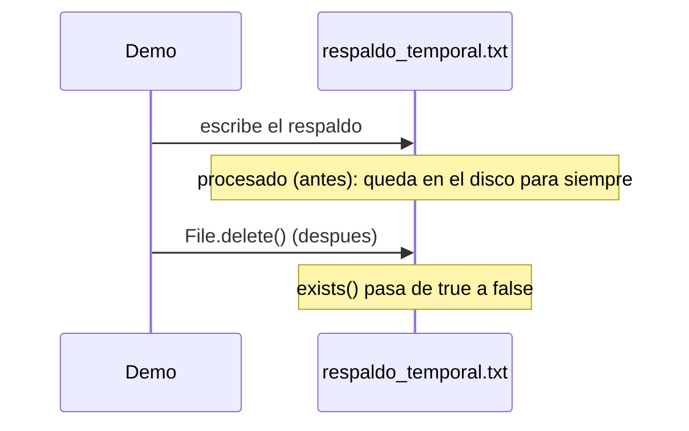

# 💡 Ejemplo 05 — Borrado de un archivo

## 🌍 Contexto

MediSalud genera un respaldo temporal antes de procesar un lote de facturación. El código actual nunca
lo borra, aunque ya se haya usado.

**Qué busca demostrar este ejemplo**: cómo borrar un archivo que ya no hace falta, y confirmar el
resultado real sobre el sistema de archivos.

## 🏥 Caso de estudio

MediSalud genera un respaldo temporal antes de procesar la facturación del día.

## 🗺️ Diagrama



## 🌳 Árbol de archivos — antes

```text
borrado-antes/
└── com/medisalud/
    └── Demo.java
```

## 💻 Archivo: Demo.java

```java
package com.medisalud;

import java.io.BufferedWriter;
import java.io.File;
import java.io.FileWriter;
import java.io.IOException;

public class Demo {

    public static void main(String[] args) {
        try (BufferedWriter escritor = new BufferedWriter(new FileWriter("respaldo_temporal.txt"))) {
            escritor.write("Respaldo temporal ya procesado");
            escritor.newLine();
        } catch (IOException e) {
            System.out.println("No se pudo escribir el respaldo: " + e.getMessage());
            return;
        }

        File respaldo = new File("respaldo_temporal.txt");
        System.out.println("El respaldo ya fue procesado, pero el archivo sigue existiendo: " + respaldo.exists());
        System.out.println("Nada en este programa lo borra: queda acumulado en el disco para siempre.");
    }
}
```

## ✅ Resultado esperado — antes

```text
El respaldo ya fue procesado, pero el archivo sigue existiendo: true
Nada en este programa lo borra: queda acumulado en el disco para siempre.
```

## 🌳 Árbol de archivos — después

```text
borrado-despues/
└── com/medisalud/
    └── Demo.java                (cambió)
```

## 💻 Archivo: Demo.java — cambió

```java
package com.medisalud;

import java.io.BufferedWriter;
import java.io.File;
import java.io.FileWriter;
import java.io.IOException;

public class Demo {

    public static void main(String[] args) {
        try (BufferedWriter escritor = new BufferedWriter(new FileWriter("respaldo_temporal.txt"))) {
            escritor.write("Respaldo temporal ya procesado");
            escritor.newLine();
        } catch (IOException e) {
            System.out.println("No se pudo escribir el respaldo: " + e.getMessage());
            return;
        }

        File respaldo = new File("respaldo_temporal.txt");
        System.out.println("El respaldo existe antes de borrarlo: " + respaldo.exists());

        boolean borrado = respaldo.delete();
        System.out.println("El borrado tuvo exito: " + borrado);
        System.out.println("El respaldo existe despues de borrarlo: " + respaldo.exists());
    }
}
```

## ✅ Resultado esperado — después

```text
El respaldo existe antes de borrarlo: true
El borrado tuvo exito: true
El respaldo existe despues de borrarlo: false
```

## 🔍 Comparación: la prueba concreta

Ambas versiones escriben el mismo respaldo temporal. La versión "antes" nunca lo borra: sigue existiendo
en el disco indefinidamente, incluso después de "procesarlo". La versión "después" invoca
`File.delete()`: `exists()` pasa de `true` (antes de borrar) a `false` (después de borrar), confirmando
que el archivo realmente desapareció del sistema de archivos.

## 🔍 Análisis: errores frecuentes

El error más frecuente es no distinguir entre un archivo temporal (que existe solo para un paso
intermedio del procesamiento) y un archivo que debe persistir. Los archivos temporales que nunca se
borran se acumulan indefinidamente, ocupando espacio en disco sin ningún beneficio.

## ❓ Preguntas de repaso

**1. [Selección]** ¿Qué devuelve `File.delete()`?

- A. Nada: es un método `void`.
- B. Un `boolean` que indica si el borrado tuvo éxito.
- C. El contenido del archivo antes de borrarlo.
- D. Una excepción, siempre.

<details>
<summary>🔑 Ver respuesta</summary>

**Respuesta correcta: B.** `delete()` devuelve `true` si el borrado tuvo éxito, `false` si no (por
ejemplo, si el archivo no existía o no había permisos), sin lanzar una excepción por ese motivo.

</details>

**2. [Selección múltiple]** Sobre la versión "después" de este ejemplo, ¿cuáles afirmaciones son
verdaderas?

- A. `exists()` es `true` antes de invocar `delete()`.
- B. `exists()` es `false` después de invocar `delete()`, si el borrado tuvo éxito.
- C. El archivo sigue existiendo después de borrarlo, solo que vacío.
- D. Borrar el archivo evita que se acumule indefinidamente en el disco.

<details>
<summary>🔑 Ver respuesta</summary>

**Respuestas correctas: A, B y D.** C es falsa: un archivo borrado con éxito deja de existir por
completo, no queda vacío.

</details>

**3. [Abierta]** Un compañero dice: "nunca hay que borrar archivos, por las dudas de necesitarlos
después". ¿Estás de acuerdo? Justifica tu respuesta.

<details>
<summary>🔑 Ver respuesta</summary>

No siempre. Hay archivos que, por diseño, son temporales — existen solo para un paso intermedio de un
proceso, como un respaldo usado antes de facturar. Conservarlos indefinidamente "por las dudas" acumula
archivos innecesarios en el disco, sin ningún beneficio real una vez que ya cumplieron su propósito. La
clave es distinguir qué datos deben persistir de verdad de los que son solo temporales.

</details>
