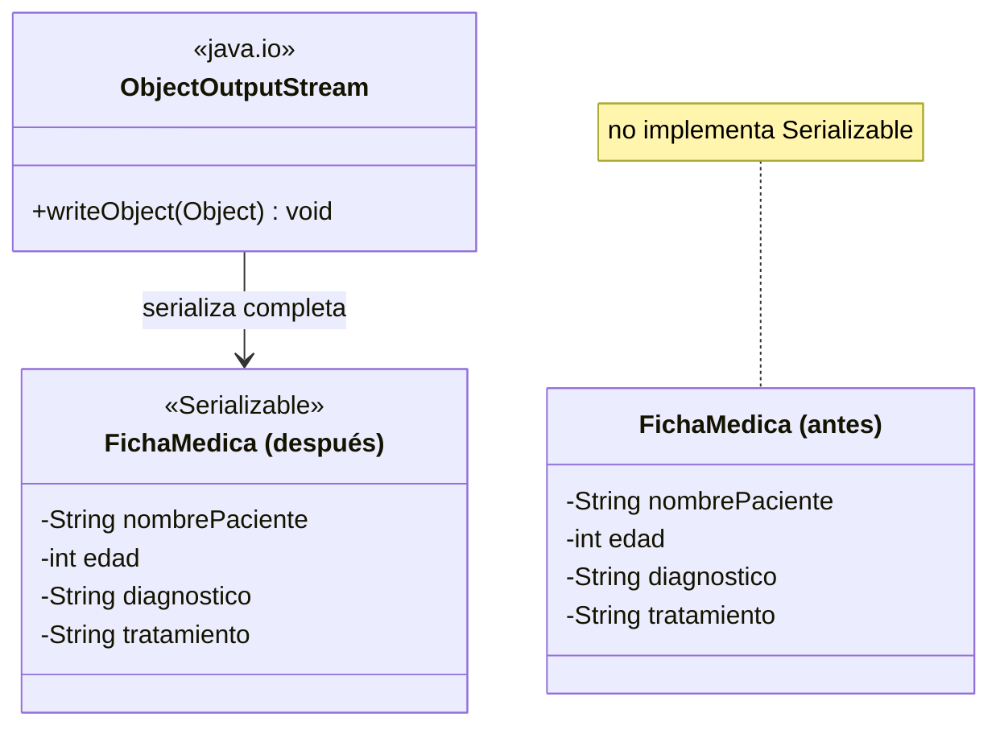

# 💡 Ejemplo 06 — Serializar objetos

## 🌍 Contexto

MediSalud guarda historias clínicas completas, con varios campos cada una. El código actual escribe cada
campo a mano, como texto, uno por uno.

**Qué busca demostrar este ejemplo**: cómo serializar un objeto completo con `Serializable` y
`ObjectOutputStream`, en vez de escribir cada campo por separado.

## 🏥 Caso de estudio

MediSalud persiste historias clínicas completas de sus pacientes.

## 🗺️ Diagrama



## 🌳 Árbol de archivos — antes

```text
serializar-antes/
└── com/medisalud/
    ├── FichaMedica.java
    └── Demo.java
```

## 💻 Archivo: FichaMedica.java

```java
package com.medisalud;

public class FichaMedica {

    private String nombrePaciente;
    private int edad;
    private String diagnostico;
    private String tratamiento;

    public FichaMedica(String nombrePaciente, int edad, String diagnostico, String tratamiento) {
        this.nombrePaciente = nombrePaciente;
        this.edad = edad;
        this.diagnostico = diagnostico;
        this.tratamiento = tratamiento;
    }

    public String getNombrePaciente() {
        return nombrePaciente;
    }

    public int getEdad() {
        return edad;
    }

    public String getDiagnostico() {
        return diagnostico;
    }

    public String getTratamiento() {
        return tratamiento;
    }
}
```

## 💻 Archivo: Demo.java

```java
package com.medisalud;

import java.io.BufferedWriter;
import java.io.FileWriter;
import java.io.IOException;

public class Demo {

    public static void main(String[] args) {
        FichaMedica historia = new FichaMedica("Ana Torres", 34, "Gripe", "Reposo e hidratacion");

        try (BufferedWriter escritor = new BufferedWriter(new FileWriter("historia_manual.txt"))) {
            // Cada campo se escribe a mano, en un orden que hay que recordar exactamente
            // para poder reconstruir el objeto despues.
            escritor.write(historia.getNombrePaciente());
            escritor.newLine();
            escritor.write(String.valueOf(historia.getEdad()));
            escritor.newLine();
            escritor.write(historia.getDiagnostico());
            escritor.newLine();
            escritor.write(historia.getTratamiento());
            escritor.newLine();
        } catch (IOException e) {
            System.out.println("No se pudo escribir historia_manual.txt: " + e.getMessage());
            return;
        }

        System.out.println("Historia clinica escrita a mano, campo por campo, en historia_manual.txt");
    }
}
```

## ✅ Resultado esperado — antes

```text
Historia clinica escrita a mano, campo por campo, en historia_manual.txt
```

## 🌳 Árbol de archivos — después

```text
serializar-despues/
├── com/medisalud/
│   ├── FichaMedica.java         (cambió)
│   ├── RegistroNoSerializable.java  (nuevo)
│   └── Demo.java                     (cambió)
```

## 💻 Archivo: FichaMedica.java — cambió

```java
package com.medisalud;

import java.io.Serializable;

public class FichaMedica implements Serializable {

    private static final long serialVersionUID = 1L;

    private String nombrePaciente;
    private int edad;
    private String diagnostico;
    private String tratamiento;

    public FichaMedica(String nombrePaciente, int edad, String diagnostico, String tratamiento) {
        this.nombrePaciente = nombrePaciente;
        this.edad = edad;
        this.diagnostico = diagnostico;
        this.tratamiento = tratamiento;
    }

    public String getNombrePaciente() {
        return nombrePaciente;
    }

    public int getEdad() {
        return edad;
    }

    public String getDiagnostico() {
        return diagnostico;
    }

    public String getTratamiento() {
        return tratamiento;
    }

    @Override
    public String toString() {
        return nombrePaciente + " (" + edad + " anios) - " + diagnostico + " - " + tratamiento;
    }
}
```

## 💻 Archivo: RegistroNoSerializable.java — nuevo

```java
package com.medisalud;

public class RegistroNoSerializable {

    private String detalle;

    public RegistroNoSerializable(String detalle) {
        this.detalle = detalle;
    }

    public String getDetalle() {
        return detalle;
    }
}
```

## 💻 Archivo: Demo.java — cambió

```java
package com.medisalud;

import java.io.FileOutputStream;
import java.io.IOException;
import java.io.NotSerializableException;
import java.io.ObjectOutputStream;

public class Demo {

    public static void main(String[] args) {
        FichaMedica historia = new FichaMedica("Ana Torres", 34, "Gripe", "Reposo e hidratacion");

        try (ObjectOutputStream salida = new ObjectOutputStream(new FileOutputStream("historia.ser"))) {
            salida.writeObject(historia);
            System.out.println("Historia clinica serializada completa en historia.ser");
        } catch (IOException e) {
            System.out.println("No se pudo serializar la historia clinica: " + e.getMessage());
        }

        System.out.println("Intentando serializar una clase que no implementa Serializable:");
        RegistroNoSerializable registro = new RegistroNoSerializable("dato sin serializar");
        try (ObjectOutputStream salida = new ObjectOutputStream(new FileOutputStream("registro.ser"))) {
            salida.writeObject(registro);
        } catch (NotSerializableException e) {
            System.out.println("NotSerializableException, manejada correctamente: " + e.getMessage());
        } catch (IOException e) {
            System.out.println("Error inesperado: " + e.getMessage());
        }
    }
}
```

## ✅ Resultado esperado — después

```text
Historia clinica serializada completa en historia.ser
Intentando serializar una clase que no implementa Serializable:
NotSerializableException, manejada correctamente: com.medisalud.RegistroNoSerializable
```

## 🔍 Comparación: la prueba concreta

La versión "antes" escribe los cuatro campos de `FichaMedica` como cuatro líneas de texto separadas,
a mano — hay que recordar el orden exacto para poder reconstruirla después. La versión "después" declara
`FichaMedica implements Serializable` (con `serialVersionUID` explícito) y la serializa completa con
una sola llamada a `ObjectOutputStream.writeObject()`. Además, intenta serializar
`RegistroNoSerializable` (que no implementa `Serializable`), obteniendo una `NotSerializableException`
real, manejada de forma controlada.

## 🔍 Análisis: errores frecuentes

El error más frecuente es intentar serializar una clase que no implementa `Serializable`, esperando que
funcione igual que con cualquier otro objeto. Java lo rechaza explícitamente con
`NotSerializableException`: `Serializable` no es un detalle opcional, es un requisito real, verificable
con código.

## ❓ Preguntas de repaso

**1. [Selección]** ¿Qué exige `ObjectOutputStream.writeObject()` de la clase del objeto que se serializa?

- A. Que declare un constructor sin argumentos.
- B. Que implemente la interfaz `Serializable`.
- C. Que sobrescriba `toString()`.
- D. Que todos sus campos sean `public`.

<details>
<summary>🔑 Ver respuesta</summary>

**Respuesta correcta: B.** `Serializable` es una interfaz marcadora (sin métodos): su sola presencia le
indica a la JVM que la clase puede serializarse. Sin ella, `writeObject()` lanza
`NotSerializableException`.

</details>

**2. [Selección múltiple]** Sobre la versión "después" de este ejemplo, ¿cuáles afirmaciones son
verdaderas?

- A. `FichaMedica` se serializa completa con una sola llamada a `writeObject()`.
- B. `RegistroNoSerializable` se serializa sin problemas, igual que `FichaMedica`.
- C. Intentar serializar `RegistroNoSerializable` lanza una excepción real, manejada de forma controlada.
- D. `FichaMedica` declara su propio `serialVersionUID`.

<details>
<summary>🔑 Ver respuesta</summary>

**Respuestas correctas: A, C y D.** B es falsa: `RegistroNoSerializable` no implementa `Serializable`,
así que intentar serializarlo lanza `NotSerializableException`.

</details>

**3. [Abierta]** Un compañero dice: "escribir cada campo a mano como texto es más simple que serializar,
porque no hace falta implementar ninguna interfaz". ¿Estás de acuerdo? Justifica tu respuesta.

<details>
<summary>🔑 Ver respuesta</summary>

Es más simple al principio, pero se vuelve frágil rápido: hay que recordar el orden exacto de los
campos, convertir cada tipo a texto y de vuelta a mano, y actualizar todo ese código cada vez que la
clase cambia. Implementar `Serializable` es una sola línea (`implements Serializable`), y a cambio se
obtiene una serialización y reconstrucción completas, automáticas y menos propensas a errores.

</details>
