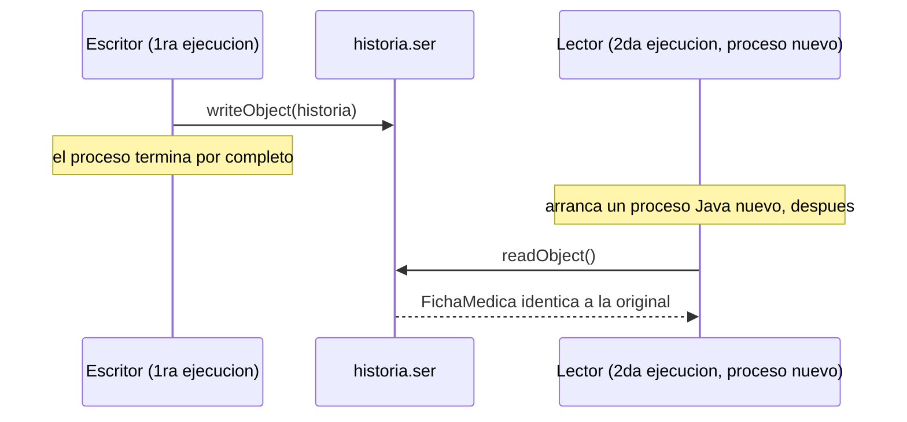

# 💡 Ejemplo 07 — Clase ObjectInputStream

## 🌍 Contexto

MediSalud necesita recuperar una historia clínica que otra ejecución del programa ya serializó. El
código actual la reconstruye a mano, leyendo texto línea por línea.

**Qué busca demostrar este ejemplo**: cómo deserializar un objeto completo con `ObjectInputStream`, y
cómo verificar que sus datos sobreviven entre dos ejecuciones completamente separadas del programa.

## 🏥 Caso de estudio

MediSalud recupera historias clínicas serializadas por una ejecución anterior del programa.

## 🗺️ Diagrama



## 🌳 Árbol de archivos — antes

```text
deserializar-antes/
└── com/medisalud/
    ├── FichaMedica.java
    └── Demo.java
```

## 💻 Archivo: FichaMedica.java

```java
package com.medisalud;

public class FichaMedica {

    private String nombrePaciente;
    private int edad;
    private String diagnostico;
    private String tratamiento;

    public FichaMedica(String nombrePaciente, int edad, String diagnostico, String tratamiento) {
        this.nombrePaciente = nombrePaciente;
        this.edad = edad;
        this.diagnostico = diagnostico;
        this.tratamiento = tratamiento;
    }

    @Override
    public String toString() {
        return nombrePaciente + " (" + edad + " anios) - " + diagnostico + " - " + tratamiento;
    }
}
```

## 💻 Archivo: Demo.java

```java
package com.medisalud;

import java.io.BufferedReader;
import java.io.FileReader;
import java.io.IOException;

public class Demo {

    public static void main(String[] args) {
        // Reconstruccion manual: hay que conocer de antemano el orden exacto de los
        // campos, y convertir a mano cada tipo (por ejemplo, la edad de texto a int).
        try (BufferedReader lector = new BufferedReader(new FileReader("historia_manual.txt"))) {
            String nombrePaciente = lector.readLine();
            int edad = Integer.parseInt(lector.readLine());
            String diagnostico = lector.readLine();
            String tratamiento = lector.readLine();

            FichaMedica historia = new FichaMedica(nombrePaciente, edad, diagnostico, tratamiento);
            System.out.println("Historia reconstruida a mano: " + historia);
        } catch (IOException e) {
            System.out.println("No se pudo leer historia_manual.txt: " + e.getMessage());
        }
    }
}
```

## ✅ Resultado esperado — antes

```text
Historia reconstruida a mano: Ana Torres (34 anios) - Gripe - Reposo e hidratacion
```

## 🌳 Árbol de archivos — después

```text
deserializar-despues/
└── com/medisalud/
    ├── FichaMedica.java   (cambió)
    ├── Escritor.java          (nuevo — primera ejecución)
    └── Lector.java            (nuevo — segunda ejecución, proceso separado)
```

## 💻 Archivo: FichaMedica.java — cambió

```java
package com.medisalud;

import java.io.Serializable;

public class FichaMedica implements Serializable {

    private static final long serialVersionUID = 1L;

    private String nombrePaciente;
    private int edad;
    private String diagnostico;
    private String tratamiento;

    public FichaMedica(String nombrePaciente, int edad, String diagnostico, String tratamiento) {
        this.nombrePaciente = nombrePaciente;
        this.edad = edad;
        this.diagnostico = diagnostico;
        this.tratamiento = tratamiento;
    }

    @Override
    public String toString() {
        return nombrePaciente + " (" + edad + " anios) - " + diagnostico + " - " + tratamiento;
    }
}
```

## 💻 Archivo: Escritor.java — nuevo

```java
package com.medisalud;

import java.io.FileOutputStream;
import java.io.IOException;
import java.io.ObjectOutputStream;

public class Escritor {

    public static void main(String[] args) {
        FichaMedica historia = new FichaMedica("Ana Torres", 34, "Gripe", "Reposo e hidratacion");

        try (ObjectOutputStream salida = new ObjectOutputStream(new FileOutputStream("historia.ser"))) {
            salida.writeObject(historia);
            System.out.println("Primera ejecucion: historia serializada y programa terminado.");
        } catch (IOException e) {
            System.out.println("No se pudo serializar la historia clinica: " + e.getMessage());
        }
    }
}
```

## 💻 Archivo: Lector.java — nuevo

```java
package com.medisalud;

import java.io.FileInputStream;
import java.io.IOException;
import java.io.ObjectInputStream;

public class Lector {

    public static void main(String[] args) {
        // Segunda ejecucion, completamente separada de la primera (Escritor): el
        // objeto se reconstruye exacto con una sola llamada, sin conocer el orden
        // de sus campos.
        try (ObjectInputStream entrada = new ObjectInputStream(new FileInputStream("historia.ser"))) {
            FichaMedica historia = (FichaMedica) entrada.readObject();
            System.out.println("Segunda ejecucion: historia deserializada: " + historia);
        } catch (IOException | ClassNotFoundException e) {
            System.out.println("No se pudo deserializar la historia clinica: " + e.getMessage());
        }
    }
}
```

## ✅ Resultado esperado — después

**Primera ejecución (`Escritor`):**

```text
Primera ejecucion: historia serializada y programa terminado.
```

**Segunda ejecución, proceso Java completamente nuevo (`Lector`):**

```text
Segunda ejecucion: historia deserializada: Ana Torres (34 anios) - Gripe - Reposo e hidratacion
```

## 🔍 Comparación: la prueba concreta

La versión "antes" reconstruye la historia clínica a mano, leyendo `historia_manual.txt` línea por línea
y convirtiendo cada campo (por ejemplo, la edad de texto a `int`) — funciona, pero depende de conocer el
orden exacto de los campos. La versión "después" usa dos procesos Java **realmente separados**: `Escritor`
serializa la historia y termina por completo; después, `Lector` — un proceso nuevo, sin ninguna relación
con el anterior salvo el archivo `historia.ser` — la deserializa con una sola llamada a `readObject()`.
Los campos recuperados son exactamente los originales, confirmando que la serialización persiste
correctamente entre ejecuciones distintas del programa.

## 🔍 Análisis: errores frecuentes

El error más frecuente es no anticipar `ClassNotFoundException` al deserializar: `readObject()` necesita
que la clase del objeto serializado esté disponible en el classpath del programa que lo deserializa. Si
la clase no está presente, la deserialización falla con esa excepción real — que este ejemplo maneja
explícitamente, junto con `IOException`.

## ❓ Preguntas de repaso

**1. [Selección]** ¿Qué hace `ObjectInputStream.readObject()`?

- A. Lee el archivo como texto plano, línea por línea.
- B. Reconstruye el objeto completo que fue serializado, con todos sus campos originales.
- C. Solo funciona si se invoca en el mismo proceso que serializó el objeto.
- D. Elimina el archivo serializado después de leerlo.

<details>
<summary>🔑 Ver respuesta</summary>

**Respuesta correcta: B.** `readObject()` reconstruye el objeto completo desde su forma serializada, sin
necesitar conocer el orden de sus campos ni convertir ningún tipo manualmente.

</details>

**2. [Selección múltiple]** Sobre la versión "después" de este ejemplo, ¿cuáles afirmaciones son
verdaderas?

- A. `Escritor` y `Lector` corren como dos procesos Java completamente separados.
- B. `Lector` solo puede ejecutarse dentro del mismo proceso que ejecutó `Escritor`.
- C. Los campos del objeto deserializado por `Lector` coinciden exactamente con los originales.
- D. `readObject()` puede lanzar `ClassNotFoundException`, manejada explícitamente en este ejemplo.

<details>
<summary>🔑 Ver respuesta</summary>

**Respuestas correctas: A, C y D.** B es falsa: precisamente lo que demuestra este ejemplo es que
`Lector` funciona en un proceso completamente nuevo y separado de `Escritor`.

</details>

**3. [Abierta]** Un compañero dice: "para comprobar que la deserialización funciona, alcanza con
serializar y deserializar dentro del mismo método `main`". ¿Estás de acuerdo? Justifica tu respuesta.

<details>
<summary>🔑 Ver respuesta</summary>

No del todo: hacerlo dentro del mismo `main` prueba que el código compila y corre, pero no prueba lo que
realmente importa de la persistencia — que los datos sobrevivan **entre ejecuciones distintas** del
programa, como pasaría en un caso real (una ejecución que guarda datos hoy, y otra que los lee mañana).
Por eso este ejemplo usa dos procesos Java genuinamente separados (`Escritor` y `Lector`), no una
simulación dentro de un mismo proceso.

</details>
