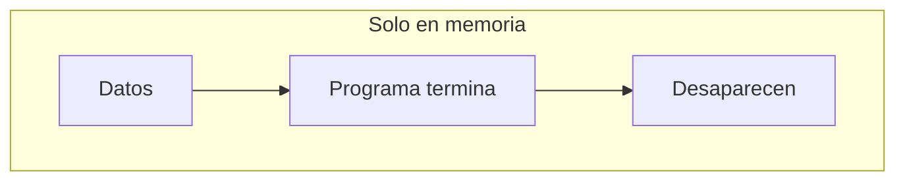
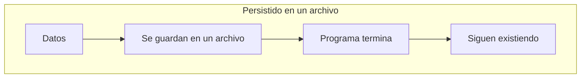
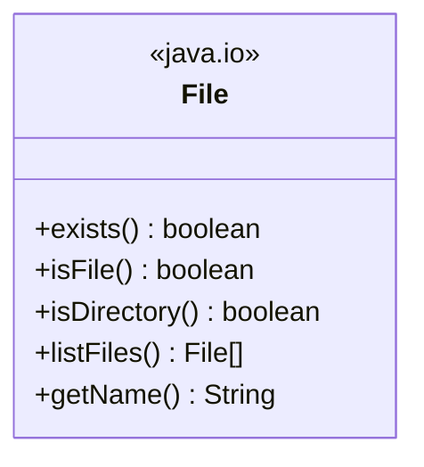
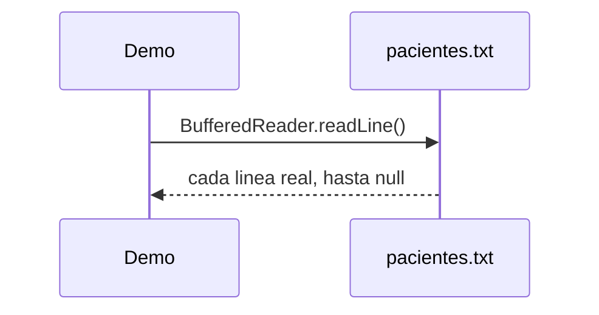
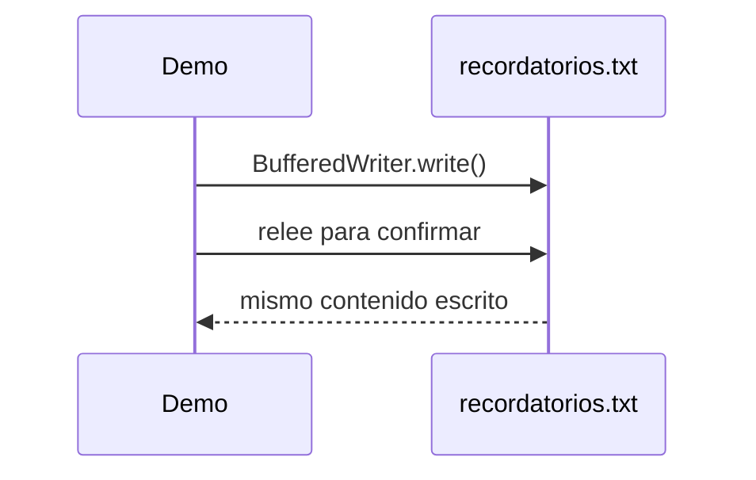
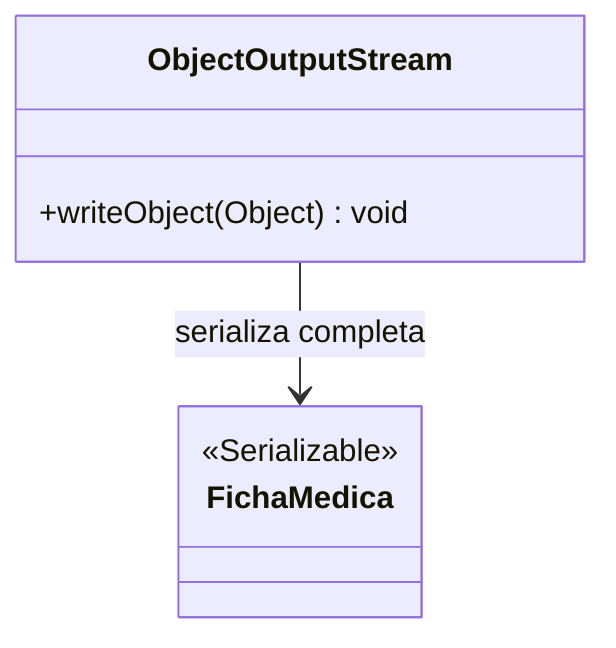
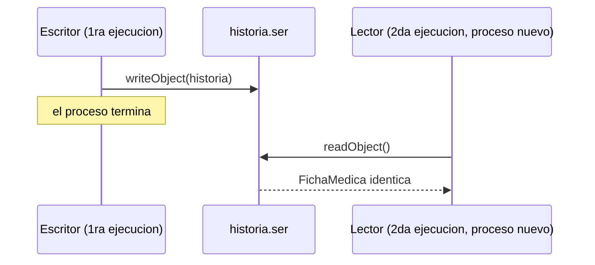

# Módulo 17 — Manejo de Archivos en Java

Curso de Java
---
## 🎯 Objetivos del módulo

- Explicar qué es la persistencia de datos y usar la clase `File` para consultar el sistema de archivos.
- Leer y escribir datos en archivos de texto, y borrar archivos que ya no hacen falta.
- Serializar objetos completos con `Serializable` y `ObjectOutputStream`.
- Deserializar objetos con `ObjectInputStream`, entre ejecuciones separadas del programa.
---
## 🗺️ Ruta de la sesión

1. Persistencia de datos.
2. Manejo de archivos en Java (Archivos en Java, la clase `File`, lectura, escritura, borrado).
3. Serializar objetos (`Serializable`, `ObjectOutputStream`).
4. Clase `ObjectInputStream`.
---
## 🌍 Por qué persistir datos

Todo lo que un programa guarda solo en memoria desaparece apenas termina. Este módulo cubre cómo
guardar datos en archivos, para que sobrevivan a la ejecución que los creó.
---
## 🧠 ¿Qué es la persistencia de datos?

Persistir datos significa guardarlos fuera de la memoria volátil del proceso, en un lugar que sobreviva
a la ejecución del programa. Sin persistencia explícita, cada ejecución empieza de cero.
---
## 🗺️ Diagrama: memoria volátil vs. datos persistidos




---
## 🧵 Archivos en Java y la clase File

Un archivo se representa en Java con una ruta (`java.io.File`). `File` permite consultar el sistema de
archivos real: si algo existe, si es un archivo o un directorio, y listar el contenido de una carpeta.
---
## 🗺️ Diagrama: la clase File


---
## 💻 La clase File — antes

```java
String[] archivosEsperados = {"paciente1.txt", "paciente2.txt"};
// lista fija: desactualizada si la carpeta cambia
```
---
## 💻 La clase File — después

```java
File carpeta = new File("historias_clinicas");
File[] archivos = carpeta.listFiles();
Arrays.sort(archivos); // el SO no garantiza orden
```
---
## 🔍 La clase File — la prueba concreta

Lista fija (antes): 2 nombres, desactualizada. Listado real con `File.listFiles()` (después): 3
archivos, siempre actualizado — porque consulta la carpeta real en vez de asumirla.
---
## 📖 Lectura de datos de un archivo

`FileReader` + `BufferedReader` permiten leer un archivo de texto línea por línea con `readLine()`, que
devuelve `null` al llegar al final.
---
## 🗺️ Diagrama: lectura de archivos


---
## 💻 Lectura — antes

```java
String[] pacientes = {"Ana Torres,BASICA", "Luis Rios,INTERMEDIA"};
// datos hardcodeados en el codigo
```
---
## 💻 Lectura — después

```java
try (BufferedReader lector = new BufferedReader(new FileReader("pacientes.txt"))) {
    String linea;
    while ((linea = lector.readLine()) != null) {
        System.out.println(linea);
    }
} catch (FileNotFoundException e) {
    System.out.println("Archivo no encontrado, manejado correctamente.");
}
```
---
## 🔍 Lectura — la prueba concreta

Misma salida exacta, leída del archivo real; `FileNotFoundException` real capturada al intentar leer un
archivo ausente, sin necesitar ninguna categoría especial de bloque.
---
## ✏️ Escritura de datos de un archivo

`FileWriter` + `BufferedWriter` permiten escribir un archivo de texto, persistiendo los datos más allá
de la ejecución del programa.
---
## 🗺️ Diagrama: escritura de archivos


---
## 💻 Escritura — antes

```java
for (String recordatorio : recordatorios) {
    System.out.println(recordatorio);
}
// se pierden al terminar el programa
```
---
## 💻 Escritura — después

```java
try (BufferedWriter escritor = new BufferedWriter(new FileWriter("recordatorios.txt"))) {
    for (String recordatorio : recordatorios) {
        escritor.write(recordatorio);
        escritor.newLine();
    }
}
File archivo = new File("recordatorios.txt");
System.out.println("Existe: " + archivo.exists());
```
---
## 🔍 Escritura — la prueba concreta

`File.exists()` real (`true`) tras escribir; contenido releído idéntico al escrito — persistencia
confirmada, no solo asumida.
---
## 🗑️ Borrado de un archivo

`File.delete()` borra un archivo que ya no hace falta, devolviendo un `boolean` con el resultado.
---
## 💻 Borrado — antes/después

```java
// antes: nunca se borra
File respaldo = new File("respaldo_temporal.txt");
System.out.println("Existe: " + respaldo.exists()); // true, para siempre

// despues: se borra explicitamente
boolean borrado = respaldo.delete();
System.out.println("Existe: " + respaldo.exists()); // false
```
---
## 🔍 Borrado — la prueba concreta

`exists()` pasa de `true` a `false` tras `delete()`; el archivo real desaparece de la carpeta,
verificado directamente sobre el sistema de archivos.
---
## 📦 Serializar objetos

`Serializable` es una interfaz marcadora: le indica a la JVM que los objetos de esa clase pueden
convertirse a bytes y reconstruirse después, sin escribir cada campo a mano.
---
## 🗺️ Diagrama: Serializable + ObjectOutputStream


---
## 💻 Serializar — antes (a mano)

```java
escritor.write(historia.getNombrePaciente());
escritor.newLine();
escritor.write(String.valueOf(historia.getEdad()));
escritor.newLine();
// ... un campo a la vez, en un orden que hay que recordar
```
---
## 💻 Serializar — después

```java
import java.io.Serializable;

public class FichaMedica implements Serializable {
    private static final long serialVersionUID = 1L;
}
```

```java
// dentro de Demo
salida.writeObject(historia); // una sola llamada
```
---
## 🔍 Serializar — la prueba concreta

Serialización exitosa en una sola llamada; `NotSerializableException` real al intentarlo sobre una
clase que no implementa `Serializable` — un requisito real, no opcional.
---
## 📥 Clase ObjectInputStream

`ObjectInputStream.readObject()` reconstruye el objeto completo, con todos sus campos originales, sin
convertir nada manualmente.
---
## 🗺️ Diagrama: dos ejecuciones separadas


---
## 💻 Deserializar — antes (a mano)

```java
String nombrePaciente = lector.readLine();
int edad = Integer.parseInt(lector.readLine());
// conversion manual de tipos, orden fijo
```
---
## 💻 Deserializar — después

```java
// Escritor: primera ejecucion
salida.writeObject(historia);

// Lector: SEGUNDA ejecucion, proceso Java separado
FichaMedica historia = (FichaMedica) entrada.readObject();
```
---
## 🔍 Deserializar — la prueba concreta

Dos procesos Java realmente separados (`Escritor`, `Lector`); todos los campos del objeto recuperado
son exactamente los originales — persistencia real entre ejecuciones, no simulada.
---
## ⚠️ Errores frecuentes de este módulo

- Asumir el contenido de una carpeta con una lista fija, en vez de consultarla con `File`.
- No manejar `FileNotFoundException` al leer un archivo que podría no existir.
- Confundir imprimir por consola con persistir en un archivo.
- No borrar archivos temporales que ya cumplieron su propósito.
- Intentar serializar una clase que no implementa `Serializable`.
- Probar la deserialización dentro del mismo `main` que serializa, en vez de en un proceso separado.
---
## 📋 Resumen de las herramientas de persistencia

| Herramienta | Qué resuelve |
|---|---|
| `File` | Consultar y crear metadatos del sistema de archivos |
| Lectura/Escritura de texto | Persistir datos simples, legibles |
| `File.delete()` | Borrar un archivo que ya no hace falta |
| `Serializable` + `ObjectOutputStream` | Serializar un objeto completo |
| `ObjectInputStream` | Deserializar, entre ejecuciones separadas |
---
## 🛠️ Taller: MediSalud

**Taller 01** (Historias Clínicas Persistentes): combina lectura/escritura de texto, serialización,
deserialización entre procesos separados, y borrado de historias ya dadas de alta.
---
## 🧪 Ejercicios: Biblioteca Universitaria

Un ejercicio Básico (identificar la violación) y uno Intermedio (aplicar la herramienta) por cada uno de
los seis sub-temas técnicos, con la Biblioteca Universitaria como dominio.
---
## 🔴🏆 Avanzado y Desafío: Biblioteca Universitaria

**Avanzado 01**: corregir un diseño con dos sub-temas ausentes (escritura + borrado). **Desafío 01**: sin
scaffold, combinar texto plano y serialización según corresponda a cada dato.
---
## ❓ Quiz 01

11 preguntas en formato entrevista técnica: 1 introductoria, una por cada sub-tema técnico, y 1
integradora final sobre cómo combinar todas las herramientas.
---
## 📚 Repaso: la pregunta clave de cada herramienta

- **File**: ¿necesito consultar el estado real del sistema de archivos?
- **Lectura/Escritura**: ¿el dato es simple y necesito persistirlo como texto legible?
- **Borrado**: ¿este archivo ya cumplió su propósito?
- **Serialización/Deserialización**: ¿necesito persistir un objeto completo, con varios campos?
---
## ✅ Checklist de cierre

- Puedo explicar la persistencia de datos y usar la clase `File`.
- Puedo leer, escribir y borrar archivos de texto.
- Puedo serializar y deserializar objetos completos, entre ejecuciones separadas.
- Completé el taller, los ejercicios Básico e Intermedio de los seis sub-temas, y el Quiz 01.
---
## 🎓 Cierre

Persistir datos es elegir la herramienta correcta para cada dato: texto plano para lo simple y legible,
serialización para los objetos completos — y borrar lo que ya no hace falta, en vez de dejarlo
acumulado para siempre.
