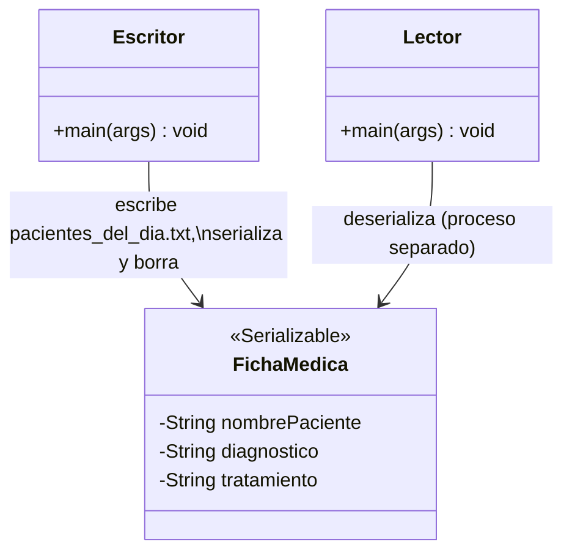

# 🔑 Solución del Taller 01 — Sistema de Historias Clínicas Persistentes de MediSalud

> Material docente, no enlazar desde la audiencia estudiante.

## 🗺️ Diagrama de clases



## 🌳 Árbol de archivos

```text
HistoriasClinicasPersistentes/
└── com/medisalud/
    ├── FichaMedica.java
    ├── Escritor.java
    └── Lector.java
```

## 💻 Código completo

## 💻 Archivo: FichaMedica.java

```java
package com.medisalud;

import java.io.Serializable;

public class FichaMedica implements Serializable {

    private static final long serialVersionUID = 1L;

    private String nombrePaciente;
    private String diagnostico;
    private String tratamiento;

    public FichaMedica(String nombrePaciente, String diagnostico, String tratamiento) {
        this.nombrePaciente = nombrePaciente;
        this.diagnostico = diagnostico;
        this.tratamiento = tratamiento;
    }

    @Override
    public String toString() {
        return nombrePaciente + " - " + diagnostico + " - " + tratamiento;
    }
}
```

## 💻 Archivo: Escritor.java

```java
package com.medisalud;

import java.io.BufferedReader;
import java.io.BufferedWriter;
import java.io.File;
import java.io.FileOutputStream;
import java.io.FileReader;
import java.io.FileWriter;
import java.io.IOException;
import java.io.ObjectOutputStream;

public class Escritor {

    public static void main(String[] args) {
        // Paso 1: lectura/escritura de texto plano — pacientes citados hoy.
        String[] pacientesDelDia = {"Ana Torres", "Luis Rios", "Marta Diaz"};
        try (BufferedWriter escritor = new BufferedWriter(new FileWriter("pacientes_del_dia.txt"))) {
            for (String paciente : pacientesDelDia) {
                escritor.write(paciente);
                escritor.newLine();
            }
        } catch (IOException e) {
            System.out.println("No se pudo escribir pacientes_del_dia.txt: " + e.getMessage());
            return;
        }

        System.out.println("Pacientes citados hoy (releidos desde el archivo):");
        try (BufferedReader lector = new BufferedReader(new FileReader("pacientes_del_dia.txt"))) {
            String linea;
            while ((linea = lector.readLine()) != null) {
                System.out.println(linea);
            }
        } catch (IOException e) {
            System.out.println("No se pudo leer pacientes_del_dia.txt: " + e.getMessage());
        }

        // Paso 2: serializacion — historias clinicas completas de Ana y Luis.
        FichaMedica historiaAna = new FichaMedica("Ana Torres", "Gripe", "Reposo e hidratacion");
        FichaMedica historiaLuis = new FichaMedica("Luis Rios", "Esguince", "Reposo y vendaje");
        serializar(historiaAna, "historia_ana.ser");
        serializar(historiaLuis, "historia_luis.ser");

        // Historia de Marta: ya fue dada de alta definitivamente, se serializa y se
        // borra de inmediato (Paso 4: borrado).
        FichaMedica historiaMarta = new FichaMedica("Marta Diaz", "Control anual", "Sin tratamiento");
        serializar(historiaMarta, "historia_marta.ser");
        File archivoMarta = new File("historia_marta.ser");
        System.out.println("Historia de Marta existe antes de borrarla: " + archivoMarta.exists());
        boolean borrado = archivoMarta.delete();
        System.out.println("Historia de Marta borrada: " + borrado);
        System.out.println("Historia de Marta existe despues de borrarla: " + archivoMarta.exists());
    }

    private static void serializar(FichaMedica historia, String nombreArchivo) {
        try (ObjectOutputStream salida = new ObjectOutputStream(new FileOutputStream(nombreArchivo))) {
            salida.writeObject(historia);
            System.out.println("Historia serializada en " + nombreArchivo + ": " + historia);
        } catch (IOException e) {
            System.out.println("No se pudo serializar en " + nombreArchivo + ": " + e.getMessage());
        }
    }
}
```

## 💻 Archivo: Lector.java

```java
package com.medisalud;

import java.io.File;
import java.io.FileInputStream;
import java.io.IOException;
import java.io.ObjectInputStream;

public class Lector {

    public static void main(String[] args) {
        // Segunda ejecucion, proceso Java separado del Escritor (Paso 3: deserializacion).
        FichaMedica historiaAna = deserializar("historia_ana.ser");
        FichaMedica historiaLuis = deserializar("historia_luis.ser");

        System.out.println("Historia de Ana deserializada: " + historiaAna);
        System.out.println("Historia de Luis deserializada: " + historiaLuis);

        File archivoMarta = new File("historia_marta.ser");
        System.out.println("Historia de Marta ya no existe (fue dada de alta y borrada): " + !archivoMarta.exists());
    }

    private static FichaMedica deserializar(String nombreArchivo) {
        try (ObjectInputStream entrada = new ObjectInputStream(new FileInputStream(nombreArchivo))) {
            return (FichaMedica) entrada.readObject();
        } catch (IOException | ClassNotFoundException e) {
            System.out.println("No se pudo deserializar " + nombreArchivo + ": " + e.getMessage());
            return null;
        }
    }
}
```

## ✅ Salida real

**Primera ejecución (`Escritor`):**

```text
Pacientes citados hoy (releidos desde el archivo):
Ana Torres
Luis Rios
Marta Diaz
Historia serializada en historia_ana.ser: Ana Torres - Gripe - Reposo e hidratacion
Historia serializada en historia_luis.ser: Luis Rios - Esguince - Reposo y vendaje
Historia serializada en historia_marta.ser: Marta Diaz - Control anual - Sin tratamiento
Historia de Marta existe antes de borrarla: true
Historia de Marta borrada: true
Historia de Marta existe despues de borrarla: false
```

**Segunda ejecución, proceso Java separado (`Lector`):**

```text
Historia de Ana deserializada: Ana Torres - Gripe - Reposo e hidratacion
Historia de Luis deserializada: Luis Rios - Esguince - Reposo y vendaje
Historia de Marta ya no existe (fue dada de alta y borrada): true
```

## ⚠️ Errores comunes observados

- **Borrar el archivo `.ser` de una historia antes de confirmar que se serializó correctamente**: si el
  borrado ocurre antes de verificar que `writeObject()` tuvo éxito, se corre el riesgo de borrar un
  archivo que en realidad nunca se llegó a escribir bien. El orden correcto es: serializar, confirmar, y
  recién después borrar (si corresponde).
- **Deserializar dentro del mismo `main` que serializa**: eso no prueba que la persistencia funcione
  entre ejecuciones reales y separadas del programa — solo prueba que el código compila y corre. `Lector`
  debe ejecutarse como un proceso Java completamente aparte de `Escritor`.
- **Olvidar que `pacientes_del_dia.txt` y los archivos `.ser` son archivos distintos**: mezclar el
  formato de texto plano con la serialización en un mismo archivo rompe ambas lecturas. Cada dato
  persiste en el formato que le corresponde: texto plano para los datos simples, serialización para los
  objetos completos.
