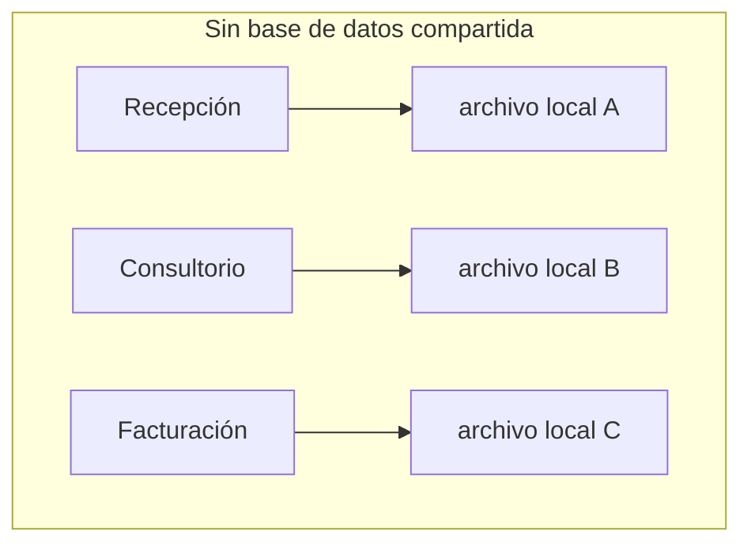
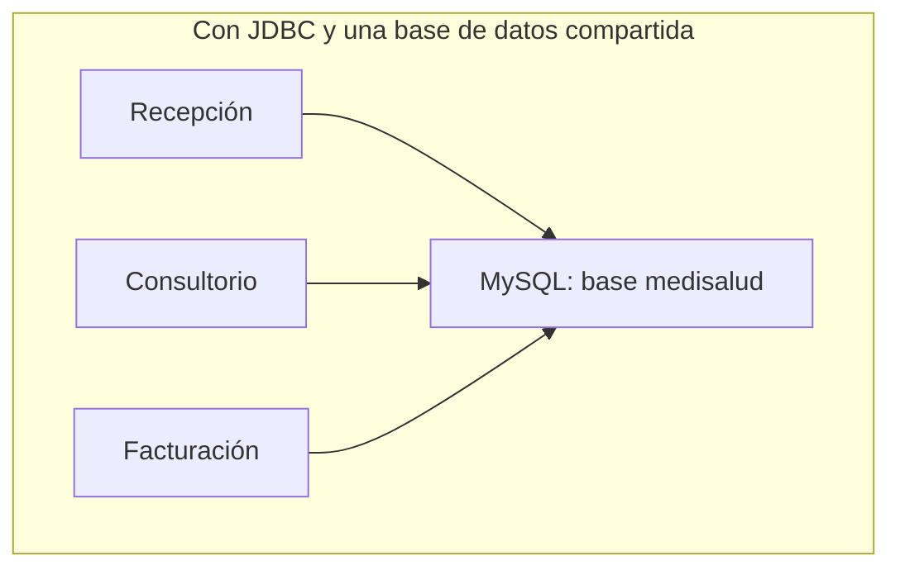

# 💡 Ejemplo 01 — ¿Qué es JDBC?

## 🌍 Contexto

MediSalud guarda la lista de pacientes en archivos de texto y objetos serializados, tal como viste en el
Módulo 17. Eso funciona bien para un solo consultorio, pero cuando varios programas y varias personas
necesitan leer y escribir los mismos datos al mismo tiempo —la recepción, cada consultorio, el área de
facturación— los archivos locales de cada computadora dejan de alcanzar.

## 🗺️ Diagrama

*Arriba: cada programa guarda sus propios datos por separado, sin verse entre sí. Abajo: los tres
programas leen y escriben la misma base de datos real a través de JDBC.*

## 🧭 Explicación paso a paso

1. **JDBC** (Java DataBase Connectivity) es la API estándar de Java para que un programa se conecte a una
   base de datos relacional y ejecute sentencias SQL contra ella, sin importar qué motor de base de datos
   sea (MySQL, PostgreSQL, etc.) mientras exista un controlador (driver) para ese motor.
2. A diferencia de un archivo local (Módulo 17), una base de datos vive en un servidor aparte: varios
   programas, en varias computadoras, pueden conectarse a la misma base y ver los mismos datos
   actualizados.
3. Para conectarse, un programa Java necesita tres cosas: el **controlador** (driver) del motor de base de
   datos instalado en el proyecto, una **URL de conexión** (dirección del servidor y nombre de la base), y
   credenciales (usuario y clave).
4. Este módulo usa MySQL como motor de base de datos, tal como lo configura el Ejemplo 02, y cubre cuatro
   herramientas de JDBC: conectar, ejecutar consultas, parametrizarlas de forma segura, y ejecutar
   operaciones con `PreparedStatement`. Cierra organizando ese acceso a datos con la arquitectura
   Modelo-Vista-Controlador.

## ✅ Resultado esperado

Un programa de MediSalud sin conexión a base de datos no tiene forma de compartir sus datos con otro
programa que corre en otra computadora: cada uno ve solo lo que él mismo guardó. Con JDBC, ambos
programas se conectan a la misma base de datos MySQL y ven exactamente los mismos datos, actualizados en
tiempo real.

## ❓ Preguntas de repaso

**1. [Selección]** ¿Qué es JDBC?

- A. Un motor de base de datos, alternativa a MySQL.
- B. La API estándar de Java para conectarse a una base de datos relacional y ejecutar SQL contra ella.
- C. Un formato de archivo para guardar datos estructurados.
- D. Una librería externa que reemplaza la necesidad de una base de datos.

🔑 Ver respuesta

**Respuesta correcta: B.** JDBC es la API estándar de Java (`java.sql`) para conectarse a una base de
datos relacional; no es un motor de base de datos ni un formato de archivo.

**2. [Selección múltiple]** ¿Cuáles de las siguientes afirmaciones sobre JDBC son verdaderas?

- A. Un programa necesita un controlador (driver) específico del motor de base de datos para conectarse.
- B. Varios programas, en varias computadoras, pueden conectarse a la misma base de datos y ver los
  mismos datos.
- C. JDBC reemplaza la necesidad de guardar cualquier dato en archivos locales, en todos los casos.
- D. La URL de conexión indica, entre otras cosas, el servidor y la base de datos a la que conectarse.

🔑 Ver respuesta

**Respuestas correctas: A, B y D.** C es falsa: JDBC no reemplaza todo uso de archivos locales (el Módulo
17 sigue siendo válido para otros casos); simplemente resuelve el problema de compartir datos entre varios
programas.

**3. [Abierta]** Un compañero dice: "si cada consultorio de MediSalud guarda sus pacientes en su propio
archivo de texto, es lo mismo que usar una base de datos, porque los datos igual quedan guardados".
¿Estás de acuerdo? Justifica tu respuesta.

🔑 Ver respuesta

No. Los datos quedan guardados en ambos casos, pero con archivos locales separados, cada consultorio solo
ve sus propios datos: si un paciente es atendido en dos consultorios distintos, ningún archivo tiene la
información completa. Una base de datos compartida, accedida con JDBC desde cada programa, permite que
todos vean y actualicen los mismos datos reales.

