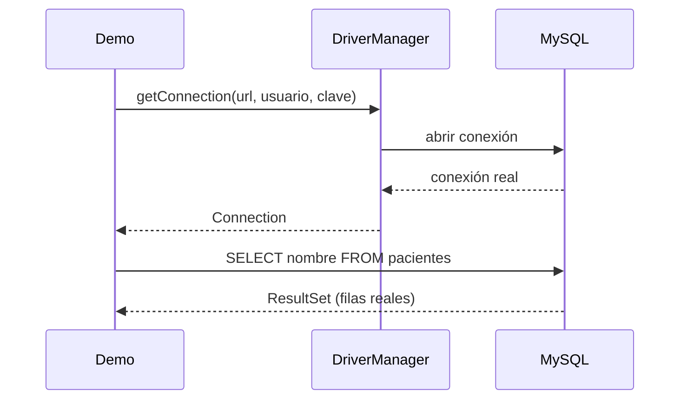

# 💡 Ejemplo 02 — Configuración del controlador y conexión

## 🌍 Contexto

MediSalud quiere que su programa de recepción consulte los pacientes reales, no una lista fija escrita en
el código que nadie actualiza cuando se registra un paciente nuevo.

**Qué busca demostrar este ejemplo**: cómo configurar el controlador JDBC de MySQL y establecer una
conexión real con `DriverManager`, incluyendo el manejo del error real cuando la conexión falla.

## 🏥 Caso de estudio

MediSalud guarda sus pacientes en una base de datos MySQL real, base `medisalud`, tabla `pacientes`:

```sql
CREATE TABLE pacientes (
    id INT AUTO_INCREMENT PRIMARY KEY,
    nombre VARCHAR(100) NOT NULL,
    edad INT NOT NULL,
    diagnostico VARCHAR(200) NOT NULL
);
```

## 🗺️ Diagrama



## 🌳 Árbol de archivos — antes

```text
conexion-antes/
└── com/medisalud/
    └── Demo.java
```

## 💻 Archivo: Demo.java

```java
package com.medisalud;

import java.util.ArrayList;
import java.util.List;

public class Demo {
    public static void main(String[] args) {
        List<String> pacientes = new ArrayList<>();
        pacientes.add("Ana Torres");
        pacientes.add("Luis Rios");

        System.out.println("Pacientes de MediSalud (lista fija en el codigo):");
        for (String nombre : pacientes) {
            System.out.println("- " + nombre);
        }
    }
}
```

## ✅ Resultado esperado — antes

```text
Pacientes de MediSalud (lista fija en el codigo):
- Ana Torres
- Luis Rios
```

## 🌳 Árbol de archivos — después

```text
conexion-despues/
└── com/medisalud/
    └── Demo.java                (cambió)
```

## 💻 Archivo: Demo.java — cambió

```java
package com.medisalud;

import java.sql.Connection;
import java.sql.DriverManager;
import java.sql.ResultSet;
import java.sql.SQLException;
import java.sql.Statement;

public class Demo {
    private static final String URL = "jdbc:mysql://localhost:3306/medisalud";
    private static final String USUARIO = "root";
    private static final String CLAVE = "curso_java_root";

    public static void main(String[] args) {
        System.out.println("Pacientes de MediSalud (consulta real a la base de datos):");
        try (Connection conexion = DriverManager.getConnection(URL, USUARIO, CLAVE);
             Statement sentencia = conexion.createStatement();
             ResultSet resultado = sentencia.executeQuery("SELECT nombre FROM pacientes ORDER BY id")) {
            while (resultado.next()) {
                System.out.println("- " + resultado.getString("nombre"));
            }
        } catch (SQLException e) {
            System.out.println("No se pudo conectar a la base de datos: " + e.getMessage());
        }

        System.out.println();
        System.out.println("Intento de conexion con datos incorrectos:");
        String urlIncorrecta = "jdbc:mysql://localhost:3307/medisalud";
        try (Connection conexion = DriverManager.getConnection(urlIncorrecta, USUARIO, CLAVE)) {
            System.out.println("Conexion inesperadamente exitosa a: " + conexion.getCatalog());
        } catch (SQLException e) {
            System.out.println("Error real de conexion, manejado sin interrumpir el programa: "
                    + e.getClass().getSimpleName());
        }
    }
}
```

## ✅ Resultado esperado — después

```text
Pacientes de MediSalud (consulta real a la base de datos):
- Ana Torres
- Luis Rios
- Marta Diaz

Intento de conexion con datos incorrectos:
Error real de conexion, manejado sin interrumpir el programa: CommunicationsException
```

## 🔍 Comparación: la prueba concreta

La versión "antes" tiene una lista fija de dos pacientes escrita en el código: si se registra un paciente
nuevo en la base de datos, ese programa nunca lo va a mostrar, porque no consulta nada real. La versión
"después" se conecta de verdad a MySQL con `DriverManager.getConnection()` y ejecuta una consulta real:
siempre muestra los pacientes que existen en ese momento en la tabla — en este caso, los tres reales.
Además, la versión "después" demuestra qué pasa si los datos de conexión son incorrectos: `DriverManager`
lanza una `SQLException` real, capturada y manejada sin interrumpir el programa.

## 🔍 Análisis: errores frecuentes

El error más frecuente es no manejar la `SQLException` que puede lanzar `DriverManager.getConnection()`:
una conexión puede fallar por muchas razones (servidor apagado, credenciales incorrectas, base de datos
inexistente), y un programa que no captura ese error termina de forma abrupta en vez de informar el
problema con claridad.

## ❓ Preguntas de repaso

**1. [Selección]** ¿Qué tres datos necesita, como mínimo, `DriverManager.getConnection()` para conectarse
a una base de datos?

- A. Solo el nombre de la base de datos.
- B. La URL de conexión, el usuario y la clave.
- C. El nombre de la tabla y las columnas a consultar.
- D. La versión exacta de MySQL instalada en el servidor.

<details>
<summary>🔑 Ver respuesta</summary>

**Respuesta correcta: B.** `getConnection(url, usuario, clave)` recibe la dirección del servidor y la
base (URL), y las credenciales para autenticarse.

</details>

**2. [Selección múltiple]** Sobre la versión "después" de este ejemplo, ¿cuáles afirmaciones son
verdaderas?

- A. La conexión se abre con try-with-resources, por lo que se cierra automáticamente al terminar el
  bloque.
- B. Si los datos de conexión son incorrectos, el programa siempre termina con una excepción no manejada.
- C. La consulta real siempre refleja el contenido actual de la tabla `pacientes`.
- D. `SQLException` es la excepción que JDBC lanza ante un problema real de conexión o consulta.

<details>
<summary>🔑 Ver respuesta</summary>

**Respuestas correctas: A, C y D.** B es falsa: el ejemplo captura la `SQLException` de una conexión
incorrecta y la maneja, en vez de dejar que el programa termine de forma abrupta.

</details>

**3. [Abierta]** Un compañero dice: "si mi programa ya probó la conexión una vez y funcionó, no hace
falta manejar el error de conexión en el código". ¿Estás de acuerdo? Justifica tu respuesta.

<details>
<summary>🔑 Ver respuesta</summary>

No. Que una conexión haya funcionado una vez no garantiza que siempre vaya a funcionar: el servidor puede
estar apagado, la red puede fallar, o las credenciales pueden cambiar. Manejar la `SQLException` real, en
vez de asumir que la conexión siempre tiene éxito, hace que el programa informe el problema con claridad
en vez de terminar de forma abrupta.

</details>
