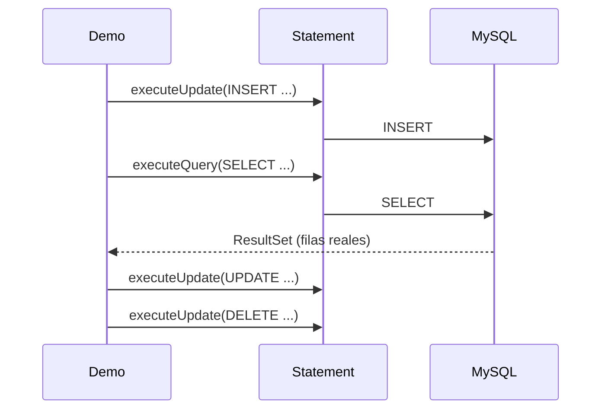

# 💡 Ejemplo 03 — Uso de JDBC

## 🌍 Contexto

MediSalud ya sabe conectarse a MySQL (Ejemplo 02), pero su programa de registro de pacientes todavía
simula las operaciones con simples mensajes por consola, sin tocar la base de datos real.

**Qué busca demostrar este ejemplo**: cómo usar `Statement` para ejecutar consultas e instrucciones SQL
completas (`SELECT`, `INSERT`, `UPDATE`, `DELETE`) contra una base de datos real, recorriendo los
resultados con `ResultSet`.

## 🏥 Caso de estudio

MediSalud registra, actualiza y da de baja pacientes en la tabla `pacientes` de su base de datos MySQL.

## 🗺️ Diagrama



## 🌳 Árbol de archivos — antes

```text
uso-antes/
└── com/medisalud/
    └── Demo.java
```

## 💻 Archivo: Demo.java

```java
package com.medisalud;

public class Demo {
    public static void main(String[] args) {
        System.out.println("Registro de pacientes (todo hardcodeado, sin conexion a la base de datos):");
        System.out.println("Registrando: Carlos Mena, 40, Asma");
        System.out.println("Actualizando diagnostico de Carlos Mena a: Asma controlada");
        System.out.println("Borrando a Carlos Mena");
        System.out.println("Ningun cambio quedo realmente guardado en ningun lado.");
    }
}
```

## ✅ Resultado esperado — antes

```text
Registro de pacientes (todo hardcodeado, sin conexion a la base de datos):
Registrando: Carlos Mena, 40, Asma
Actualizando diagnostico de Carlos Mena a: Asma controlada
Borrando a Carlos Mena
Ningun cambio quedo realmente guardado en ningun lado.
```

## 🌳 Árbol de archivos — después

```text
uso-despues/
└── com/medisalud/
    └── Demo.java                (cambió)
```

## 💻 Archivo: Demo.java — cambió

```java
package com.medisalud;

import java.sql.Connection;
import java.sql.DriverManager;
import java.sql.ResultSet;
import java.sql.SQLException;
import java.sql.Statement;

public class Demo {
    private static final String URL = "jdbc:mysql://localhost:3306/medisalud";
    private static final String USUARIO = "root";
    private static final String CLAVE = "curso_java_root";

    public static void main(String[] args) {
        try (Connection conexion = DriverManager.getConnection(URL, USUARIO, CLAVE);
             Statement sentencia = conexion.createStatement()) {

            System.out.println("Pacientes antes de registrar (consulta real):");
            imprimir(sentencia);

            System.out.println();
            System.out.println("Registrando a Carlos Mena...");
            sentencia.executeUpdate(
                "INSERT INTO pacientes (nombre, edad, diagnostico) VALUES ('Carlos Mena', 40, 'Asma')",
                Statement.RETURN_GENERATED_KEYS);
            int id;
            try (ResultSet claves = sentencia.getGeneratedKeys()) {
                claves.next();
                id = claves.getInt(1);
            }
            System.out.println("Pacientes despues de registrar:");
            imprimir(sentencia);

            System.out.println();
            System.out.println("Actualizando el diagnostico de Carlos Mena...");
            sentencia.executeUpdate(
                "UPDATE pacientes SET diagnostico = 'Asma controlada' WHERE id = " + id);
            System.out.println("Pacientes despues de actualizar:");
            imprimir(sentencia);

            System.out.println();
            System.out.println("Borrando a Carlos Mena...");
            sentencia.executeUpdate("DELETE FROM pacientes WHERE id = " + id);
            System.out.println("Pacientes despues de borrar (vuelve al estado original):");
            imprimir(sentencia);
        } catch (SQLException e) {
            System.out.println("Error real de base de datos: " + e.getMessage());
        }
    }

    private static void imprimir(Statement sentencia) throws SQLException {
        try (ResultSet resultado = sentencia.executeQuery(
                "SELECT nombre, edad, diagnostico FROM pacientes ORDER BY id")) {
            while (resultado.next()) {
                System.out.println("- " + resultado.getString("nombre") + ", "
                        + resultado.getInt("edad") + ", " + resultado.getString("diagnostico"));
            }
        }
    }
}
```

## ✅ Resultado esperado — después

```text
Pacientes antes de registrar (consulta real):
- Ana Torres, 34, Gripe
- Luis Rios, 45, Hipertension
- Marta Diaz, 29, Migrana

Registrando a Carlos Mena...
Pacientes despues de registrar:
- Ana Torres, 34, Gripe
- Luis Rios, 45, Hipertension
- Marta Diaz, 29, Migrana
- Carlos Mena, 40, Asma

Actualizando el diagnostico de Carlos Mena...
Pacientes despues de actualizar:
- Ana Torres, 34, Gripe
- Luis Rios, 45, Hipertension
- Marta Diaz, 29, Migrana
- Carlos Mena, 40, Asma controlada

Borrando a Carlos Mena...
Pacientes despues de borrar (vuelve al estado original):
- Ana Torres, 34, Gripe
- Luis Rios, 45, Hipertension
- Marta Diaz, 29, Migrana
```

## 🔍 Comparación: la prueba concreta

La versión "antes" solo imprime mensajes que simulan las operaciones: nada queda guardado en ningún
lado, y una segunda ejecución no encontraría ningún rastro. La versión "después" ejecuta las operaciones
de verdad con `Statement`: el `INSERT` agrega una fila real (verificable con una consulta inmediatamente
después, que pasa de 3 a 4 pacientes), el `UPDATE` cambia su diagnóstico real, y el `DELETE` la elimina de
verdad — cada paso confirmado con una consulta real a la tabla.

## 🔍 Análisis: errores frecuentes

El error más frecuente es olvidar que `executeUpdate()` (para `INSERT`/`UPDATE`/`DELETE`) y
`executeQuery()` (para `SELECT`) son métodos distintos de `Statement`: usar el que no corresponde lanza
una excepción real en tiempo de ejecución, no un error de compilación.

## ❓ Preguntas de repaso

**1. [Selección]** ¿Qué método de `Statement` se usa para ejecutar un `SELECT` y obtener sus filas?

- A. `executeUpdate()`
- B. `executeQuery()`
- C. `execute()`
- D. `getResultSet()`

<details>
<summary>🔑 Ver respuesta</summary>

**Respuesta correcta: B.** `executeQuery()` ejecuta un `SELECT` y devuelve un `ResultSet` con las filas;
`executeUpdate()` es para `INSERT`/`UPDATE`/`DELETE`, que no devuelven filas.

</details>

**2. [Selección múltiple]** Sobre la versión "después" de este ejemplo, ¿cuáles afirmaciones son
verdaderas?

- A. El `INSERT` queda confirmado consultando la tabla inmediatamente después, con una fila más.
- B. `ResultSet.next()` avanza a la siguiente fila del resultado y devuelve `false` cuando no hay más.
- C. `executeUpdate()` devuelve el contenido de las filas modificadas.
- D. Al final del programa, la tabla `pacientes` vuelve a tener las mismas filas que al principio.

<details>
<summary>🔑 Ver respuesta</summary>

**Respuestas correctas: A, B y D.** C es falsa: `executeUpdate()` devuelve la cantidad de filas
afectadas (un `int`), no su contenido.

</details>

**3. [Abierta]** Un compañero dice: "si mi programa solo necesita leer datos, no hace falta usar
`executeUpdate()` nunca". ¿Estás de acuerdo? Justifica tu respuesta.

<details>
<summary>🔑 Ver respuesta</summary>

Depende del programa. Si el programa solo consulta datos (como el Ejemplo 02), en efecto no necesita
`executeUpdate()`. Pero en cuanto necesita registrar, actualizar o borrar datos reales —como este
ejemplo—, sí hace falta: `executeQuery()` solo sirve para `SELECT`.

</details>
