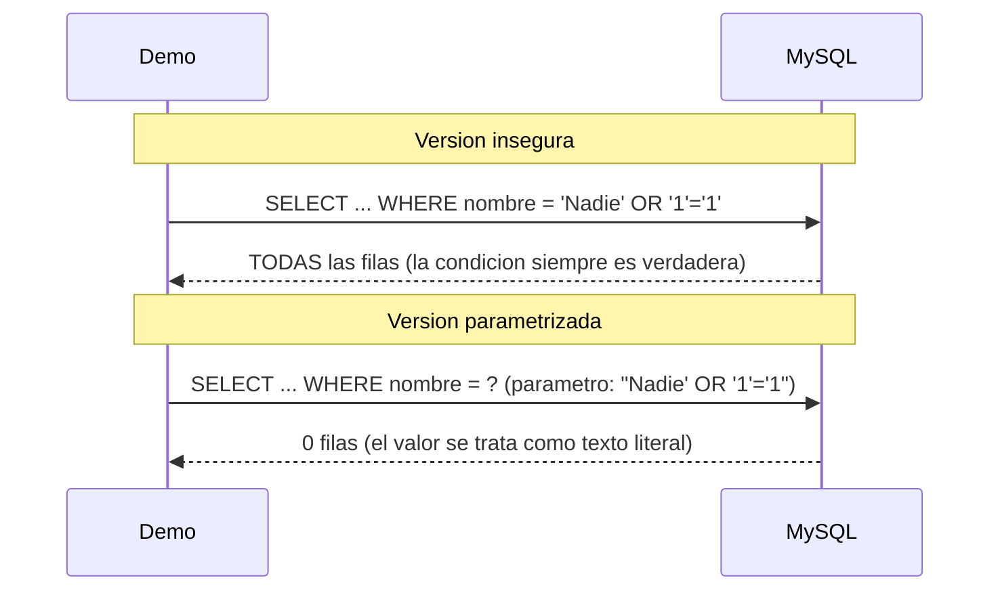

# 💡 Ejemplo 04 — Consultas parametrizadas

## 🌍 Contexto

MediSalud agrega un buscador de pacientes por nombre a su programa de recepción. El nombre lo escribe
quien usa el programa, así que puede ser cualquier texto — incluido texto pensado para alterar la
consulta.

**Qué busca demostrar este ejemplo**: por qué construir una consulta SQL concatenando texto de entrada es
una práctica insegura (inyección SQL), y cómo una consulta parametrizada con `PreparedStatement` evita el
problema.

## 🏥 Caso de estudio

MediSalud busca pacientes por nombre en la tabla `pacientes` de su base de datos MySQL.

## 🗺️ Diagrama



## 🌳 Árbol de archivos — antes

```text
parametrizadas-antes/
└── com/medisalud/
    └── Demo.java
```

## 💻 Archivo: Demo.java

```java
package com.medisalud;

import java.sql.Connection;
import java.sql.DriverManager;
import java.sql.ResultSet;
import java.sql.SQLException;
import java.sql.Statement;

public class Demo {
    private static final String URL = "jdbc:mysql://localhost:3306/medisalud";
    private static final String USUARIO = "root";
    private static final String CLAVE = "curso_java_root";

    public static void main(String[] args) {
        String nombreBuscado = "Nadie' OR '1'='1";

        System.out.println("Busqueda insegura (concatenando texto directamente en el SQL):");
        String sql = "SELECT nombre FROM pacientes WHERE nombre = '" + nombreBuscado + "'";
        System.out.println("Consulta ejecutada: " + sql);

        try (Connection conexion = DriverManager.getConnection(URL, USUARIO, CLAVE);
             Statement sentencia = conexion.createStatement();
             ResultSet resultado = sentencia.executeQuery(sql)) {
            int filas = 0;
            while (resultado.next()) {
                filas++;
                System.out.println("- " + resultado.getString("nombre"));
            }
            System.out.println("Filas devueltas: " + filas
                    + " (se buscaba un paciente inexistente: la concatenacion insegura devolvio la tabla completa)");
        } catch (SQLException e) {
            System.out.println("Error real de base de datos: " + e.getMessage());
        }
    }
}
```

## ✅ Resultado esperado — antes

```text
Busqueda insegura (concatenando texto directamente en el SQL):
Consulta ejecutada: SELECT nombre FROM pacientes WHERE nombre = 'Nadie' OR '1'='1'
- Ana Torres
- Luis Rios
- Marta Diaz
Filas devueltas: 3 (se buscaba un paciente inexistente: la concatenacion insegura devolvio la tabla completa)
```

## 🌳 Árbol de archivos — después

```text
parametrizadas-despues/
└── com/medisalud/
    └── Demo.java                (cambió)
```

## 💻 Archivo: Demo.java — cambió

```java
package com.medisalud;

import java.sql.Connection;
import java.sql.DriverManager;
import java.sql.PreparedStatement;
import java.sql.ResultSet;
import java.sql.SQLException;

public class Demo {
    private static final String URL = "jdbc:mysql://localhost:3306/medisalud";
    private static final String USUARIO = "root";
    private static final String CLAVE = "curso_java_root";

    public static void main(String[] args) {
        String nombreBuscado = "Nadie' OR '1'='1";

        System.out.println("Busqueda parametrizada (el valor viaja como parametro, no como texto SQL):");
        String sql = "SELECT nombre FROM pacientes WHERE nombre = ?";
        System.out.println("Consulta ejecutada: " + sql + " con parametro: " + nombreBuscado);

        try (Connection conexion = DriverManager.getConnection(URL, USUARIO, CLAVE);
             PreparedStatement sentencia = conexion.prepareStatement(sql)) {
            sentencia.setString(1, nombreBuscado);
            try (ResultSet resultado = sentencia.executeQuery()) {
                int filas = 0;
                while (resultado.next()) {
                    filas++;
                    System.out.println("- " + resultado.getString("nombre"));
                }
                System.out.println("Filas devueltas: " + filas
                        + " (el mismo valor ahora se trata como texto literal: no altera la consulta)");
            }
        } catch (SQLException e) {
            System.out.println("Error real de base de datos: " + e.getMessage());
        }
    }
}
```

## ✅ Resultado esperado — después

```text
Busqueda parametrizada (el valor viaja como parametro, no como texto SQL):
Consulta ejecutada: SELECT nombre FROM pacientes WHERE nombre = ? con parametro: Nadie' OR '1'='1
Filas devueltas: 0 (el mismo valor ahora se trata como texto literal: no altera la consulta)
```

## 🔍 Comparación: la prueba concreta

Con el mismo valor de búsqueda `"Nadie' OR '1'='1"` (un paciente que no existe, pensado para alterar la
consulta): la versión insegura concatena ese texto directamente en el SQL, y la condición `'1'='1'` se
vuelve parte de la consulta real — MySQL la ejecuta como si dijera "trae cualquier fila", devolviendo las
3 filas de la tabla completa. La versión parametrizada pasa el mismo valor como parámetro de
`PreparedStatement`: MySQL lo trata como un único valor de texto literal a comparar, nunca como parte de
la sintaxis SQL, y la consulta devuelve 0 filas — el comportamiento correcto, porque ningún paciente se
llama así.

## 🔍 Análisis: errores frecuentes

El error más frecuente es construir una consulta SQL concatenando directamente cualquier valor que venga
de afuera del programa (entrada del usuario, un parámetro, un archivo). Aunque el código compila y
funciona con datos "normales", basta un valor pensado para alterar la consulta para que el programa
devuelva datos que nunca debería mostrar — o, en casos peores, modifique o borre datos que no debería.

## ❓ Preguntas de repaso

**1. [Selección]** ¿Qué es una inyección SQL?

- A. Un tipo de excepción que Java lanza automáticamente al ejecutar SQL inválido.
- B. Una técnica para optimizar consultas SQL, agregando índices adicionales.
- C. Un ataque en el que un valor de entrada, al concatenarse en el texto de una consulta SQL, altera su
  significado real.
- D. Un método de `PreparedStatement` para validar datos antes de ejecutarlos.

<details>
<summary>🔑 Ver respuesta</summary>

**Respuesta correcta: C.** La inyección SQL ocurre cuando un valor de entrada se concatena directamente
en el texto de una consulta, permitiendo que ese valor altere la lógica real de la consulta.

</details>

**2. [Selección múltiple]** Sobre este ejemplo, ¿cuáles afirmaciones son verdaderas?

- A. Con el valor `"Nadie' OR '1'='1"`, la versión insegura devuelve todas las filas de la tabla.
- B. Con el mismo valor, la versión parametrizada devuelve 0 filas.
- C. `PreparedStatement` valida automáticamente que el valor de entrada sea un nombre válido.
- D. El riesgo de inyección SQL existe solo si el valor viene directamente de un formulario web.

<details>
<summary>🔑 Ver respuesta</summary>

**Respuestas correctas: A y B.** C es falsa: `PreparedStatement` no valida el significado del valor, solo
garantiza que se trate como un dato, no como parte del SQL. D es falsa: el riesgo existe con cualquier
valor externo al programa, no solo entradas web (un archivo, un argumento de línea de comandos, etc.).

</details>

**3. [Abierta]** Un compañero dice: "mi programa nunca recibe entrada de usuarios externos, así que no
necesito preocuparme por la inyección SQL". ¿Estás de acuerdo? Justifica tu respuesta.

<details>
<summary>🔑 Ver respuesta</summary>

No necesariamente. El riesgo depende de si algún valor que llega a la consulta viene de **afuera del
código que la escribe** — puede ser un argumento de línea de comandos, el contenido de un archivo, o el
resultado de otra consulta. Cualquier valor que no sea un literal fijo en el código merece tratarse con
una consulta parametrizada, por seguridad.

</details>
