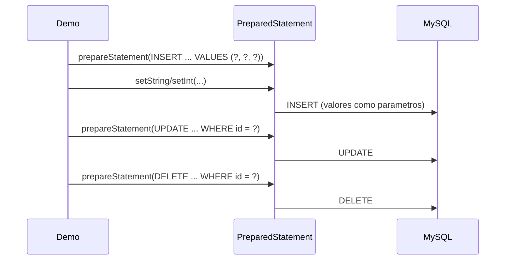

# 💡 Ejemplo 05 — Operaciones con PreparedStatement

## 🌍 Contexto

MediSalud ya sabe evitar la inyección SQL en una búsqueda (Ejemplo 04), pero su programa de registro de
pacientes sigue armando cada consulta —insertar, actualizar, borrar— concatenando valores a mano.

**Qué busca demostrar este ejemplo**: cómo implementar las cuatro operaciones básicas (consultar,
insertar, actualizar, borrar) con `PreparedStatement`, parametrizando cada valor en vez de concatenarlo.

## 🏥 Caso de estudio

MediSalud registra, actualiza, consulta y borra pacientes en la tabla `pacientes` de su base de datos
MySQL.

## 🗺️ Diagrama



## 🌳 Árbol de archivos — antes

```text
preparedstatement-antes/
└── com/medisalud/
    └── Demo.java
```

## 💻 Archivo: Demo.java

```java
package com.medisalud;

import java.sql.Connection;
import java.sql.DriverManager;
import java.sql.ResultSet;
import java.sql.SQLException;
import java.sql.Statement;

public class Demo {
    private static final String URL = "jdbc:mysql://localhost:3306/medisalud";
    private static final String USUARIO = "root";
    private static final String CLAVE = "curso_java_root";

    public static void main(String[] args) {
        String nombre = "Sofia Vera";
        int edad = 27;
        String diagnostico = "Alergia";

        try (Connection conexion = DriverManager.getConnection(URL, USUARIO, CLAVE);
             Statement sentencia = conexion.createStatement()) {

            System.out.println("Registrando a " + nombre + " (consulta armada a mano)...");
            sentencia.executeUpdate(
                "INSERT INTO pacientes (nombre, edad, diagnostico) VALUES ('"
                    + nombre + "', " + edad + ", '" + diagnostico + "')",
                Statement.RETURN_GENERATED_KEYS);
            int id;
            try (ResultSet claves = sentencia.getGeneratedKeys()) {
                claves.next();
                id = claves.getInt(1);
            }

            String nuevoDiagnostico = "Alergia controlada";
            System.out.println("Actualizando el diagnostico (consulta armada a mano)...");
            sentencia.executeUpdate(
                "UPDATE pacientes SET diagnostico = '" + nuevoDiagnostico + "' WHERE id = " + id);

            try (ResultSet resultado = sentencia.executeQuery(
                    "SELECT nombre, diagnostico FROM pacientes WHERE id = " + id)) {
                resultado.next();
                System.out.println("Paciente tras actualizar: " + resultado.getString("nombre")
                        + ", " + resultado.getString("diagnostico"));
            }

            System.out.println("Borrando a " + nombre + " (consulta armada a mano)...");
            sentencia.executeUpdate("DELETE FROM pacientes WHERE id = " + id);
            System.out.println("Registro completo. La tabla vuelve a su estado original.");
        } catch (SQLException e) {
            System.out.println("Error real de base de datos: " + e.getMessage());
        }
    }
}
```

## ✅ Resultado esperado — antes

```text
Registrando a Sofia Vera (consulta armada a mano)...
Actualizando el diagnostico (consulta armada a mano)...
Paciente tras actualizar: Sofia Vera, Alergia controlada
Borrando a Sofia Vera (consulta armada a mano)...
Registro completo. La tabla vuelve a su estado original.
```

## 🌳 Árbol de archivos — después

```text
preparedstatement-despues/
└── com/medisalud/
    └── Demo.java                (cambió)
```

## 💻 Archivo: Demo.java — cambió

```java
package com.medisalud;

import java.sql.Connection;
import java.sql.DriverManager;
import java.sql.PreparedStatement;
import java.sql.ResultSet;
import java.sql.SQLException;
import java.sql.Statement;

public class Demo {
    private static final String URL = "jdbc:mysql://localhost:3306/medisalud";
    private static final String USUARIO = "root";
    private static final String CLAVE = "curso_java_root";

    public static void main(String[] args) {
        String nombre = "Sofia Vera";
        int edad = 27;
        String diagnostico = "Alergia";

        try (Connection conexion = DriverManager.getConnection(URL, USUARIO, CLAVE)) {

            System.out.println("Registrando a " + nombre + " (PreparedStatement)...");
            int id;
            try (PreparedStatement insertar = conexion.prepareStatement(
                    "INSERT INTO pacientes (nombre, edad, diagnostico) VALUES (?, ?, ?)",
                    Statement.RETURN_GENERATED_KEYS)) {
                insertar.setString(1, nombre);
                insertar.setInt(2, edad);
                insertar.setString(3, diagnostico);
                insertar.executeUpdate();
                try (ResultSet claves = insertar.getGeneratedKeys()) {
                    claves.next();
                    id = claves.getInt(1);
                }
            }

            String nuevoDiagnostico = "Alergia controlada";
            System.out.println("Actualizando el diagnostico (PreparedStatement)...");
            try (PreparedStatement actualizar = conexion.prepareStatement(
                    "UPDATE pacientes SET diagnostico = ? WHERE id = ?")) {
                actualizar.setString(1, nuevoDiagnostico);
                actualizar.setInt(2, id);
                actualizar.executeUpdate();
            }

            try (PreparedStatement consultar = conexion.prepareStatement(
                    "SELECT nombre, diagnostico FROM pacientes WHERE id = ?")) {
                consultar.setInt(1, id);
                try (ResultSet resultado = consultar.executeQuery()) {
                    resultado.next();
                    System.out.println("Paciente tras actualizar: " + resultado.getString("nombre")
                            + ", " + resultado.getString("diagnostico"));
                }
            }

            System.out.println("Borrando a " + nombre + " (PreparedStatement)...");
            try (PreparedStatement borrar = conexion.prepareStatement(
                    "DELETE FROM pacientes WHERE id = ?")) {
                borrar.setInt(1, id);
                borrar.executeUpdate();
            }
            System.out.println("Registro completo. La tabla vuelve a su estado original.");
        } catch (SQLException e) {
            System.out.println("Error real de base de datos: " + e.getMessage());
        }
    }
}
```

## ✅ Resultado esperado — después

```text
Registrando a Sofia Vera (PreparedStatement)...
Actualizando el diagnostico (PreparedStatement)...
Paciente tras actualizar: Sofia Vera, Alergia controlada
Borrando a Sofia Vera (PreparedStatement)...
Registro completo. La tabla vuelve a su estado original.
```

## 🔍 Comparación: la prueba concreta

Ambas versiones producen exactamente el mismo resultado observable sobre la base de datos: el mismo
paciente registrado, actualizado y borrado. La diferencia está en cómo se construye cada consulta: la
versión "antes" arma el texto SQL concatenando cada valor a mano (con el riesgo de inyección del Ejemplo
04, y el trabajo extra de escapar comillas en textos), mientras que la versión "después" declara la
consulta una sola vez, con marcadores `?`, y pasa cada valor con `setString()`/`setInt()` — más corto, más
seguro, y sin conversión manual de tipos a texto.

## 🔍 Análisis: errores frecuentes

El error más frecuente es parametrizar solo algunas operaciones (por ejemplo, las consultas) y seguir
concatenando en las demás (inserciones, actualizaciones, borrados). Cualquier operación que incorpore un
valor externo al texto SQL, sin importar si es un `SELECT` o un `INSERT`/`UPDATE`/`DELETE`, debe
parametrizarse.

## ❓ Preguntas de repaso

**1. [Selección]** ¿Qué método de `PreparedStatement` se usa para ejecutar un `INSERT`, `UPDATE` o
`DELETE` ya parametrizado?

- A. `executeQuery()`
- B. `executeUpdate()`
- C. `setString()`
- D. `getGeneratedKeys()`

<details>
<summary>🔑 Ver respuesta</summary>

**Respuesta correcta: B.** `executeUpdate()` ejecuta la sentencia ya parametrizada (con los valores ya
asignados con `setX()`) y devuelve la cantidad de filas afectadas.

</details>

**2. [Selección múltiple]** Sobre este ejemplo, ¿cuáles afirmaciones son verdaderas?

- A. `setInt()` y `setString()` asignan el valor de un parámetro según su posición (`1`, `2`, ...).
- B. Ambas versiones (antes y después) producen el mismo resultado final sobre la tabla `pacientes`.
- C. `PreparedStatement` evita tener que convertir manualmente cada valor a texto SQL.
- D. `Statement.RETURN_GENERATED_KEYS` solo funciona con `Statement`, nunca con `PreparedStatement`.

<details>
<summary>🔑 Ver respuesta</summary>

**Respuestas correctas: A, B y C.** D es falsa: `PreparedStatement` también admite
`RETURN_GENERATED_KEYS` al prepararlo, tal como usa este mismo ejemplo para recuperar el id generado por
el `INSERT`.

</details>

**3. [Abierta]** Un compañero dice: "ya parametricé el `SELECT` de mi programa, así que ya estoy a salvo
de la inyección SQL". ¿Estás de acuerdo? Justifica tu respuesta.

<details>
<summary>🔑 Ver respuesta</summary>

No necesariamente. Si el mismo programa tiene otras operaciones (`INSERT`, `UPDATE`, `DELETE`) que siguen
concatenando valores externos en el texto SQL, esas operaciones siguen siendo vulnerables. Cada operación
que incorpore un valor externo debe parametrizarse, no solo las consultas de lectura.

</details>
